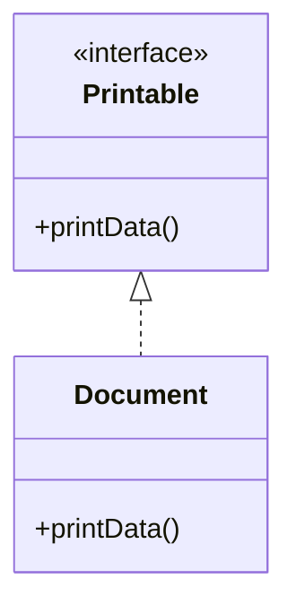
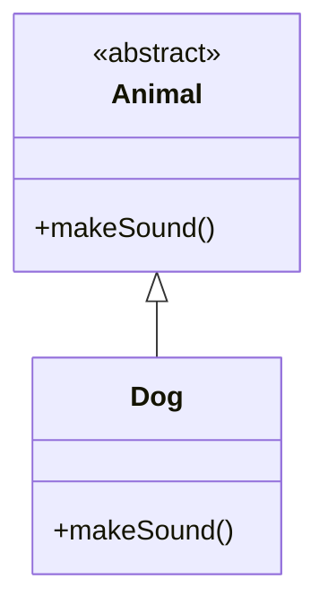

---

linkTitle: "2.4.3 Interfaces and Abstract Classes"
title: "Dart Interfaces and Abstract Classes: Mastering OOP in Flutter"
description: "Explore the concepts of interfaces and abstract classes in Dart, crucial for mastering object-oriented programming in Flutter. Learn how to define and implement interfaces, create abstract classes, and understand their differences and use cases with practical examples and exercises."
categories:
- Dart Programming
- Object-Oriented Programming
- Flutter Development
tags:
- Dart
- Interfaces
- Abstract Classes
- OOP
- Flutter
date: 2024-10-25
type: docs
nav_weight: 243000
canonical: "https://fluttermasterylibrary.com/3/2/4/3"
license: "© 2023 Tokenizer Inc. CC BY-NC-SA 4.0"
---

## 2.4.3 Interfaces and Abstract Classes

In the realm of object-oriented programming (OOP), interfaces and abstract classes are fundamental concepts that enable developers to design flexible and reusable code structures. Dart, the language behind Flutter, provides robust support for both interfaces and abstract classes, allowing developers to create sophisticated applications with ease. This section will delve into these concepts, illustrating their usage, differences, and practical applications in Flutter development.

### Interfaces in Dart

In Dart, every class implicitly defines an interface. This means that any class can be used as an interface, and other classes can implement it to ensure they provide specific functionalities. Interfaces in Dart are not declared explicitly; instead, they are defined by the methods and properties of a class.

#### Defining and Implementing Interfaces

To implement an interface in Dart, you use the `implements` keyword. When a class implements an interface, it must provide concrete implementations for all the methods defined in the interface.

**Example: Defining and Implementing an Interface**

```dart
class Printable {
  void printData();
}

class Document implements Printable {
  @override
  void printData() {
    print('Printing document...');
  }
}
```

In this example, the `Printable` class defines an interface with a single method `printData()`. The `Document` class implements this interface and provides its own implementation of the `printData()` method.

#### Key Characteristics of Interfaces

- **Implicit Definition**: All classes in Dart define an interface implicitly.
- **Contractual Obligation**: Implementing a class obligates it to provide concrete implementations for all interface methods.
- **Multiple Implementations**: A class can implement multiple interfaces, allowing for flexible design patterns.

### Abstract Classes

Abstract classes in Dart are used to define methods that must be implemented by subclasses. Unlike interfaces, abstract classes can contain both abstract methods (without implementation) and concrete methods (with implementation). Abstract classes cannot be instantiated directly.

#### Creating and Using Abstract Classes

To define an abstract class in Dart, use the `abstract` keyword. Subclasses of an abstract class must implement all its abstract methods.

**Example: Defining and Using an Abstract Class**

```dart
abstract class Animal {
  void makeSound();
}

class Dog extends Animal {
  @override
  void makeSound() {
    print('Bark!');
  }
}
```

Here, the `Animal` class is abstract and defines an abstract method `makeSound()`. The `Dog` class extends `Animal` and provides an implementation for the `makeSound()` method.

#### Key Characteristics of Abstract Classes

- **Cannot Instantiate**: Abstract classes cannot be instantiated directly.
- **Mixed Methods**: Can contain both abstract and concrete methods.
- **Inheritance**: Subclasses must implement all abstract methods.

### Usage Differences

While both interfaces and abstract classes are used to define contracts for classes, they serve different purposes and have distinct characteristics.

- **Abstract Classes**:
  - Can have both abstract and concrete methods.
  - Used when there is a need to provide some common functionality to subclasses.
  - Cannot be instantiated directly.

- **Interfaces**:
  - Define a contract that implementing classes must fulfill.
  - Focus solely on method signatures without any implementation.
  - Allow for multiple implementations, enabling polymorphic behavior.

### Visual Diagrams

To better understand interfaces and abstract classes, let's visualize these concepts using UML diagrams.

#### UML Diagram for Interfaces



In this UML diagram, `Printable` is an interface with a method `printData()`, and `Document` implements this interface.

#### UML Diagram for Abstract Classes



Here, `Animal` is an abstract class with an abstract method `makeSound()`, and `Dog` extends `Animal` to provide an implementation.

### Interactive Exercise

To solidify your understanding, let's engage in a practical exercise. Define an interface `Playable` with a method `play()`, and then implement it in classes like `Guitar` and `Piano`.

**Exercise: Implementing the `Playable` Interface**

1. Define the `Playable` interface:

```dart
class Playable {
  void play();
}
```

2. Implement the `Playable` interface in the `Guitar` class:

```dart
class Guitar implements Playable {
  @override
  void play() {
    print('Playing the guitar...');
  }
}
```

3. Implement the `Playable` interface in the `Piano` class:

```dart
class Piano implements Playable {
  @override
  void play() {
    print('Playing the piano...');
  }
}
```

4. Test the implementation:

```dart
void main() {
  Playable guitar = Guitar();
  Playable piano = Piano();

  guitar.play(); // Output: Playing the guitar...
  piano.play();  // Output: Playing the piano...
}
```

### Best Practices and Common Pitfalls

- **Use Abstract Classes for Shared Code**: When you have common functionality that multiple classes should inherit, use abstract classes.
- **Interfaces for Flexibility**: Use interfaces when you need to define a contract that multiple classes can implement differently.
- **Avoid Overusing Interfaces**: While interfaces provide flexibility, overusing them can lead to complex and hard-to-maintain code.
- **Clear Naming Conventions**: Use clear and descriptive names for interfaces and abstract classes to convey their purpose.

### Practical Applications and Real-World Scenarios

- **UI Components**: In Flutter, interfaces can be used to define common behaviors for UI components, such as `Clickable` or `Draggable`.
- **Service Layers**: Abstract classes can define base service classes with common methods, while specific services extend these classes to provide detailed implementations.
- **Plugin Development**: Interfaces are crucial in plugin development, where different platforms implement the same interface to provide platform-specific functionality.

### Additional Resources

- [Dart Language Tour](https://dart.dev/guides/language/language-tour)
- [Effective Dart: Design](https://dart.dev/guides/language/effective-dart/design)
- [Flutter Documentation](https://flutter.dev/docs)

By understanding and applying interfaces and abstract classes, you can create more robust and flexible applications in Flutter. These concepts are not only foundational to Dart programming but also essential for building scalable and maintainable codebases.

## Quiz Time!



### What keyword is used to implement an interface in Dart?

- [x] implements
- [ ] extends
- [ ] interface
- [ ] abstract

> **Explanation:** The `implements` keyword is used in Dart to implement an interface.

### Can abstract classes in Dart have concrete methods?

- [x] Yes
- [ ] No

> **Explanation:** Abstract classes in Dart can have both abstract and concrete methods.

### What is the main purpose of an interface in Dart?

- [x] To define a contract that implementing classes must fulfill
- [ ] To provide a base class for inheritance
- [ ] To allow instantiation of objects
- [ ] To define private methods

> **Explanation:** Interfaces define a contract that implementing classes must fulfill, focusing on method signatures.

### Which of the following cannot be instantiated directly?

- [x] Abstract classes
- [ ] Interfaces
- [ ] Concrete classes
- [ ] Mixins

> **Explanation:** Abstract classes cannot be instantiated directly; they require subclasses to implement their abstract methods.

### How do you define an abstract class in Dart?

- [x] Using the `abstract` keyword
- [ ] Using the `interface` keyword
- [ ] Using the `implements` keyword
- [ ] Using the `extends` keyword

> **Explanation:** The `abstract` keyword is used to define an abstract class in Dart.

### Can a class implement multiple interfaces in Dart?

- [x] Yes
- [ ] No

> **Explanation:** A class in Dart can implement multiple interfaces, allowing for flexible design patterns.

### What is the output of the following code snippet?
```dart
class Playable {
  void play();
}

class Guitar implements Playable {
  @override
  void play() {
    print('Playing the guitar...');
  }
}

void main() {
  Playable guitar = Guitar();
  guitar.play();
}
```

- [x] Playing the guitar...
- [ ] Playing the piano...
- [ ] Error: Playable is abstract and cannot be instantiated
- [ ] No output

> **Explanation:** The `Guitar` class implements the `Playable` interface and provides an implementation for the `play()` method, resulting in the output "Playing the guitar...".

### What is a common use case for abstract classes in Flutter?

- [x] Defining base classes with shared functionality
- [ ] Implementing platform-specific code
- [ ] Managing state across widgets
- [ ] Handling user input

> **Explanation:** Abstract classes are often used to define base classes with shared functionality that subclasses can inherit and extend.

### Which of the following statements is true about interfaces in Dart?

- [x] All classes implicitly define an interface
- [ ] Interfaces can have concrete methods
- [ ] Interfaces can be instantiated
- [ ] Interfaces are defined using the `interface` keyword

> **Explanation:** In Dart, all classes implicitly define an interface, which can be implemented by other classes.

### True or False: An abstract class in Dart can be used to define a contract for subclasses.

- [x] True
- [ ] False

> **Explanation:** True. An abstract class can define a contract for subclasses by specifying abstract methods that must be implemented.



By mastering interfaces and abstract classes, you can harness the full power of object-oriented programming in Dart, enabling you to build more flexible and maintainable Flutter applications.
