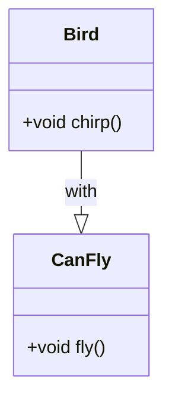
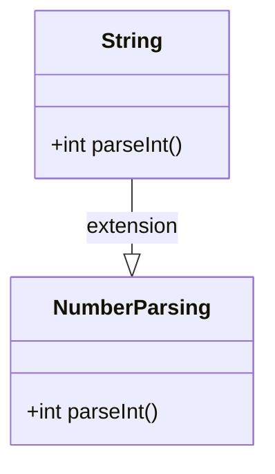

## 2.4.4 Mixins and Extensions

In the world of Dart programming, mixins and extensions are powerful tools that enhance the flexibility and reusability of your code. They allow developers to inject functionality into classes and extend existing types without modifying their source code. This section will delve into the concepts of mixins and extensions, providing you with the knowledge and practical skills to leverage these features in your Flutter applications.

### Understanding Mixins

Mixins in Dart provide a way to reuse code across multiple class hierarchies. They enable you to define a set of methods and properties that can be shared among different classes, promoting code reuse without the constraints of traditional inheritance.

#### What are Mixins?

A mixin is a class that provides methods and properties to other classes. Unlike inheritance, where a class can only extend one superclass, mixins allow you to "mix in" functionality from multiple sources. This is particularly useful when you want to share behavior across classes that do not share a common ancestor.

#### Using Mixins in Dart

In Dart 2.1 and above, the `mixin` keyword is used to define a mixin. Here's a simple example:

```dart
mixin CanFly {
  void fly() {
    print('Flying');
  }
}

class Bird with CanFly {
  void chirp() {
    print('Chirp!');
  }
}

var sparrow = Bird();
sparrow.fly(); // Outputs: Flying
sparrow.chirp(); // Outputs: Chirp!
```

In this example, the `CanFly` mixin provides a `fly` method that can be used by any class that mixes it in. The `Bird` class uses the `with` keyword to include the `CanFly` mixin, gaining the ability to fly without directly inheriting from a superclass.

#### When to Use Mixins

Mixins are ideal when you need to share methods and properties across multiple classes that are not directly related. They are particularly useful in scenarios where:

- You want to avoid the limitations of single inheritance.
- You need to inject common behavior into classes that do not share a common ancestor.
- You want to keep your codebase DRY (Don't Repeat Yourself) by reusing functionality.

#### Constraints on Mixins

While mixins are powerful, they come with certain constraints:

- Mixins cannot have constructors. This means you cannot instantiate a mixin directly.
- The class using the mixin cannot extend from another class unless the mixin allows it. This is to prevent conflicts in the class hierarchy.

### Visualizing Mixins

To better understand how mixins work, let's visualize the concept using a class diagram:



In this diagram, the `Bird` class uses the `CanFly` mixin to gain the `fly` method, illustrating how mixins inject behavior into classes.

### Best Practices for Using Mixins

- Use mixins to share behavior across unrelated classes, avoiding the pitfalls of deep inheritance hierarchies.
- Keep mixins focused and cohesive, providing a specific set of related functionalities.
- Be mindful of potential conflicts when mixing in multiple mixins that provide similar methods or properties.

### Interactive Exercise: Creating a Logger Mixin

Let's put your knowledge to the test with an interactive exercise. Create a mixin called `Logger` that provides a `log()` method, and use it in different classes.

```dart
mixin Logger {
  void log(String message) {
    print('Log: $message');
  }
}

class FileHandler with Logger {
  void readFile() {
    log('Reading file');
    // File reading logic
  }
}

class NetworkManager with Logger {
  void fetchData() {
    log('Fetching data');
    // Network fetching logic
  }
}

void main() {
  var fileHandler = FileHandler();
  fileHandler.readFile(); // Outputs: Log: Reading file

  var networkManager = NetworkManager();
  networkManager.fetchData(); // Outputs: Log: Fetching data
}
```

### Understanding Extensions

Extensions in Dart allow you to add new functionalities to existing libraries or classes without modifying their source code. This is particularly useful for enhancing built-in types or third-party libraries.

#### What are Extensions?

Extensions enable you to define additional methods and properties for existing types. They provide a way to extend the capabilities of a class without altering its original implementation.

#### Using Extensions in Dart

Here's an example of how to use extensions to add a method to the `String` class:

```dart
extension NumberParsing on String {
  int parseInt() {
    return int.parse(this);
  }
}

var value = '42'.parseInt(); // Outputs: 42
```

In this example, the `NumberParsing` extension adds a `parseInt` method to the `String` class, allowing you to convert a string to an integer directly.

#### When to Use Extensions

Extensions are useful when you want to:

- Add utility methods to existing classes without subclassing.
- Enhance third-party libraries with additional functionality.
- Keep your code organized by grouping related methods together.

### Visualizing Extensions

Let's visualize how extensions add methods to existing types using a class diagram:



In this diagram, the `NumberParsing` extension adds the `parseInt` method to the `String` class, illustrating how extensions enhance existing types.

### Best Practices for Using Extensions

- Use extensions to add non-essential methods that enhance the usability of a class.
- Avoid adding methods that could conflict with existing methods in the class or future updates.
- Keep extensions focused and relevant to the type they are extending.

### Interactive Exercise: Extending List Functionality

Try extending the `List` class with a method that returns the sum of its elements.

```dart
extension ListSum on List<int> {
  int sum() {
    return this.fold(0, (previous, current) => previous + current);
  }
}

void main() {
  var numbers = [1, 2, 3, 4];
  print(numbers.sum()); // Outputs: 10
}
```

### Real-World Applications

Mixins and extensions are widely used in real-world Flutter applications to enhance code reusability and maintainability. For example:

- **Mixins**: In a Flutter app, you might use mixins to add common functionality like logging, error handling, or network connectivity checks across different classes.
- **Extensions**: You can use extensions to add utility methods to Flutter widgets or Dart collections, making your code more expressive and concise.

### Summary

Mixins and extensions are powerful features in Dart that promote code reuse and flexibility. Mixins allow you to share behavior across unrelated classes, while extensions enable you to enhance existing types without modifying their source code. By understanding and applying these concepts, you can write more maintainable and scalable Flutter applications.

### Further Reading and Resources

- [Dart Language Tour: Mixins](https://dart.dev/guides/language/language-tour#adding-features-to-a-class-mixins)
- [Dart Language Tour: Extensions](https://dart.dev/guides/language/extension-methods)
- [Flutter Documentation](https://flutter.dev/docs)

## Quiz Time!



### What is a mixin in Dart?

- [x] A class that provides methods and properties to other classes.
- [ ] A subclass that inherits from a superclass.
- [ ] A function that extends the capabilities of a class.
- [ ] A type of constructor in Dart.

> **Explanation:** A mixin is a class that provides methods and properties to other classes, allowing for code reuse across multiple class hierarchies.

### Which keyword is used to define a mixin in Dart 2.1 and above?

- [x] mixin
- [ ] class
- [ ] interface
- [ ] extend

> **Explanation:** The `mixin` keyword is used to define a mixin in Dart 2.1 and above.

### Can mixins have constructors in Dart?

- [ ] Yes
- [x] No

> **Explanation:** Mixins cannot have constructors in Dart, which means they cannot be instantiated directly.

### What is the purpose of extensions in Dart?

- [x] To add new functionalities to existing libraries or classes without modifying them.
- [ ] To create new classes from existing ones.
- [ ] To define constructors for classes.
- [ ] To implement interfaces.

> **Explanation:** Extensions allow you to add new functionalities to existing libraries or classes without modifying their source code.

### How do you apply a mixin to a class in Dart?

- [x] Using the `with` keyword.
- [ ] Using the `extends` keyword.
- [ ] Using the `implements` keyword.
- [ ] Using the `mixin` keyword.

> **Explanation:** The `with` keyword is used to apply a mixin to a class in Dart.

### What is a potential risk when using extensions?

- [x] Method name collisions.
- [ ] Increased code complexity.
- [ ] Reduced performance.
- [ ] Inability to use inheritance.

> **Explanation:** A potential risk when using extensions is method name collisions, which can occur if the extension adds a method with the same name as an existing method in the class.

### Which of the following is a valid use case for mixins?

- [x] Sharing methods across unrelated classes.
- [ ] Creating new instances of a class.
- [ ] Defining constructors for a class.
- [ ] Implementing interfaces.

> **Explanation:** Mixins are used for sharing methods and properties across unrelated classes, promoting code reuse without inheritance.

### How can you add a method to an existing class using extensions?

- [x] By defining an extension with the desired method.
- [ ] By subclassing the existing class.
- [ ] By using the `implements` keyword.
- [ ] By modifying the original class code.

> **Explanation:** You can add a method to an existing class by defining an extension with the desired method.

### Which of the following is a best practice when using mixins?

- [x] Keep mixins focused and cohesive.
- [ ] Use mixins to define constructors.
- [ ] Apply mixins to all classes indiscriminately.
- [ ] Avoid using mixins for code reuse.

> **Explanation:** A best practice when using mixins is to keep them focused and cohesive, providing a specific set of related functionalities.

### True or False: Extensions can modify the original implementation of a class.

- [ ] True
- [x] False

> **Explanation:** False. Extensions cannot modify the original implementation of a class; they only add new methods or properties.


