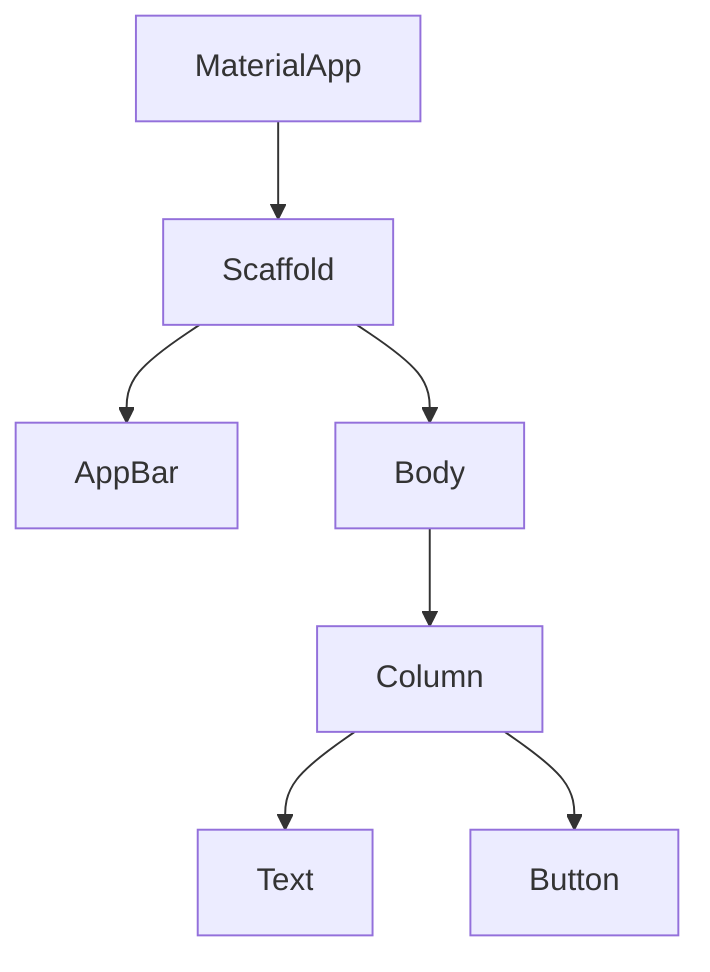

## 3.1.1 What are Widgets

In the world of Flutter, widgets are the fundamental building blocks of your application's user interface. Understanding widgets is crucial for anyone looking to master Flutter development, as they form the core of how you design and build your app's UI. In this section, we'll delve into what widgets are, the different types of widgets, how they are organized, and how you can use them to create dynamic and responsive applications.

### Introduction to Widgets

In Flutter, **everything is a widget**. This phrase is often heard when discussing Flutter, and it encapsulates the framework's approach to building user interfaces. Widgets are the basic elements that describe what your app's UI should look like given its current configuration and state. They can be as simple as a button or a piece of text, or as complex as an entire screen or application.

Widgets in Flutter can be categorized into two main types: **visible** and **invisible**. Visible widgets are those that are rendered on the screen, such as buttons, images, and text. Invisible widgets, on the other hand, help with layout, state management, and other behind-the-scenes tasks that are crucial for the app's functionality but do not have a direct visual representation.

### Types of Widgets

Understanding the different types of widgets is essential for building effective Flutter applications. Let's explore the primary types of widgets you'll encounter:

#### Stateless Widgets

Stateless widgets are immutable, meaning that their properties cannot change once they are created. They represent parts of the user interface that do not change over time. For example, a static text label or an icon is typically implemented as a stateless widget. Stateless widgets are ideal for UI elements that do not require any interaction or state management.

Here's a simple example of a stateless widget:

```dart
import 'package:flutter/material.dart';

class MyStatelessWidget extends StatelessWidget {
  @override
  Widget build(BuildContext context) {
    return Text(
      'Hello, Flutter!',
      style: TextStyle(fontSize: 24, color: Colors.blue),
    );
  }
}
```

In this example, the `Text` widget is a stateless widget that displays a simple message.

#### Stateful Widgets

Stateful widgets, unlike stateless widgets, can change their state during the app's lifecycle. They are used for dynamic parts of the UI that need to update in response to user interactions or other events. A stateful widget consists of two classes: the widget itself and a state class that holds the mutable state.

Here's an example of a stateful widget:

```dart
import 'package:flutter/material.dart';

class MyStatefulWidget extends StatefulWidget {
  @override
  _MyStatefulWidgetState createState() => _MyStatefulWidgetState();
}

class _MyStatefulWidgetState extends State<MyStatefulWidget> {
  int _counter = 0;

  void _incrementCounter() {
    setState(() {
      _counter++;
    });
  }

  @override
  Widget build(BuildContext context) {
    return Column(
      children: <Widget>[
        Text('Counter: $_counter'),
        ElevatedButton(
          onPressed: _incrementCounter,
          child: Text('Increment'),
        ),
      ],
    );
  }
}
```

In this example, the `MyStatefulWidget` can update its UI when the button is pressed, thanks to the `setState` method.

#### Inherited Widgets

Inherited widgets are a powerful feature in Flutter that allows you to efficiently propagate information down the widget tree. They are often used for state management, where you need to share data across multiple widgets without passing it explicitly through constructors.

Here's a basic example of an inherited widget:

```dart
import 'package:flutter/material.dart';

class MyInheritedWidget extends InheritedWidget {
  final int data;

  MyInheritedWidget({Key? key, required this.data, required Widget child})
      : super(key: key, child: child);

  @override
  bool updateShouldNotify(MyInheritedWidget oldWidget) {
    return oldWidget.data != data;
  }

  static MyInheritedWidget? of(BuildContext context) {
    return context.dependOnInheritedWidgetOfExactType<MyInheritedWidget>();
  }
}
```

In this example, `MyInheritedWidget` can be used to share the `data` value with its descendants in the widget tree.

### Widget Tree Concept

Widgets in Flutter are organized in a tree-like structure known as the **Widget Tree**. This hierarchical arrangement allows you to build complex UIs by nesting widgets within each other. The widget tree starts with a root widget, typically `MaterialApp` or `CupertinoApp`, and branches out to include all the other widgets in your app.

Here's a simple representation of a widget tree using Mermaid.js:



In this diagram, the `MaterialApp` is the root widget, and it contains a `Scaffold`, which further contains an `AppBar` and a `Body`. The body consists of a `Column` with a `Text` and a `Button`.

#### Parent and Child Relationships

In the widget tree, widgets have parent and child relationships. A parent widget can have one or more child widgets, and each child widget can have its own children, forming a nested structure. This hierarchy allows you to build complex UIs by composing simple widgets.

### Composition Over Inheritance

Flutter emphasizes **composition** over inheritance, meaning that complex widgets are created by combining simpler ones rather than extending existing classes. This approach promotes code reuse and flexibility, allowing you to build custom widgets by composing existing ones.

For example, you can create a custom button by composing a `Container`, `Text`, and `GestureDetector`:

```dart
import 'package:flutter/material.dart';

class CustomButton extends StatelessWidget {
  final String label;
  final VoidCallback onPressed;

  CustomButton({required this.label, required this.onPressed});

  @override
  Widget build(BuildContext context) {
    return GestureDetector(
      onTap: onPressed,
      child: Container(
        padding: EdgeInsets.all(16),
        decoration: BoxDecoration(
          color: Colors.blue,
          borderRadius: BorderRadius.circular(8),
        ),
        child: Text(
          label,
          style: TextStyle(color: Colors.white),
        ),
      ),
    );
  }
}
```

In this example, `CustomButton` is a composed widget that combines a `Container`, `Text`, and `GestureDetector` to create a reusable button component.

### Visual Examples

To better understand widgets, let's look at some visual examples of simple widgets and how they appear in an app.

#### Text Widget

```dart
Text('Hello, World!', style: TextStyle(fontSize: 24, color: Colors.black))
```

This `Text` widget displays the message "Hello, World!" with a font size of 24 and black color.

#### Image Widget

```dart
Image.network('https://example.com/image.png')
```

The `Image` widget loads and displays an image from a network URL.

#### Container Widget

```dart
Container(
  width: 100,
  height: 100,
  color: Colors.red,
)
```

This `Container` widget creates a red square with a width and height of 100 pixels.

### Hands-On Demonstration

Now that we've covered the basics, let's put this knowledge into practice. Open your Flutter development environment and create a new Flutter project. Follow these steps to add widgets to your app and observe the changes:

1. **Create a New Flutter Project:**
   - Open your terminal or command prompt.
   - Run `flutter create my_first_app`.
   - Navigate to the project directory with `cd my_first_app`.

2. **Open the Project in Your IDE:**
   - Open the `my_first_app` folder in your preferred IDE (e.g., VS Code, Android Studio).

3. **Modify the `main.dart` File:**
   - Open the `lib/main.dart` file.
   - Replace the existing code with the following:

   ```dart
   import 'package:flutter/material.dart';

   void main() {
     runApp(MyApp());
   }

   class MyApp extends StatelessWidget {
     @override
     Widget build(BuildContext context) {
       return MaterialApp(
         home: Scaffold(
           appBar: AppBar(
             title: Text('My First App'),
           ),
           body: Center(
             child: Column(
               mainAxisAlignment: MainAxisAlignment.center,
               children: <Widget>[
                 Text('Hello, Flutter!'),
                 ElevatedButton(
                   onPressed: () {},
                   child: Text('Press Me'),
                 ),
               ],
             ),
           ),
         ),
       );
     }
   }
   ```

4. **Run the App:**
   - Use the command `flutter run` to start the app on an emulator or connected device.
   - Observe the `Text` and `ElevatedButton` widgets displayed on the screen.

### Analogies and Metaphors

Think of widgets as Lego blocks. Just as you can use Lego blocks to build anything from a simple house to a complex spaceship, you can use widgets to construct any user interface, from a basic button to an intricate dashboard. Each widget is a building block that can be combined with others to create a cohesive and functional UI.

### Summary

In this section, we've explored the concept of widgets in Flutter, the different types of widgets, and how they are organized in a widget tree. We've also discussed the importance of composition over inheritance and provided practical examples to help you get started with building your own Flutter applications. Understanding widgets is a crucial step in mastering Flutter development, as they are the foundation upon which all Flutter apps are built.

By experimenting with different widgets and compositions, you can create dynamic and responsive user interfaces that enhance the user experience. As you continue your journey with Flutter, remember that widgets are your primary tools for crafting beautiful and functional apps.

## Quiz Time!



### What is a widget in Flutter?

- [x] A basic building block of a Flutter app's user interface
- [ ] A type of database used in Flutter
- [ ] A programming language used in Flutter
- [ ] A tool for debugging Flutter apps

> **Explanation:** In Flutter, a widget is a basic building block of the user interface. Everything in Flutter is a widget, from simple text and images to complex layouts.

### Which of the following is a characteristic of a stateless widget?

- [x] It is immutable and does not change over time
- [ ] It can change its state during the app's lifecycle
- [ ] It is used for managing state across multiple widgets
- [ ] It is a type of inherited widget

> **Explanation:** Stateless widgets are immutable and represent parts of the UI that do not change over time. They are ideal for static content.

### What is the primary purpose of a stateful widget?

- [x] To manage dynamic parts of the UI that can change state
- [ ] To create static UI elements
- [ ] To propagate information down the widget tree
- [ ] To handle network requests

> **Explanation:** Stateful widgets are used for dynamic parts of the UI that need to update in response to user interactions or other events.

### How are widgets organized in a Flutter application?

- [x] In a tree-like structure called the widget tree
- [ ] In a linear list
- [ ] In a circular buffer
- [ ] In a grid layout

> **Explanation:** Widgets in Flutter are organized in a tree-like structure known as the widget tree, which allows for hierarchical arrangement and composition.

### What is the advantage of composition over inheritance in Flutter?

- [x] It promotes code reuse and flexibility
- [ ] It simplifies the use of global variables
- [ ] It allows for direct manipulation of widget properties
- [ ] It eliminates the need for state management

> **Explanation:** Composition over inheritance allows for building complex widgets by combining simpler ones, promoting code reuse and flexibility.

### Which widget type is used to efficiently propagate information down the widget tree?

- [x] Inherited widget
- [ ] Stateless widget
- [ ] Stateful widget
- [ ] Container widget

> **Explanation:** Inherited widgets are used to efficiently propagate information down the widget tree, often for state management purposes.

### What is the role of the `setState` method in a stateful widget?

- [x] To update the UI in response to state changes
- [ ] To initialize the widget's properties
- [ ] To define the widget's layout
- [ ] To handle network requests

> **Explanation:** The `setState` method is used in stateful widgets to update the UI in response to changes in the widget's state.

### Which of the following is an example of a visible widget?

- [x] Text
- [ ] InheritedWidget
- [ ] ThemeData
- [ ] MediaQuery

> **Explanation:** The `Text` widget is a visible widget that is rendered on the screen, displaying text content.

### What is the purpose of the `build` method in a widget?

- [x] To describe the widget's UI and return a widget tree
- [ ] To handle user input
- [ ] To manage network requests
- [ ] To initialize the widget's state

> **Explanation:** The `build` method describes the widget's UI and returns a widget tree that represents the widget's layout.

### True or False: In Flutter, every widget must have a child.

- [ ] True
- [x] False

> **Explanation:** Not every widget in Flutter must have a child. Some widgets, like `Text` or `Image`, do not require a child, while others, like `Container`, can have one or more children.


