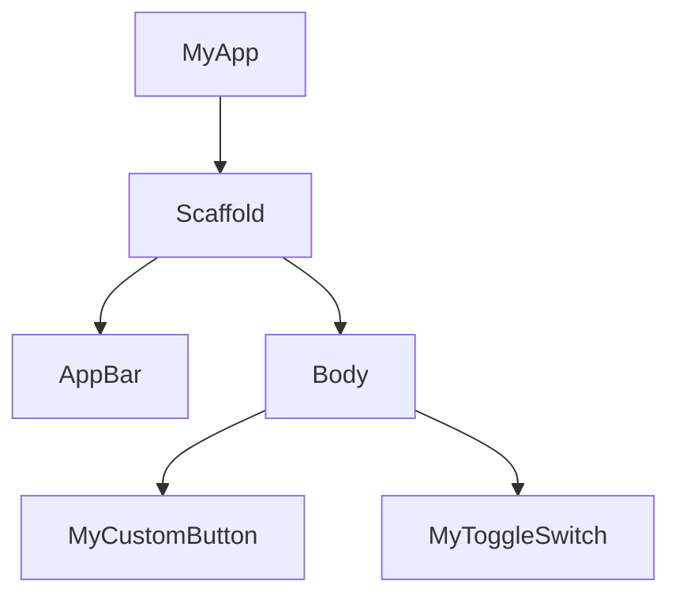

## 3.1.4 Building Custom Widgets

In Flutter, widgets are the building blocks of your application's user interface. While Flutter provides a rich set of pre-built widgets, there are times when you'll need to create custom widgets to meet specific design requirements or to encapsulate complex UI logic. Building custom widgets not only enhances code reusability and maintainability but also allows for greater abstraction and modularity in your app's architecture.

### Why Build Custom Widgets

Creating custom widgets offers several benefits:

- **Code Reusability:** Custom widgets can be reused across different parts of your application, reducing code duplication and simplifying maintenance.
- **Maintainability:** By encapsulating UI logic within custom widgets, you make your codebase easier to understand and maintain.
- **Abstraction:** Custom widgets allow you to abstract complex UI components into simpler, more manageable pieces, making your code more readable and organized.

When planning your app's architecture, think in terms of widgets. Consider how you can break down your UI into smaller, reusable components that can be easily managed and updated.

### Creating a Custom Stateless Widget

Stateless widgets are immutable and do not hold any state. They are ideal for UI components that do not change over time or in response to user interactions.

#### Step-by-Step Guide to Creating a Custom Stateless Widget

Let's create a custom stateless widget called `MyCustomButton`. This widget will accept parameters such as `text`, `onPressed`, and `color`.

1. **Define the Widget Class:**

   Start by defining a class that extends `StatelessWidget`.

   ```dart
   import 'package:flutter/material.dart';

   class MyCustomButton extends StatelessWidget {
     final String text;
     final VoidCallback onPressed;
     final Color color;

     MyCustomButton({
       required this.text,
       required this.onPressed,
       this.color = Colors.blue,
     });

     @override
     Widget build(BuildContext context) {
       return ElevatedButton(
         onPressed: onPressed,
         style: ElevatedButton.styleFrom(primary: color),
         child: Text(text),
       );
     }
   }
   ```

   **Explanation:**
   - The `MyCustomButton` class extends `StatelessWidget`.
   - It takes three parameters: `text`, `onPressed`, and `color`.
   - The `build` method returns an `ElevatedButton` with the specified properties.

2. **Use the Custom Widget in Your App:**

   You can now use `MyCustomButton` in your app like any other widget.

   ```dart
   import 'package:flutter/material.dart';
   import 'my_custom_button.dart'; // Import the custom widget

   void main() {
     runApp(MyApp());
   }

   class MyApp extends StatelessWidget {
     @override
     Widget build(BuildContext context) {
       return MaterialApp(
         home: Scaffold(
           appBar: AppBar(title: Text('Custom Button Example')),
           body: Center(
             child: MyCustomButton(
               text: 'Click Me',
               onPressed: () {
                 print('Button Pressed!');
               },
               color: Colors.green,
             ),
           ),
         ),
       );
     }
   }
   ```

   **Explanation:**
   - The `MyCustomButton` is used within the `MyApp` widget.
   - It demonstrates how to pass parameters to the custom widget.

### Creating a Custom Stateful Widget

Stateful widgets are mutable and can hold state that may change over time or in response to user interactions.

#### Step-by-Step Guide to Creating a Custom Stateful Widget

Let's create a custom stateful widget called `MyToggleSwitch`. This widget will maintain its own state to toggle between on and off.

1. **Define the Stateful Widget Class:**

   Start by defining a class that extends `StatefulWidget`.

   ```dart
   import 'package:flutter/material.dart';

   class MyToggleSwitch extends StatefulWidget {
     final ValueChanged<bool> onChanged;

     MyToggleSwitch({required this.onChanged});

     @override
     _MyToggleSwitchState createState() => _MyToggleSwitchState();
   }

   class _MyToggleSwitchState extends State<MyToggleSwitch> {
     bool _isOn = false;

     void _toggleSwitch() {
       setState(() {
         _isOn = !_isOn;
       });
       widget.onChanged(_isOn);
     }

     @override
     Widget build(BuildContext context) {
       return Switch(
         value: _isOn,
         onChanged: (value) {
           _toggleSwitch();
         },
       );
     }
   }
   ```

   **Explanation:**
   - The `MyToggleSwitch` class extends `StatefulWidget`.
   - It takes a parameter `onChanged` to notify the parent widget of state changes.
   - The `_MyToggleSwitchState` class manages the internal state `_isOn`.

2. **Use the Custom Stateful Widget in Your App:**

   You can now use `MyToggleSwitch` in your app and respond to its state changes.

   ```dart
   import 'package:flutter/material.dart';
   import 'my_toggle_switch.dart'; // Import the custom widget

   void main() {
     runApp(MyApp());
   }

   class MyApp extends StatelessWidget {
     @override
     Widget build(BuildContext context) {
       return MaterialApp(
         home: Scaffold(
           appBar: AppBar(title: Text('Toggle Switch Example')),
           body: Center(
             child: MyToggleSwitch(
               onChanged: (isOn) {
                 print('Switch is now: $isOn');
               },
             ),
           ),
         ),
       );
     }
   }
   ```

   **Explanation:**
   - The `MyToggleSwitch` is used within the `MyApp` widget.
   - It demonstrates how to handle state changes using the `onChanged` callback.

### Composition and Inheritance

#### Composition

Composition involves building complex widgets by combining simpler ones. This approach promotes code reuse and modularity.

- **Example:**

  You can create a custom card widget by composing existing widgets like `Container`, `Text`, and `Image`.

  ```dart
  class MyCustomCard extends StatelessWidget {
    final String title;
    final String subtitle;
    final String imageUrl;

    MyCustomCard({
      required this.title,
      required this.subtitle,
      required this.imageUrl,
    });

    @override
    Widget build(BuildContext context) {
      return Card(
        child: Column(
          children: [
            Image.network(imageUrl),
            ListTile(
              title: Text(title),
              subtitle: Text(subtitle),
            ),
          ],
        ),
      );
    }
  }
  ```

  **Explanation:**
  - The `MyCustomCard` widget is composed of an `Image` and a `ListTile`.
  - This demonstrates how to build a complex widget by combining simpler ones.

#### Inheritance

Inheritance can be used to extend existing widgets, but it should be used sparingly. Prefer composition over inheritance for better flexibility and maintainability.

- **Example:**

  You might extend a `Text` widget to add custom styling.

  ```dart
  class MyStyledText extends Text {
    MyStyledText(String data)
        : super(
            data,
            style: TextStyle(fontSize: 20, fontWeight: FontWeight.bold),
          );
  }
  ```

  **Explanation:**
  - The `MyStyledText` widget extends `Text` to apply custom styling.
  - Use inheritance when you need to slightly modify the behavior of an existing widget.

### Best Practices

- **Single Responsibility:** Keep widgets focused on a single purpose to enhance readability and maintainability.
- **Data and Callbacks:** Pass data and callbacks through constructors to maintain a clear flow of information.
- **Avoid Excessive Nesting:** Break down complex UIs into smaller widgets to avoid deeply nested widget trees.
- **Naming Conventions:** Use descriptive names for custom widgets to convey their purpose and functionality.

### Visual Aids

#### Widget Tree Diagram

To illustrate how custom widgets fit into the widget tree, consider the following diagram:



**Explanation:**
- The diagram shows how `MyCustomButton` and `MyToggleSwitch` are integrated into the widget tree under the `Scaffold`.

#### Refactoring Example

Before refactoring:

```dart
Column(
  children: [
    ElevatedButton(
      onPressed: () {},
      child: Text('Button 1'),
    ),
    ElevatedButton(
      onPressed: () {},
      child: Text('Button 2'),
    ),
  ],
)
```

After refactoring into custom widgets:

```dart
Column(
  children: [
    MyCustomButton(
      text: 'Button 1',
      onPressed: () {},
    ),
    MyCustomButton(
      text: 'Button 2',
      onPressed: () {},
    ),
  ],
)
```

**Explanation:**
- The refactored code uses `MyCustomButton` to reduce duplication and improve maintainability.

### Exercise

**Challenge:** Refactor the following widget tree into smaller custom widgets.

```dart
Column(
  children: [
    Container(
      padding: EdgeInsets.all(16.0),
      child: Text('Title', style: TextStyle(fontSize: 24)),
    ),
    Container(
      padding: EdgeInsets.all(16.0),
      child: Text('Subtitle', style: TextStyle(fontSize: 16)),
    ),
    ElevatedButton(
      onPressed: () {},
      child: Text('Action'),
    ),
  ],
)
```

**Task:**
- Identify logical components to extract into custom widgets.
- Create a `TitleText` widget and a `SubtitleText` widget.
- Use these custom widgets in the refactored code.

**Solution:**

```dart
class TitleText extends StatelessWidget {
  final String text;

  TitleText({required this.text});

  @override
  Widget build(BuildContext context) {
    return Container(
      padding: EdgeInsets.all(16.0),
      child: Text(text, style: TextStyle(fontSize: 24)),
    );
  }
}

class SubtitleText extends StatelessWidget {
  final String text;

  SubtitleText({required this.text});

  @override
  Widget build(BuildContext context) {
    return Container(
      padding: EdgeInsets.all(16.0),
      child: Text(text, style: TextStyle(fontSize: 16)),
    );
  }
}

// Refactored widget tree
Column(
  children: [
    TitleText(text: 'Title'),
    SubtitleText(text: 'Subtitle'),
    MyCustomButton(
      text: 'Action',
      onPressed: () {},
    ),
  ],
)
```

**Explanation:**
- The `TitleText` and `SubtitleText` widgets encapsulate the styling logic, making the code cleaner and more modular.

### Conclusion

Building custom widgets in Flutter is a powerful way to enhance your app's architecture by promoting code reusability, maintainability, and abstraction. By following best practices and leveraging composition, you can create modular and scalable UIs that are easy to manage and extend. As you continue to develop with Flutter, consider how custom widgets can simplify your codebase and improve the overall quality of your applications.

## Quiz Time!



### What is a primary benefit of creating custom widgets in Flutter?

- [x] Code reusability
- [ ] Increased app size
- [ ] Slower performance
- [ ] More complex code

> **Explanation:** Custom widgets promote code reusability by allowing you to encapsulate UI logic and reuse it across different parts of your application.

### Which widget type should you use if your widget does not need to maintain state?

- [x] StatelessWidget
- [ ] StatefulWidget
- [ ] InheritedWidget
- [ ] Provider

> **Explanation:** StatelessWidget is used for widgets that do not need to maintain any state.

### What is the purpose of the `setState` method in a StatefulWidget?

- [x] To update the UI when the widget's state changes
- [ ] To initialize the widget
- [ ] To dispose of the widget
- [ ] To build the widget tree

> **Explanation:** The `setState` method is used to update the UI when the widget's state changes.

### How do you pass data to a custom widget?

- [x] Through the widget's constructor
- [ ] Using global variables
- [ ] By modifying the widget's build method
- [ ] Through the widget's state

> **Explanation:** Data is passed to a custom widget through its constructor, allowing for a clear flow of information.

### What is a recommended practice when building custom widgets?

- [x] Keep widgets focused on a single purpose
- [ ] Use as many global variables as possible
- [ ] Avoid using constructors
- [ ] Nest widgets deeply

> **Explanation:** Keeping widgets focused on a single purpose enhances readability and maintainability.

### What is the role of the `build` method in a widget?

- [x] To describe how to display the widget in terms of other, lower-level widgets
- [ ] To initialize the widget's state
- [ ] To handle user input
- [ ] To dispose of the widget

> **Explanation:** The `build` method describes how to display the widget in terms of other, lower-level widgets.

### When should you prefer composition over inheritance in Flutter?

- [x] When building complex widgets by combining simpler ones
- [ ] When you need to modify the behavior of an existing widget
- [ ] When you want to create a new widget from scratch
- [ ] When you need to manage widget state

> **Explanation:** Composition is preferred for building complex widgets by combining simpler ones, promoting flexibility and maintainability.

### What is a common pitfall to avoid when creating custom widgets?

- [x] Excessive nesting of widgets
- [ ] Using constructors
- [ ] Passing data through constructors
- [ ] Keeping widgets focused on a single purpose

> **Explanation:** Excessive nesting of widgets can make the code difficult to read and maintain.

### How can you handle state changes in a custom stateful widget?

- [x] By using the `setState` method
- [ ] By modifying the widget's constructor
- [ ] By using global variables
- [ ] By overriding the widget's build method

> **Explanation:** The `setState` method is used to handle state changes in a custom stateful widget.

### True or False: Inheritance should be the primary approach for creating custom widgets in Flutter.

- [ ] True
- [x] False

> **Explanation:** Inheritance should be used sparingly. Composition is generally preferred for creating custom widgets due to its flexibility and maintainability.


