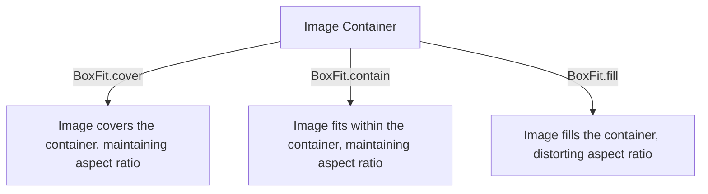

## 3.2.1 Text and Image Widgets

In the world of Flutter, widgets are the building blocks of your application's user interface. Among these, the `Text` and `Image` widgets are fundamental components that allow you to display textual and visual content, respectively. Understanding how to effectively use these widgets is crucial for creating engaging and visually appealing applications. This section will guide you through the basics and advanced usage of `Text` and `Image` widgets, including styling, asset management, and practical examples.

### Text Widget

The `Text` widget is one of the most commonly used widgets in Flutter, designed to display a string of text with various styling options. It is simple yet powerful, allowing you to customize the appearance of text to fit your application's design.

#### Basic Usage

To display a simple piece of text, you can use the `Text` widget as follows:

```dart
Text('Hello, Flutter!');
```

This line of code will render the text "Hello, Flutter!" on the screen using the default styling provided by Flutter.

#### Styling Options

Flutter provides extensive styling capabilities through the `TextStyle` class, which you can apply using the `style` property of the `Text` widget. Here's an example of how you can style text:

```dart
Text(
  'Styled Text',
  style: TextStyle(
    fontSize: 24,
    color: Colors.blue,
    fontWeight: FontWeight.bold,
  ),
);
```

In this example, the text "Styled Text" is displayed with a font size of 24, a blue color, and bold weight. The `TextStyle` class offers numerous properties to customize text, including:

- `fontSize`: Sets the size of the text.
- `color`: Changes the color of the text.
- `fontWeight`: Adjusts the thickness of the text.
- `fontStyle`: Allows you to set the text to italic.
- `letterSpacing`: Modifies the space between letters.
- `wordSpacing`: Changes the space between words.

#### Text Alignment and Directionality

The `Text` widget also supports alignment and directionality, which are crucial for creating a well-structured layout. You can use the `textAlign` property to align text within its container:

```dart
Text(
  'Center Aligned Text',
  textAlign: TextAlign.center,
);
```

The `textDirection` property is useful for supporting languages with different reading directions, such as Arabic or Hebrew:

```dart
Text(
  'Right to Left Text',
  textDirection: TextDirection.rtl,
);
```

### Image Widget

The `Image` widget is used to display images in your Flutter application. It supports various sources, including assets, network, and local files.

#### Different Constructors

Flutter provides multiple constructors for the `Image` widget, each suited for different image sources:

- **`Image.asset`**: Loads images from the local assets directory.
- **`Image.network`**: Fetches images from a URL.
- **`Image.file`**: Displays images from the local file system.

Here are examples of how to use these constructors:

```dart
Image.asset('assets/images/logo.png');
Image.network('https://example.com/image.png');
```

#### Properties of the Image Widget

The `Image` widget comes with several properties to control how images are displayed:

- `fit`: Determines how the image should be inscribed into the space allocated during layout. Options include `BoxFit.cover`, `BoxFit.contain`, `BoxFit.fill`, etc.
- `width` and `height`: Set the dimensions of the image.
- `alignment`: Aligns the image within its container.

For example, to display an image that covers its container while maintaining its aspect ratio, you can use:

```dart
Image.asset(
  'assets/images/logo.png',
  fit: BoxFit.cover,
);
```

### Asset Management

Managing assets efficiently is crucial for any Flutter application, especially when dealing with images. Here's how you can add and manage image assets in your Flutter project.

#### Adding Images to the Assets Directory

1. Create an `assets` directory in the root of your Flutter project.
2. Add your image files to this directory, maintaining a clear and organized structure.

#### Updating `pubspec.yaml`

To use images from the assets directory, you must declare them in the `pubspec.yaml` file:

```yaml
flutter:
  assets:
    - assets/images/logo.png
```

This configuration ensures that Flutter includes the specified images in the build process.

#### Visual Instructions for Organizing Assets

Organizing your assets directory can greatly enhance the maintainability of your project. Consider categorizing images based on their usage, such as `icons`, `backgrounds`, or `logos`. This structure helps you quickly locate and manage assets as your project grows.

### Exercises

To solidify your understanding of `Text` and `Image` widgets, try the following exercises:

- Display a local image and a network image in your app. Experiment with different `fit` options to see how they affect the image display.
- Style a piece of text using various `TextStyle` properties. Try changing the font size, color, and weight, and experiment with different fonts.

### Visual Aids

To enhance your understanding, let's look at some visual examples:

#### Text Styling

Below is a screenshot demonstrating various text styles:


#### Image Fit Options

The following diagram illustrates how different `fit` options affect image display:



### Best Practices

- **Consistency**: Maintain consistent styling across your application to create a cohesive user experience.
- **Performance**: Use appropriately sized images to optimize performance and reduce loading times.
- **Accessibility**: Ensure text is readable by choosing appropriate font sizes and colors, and consider accessibility features like text scaling.

### Common Pitfalls

- **Asset Declaration**: Forgetting to declare assets in `pubspec.yaml` can lead to runtime errors.
- **Image Sizing**: Using large images without resizing can negatively impact performance.

### Additional Resources

- [Flutter Text Widget Documentation](https://api.flutter.dev/flutter/widgets/Text-class.html)
- [Flutter Image Widget Documentation](https://api.flutter.dev/flutter/widgets/Image-class.html)
- [Flutter Asset Management Guide](https://flutter.dev/docs/development/ui/assets-and-images)

By mastering the `Text` and `Image` widgets, you can create visually appealing and functional Flutter applications. Experiment with different styles and configurations to see what works best for your projects.

## Quiz Time!



### What is the primary purpose of the `Text` widget in Flutter?

- [x] To display a string of text
- [ ] To display images
- [ ] To manage application state
- [ ] To handle user input

> **Explanation:** The `Text` widget is used to display a string of text in a Flutter application.

### Which property of the `Text` widget is used to style the text?

- [ ] textAlign
- [x] style
- [ ] textDirection
- [ ] decoration

> **Explanation:** The `style` property of the `Text` widget is used to apply styling through the `TextStyle` class.

### How do you load an image from the network in Flutter?

- [ ] Image.asset
- [x] Image.network
- [ ] Image.file
- [ ] Image.memory

> **Explanation:** The `Image.network` constructor is used to load images from a URL.

### What is the purpose of the `fit` property in the `Image` widget?

- [ ] To set the image's color
- [x] To determine how the image should be inscribed into the space allocated during layout
- [ ] To set the image's alignment
- [ ] To set the image's border

> **Explanation:** The `fit` property determines how the image should be inscribed into the space allocated during layout, affecting its aspect ratio and size.

### Which `TextStyle` property would you use to make text bold?

- [ ] fontStyle
- [x] fontWeight
- [ ] letterSpacing
- [ ] color

> **Explanation:** The `fontWeight` property is used to adjust the thickness of the text, including making it bold.

### What must you do to use an image from the assets directory in Flutter?

- [ ] Declare it in the main.dart file
- [x] Declare it in the `pubspec.yaml` file
- [ ] Declare it in the index.html file
- [ ] Declare it in the AndroidManifest.xml file

> **Explanation:** To use an image from the assets directory, you must declare it in the `pubspec.yaml` file.

### Which property of the `Text` widget is used to align text within its container?

- [x] textAlign
- [ ] style
- [ ] textDirection
- [ ] fontSize

> **Explanation:** The `textAlign` property is used to align text within its container.

### What is the default text direction in Flutter?

- [x] TextDirection.ltr
- [ ] TextDirection.rtl
- [ ] TextDirection.ttb
- [ ] TextDirection.btt

> **Explanation:** The default text direction in Flutter is `TextDirection.ltr` (left-to-right).

### Which `Image` constructor is used to display images from the local file system?

- [ ] Image.asset
- [ ] Image.network
- [x] Image.file
- [ ] Image.memory

> **Explanation:** The `Image.file` constructor is used to display images from the local file system.

### True or False: The `Text` widget can only display plain text without any styling.

- [ ] True
- [x] False

> **Explanation:** False. The `Text` widget can display styled text using the `style` property with the `TextStyle` class.


