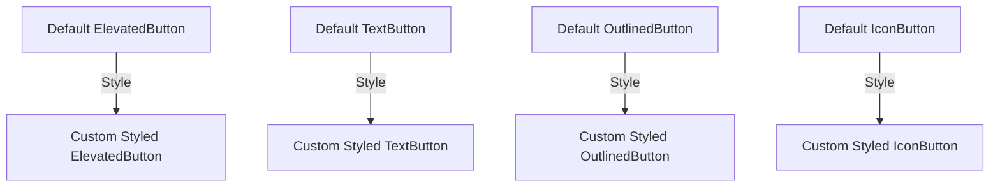

## 3.2.2 Button Widgets

Buttons are fundamental interactive components in any user interface, serving as the primary means for users to trigger actions within an application. In Flutter, buttons are versatile widgets that can be customized to fit the aesthetic and functional needs of your app. This section will delve into the various types of button widgets available in Flutter, how to style them, and best practices for their use.

### Introduction to Buttons

Buttons in Flutter are interactive widgets that respond to user input by triggering specific actions. They are essential for navigation, form submissions, and executing commands. Understanding how to effectively use and customize buttons is crucial for creating intuitive and responsive user interfaces.

### Common Button Widgets

Flutter provides several built-in button widgets, each designed for different use cases. Let's explore the most commonly used button types:

#### ElevatedButton

The `ElevatedButton` is used for primary actions that require emphasis. It features a raised appearance, providing a sense of depth and importance.

**Example:**

```dart
ElevatedButton(
  onPressed: () {
    // Handle button press
  },
  child: Text('Elevated Button'),
);
```

The `ElevatedButton` is ideal for actions that are central to the app's functionality, such as submitting a form or saving changes.

#### TextButton

The `TextButton` is used for less prominent actions. It appears flat against the background, making it suitable for secondary actions.

**Example:**

```dart
TextButton(
  onPressed: () {},
  child: Text('Text Button'),
);
```

`TextButton` is often used for actions like "Cancel" or "Learn More," where the action is optional or supplementary.

#### OutlinedButton

The `OutlinedButton` is similar to the `TextButton` but includes an outline, providing a subtle emphasis.

**Example:**

```dart
OutlinedButton(
  onPressed: () {},
  child: Text('Outlined Button'),
);
```

This button type is useful for actions that need to stand out slightly more than a `TextButton` but less than an `ElevatedButton`.

### Button Styling

Flutter allows extensive customization of buttons through the `style` property. By using `ButtonStyle`, you can modify various aspects of a button's appearance, such as background color, text style, padding, and shape.

**Example:**

```dart
ElevatedButton(
  onPressed: () {},
  style: ButtonStyle(
    backgroundColor: MaterialStateProperty.all<Color>(Colors.green),
    padding: MaterialStateProperty.all<EdgeInsets>(
      EdgeInsets.symmetric(horizontal: 24, vertical: 12),
    ),
  ),
  child: Text('Custom Styled Button'),
);
```

In this example, the `ElevatedButton` is styled with a green background and custom padding, demonstrating how you can tailor buttons to match your app's design language.

### Icon Buttons

For actions represented by icons, the `IconButton` widget is the go-to choice. It is particularly useful for toolbar actions or when space is limited.

**Example:**

```dart
IconButton(
  icon: Icon(Icons.volume_up),
  onPressed: () {},
);
```

`IconButton` is often used for actions like toggling sound, opening a menu, or sharing content.

### Visual Examples

To better understand the differences in button styles, let's compare default styles versus customized styles through visual examples.



In the diagram above, each default button type is shown transitioning to a custom-styled version, illustrating the impact of styling on button appearance.

### Best Practices

When implementing buttons in your Flutter app, consider the following best practices:

- **Appropriate Button Types:** Choose button types based on the importance of the action. Use `ElevatedButton` for primary actions, `TextButton` for secondary actions, and `OutlinedButton` for actions that need slight emphasis.
- **Accessibility:** Ensure buttons are accessible with clear labels and sufficient tap areas. This includes providing descriptive text for screen readers and maintaining adequate contrast for visibility.
- **Consistent Styling:** Maintain consistency in button styles across your app to provide a cohesive user experience.

### Exercise

To reinforce your understanding, try creating a UI that incorporates different button types. Apply custom styles and handle `onPressed` events to perform actions. Consider the following tasks:

- Create a form with an `ElevatedButton` for submission and a `TextButton` for resetting the form.
- Design a toolbar with `IconButton` widgets for common actions like search and settings.
- Experiment with `OutlinedButton` to highlight optional features or settings.

### Conclusion

Buttons are a crucial part of any Flutter application, providing users with the means to interact with your app. By understanding the different types of button widgets and how to style them, you can create intuitive and visually appealing interfaces. Remember to follow best practices for accessibility and consistency to enhance the user experience.

## Quiz Time!



### What is the primary use of an ElevatedButton in Flutter?

- [x] To perform primary actions that require emphasis.
- [ ] To perform secondary actions.
- [ ] To display icons.
- [ ] To create text links.

> **Explanation:** ElevatedButton is used for primary actions that require emphasis, providing a raised appearance.

### Which button type is suitable for less prominent actions?

- [ ] ElevatedButton
- [x] TextButton
- [ ] OutlinedButton
- [ ] IconButton

> **Explanation:** TextButton is used for less prominent actions, appearing flat against the background.

### How can you customize the appearance of a button in Flutter?

- [x] By using the `style` property with `ButtonStyle`.
- [ ] By changing the button's `child` property.
- [ ] By wrapping the button in a `Container`.
- [ ] By using the `decoration` property.

> **Explanation:** The `style` property with `ButtonStyle` allows extensive customization of a button's appearance.

### What is the purpose of an IconButton in Flutter?

- [ ] To display text.
- [ ] To perform primary actions.
- [x] To represent actions with icons.
- [ ] To create outlined buttons.

> **Explanation:** IconButton is used for actions represented by icons, often in toolbars or when space is limited.

### Which button type includes an outline for subtle emphasis?

- [ ] ElevatedButton
- [ ] TextButton
- [x] OutlinedButton
- [ ] IconButton

> **Explanation:** OutlinedButton includes an outline, providing subtle emphasis compared to a TextButton.

### What should you consider when choosing button types for your app?

- [x] The importance of the action.
- [ ] The color of the button.
- [ ] The size of the button.
- [ ] The position of the button.

> **Explanation:** Choose button types based on the importance of the action to ensure appropriate emphasis.

### How can you ensure buttons are accessible?

- [x] By providing clear labels and sufficient tap areas.
- [ ] By using only IconButton widgets.
- [ ] By making buttons very small.
- [ ] By using complex animations.

> **Explanation:** Ensuring buttons are accessible involves providing clear labels and sufficient tap areas for interaction.

### What is a common use case for TextButton?

- [ ] Primary actions
- [x] Secondary actions
- [ ] Displaying icons
- [ ] Creating outlines

> **Explanation:** TextButton is commonly used for secondary actions, where the action is optional or supplementary.

### Which property allows you to set the background color of a button?

- [x] `backgroundColor` in `ButtonStyle`
- [ ] `color` in `Container`
- [ ] `decoration` in `BoxDecoration`
- [ ] `textColor` in `TextStyle`

> **Explanation:** The `backgroundColor` property in `ButtonStyle` allows you to set the background color of a button.

### True or False: IconButton is used for actions that require text labels.

- [ ] True
- [x] False

> **Explanation:** False. IconButton is used for actions represented by icons, not text labels.


