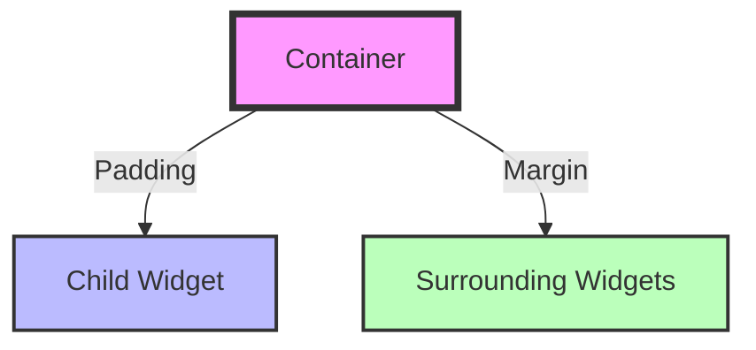

## 3.3.1 Container and Padding

In the world of Flutter, creating visually appealing and responsive layouts is a fundamental skill. Two of the most essential widgets that aid in this process are the `Container` and `Padding` widgets. These widgets provide the foundation for building complex UIs by allowing developers to control spacing, alignment, and styling. In this section, we will delve into the intricacies of these widgets, exploring their properties, usage, and best practices.

### Container Widget

The `Container` widget is one of the most versatile widgets in Flutter. It acts as a box that can contain other widgets and provides a wide range of properties for layout and styling. Whether you need to set dimensions, apply padding, or add decorations, the `Container` widget is your go-to tool.

#### Properties of Container

- **Padding**: Adds space inside the container, between the container's boundary and its child.
- **Margin**: Adds space outside the container, between the container's boundary and its surrounding widgets.
- **Alignment**: Aligns the child widget within the container.
- **Decoration**: Allows you to style the container with borders, colors, gradients, etc.
- **Width and Height**: Sets the dimensions of the container.

Here's a basic example of using a `Container`:

```dart
Container(
  color: Colors.blue,
  width: 100,
  height: 100,
  child: Center(
    child: Text(
      'Hello, Flutter!',
      style: TextStyle(color: Colors.white),
    ),
  ),
);
```

In this example, the `Container` is given a fixed width and height, a blue background color, and contains a centered text widget.

#### Container as a Parent Widget

The `Container` widget can act as a parent to other widgets, making it a powerful tool for building complex layouts. By nesting containers, you can create intricate designs and control the spacing and alignment of child widgets.

Consider the following example where a `Container` is used to create a card-like UI:

```dart
Container(
  margin: EdgeInsets.all(10.0),
  padding: EdgeInsets.all(20.0),
  decoration: BoxDecoration(
    color: Colors.white,
    borderRadius: BorderRadius.circular(10.0),
    boxShadow: [
      BoxShadow(
        color: Colors.grey.withOpacity(0.5),
        spreadRadius: 5,
        blurRadius: 7,
        offset: Offset(0, 3), // changes position of shadow
      ),
    ],
  ),
  child: Column(
    crossAxisAlignment: CrossAxisAlignment.start,
    children: <Widget>[
      Text(
        'Title',
        style: TextStyle(fontSize: 24, fontWeight: FontWeight.bold),
      ),
      SizedBox(height: 10),
      Text(
        'This is a description of the card. It provides more details about the content.',
        style: TextStyle(fontSize: 16),
      ),
    ],
  ),
);
```

In this example, the `Container` is styled to look like a card with padding, margin, and a shadow effect.

### Padding Widget

The `Padding` widget is specifically designed to add space around a child widget. It is a simple yet powerful widget that helps in managing the layout by providing consistent spacing.

#### Using the Padding Widget

The `Padding` widget takes a `padding` parameter, which is an instance of `EdgeInsets`. Here's a basic example:

```dart
Padding(
  padding: EdgeInsets.all(16.0),
  child: Text('Padded Text'),
);
```

In this example, the `Padding` widget adds 16 logical pixels of padding on all sides of the text.

### EdgeInsets

`EdgeInsets` is a class that allows you to specify padding in various ways:

- **EdgeInsets.all(double value)**: Applies the same padding on all sides.
- **EdgeInsets.symmetric(vertical: value, horizontal: value)**: Applies different padding vertically and horizontally.
- **EdgeInsets.only(left: value, top: value, right: value, bottom: value)**: Allows you to specify padding for each side individually.

Here's how you can use `EdgeInsets` to create different padding effects:

```dart
// Same padding on all sides
Padding(
  padding: EdgeInsets.all(8.0),
  child: Text('Equal Padding'),
);

// Different padding vertically and horizontally
Padding(
  padding: EdgeInsets.symmetric(vertical: 10.0, horizontal: 20.0),
  child: Text('Symmetric Padding'),
);

// Specific padding per side
Padding(
  padding: EdgeInsets.only(left: 30.0, top: 10.0),
  child: Text('Custom Padding'),
);
```

### Visual Examples

To better understand the impact of padding and margin, let's visualize these concepts with diagrams.

#### Diagram: Padding and Margin Effects



In this diagram, the `Container` has padding that affects the space inside it, while the margin affects the space outside it.

### Best Practices

- **Use `Padding` over `Container` for Padding**: If you only need to add padding, use the `Padding` widget instead of a `Container` with padding. This keeps your layout clean and efficient.
- **Keep Layouts Clean**: Use appropriate widgets for specific tasks. Avoid nesting multiple containers unnecessarily, as this can lead to complex and hard-to-maintain code.
- **Consistent Spacing**: Use consistent padding and margin values throughout your app to maintain a uniform look and feel.

### Exercises

To solidify your understanding of `Container` and `Padding`, try creating a simple card UI with the following specifications:

- A `Container` with a margin of 10 pixels.
- Inside the `Container`, use a `Padding` widget with 20 pixels of padding.
- Add a `Column` with two `Text` widgets: one for the title and one for the description.
- Style the `Container` to have rounded corners and a shadow effect.

This exercise will help you understand how padding and margin work together to create visually appealing layouts.

### Conclusion

The `Container` and `Padding` widgets are fundamental building blocks in Flutter's layout system. By mastering these widgets, you can create clean, responsive, and visually appealing UIs. Remember to use the right widget for the right task and maintain consistent spacing throughout your app.

For further exploration, consider reading the official [Flutter documentation](https://flutter.dev/docs/development/ui/layout) and experimenting with different layout scenarios in your projects.

## Quiz Time!



### What is the primary purpose of the Container widget in Flutter?

- [x] To provide layout and styling capabilities for child widgets.
- [ ] To handle user input events.
- [ ] To manage state within an application.
- [ ] To perform network operations.

> **Explanation:** The `Container` widget is primarily used for layout and styling, allowing developers to set dimensions, padding, margin, and more for child widgets.

### Which property of the Container widget adds space inside the container, between its boundary and child?

- [ ] Margin
- [x] Padding
- [ ] Alignment
- [ ] Decoration

> **Explanation:** The `padding` property of the `Container` widget adds space inside the container, between its boundary and the child widget.

### How do you apply the same padding on all sides using EdgeInsets?

- [ ] EdgeInsets.symmetric(vertical: value, horizontal: value)
- [x] EdgeInsets.all(value)
- [ ] EdgeInsets.only(left: value, top: value, right: value, bottom: value)
- [ ] EdgeInsets.fromLTRB(left, top, right, bottom)

> **Explanation:** `EdgeInsets.all(value)` applies the same padding on all sides of the widget.

### What is the recommended widget to use if you only need to add padding around a child widget?

- [ ] Container
- [x] Padding
- [ ] Align
- [ ] SizedBox

> **Explanation:** The `Padding` widget is specifically designed to add padding around a child widget, making it the recommended choice for this purpose.

### Which of the following is NOT a property of the Container widget?

- [ ] Width
- [ ] Height
- [ ] Color
- [x] GestureDetector

> **Explanation:** `GestureDetector` is not a property of the `Container` widget; it is a separate widget used for detecting gestures.

### What does the EdgeInsets.symmetric constructor allow you to specify?

- [x] Different padding values for vertical and horizontal sides.
- [ ] The same padding on all sides.
- [ ] Padding for each side individually.
- [ ] Padding using logical pixels.

> **Explanation:** `EdgeInsets.symmetric` allows you to specify different padding values for vertical and horizontal sides.

### Which widget would you use to align a child widget within a Container?

- [ ] Padding
- [ ] Margin
- [x] Align
- [ ] SizedBox

> **Explanation:** The `Align` widget is used to align a child widget within its parent, such as a `Container`.

### What effect does the margin property of a Container have?

- [x] It adds space outside the container, between the container's boundary and surrounding widgets.
- [ ] It adds space inside the container, between the container's boundary and its child.
- [ ] It changes the alignment of the child widget.
- [ ] It applies a shadow effect to the container.

> **Explanation:** The `margin` property adds space outside the container, affecting the spacing between the container and its surrounding widgets.

### Which widget is best for creating a card-like UI with padding and margin?

- [x] Container
- [ ] Padding
- [ ] Column
- [ ] Row

> **Explanation:** The `Container` widget is ideal for creating card-like UIs as it allows you to apply padding, margin, and styling such as borders and shadows.

### True or False: The Padding widget can only be used with Text widgets.

- [ ] True
- [x] False

> **Explanation:** False. The `Padding` widget can be used with any type of child widget, not just `Text` widgets.


