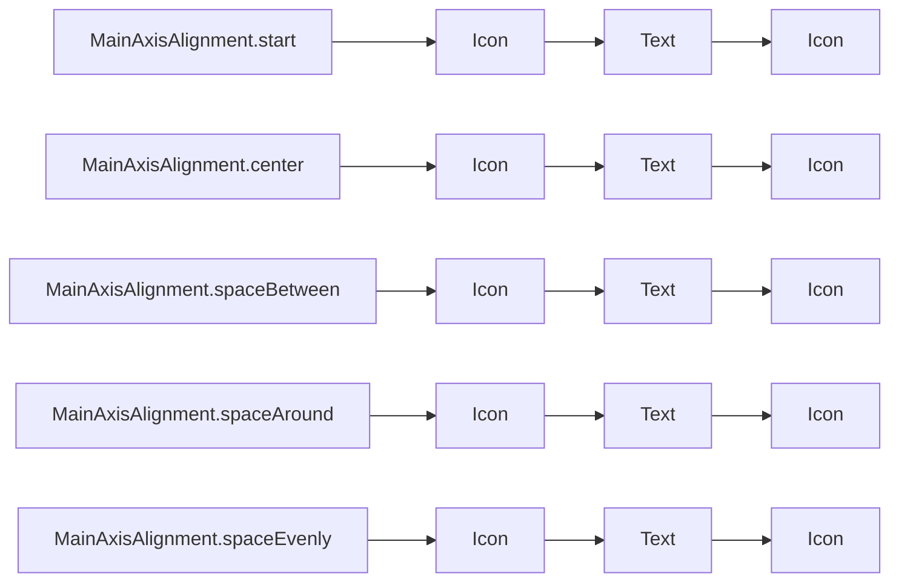

## 3.3.2 Row and Column

In Flutter, creating a flexible and responsive user interface is essential for delivering a seamless user experience across different devices and screen sizes. Two of the most fundamental widgets for achieving this are the `Row` and `Column` widgets. These widgets allow developers to arrange child widgets in horizontal and vertical layouts, respectively. Understanding how to effectively use these widgets is crucial for building complex and dynamic UIs in Flutter.

### Row Widget

The `Row` widget is used to arrange its children in a horizontal array. This widget is particularly useful when you want to display elements side by side, such as icons next to text or buttons in a toolbar.

#### Basic Usage

The basic usage of a `Row` widget involves specifying its children in a list. Here's a simple example:

```dart
Row(
  children: [
    Icon(Icons.star),
    Text('Star'),
  ],
);
```

In this example, the `Row` widget contains an `Icon` and a `Text` widget, which are displayed horizontally.

#### MainAxisAlignment

The `mainAxisAlignment` property of a `Row` widget controls how the children are aligned along the main axis, which is horizontal for a `Row`. This property can be used to distribute space between and around the children.

Here are some common values for `MainAxisAlignment`:

- `MainAxisAlignment.start`: Aligns children at the start of the row.
- `MainAxisAlignment.end`: Aligns children at the end of the row.
- `MainAxisAlignment.center`: Centers children in the row.
- `MainAxisAlignment.spaceBetween`: Places free space evenly between the children.
- `MainAxisAlignment.spaceAround`: Places free space evenly between the children, with half of that space also before and after the first and last child.
- `MainAxisAlignment.spaceEvenly`: Places free space evenly between the children as well as before and after the first and last child.

Example:

```dart
Row(
  mainAxisAlignment: MainAxisAlignment.spaceEvenly,
  children: [
    Icon(Icons.star),
    Text('Star'),
    Icon(Icons.star_border),
  ],
);
```

In this example, the `mainAxisAlignment` is set to `spaceEvenly`, which distributes the children evenly across the row.

#### CrossAxisAlignment

The `crossAxisAlignment` property controls how the children are aligned along the cross axis, which is vertical for a `Row`. This property is useful for aligning children with different heights.

Common values for `CrossAxisAlignment`:

- `CrossAxisAlignment.start`: Aligns children at the top of the row.
- `CrossAxisAlignment.end`: Aligns children at the bottom of the row.
- `CrossAxisAlignment.center`: Centers children vertically in the row.
- `CrossAxisAlignment.stretch`: Stretches children to fill the vertical space.

Example:

```dart
Row(
  crossAxisAlignment: CrossAxisAlignment.start,
  children: [
    Icon(Icons.star, size: 50),
    Text('Star'),
  ],
);
```

Here, the `crossAxisAlignment` is set to `start`, aligning the children at the top of the row.

### Column Widget

The `Column` widget is similar to the `Row` widget but arranges its children vertically. This widget is ideal for stacking elements on top of each other, such as text fields in a form or a list of items.

#### Basic Usage

The basic usage of a `Column` widget is similar to that of a `Row`, but the children are arranged vertically:

```dart
Column(
  children: [
    Icon(Icons.star),
    Text('Star'),
  ],
);
```

#### MainAxisAlignment and CrossAxisAlignment

The `Column` widget also supports `mainAxisAlignment` and `crossAxisAlignment`, but their effects are along the vertical and horizontal axes, respectively.

Example with `MainAxisAlignment`:

```dart
Column(
  mainAxisAlignment: MainAxisAlignment.spaceAround,
  children: [
    Icon(Icons.star),
    Text('Star'),
    Icon(Icons.star_border),
  ],
);
```

Example with `CrossAxisAlignment`:

```dart
Column(
  crossAxisAlignment: CrossAxisAlignment.start,
  children: [
    Icon(Icons.star, size: 50),
    Text('Star'),
  ],
);
```

### Nested Rows and Columns

To create complex layouts, you can nest `Row` and `Column` widgets within each other. This allows for intricate designs and flexible arrangements of UI elements.

Example:

```dart
Column(
  children: [
    Row(
      mainAxisAlignment: MainAxisAlignment.spaceBetween,
      children: [
        Icon(Icons.star),
        Text('Star'),
      ],
    ),
    Row(
      mainAxisAlignment: MainAxisAlignment.spaceEvenly,
      children: [
        Icon(Icons.star_border),
        Text('Border'),
      ],
    ),
  ],
);
```

#### Potential Layout Issues

When nesting `Row` and `Column` widgets, be cautious of potential layout issues such as overflowing. This can occur if the combined size of the children exceeds the available space. To mitigate this, consider using widgets like `Expanded` or `Flexible`.

### Expanded and Flexible Widgets

The `Expanded` and `Flexible` widgets are used to control how a child of a `Row` or `Column` flexes to fill the available space.

#### Expanded Widget

The `Expanded` widget takes up the remaining space in a `Row` or `Column`. It is useful when you want a child to fill the available space.

Example:

```dart
Row(
  children: [
    Expanded(child: Text('This text will expand')),
    Icon(Icons.arrow_forward),
  ],
);
```

In this example, the `Text` widget expands to fill the available horizontal space, while the `Icon` remains at its natural size.

#### Flexible Widget

The `Flexible` widget allows a child to occupy a flexible amount of space. Unlike `Expanded`, it can be configured to take only a portion of the available space.

Example:

```dart
Row(
  children: [
    Flexible(
      flex: 2,
      child: Container(color: Colors.red),
    ),
    Flexible(
      flex: 1,
      child: Container(color: Colors.blue),
    ),
  ],
);
```

In this example, the red container takes up twice as much space as the blue container.

### Visual Aids

To better understand the alignment and spacing options, let's visualize a `Row` with different `MainAxisAlignment` settings:



This diagram illustrates how different `MainAxisAlignment` settings affect the distribution of children in a `Row`.

### Exercises

To reinforce your understanding of `Row` and `Column`, try recreating the following UI layout:

- Create a `Column` with three `Row` widgets.
- Each `Row` should contain an `Icon` and a `Text` widget.
- Use `MainAxisAlignment.spaceEvenly` for the first `Row`, `MainAxisAlignment.center` for the second, and `MainAxisAlignment.spaceBetween` for the third.
- Experiment with `CrossAxisAlignment` to see how it affects the vertical alignment of the children.

### Best Practices

- Use `Row` and `Column` widgets to create simple and complex layouts.
- Leverage `MainAxisAlignment` and `CrossAxisAlignment` to control the alignment and distribution of children.
- Use `Expanded` and `Flexible` widgets to manage space efficiently and avoid overflow issues.
- Test your layouts on different screen sizes to ensure responsiveness.

### Common Pitfalls

- Avoid nesting too many `Row` and `Column` widgets, as this can lead to complex and hard-to-maintain code.
- Be mindful of overflow issues, especially when using fixed-size widgets within a `Row` or `Column`.
- Use `Expanded` and `Flexible` wisely to prevent unintended layout behavior.

### Additional Resources

- [Flutter Official Documentation on Row](https://api.flutter.dev/flutter/widgets/Row-class.html)
- [Flutter Official Documentation on Column](https://api.flutter.dev/flutter/widgets/Column-class.html)
- [Flutter Layouts Cheat Sheet](https://flutter.dev/docs/development/ui/layout)

By mastering the `Row` and `Column` widgets, you can create flexible and responsive layouts that adapt to various screen sizes and orientations. Experiment with different alignment and spacing options to achieve the desired look and feel for your Flutter applications.

## Quiz Time!



### What is the primary purpose of the Row widget in Flutter?

- [x] To arrange widgets horizontally
- [ ] To arrange widgets vertically
- [ ] To arrange widgets in a grid
- [ ] To arrange widgets in a stack

> **Explanation:** The `Row` widget is used to arrange its children horizontally.

### Which property of the Row widget controls the horizontal alignment of its children?

- [x] MainAxisAlignment
- [ ] CrossAxisAlignment
- [ ] Alignment
- [ ] Flex

> **Explanation:** The `mainAxisAlignment` property controls how the children are aligned horizontally in a `Row`.

### What does the Expanded widget do in a Row or Column?

- [x] It makes a child widget fill the available space
- [ ] It centers a child widget
- [ ] It aligns a child widget to the start
- [ ] It aligns a child widget to the end

> **Explanation:** The `Expanded` widget makes a child widget fill the available space in a `Row` or `Column`.

### How does the CrossAxisAlignment property affect a Row?

- [x] It controls the vertical alignment of children
- [ ] It controls the horizontal alignment of children
- [ ] It controls the spacing between children
- [ ] It controls the size of children

> **Explanation:** The `crossAxisAlignment` property controls the vertical alignment of children in a `Row`.

### Which MainAxisAlignment value places free space evenly between children and also before and after the first and last child?

- [x] MainAxisAlignment.spaceEvenly
- [ ] MainAxisAlignment.spaceBetween
- [ ] MainAxisAlignment.spaceAround
- [ ] MainAxisAlignment.center

> **Explanation:** `MainAxisAlignment.spaceEvenly` places free space evenly between the children as well as before and after the first and last child.

### What is a potential issue when nesting multiple Rows and Columns?

- [x] Layout overflow
- [ ] Increased performance
- [ ] Reduced code complexity
- [ ] Improved readability

> **Explanation:** Nesting multiple `Row` and `Column` widgets can lead to layout overflow issues if not managed properly.

### Which widget allows a child to occupy a flexible amount of space in a Row or Column?

- [x] Flexible
- [ ] Expanded
- [ ] SizedBox
- [ ] Container

> **Explanation:** The `Flexible` widget allows a child to occupy a flexible amount of space in a `Row` or `Column`.

### What does the MainAxisAlignment.spaceBetween value do?

- [x] Places free space evenly between children
- [ ] Aligns children at the start
- [ ] Aligns children at the end
- [ ] Centers children

> **Explanation:** `MainAxisAlignment.spaceBetween` places free space evenly between the children.

### Which CrossAxisAlignment value stretches children to fill the vertical space in a Row?

- [x] CrossAxisAlignment.stretch
- [ ] CrossAxisAlignment.start
- [ ] CrossAxisAlignment.end
- [ ] CrossAxisAlignment.center

> **Explanation:** `CrossAxisAlignment.stretch` stretches children to fill the vertical space in a `Row`.

### True or False: The Column widget can only contain other Column widgets.

- [ ] True
- [x] False

> **Explanation:** The `Column` widget can contain any type of widget, not just other `Column` widgets.


