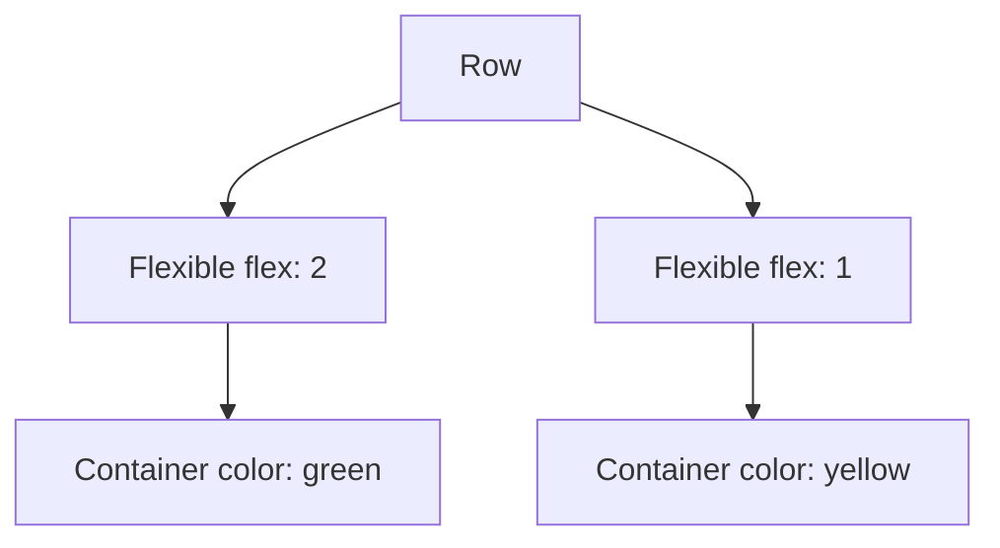

## 3.3.4 Flexible and Expanded

In the world of Flutter, creating responsive and adaptive layouts is crucial for delivering a seamless user experience across different devices and screen sizes. Two powerful widgets that aid in achieving this are the `Flexible` and `Expanded` widgets. These widgets are essential tools for controlling how children of a `Row`, `Column`, or `Flex` widget expand to fill available space. In this section, we will delve into the intricacies of these widgets, explore their usage through practical examples, and provide insights into best practices for their implementation.

### Understanding Flexible and Expanded

Both `Flexible` and `Expanded` widgets play a pivotal role in determining how a child widget behaves within a parent widget like `Row`, `Column`, or `Flex`. They allow developers to manage space allocation efficiently, ensuring that the UI adapts gracefully to different screen dimensions.

#### The Expanded Widget

The `Expanded` widget is a straightforward yet powerful tool that makes its child fill the available space within a parent widget. It is essentially a shorthand for `Flexible(flex: 1, fit: FlexFit.tight)`, meaning it forces the child to occupy all the remaining space in the parent.

**Key Characteristics of Expanded:**

- **Space Filling:** The child widget will expand to fill all available space.
- **Tight Fit:** It uses a `FlexFit.tight` fit, ensuring the child widget occupies the maximum space possible.

**Example Usage of Expanded:**

```dart
Row(
  children: [
    Expanded(child: Text('This will expand')),
    Text('This will not expand'),
  ],
);
```

In the above example, the `Text` widget wrapped in `Expanded` will stretch to fill the remaining space in the `Row`, while the other `Text` widget will maintain its natural size.

#### The Flexible Widget

The `Flexible` widget offers more nuanced control over how a child widget resizes. It can be configured to either fill the available space (`FlexFit.tight`) or take up only as much space as it needs (`FlexFit.loose`).

**Key Characteristics of Flexible:**

- **Flexibility:** Allows the child to either fill the space or be smaller, depending on the `fit` parameter.
- **Customizable Fit:** Can be set to `FlexFit.tight` or `FlexFit.loose`.

**Example Usage of Flexible:**

```dart
Row(
  children: [
    Flexible(
      flex: 2,
      child: Container(color: Colors.red),
    ),
    Flexible(
      flex: 1,
      child: Container(color: Colors.blue),
    ),
  ],
);
```

In this example, the `Container` widgets are wrapped in `Flexible` with different `flex` values, determining their relative sizes within the `Row`.

### Flex Properties

The `flex` property is a crucial aspect of both `Flexible` and `Expanded` widgets. It dictates how much space a widget should take relative to its siblings. The `flex` value is an integer, and the space is divided among children based on their `flex` values.

**Understanding Flex Values:**

- **Relative Sizing:** Widgets with higher `flex` values take more space.
- **Proportional Distribution:** Space is distributed proportionally based on the sum of all `flex` values.

**Example with Flex Values:**

```dart
Row(
  children: [
    Flexible(
      flex: 2,
      child: Container(color: Colors.green),
    ),
    Flexible(
      flex: 1,
      child: Container(color: Colors.yellow),
    ),
  ],
);
```

Here, the green `Container` will occupy twice the space of the yellow `Container` because its `flex` value is twice as large.

### Visual Aids

To better understand how `flex` values affect layout, let's visualize the distribution of space using diagrams.



In this diagram, the `Row` contains two `Flexible` widgets with different `flex` values, illustrating how space is allocated.

### Best Practices

When using `Flexible` and `Expanded`, consider the following best practices to ensure optimal layout performance and responsiveness:

- **Use `Expanded` for Full Space Utilization:** When you want a child widget to fill all available space, `Expanded` is the ideal choice.
- **Leverage `Flexible` for Control:** Use `Flexible` when you need more granular control over how a child resizes, especially when different children should occupy varying amounts of space.
- **Balance Flex Values:** Ensure that `flex` values are balanced to achieve the desired layout proportions.
- **Test Across Devices:** Always test your layouts on multiple devices to ensure they adapt well to different screen sizes and orientations.

### Exercise

To solidify your understanding, try creating a responsive layout using both `Flexible` and `Expanded`. Adjust the `flex` values to see how they impact the layout.

**Exercise Prompt:**

Create a `Column` with three children: a `Text` widget, a `Container` with a `Flexible` widget, and another `Container` with an `Expanded` widget. Experiment with different `flex` values to observe how the layout changes.

```dart
Column(
  children: [
    Text('Header'),
    Flexible(
      flex: 2,
      child: Container(color: Colors.orange),
    ),
    Expanded(
      child: Container(color: Colors.purple),
    ),
  ],
);
```

### Conclusion

Understanding and effectively using `Flexible` and `Expanded` widgets is crucial for creating responsive and adaptive Flutter layouts. By mastering these widgets, you can ensure that your applications provide a consistent and engaging user experience across a wide range of devices.

For further exploration, consider diving into the official Flutter documentation and experimenting with different layout configurations in your projects.

## Quiz Time!



### What is the primary purpose of the `Expanded` widget in Flutter?

- [x] To make a child widget fill the available space in a `Row`, `Column`, or `Flex`.
- [ ] To allow a child widget to take up only as much space as it needs.
- [ ] To provide padding around a child widget.
- [ ] To align a child widget to the center of its parent.

> **Explanation:** The `Expanded` widget is used to make a child widget fill all available space within a parent widget like `Row`, `Column`, or `Flex`.

### How does the `Flexible` widget differ from the `Expanded` widget?

- [x] `Flexible` allows more control over how a child resizes, while `Expanded` forces the child to fill available space.
- [ ] `Flexible` is used for aligning widgets, while `Expanded` is used for padding.
- [ ] `Flexible` is only used in `Column` widgets, while `Expanded` is only used in `Row` widgets.
- [ ] `Flexible` and `Expanded` are identical in functionality.

> **Explanation:** The `Flexible` widget provides more control over how a child resizes, allowing for both `FlexFit.tight` and `FlexFit.loose` fits, whereas `Expanded` forces the child to fill the available space.

### What does the `flex` property in `Flexible` and `Expanded` widgets control?

- [x] The relative amount of space a widget takes compared to its siblings.
- [ ] The alignment of the widget within its parent.
- [ ] The color of the widget.
- [ ] The padding around the widget.

> **Explanation:** The `flex` property determines how much space a widget takes relative to its siblings, with higher `flex` values resulting in more space.

### Which `FlexFit` value should you use if you want a child widget to fill all available space?

- [x] `FlexFit.tight`
- [ ] `FlexFit.loose`
- [ ] `FlexFit.expand`
- [ ] `FlexFit.shrink`

> **Explanation:** `FlexFit.tight` is used when you want a child widget to fill all available space.

### In a `Row` with two `Flexible` children, if one has a `flex` value of 2 and the other has a `flex` value of 1, how is the space divided?

- [x] The first child takes twice as much space as the second child.
- [ ] The space is divided equally between the two children.
- [ ] The second child takes twice as much space as the first child.
- [ ] The space is divided based on the order of the children.

> **Explanation:** The first child takes twice as much space as the second child because its `flex` value is twice as large.

### What is a common use case for the `Expanded` widget?

- [x] To make a widget fill the remaining space in a `Row` or `Column`.
- [ ] To add padding around a widget.
- [ ] To align a widget to the left of its parent.
- [ ] To change the color of a widget.

> **Explanation:** The `Expanded` widget is commonly used to make a widget fill the remaining space in a `Row` or `Column`.

### Which widget would you use to allow a child widget to take up only as much space as it needs?

- [x] `Flexible` with `FlexFit.loose`
- [ ] `Expanded`
- [ ] `Container`
- [ ] `Align`

> **Explanation:** `Flexible` with `FlexFit.loose` allows a child widget to take up only as much space as it needs.

### What happens if you use `Expanded` inside a `Column` with other non-expanded children?

- [x] The `Expanded` child will fill the remaining vertical space.
- [ ] The `Expanded` child will be aligned to the top.
- [ ] The `Expanded` child will be hidden.
- [ ] The `Expanded` child will overlap other children.

> **Explanation:** The `Expanded` child will fill the remaining vertical space in a `Column`.

### Can `Flexible` and `Expanded` widgets be used outside of `Row`, `Column`, or `Flex`?

- [ ] True
- [x] False

> **Explanation:** `Flexible` and `Expanded` widgets are specifically designed to be used within `Row`, `Column`, or `Flex` widgets to control space allocation.

### What is the default `flex` value for `Expanded`?

- [x] 1
- [ ] 0
- [ ] 2
- [ ] 3

> **Explanation:** The default `flex` value for `Expanded` is 1, meaning it will take up all available space unless other `flex` values are specified.


