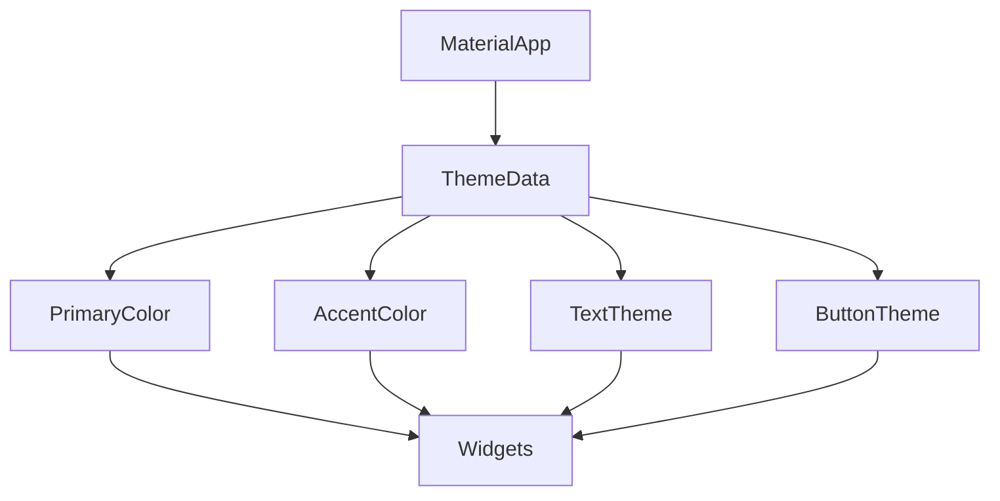

## 3.4.1 Colors and Themes

In the world of mobile app development, creating a visually appealing and consistent user interface is crucial. Flutter, with its rich set of widgets and customization options, provides developers with the tools to design beautiful applications. One of the key aspects of this design process is the effective use of colors and themes. In this section, we will delve into how Flutter handles colors and themes, providing you with the knowledge to create stunning and cohesive app designs.

### Using Colors

Colors play a vital role in the design of any application. They can convey emotions, highlight important elements, and enhance the overall user experience. Flutter offers a comprehensive `Colors` class that includes a wide range of predefined colors, making it easy to apply consistent color schemes across your app.

#### Predefined Colors

The `Colors` class in Flutter provides a palette of predefined colors that you can use directly in your widgets. This class includes a variety of shades for each color, allowing you to choose the perfect hue for your design needs.

```dart
Container(
  color: Colors.amber,
);
```

In the example above, we use `Colors.amber` to set the background color of a `Container`. This approach is straightforward and ensures that your app's colors are consistent with Material Design guidelines.

#### Custom Colors

While predefined colors are convenient, there may be times when you need a specific color that isn't available in the `Colors` class. In such cases, you can create custom colors using the `Color` class and hexadecimal values.

```dart
Color customColor = Color(0xFF42A5F5);
```

The `Color` constructor takes a 32-bit integer value, where the first two digits represent the alpha channel (transparency), and the remaining six digits represent the RGB (red, green, blue) values. In the example above, `0xFF42A5F5` represents a shade of blue with full opacity.

### Themes in Flutter

Themes are a powerful feature in Flutter that allow you to define app-wide styling, ensuring consistency across your application. By using themes, you can centralize your styling logic, making it easier to maintain and update your app's appearance.

#### The `ThemeData` Class

The `ThemeData` class is the cornerstone of theming in Flutter. It allows you to define a comprehensive set of styling options, including colors, text styles, and widget themes. By configuring `ThemeData`, you can create a cohesive look and feel for your entire application.

```dart
MaterialApp(
  theme: ThemeData(
    primaryColor: Colors.blue,
    accentColor: Colors.amber,
  ),
  home: MyHomePage(),
);
```

In this example, we define a theme for our `MaterialApp` with a primary color of blue and an accent color of amber. These colors will be applied to various widgets throughout the app, such as buttons and app bars, ensuring a consistent design.

#### Accessing Theme Colors

Once you've defined a theme, you can access its properties within your widgets using `Theme.of(context)`. This method retrieves the current theme data, allowing you to apply theme-specific styles dynamically.

```dart
Container(
  color: Theme.of(context).primaryColor,
);
```

By using `Theme.of(context).primaryColor`, you ensure that the container's color matches the primary color defined in your theme. This approach promotes consistency and makes it easy to update your app's styling in one place.

### Customizing Themes

Flutter's theming system is highly customizable, allowing you to tailor the appearance of various UI elements to suit your design needs. You can customize text themes, button themes, and more by modifying the `ThemeData` properties.

#### Custom Text Themes

Text is a fundamental part of any application, and customizing text styles is essential for creating a polished user interface. Flutter allows you to define custom text themes within `ThemeData`, providing a consistent typography across your app.

```dart
theme: ThemeData(
  textTheme: TextTheme(
    headline1: TextStyle(fontSize: 36.0, fontWeight: FontWeight.bold),
  ),
);
```

In this example, we define a custom text style for `headline1`, setting the font size to 36.0 and the font weight to bold. This style will be applied to all text widgets that use the `headline1` style, ensuring a uniform appearance.

#### Custom Button Themes

Buttons are interactive elements that play a crucial role in user interaction. Flutter allows you to customize button styles through the `ButtonThemeData` class, enabling you to define consistent button appearances across your app.

```dart
theme: ThemeData(
  buttonTheme: ButtonThemeData(
    buttonColor: Colors.blue,
    textTheme: ButtonTextTheme.primary,
  ),
);
```

In this example, we set the button color to blue and specify that the button text should use the primary color defined in the theme. This ensures that all buttons in the app have a consistent look and feel.

### Dark and Light Themes

Supporting both light and dark themes is becoming increasingly important as users expect apps to adapt to their preferences and device settings. Flutter makes it easy to implement dark and light themes by allowing you to define different `ThemeData` configurations for each mode.

#### Defining Brightness

The `brightness` property in `ThemeData` determines whether a theme is light or dark. By setting this property, you can create separate themes for each mode and switch between them based on user preferences or system settings.

```dart
MaterialApp(
  theme: ThemeData(
    brightness: Brightness.light,
    primaryColor: Colors.blue,
  ),
  darkTheme: ThemeData(
    brightness: Brightness.dark,
    primaryColor: Colors.blueGrey,
  ),
  themeMode: ThemeMode.system,
  home: MyHomePage(),
);
```

In this example, we define both a light and a dark theme, with the `themeMode` set to `ThemeMode.system`. This configuration automatically switches between the light and dark themes based on the device's system settings, providing a seamless experience for users.

### Visual Aids

To better understand the impact of themes on your app's appearance, it's helpful to visualize the changes. Below are some visual aids that illustrate how different themes can transform the look and feel of your application.

#### Screenshots of Different Themes


These screenshots demonstrate the same app with light and dark themes applied. Notice how the color scheme and overall aesthetics change to match the selected theme.

#### Theme Inheritance Diagram



This diagram illustrates how `ThemeData` properties are inherited by various widgets within the app, ensuring a consistent design language.

### Best Practices

When working with colors and themes in Flutter, it's important to follow best practices to ensure a maintainable and scalable codebase.

- **Define Themes at the Top Level:** Always define your themes at the top level of your app, such as in the `MaterialApp` widget. This ensures that all widgets have access to the theme properties.
- **Use Theme Properties:** Instead of hardcoding colors and styles, use theme properties to maintain consistency and make it easier to update your app's design.
- **Test Across Devices:** Ensure that your themes look good on different devices and screen sizes. Test both light and dark modes to verify that your app adapts correctly.

### Exercise

To reinforce your understanding of colors and themes in Flutter, try the following exercise:

1. Create a new Flutter project.
2. Define a custom theme with a unique color scheme and typography.
3. Implement both light and dark themes, allowing users to switch between them.
4. Apply the custom theme to your app and test it on different devices.

By completing this exercise, you'll gain hands-on experience with Flutter's theming system and learn how to create visually appealing and consistent app designs.

### Conclusion

Colors and themes are essential components of any Flutter application, providing the foundation for a cohesive and engaging user experience. By leveraging Flutter's powerful theming capabilities, you can create apps that are not only visually stunning but also adaptable to user preferences and system settings. As you continue to explore Flutter, remember to experiment with different color schemes and themes to find the perfect design for your projects.

## Quiz Time!



### What class provides a palette of predefined colors in Flutter?

- [x] Colors
- [ ] ColorScheme
- [ ] ThemeData
- [ ] Palette

> **Explanation:** The `Colors` class in Flutter provides a wide range of predefined colors that can be used directly in your widgets.

### How can you create a custom color using hexadecimal values in Flutter?

- [x] Color(0xFF42A5F5)
- [ ] Colors.custom(0xFF42A5F5)
- [ ] ThemeData.customColor(0xFF42A5F5)
- [ ] ColorScheme.fromHex(0xFF42A5F5)

> **Explanation:** You can create a custom color in Flutter using the `Color` class and a hexadecimal value, such as `Color(0xFF42A5F5)`.

### Which class is used to define app-wide themes in Flutter?

- [x] ThemeData
- [ ] Theme
- [ ] ColorScheme
- [ ] MaterialApp

> **Explanation:** The `ThemeData` class is used to define app-wide themes in Flutter, allowing you to specify colors, text styles, and other styling options.

### How do you access theme properties within a widget?

- [x] Theme.of(context)
- [ ] ThemeData.of(context)
- [ ] Colors.of(context)
- [ ] MaterialApp.of(context)

> **Explanation:** You can access theme properties within a widget using `Theme.of(context)`, which retrieves the current theme data.

### What property in `ThemeData` determines whether a theme is light or dark?

- [x] brightness
- [ ] colorScheme
- [ ] themeMode
- [ ] primaryColor

> **Explanation:** The `brightness` property in `ThemeData` determines whether a theme is light or dark.

### How can you define both light and dark themes in a Flutter app?

- [x] Use `theme` and `darkTheme` properties in `MaterialApp`
- [ ] Use `ThemeData.light` and `ThemeData.dark`
- [ ] Use `ColorScheme.light` and `ColorScheme.dark`
- [ ] Use `ThemeMode.light` and `ThemeMode.dark`

> **Explanation:** You can define both light and dark themes in a Flutter app by using the `theme` and `darkTheme` properties in the `MaterialApp` widget.

### What is the purpose of the `ThemeMode` property in `MaterialApp`?

- [x] To specify how the app should switch between light and dark themes
- [ ] To define the primary color of the app
- [ ] To set the default font size
- [ ] To configure the app's navigation bar

> **Explanation:** The `ThemeMode` property in `MaterialApp` specifies how the app should switch between light and dark themes, such as based on system settings.

### Which method is used to apply a custom text style to a specific text theme in Flutter?

- [x] TextTheme.headline1
- [ ] ThemeData.textStyle
- [ ] Colors.textTheme
- [ ] MaterialApp.textTheme

> **Explanation:** You can apply a custom text style to a specific text theme in Flutter using properties like `TextTheme.headline1`.

### What is a best practice when defining themes in a Flutter app?

- [x] Define themes at the top level of the app
- [ ] Hardcode colors in each widget
- [ ] Use different themes for each screen
- [ ] Avoid using themes for styling

> **Explanation:** A best practice when defining themes in a Flutter app is to define them at the top level, such as in the `MaterialApp` widget, to ensure consistency.

### True or False: You should always hardcode colors in your Flutter app for consistency.

- [ ] True
- [x] False

> **Explanation:** False. You should use theme properties instead of hardcoding colors to maintain consistency and make it easier to update your app's design.


