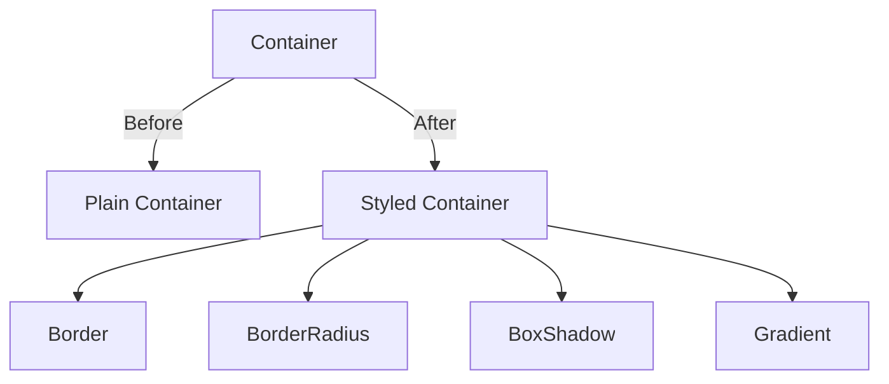

## 3.4.3 BoxDecoration and Borders

In the world of Flutter, creating visually appealing user interfaces is both an art and a science. One of the most powerful tools at your disposal for styling widgets is the `BoxDecoration` class. This versatile class allows you to apply a variety of visual effects to widgets, transforming simple containers into eye-catching UI elements. In this section, we'll delve into the intricacies of `BoxDecoration` and explore how borders, shadows, gradients, and more can be used to enhance your app's design.

### Understanding BoxDecoration

The `BoxDecoration` class is a cornerstone of Flutter's styling capabilities. It is typically used in conjunction with the `Container` widget's `decoration` property to apply a range of visual effects. Here's a breakdown of the key properties you can leverage with `BoxDecoration`:

- **Color**: Sets the background color of the container.
- **Border**: Adds borders around the container.
- **BorderRadius**: Rounds the corners of the container.
- **BoxShadow**: Applies shadows to create depth.
- **Gradient**: Fills the container with a gradient.
- **Image**: Sets a background image for the container.

Let's explore each of these properties in detail, complete with practical examples and visual illustrations.

### Applying Borders

Borders are a fundamental aspect of UI design, providing structure and emphasis to elements. In Flutter, you can easily add borders to a container using the `border` property of `BoxDecoration`.

#### Example: Adding a Simple Border

```dart
Container(
  decoration: BoxDecoration(
    border: Border.all(color: Colors.black, width: 2),
  ),
)
```

In this example, a black border with a width of 2 pixels is applied to the container. The `Border.all` constructor is a convenient way to apply the same border to all sides of the container.

#### Customizing Borders

You can customize borders further by specifying different styles for each side using the `Border` class:

```dart
Container(
  decoration: BoxDecoration(
    border: Border(
      top: BorderSide(color: Colors.red, width: 3),
      right: BorderSide(color: Colors.green, width: 3),
      bottom: BorderSide(color: Colors.blue, width: 3),
      left: BorderSide(color: Colors.yellow, width: 3),
    ),
  ),
)
```

This example demonstrates how to apply different colors and widths to each side of the border, creating a colorful and dynamic effect.

### BorderRadius: Rounding the Corners

Rounded corners can soften the appearance of UI elements, making them more visually appealing. The `borderRadius` property of `BoxDecoration` allows you to round the corners of a container.

#### Example: Applying BorderRadius

```dart
Container(
  decoration: BoxDecoration(
    color: Colors.white,
    borderRadius: BorderRadius.circular(8.0),
  ),
)
```

Here, the `BorderRadius.circular` method is used to apply a uniform radius of 8 pixels to all corners of the container. You can also specify different radii for each corner using `BorderRadius.only`.

### BoxShadow: Adding Depth with Shadows

Shadows can add a sense of depth and realism to your UI, making elements appear elevated above the background. The `boxShadow` property of `BoxDecoration` is used to apply shadows.

#### Example: Adding a BoxShadow

```dart
Container(
  decoration: BoxDecoration(
    color: Colors.white,
    boxShadow: [
      BoxShadow(
        color: Colors.grey.withOpacity(0.5),
        spreadRadius: 5,
        blurRadius: 7,
        offset: Offset(0, 3),
      ),
    ],
  ),
)
```

In this example, a shadow is applied with a grey color, a spread radius of 5, and a blur radius of 7. The `offset` parameter specifies the shadow's position relative to the container.

### Gradients: Creating Color Transitions

Gradients can add a dynamic and colorful touch to your UI. The `gradient` property of `BoxDecoration` allows you to fill a container with a linear or radial gradient.

#### Example: Applying a Linear Gradient

```dart
Container(
  decoration: BoxDecoration(
    gradient: LinearGradient(
      colors: [Colors.blue, Colors.green],
      begin: Alignment.topLeft,
      end: Alignment.bottomRight,
    ),
  ),
)
```

This example demonstrates a linear gradient transitioning from blue to green, starting from the top-left and ending at the bottom-right of the container.

### Visual Examples

To better understand the impact of `BoxDecoration`, let's visualize some examples. Below are illustrations of containers before and after applying various decorations.



- **Plain Container**: A basic container with no styling.
- **Styled Container**: A container with a combination of border, rounded corners, shadow, and gradient.

### Best Practices

When using `BoxDecoration`, it's important to keep your designs clean and consistent. Here are some best practices to consider:

- **Consistency**: Use consistent styles across your app to create a cohesive look and feel.
- **Subtlety**: Avoid overwhelming users with excessive shadows or gradients. Subtle effects often have a more professional appearance.
- **Performance**: Be mindful of performance when applying complex decorations, especially on lower-end devices.

### Exercise: Create a Styled Card Widget

To reinforce your understanding of `BoxDecoration`, try creating a styled card widget. Use a combination of borders, rounded corners, shadows, and gradients to design a visually appealing card. Here's a starting point:

```dart
Container(
  margin: EdgeInsets.all(10),
  padding: EdgeInsets.all(20),
  decoration: BoxDecoration(
    color: Colors.white,
    borderRadius: BorderRadius.circular(15),
    boxShadow: [
      BoxShadow(
        color: Colors.black26,
        blurRadius: 10,
        offset: Offset(0, 5),
      ),
    ],
    gradient: LinearGradient(
      colors: [Colors.purple, Colors.blue],
      begin: Alignment.topLeft,
      end: Alignment.bottomRight,
    ),
  ),
  child: Column(
    crossAxisAlignment: CrossAxisAlignment.start,
    children: [
      Text(
        'Styled Card',
        style: TextStyle(fontSize: 24, fontWeight: FontWeight.bold),
      ),
      SizedBox(height: 10),
      Text(
        'This is a card with a gradient background, rounded corners, and a shadow.',
        style: TextStyle(fontSize: 16),
      ),
    ],
  ),
)
```

### Conclusion

The `BoxDecoration` class is a powerful tool for enhancing the visual appeal of your Flutter applications. By mastering its properties, you can create sophisticated and engaging user interfaces that captivate your users. Remember to experiment with different combinations of borders, shadows, gradients, and more to find the perfect style for your app.

For further exploration, consider diving into the official [Flutter documentation](https://flutter.dev/docs/development/ui/widgets/container) and experimenting with open-source projects on platforms like GitHub. Additionally, books and online courses on Flutter UI design can provide deeper insights into advanced styling techniques.

## Quiz Time!



### What is the primary use of the `BoxDecoration` class in Flutter?

- [x] To apply visual effects to a widget
- [ ] To manage state in a Flutter application
- [ ] To handle user input
- [ ] To perform network requests

> **Explanation:** The `BoxDecoration` class is used to apply visual effects such as colors, borders, shadows, and gradients to widgets, enhancing their appearance.

### Which property of `BoxDecoration` is used to add a shadow to a container?

- [ ] border
- [ ] gradient
- [x] boxShadow
- [ ] image

> **Explanation:** The `boxShadow` property is used to add shadows to a container, creating a sense of depth.

### How can you round the corners of a container in Flutter?

- [ ] Using the `border` property
- [x] Using the `borderRadius` property
- [ ] Using the `boxShadow` property
- [ ] Using the `gradient` property

> **Explanation:** The `borderRadius` property is used to round the corners of a container, giving it a softer appearance.

### What does the `Border.all` constructor do?

- [x] Applies the same border to all sides of a container
- [ ] Applies a gradient to a container
- [ ] Adds a shadow to a container
- [ ] Sets the background color of a container

> **Explanation:** The `Border.all` constructor is a convenient way to apply the same border style to all sides of a container.

### Which of the following is a best practice when using `BoxDecoration`?

- [x] Keep designs clean and consistent
- [ ] Use as many shadows as possible
- [ ] Avoid using gradients
- [ ] Always use the same color for all borders

> **Explanation:** Keeping designs clean and consistent helps create a cohesive and professional look across your app.

### What is the effect of using a `LinearGradient` in `BoxDecoration`?

- [ ] It adds a shadow to the container
- [x] It fills the container with a gradient transition between colors
- [ ] It rounds the corners of the container
- [ ] It applies a border to the container

> **Explanation:** A `LinearGradient` fills the container with a smooth transition between specified colors, enhancing its visual appeal.

### How can you apply different border styles to each side of a container?

- [ ] Using the `borderRadius` property
- [ ] Using the `boxShadow` property
- [x] Using the `Border` class with individual `BorderSide` specifications
- [ ] Using the `gradient` property

> **Explanation:** The `Border` class allows you to specify different `BorderSide` styles for each side of a container, providing flexibility in design.

### What is the purpose of the `offset` parameter in the `BoxShadow` class?

- [ ] To set the color of the shadow
- [ ] To determine the blur radius of the shadow
- [x] To specify the position of the shadow relative to the container
- [ ] To apply a gradient to the shadow

> **Explanation:** The `offset` parameter specifies the position of the shadow relative to the container, affecting its direction and distance.

### Which property would you use to set a background image in `BoxDecoration`?

- [ ] border
- [ ] boxShadow
- [ ] gradient
- [x] image

> **Explanation:** The `image` property is used to set a background image for a container, allowing for rich visual designs.

### True or False: The `BoxDecoration` class can only be used with the `Container` widget.

- [x] False
- [ ] True

> **Explanation:** While `BoxDecoration` is commonly used with the `Container` widget, it can be applied to any widget that supports the `decoration` property, such as `DecoratedBox`.


