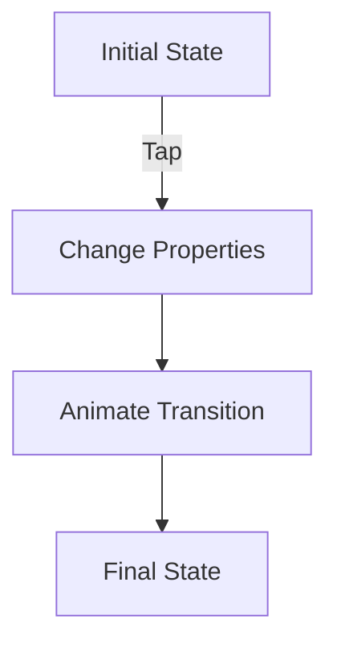
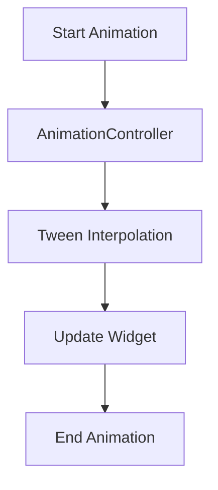

## 3.4.4 Animating Styles

In the realm of mobile app development, creating a visually appealing and interactive user interface is crucial for engaging users. Animations play a pivotal role in enhancing user experience by providing visual feedback and improving interactivity. In this section, we will delve into the world of animating styles in Flutter, exploring how to use widgets like `AnimatedContainer` and techniques such as Tween animations to bring your app to life.

### Introduction to Animations

Animations are not just about making your app look good; they serve a functional purpose by guiding users through your app's interface, indicating changes, and providing feedback. When used effectively, animations can make your app feel more responsive and intuitive. They help in:

- **Providing Visual Feedback:** Animations can indicate that an action has been recognized, such as a button press or a successful form submission.
- **Enhancing Interactivity:** By animating transitions between different states, you can make interactions feel more natural and engaging.
- **Improving Navigation:** Smooth transitions between screens or components can help users understand the flow of your app.

### AnimatedContainer

One of the simplest ways to animate styles in Flutter is by using the `AnimatedContainer` widget. This widget automatically animates changes to its properties, such as size, color, and alignment, over a specified duration.

#### How AnimatedContainer Works

The `AnimatedContainer` widget is a powerful tool for creating simple animations without the need for complex animation controllers or builders. When you change any of its properties, the `AnimatedContainer` smoothly transitions from the old value to the new one over the duration you specify.

Here's a basic example to illustrate how `AnimatedContainer` can be used:

```dart
import 'package:flutter/material.dart';

class AnimatedContainerExample extends StatefulWidget {
  @override
  _AnimatedContainerExampleState createState() => _AnimatedContainerExampleState();
}

class _AnimatedContainerExampleState extends State<AnimatedContainerExample> {
  bool _isExpanded = false;

  @override
  Widget build(BuildContext context) {
    return Scaffold(
      appBar: AppBar(
        title: Text('AnimatedContainer Example'),
      ),
      body: Center(
        child: GestureDetector(
          onTap: () {
            setState(() {
              _isExpanded = !_isExpanded;
            });
          },
          child: AnimatedContainer(
            duration: Duration(seconds: 1),
            width: _isExpanded ? 200 : 100,
            height: _isExpanded ? 200 : 100,
            color: _isExpanded ? Colors.blue : Colors.red,
            alignment: _isExpanded ? Alignment.center : AlignmentDirectional.topCenter,
            child: FlutterLogo(size: 75),
          ),
        ),
      ),
    );
  }
}
```

In this example, tapping on the `AnimatedContainer` toggles its size and color between two states. The transition is smooth, thanks to the `duration` property, which specifies how long the animation should take.

#### Visual Aids

To better understand how `AnimatedContainer` works, consider the following diagram that illustrates the animation process:



This diagram shows the flow from the initial state, where the container is not expanded, to the final state, where it is expanded, with an animation in between.

### Tween Animations

For more complex animations, you can use `Tween` animations. A `Tween` allows you to interpolate between two values over time. This is particularly useful when you want to animate properties that are not directly supported by `AnimatedContainer`.

#### Using Tween with AnimationController and AnimatedBuilder

To create a Tween animation, you typically use an `AnimationController` to manage the animation's lifecycle and an `AnimatedBuilder` to rebuild the widget tree whenever the animation's value changes.

Here's an example of how to use a `Tween` to animate the opacity of a widget:

```dart
import 'package:flutter/material.dart';

class TweenAnimationExample extends StatefulWidget {
  @override
  _TweenAnimationExampleState createState() => _TweenAnimationExampleState();
}

class _TweenAnimationExampleState extends State<TweenAnimationExample> with SingleTickerProviderStateMixin {
  AnimationController _controller;
  Animation<double> _animation;

  @override
  void initState() {
    super.initState();
    _controller = AnimationController(
      duration: const Duration(seconds: 2),
      vsync: this,
    );

    _animation = Tween<double>(begin: 0.0, end: 1.0).animate(_controller)
      ..addListener(() {
        setState(() {});
      });

    _controller.forward();
  }

  @override
  void dispose() {
    _controller.dispose();
    super.dispose();
  }

  @override
  Widget build(BuildContext context) {
    return Scaffold(
      appBar: AppBar(
        title: Text('Tween Animation Example'),
      ),
      body: Center(
        child: Opacity(
          opacity: _animation.value,
          child: FlutterLogo(size: 100),
        ),
      ),
    );
  }
}
```

In this example, the `Tween` interpolates between 0.0 and 1.0, animating the opacity of a `FlutterLogo` widget. The `AnimationController` manages the animation's duration and triggers the rebuild of the widget tree through the `AnimatedBuilder`.

#### Visual Aids

To visualize the Tween animation process, consider the following diagram:



This diagram outlines the flow from starting the animation to updating the widget with interpolated values and ending the animation.

### Best Practices for Animations

When implementing animations in your Flutter app, consider the following best practices:

- **Enhance, Don't Distract:** Animations should enhance the user experience, not distract from it. Use animations to guide users and provide feedback, not to overwhelm them.
- **Keep It Smooth:** Ensure that animations are smooth and consistent. Avoid abrupt changes that can confuse users.
- **Performance Matters:** Be mindful of performance, especially on lower-end devices. Use animations judiciously to avoid degrading the app's performance.
- **Consistency is Key:** Maintain consistency in animation styles across your app to provide a cohesive user experience.

### Exercises

To reinforce your understanding of animating styles in Flutter, try implementing the following exercise:

- **Interactive Animation:** Create a button that changes its size and color when pressed. Use `AnimatedContainer` to animate the changes and ensure the transition is smooth.

Here's a starting point for your exercise:

```dart
import 'package:flutter/material.dart';

class InteractiveButton extends StatefulWidget {
  @override
  _InteractiveButtonState createState() => _InteractiveButtonState();
}

class _InteractiveButtonState extends State<InteractiveButton> {
  bool _isPressed = false;

  @override
  Widget build(BuildContext context) {
    return Scaffold(
      appBar: AppBar(
        title: Text('Interactive Button'),
      ),
      body: Center(
        child: GestureDetector(
          onTap: () {
            setState(() {
              _isPressed = !_isPressed;
            });
          },
          child: AnimatedContainer(
            duration: Duration(milliseconds: 300),
            width: _isPressed ? 150 : 100,
            height: _isPressed ? 150 : 100,
            decoration: BoxDecoration(
              color: _isPressed ? Colors.green : Colors.orange,
              borderRadius: BorderRadius.circular(10),
            ),
            child: Center(
              child: Text(
                'Press Me',
                style: TextStyle(color: Colors.white, fontSize: 16),
              ),
            ),
          ),
        ),
      ),
    );
  }
}
```

### Conclusion

Animating styles in Flutter is a powerful way to enhance the user experience and create engaging, interactive interfaces. By leveraging widgets like `AnimatedContainer` and techniques such as Tween animations, you can bring your app to life with smooth transitions and dynamic visuals. Remember to use animations thoughtfully, keeping them smooth and consistent to ensure they enhance rather than detract from the user experience.

For further exploration, consider diving into Flutter's animation documentation and experimenting with more complex animations using the `flutter_animation_set` package or exploring third-party libraries like `rive` for advanced animation capabilities.

## Quiz Time!



### What is the primary purpose of animations in a Flutter app?

- [x] To enhance user experience by providing visual feedback and improving interactivity.
- [ ] To increase the complexity of the app.
- [ ] To make the app run faster.
- [ ] To replace static images with dynamic content.

> **Explanation:** Animations enhance user experience by providing visual feedback and improving interactivity, making the app more engaging and intuitive.

### Which widget is used to automatically animate changes to its properties in Flutter?

- [x] AnimatedContainer
- [ ] Container
- [ ] AnimatedBuilder
- [ ] Tween

> **Explanation:** The `AnimatedContainer` widget automatically animates changes to its properties such as size, color, and alignment over a specified duration.

### What is the role of an AnimationController in Tween animations?

- [x] To manage the animation's lifecycle and timing.
- [ ] To create static images.
- [ ] To handle user input.
- [ ] To manage network requests.

> **Explanation:** An `AnimationController` manages the animation's lifecycle and timing, allowing you to control when the animation starts, stops, and repeats.

### How does the Tween class function in animations?

- [x] It interpolates between two values over time.
- [ ] It creates static images.
- [ ] It handles user input.
- [ ] It manages network requests.

> **Explanation:** The `Tween` class interpolates between two values over time, allowing for smooth transitions between different states in an animation.

### What is a best practice when using animations in a Flutter app?

- [x] Use animations to enhance, not distract.
- [ ] Use as many animations as possible.
- [ ] Make animations as fast as possible.
- [ ] Avoid using animations altogether.

> **Explanation:** Animations should enhance the user experience, not distract from it. They should guide users and provide feedback without overwhelming them.

### Which property of AnimatedContainer specifies how long the animation should take?

- [x] duration
- [ ] color
- [ ] width
- [ ] height

> **Explanation:** The `duration` property of `AnimatedContainer` specifies how long the animation should take, determining the speed of the transition.

### What is the purpose of the AnimatedBuilder widget?

- [x] To rebuild the widget tree whenever the animation's value changes.
- [ ] To create static images.
- [ ] To handle user input.
- [ ] To manage network requests.

> **Explanation:** The `AnimatedBuilder` widget rebuilds the widget tree whenever the animation's value changes, allowing for dynamic updates to the UI based on the animation's progress.

### In the context of animations, what does "interpolating" mean?

- [x] Calculating intermediate values between two endpoints.
- [ ] Creating static images.
- [ ] Handling user input.
- [ ] Managing network requests.

> **Explanation:** Interpolating means calculating intermediate values between two endpoints, which is essential for creating smooth transitions in animations.

### What should you consider when implementing animations on lower-end devices?

- [x] Be mindful of performance and use animations judiciously.
- [ ] Use as many animations as possible.
- [ ] Make animations as fast as possible.
- [ ] Avoid using animations altogether.

> **Explanation:** On lower-end devices, it's important to be mindful of performance and use animations judiciously to avoid degrading the app's performance.

### True or False: The AnimatedContainer widget requires an AnimationController to function.

- [x] False
- [ ] True

> **Explanation:** The `AnimatedContainer` widget does not require an `AnimationController` to function. It automatically animates changes to its properties over a specified duration.


