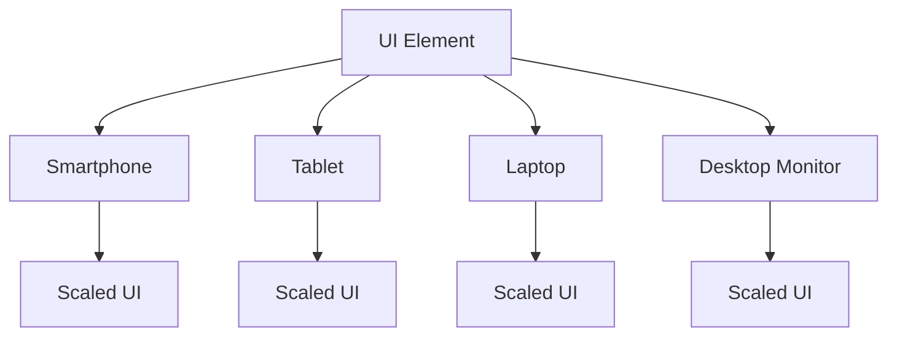

## 4.1.1 Understanding Screen Sizes

In the rapidly evolving landscape of technology, applications are expected to run seamlessly across a myriad of devices, from compact mobile phones to expansive desktop monitors. This diversity in device sizes and resolutions presents a unique challenge for developers: how to design applications that deliver an optimal user experience on every screen. In this section, we will delve into the concept of screen sizes, explore how Flutter handles these variations, and discuss strategies for creating responsive designs.

### Introduction to Screen Sizes

The proliferation of devices with varying screen sizes and resolutions has transformed the way we approach application design. No longer can developers assume a one-size-fits-all approach; instead, they must consider the unique characteristics of each device to ensure that their applications are both functional and visually appealing.

- **Diverse Device Landscape:** From smartphones and tablets to laptops and desktop monitors, each device offers a different screen size and resolution. This diversity necessitates a flexible design approach that can adapt to different environments.
- **Optimal User Experience:** The goal of responsive design is to provide a consistent and enjoyable user experience, regardless of the device being used. This involves ensuring that UI elements are appropriately sized, spaced, and positioned to accommodate different screen dimensions.

### Pixels and Logical Pixels

To understand how Flutter manages screen sizes, it's essential to grasp the distinction between physical pixels and logical pixels.

- **Physical Pixels:** These are the actual pixels on a device's screen. The number of physical pixels varies between devices, affecting how content is displayed.
- **Logical Pixels:** Flutter uses logical pixels, which are device-independent units. This abstraction allows Flutter to render UI elements consistently across devices with different pixel densities.

Logical pixels provide a uniform visual size, making it easier to design interfaces that look similar on different devices. This is crucial for maintaining a consistent user experience.

### Device Pixel Ratio (dpr)

The device pixel ratio (dpr) is a key concept in understanding how Flutter scales UI elements.

- **Definition:** The device pixel ratio is the ratio between logical pixels and physical pixels. It indicates how many physical pixels correspond to a single logical pixel.
- **Automatic Scaling:** Flutter automatically scales UI elements based on the device's pixel ratio. This ensures that elements appear at the intended size, regardless of the device's resolution.

For example, a device with a high pixel density will have a higher dpr, meaning more physical pixels are used to display each logical pixel. This results in sharper and more detailed visuals.

### Common Screen Sizes and Resolutions

Understanding common screen sizes and resolutions is crucial for designing responsive UIs. Below is a table showcasing some typical device dimensions:

| Device Type     | Screen Size | Resolution  | Aspect Ratio |
|-----------------|-------------|-------------|--------------|
| Smartphone      | 5.5 inches  | 1080 x 1920 | 16:9         |
| Tablet          | 10 inches   | 1200 x 1920 | 16:10        |
| Laptop          | 13 inches   | 1440 x 900  | 16:10        |
| Desktop Monitor | 24 inches   | 1920 x 1080 | 16:9         |

- **Portrait vs. Landscape:** Devices can be used in either portrait or landscape orientation, affecting how content is displayed. Designing for both orientations ensures a flexible and adaptable UI.

### Visual Aids

To illustrate how UI elements scale across different screen sizes, consider the following diagram:

This diagram demonstrates how a single UI element is scaled to fit various devices, maintaining its visual integrity across different screen sizes.

### Challenges of Multiple Screen Sizes

Designing for multiple screen sizes introduces several challenges:

- **Content Overflow:** On smaller screens, content may overflow or become truncated, leading to a poor user experience.
- **Insufficient Spacing:** Elements may appear cramped on smaller devices, making it difficult for users to interact with the UI.
- **Inconsistent Element Sizes:** UI elements may appear too small or too large, disrupting the visual balance of the application.

Responsive design techniques are essential to address these challenges, ensuring that applications are both functional and aesthetically pleasing on all devices.

### Understanding Aspect Ratios

Aspect ratio is the proportional relationship between a screen's width and height. It plays a significant role in maintaining consistent layouts across devices.

- **Common Aspect Ratios:** Some typical aspect ratios include 16:9 (widescreen), 4:3 (standard), and 16:10 (common in tablets).
- **Significance:** Maintaining a consistent aspect ratio ensures that UI elements are proportionally scaled, preserving their intended design.

For example, a video designed for a 16:9 aspect ratio will appear correctly on devices with the same ratio, but may require adjustments on devices with different ratios.

### Hands-On Demonstration

To see how Flutter handles different screen sizes, try running your app on various emulators or physical devices. Observe how the UI adapts to different dimensions and orientations.

- **Experiment with Orientations:** Switch between portrait and landscape modes to see how the layout adjusts.
- **Test on Multiple Devices:** Use emulators to simulate different screen sizes and resolutions, ensuring that your app looks great on all devices.

### Conclusion

Understanding screen sizes is a fundamental aspect of responsive design. By considering the diverse range of devices and their unique characteristics, developers can create applications that deliver a consistent and enjoyable user experience. As we move forward, we will explore techniques for building responsive UIs that adapt seamlessly to any screen size.

## Quiz Time!



### What is the primary goal of responsive design?

- [x] To provide a consistent and enjoyable user experience across all devices
- [ ] To ensure that applications run faster on all devices
- [ ] To make applications look the same on all devices
- [ ] To reduce the number of UI elements in an application

> **Explanation:** The primary goal of responsive design is to provide a consistent and enjoyable user experience across all devices, regardless of their screen size or resolution.

### What are logical pixels in Flutter?

- [x] Device-independent units used to render UI elements consistently across devices
- [ ] The actual pixels on a device's screen
- [ ] Pixels that change size based on the device's orientation
- [ ] Pixels that are only used for text rendering

> **Explanation:** Logical pixels are device-independent units used in Flutter to render UI elements consistently across devices with different pixel densities.

### How does Flutter handle different device pixel ratios?

- [x] Flutter automatically scales UI elements based on the device's pixel ratio
- [ ] Flutter requires manual scaling of UI elements for each device
- [ ] Flutter uses a fixed pixel ratio for all devices
- [ ] Flutter does not support scaling for different pixel ratios

> **Explanation:** Flutter automatically scales UI elements based on the device's pixel ratio, ensuring that elements appear at the intended size on all devices.

### What is the significance of aspect ratios in responsive design?

- [x] Aspect ratios help maintain consistent layouts across devices
- [ ] Aspect ratios determine the color scheme of an application
- [ ] Aspect ratios are only important for video content
- [ ] Aspect ratios have no impact on responsive design

> **Explanation:** Aspect ratios help maintain consistent layouts across devices by ensuring that UI elements are proportionally scaled.

### Which of the following is a common challenge when designing for multiple screen sizes?

- [x] Content overflow
- [ ] Increased application speed
- [ ] Reduced application size
- [ ] Improved battery life

> **Explanation:** Content overflow is a common challenge when designing for multiple screen sizes, as elements may not fit properly on smaller screens.

### What is the device pixel ratio (dpr)?

- [x] The ratio between logical pixels and physical pixels
- [ ] The number of colors a device can display
- [ ] The speed at which a device processes images
- [ ] The ratio of text to images on a screen

> **Explanation:** The device pixel ratio (dpr) is the ratio between logical pixels and physical pixels, indicating how many physical pixels correspond to a single logical pixel.

### Why is it important to test applications on multiple devices?

- [x] To ensure that the UI adapts correctly to different screen sizes and resolutions
- [ ] To increase the application's download speed
- [ ] To reduce the application's memory usage
- [ ] To improve the application's battery efficiency

> **Explanation:** Testing applications on multiple devices ensures that the UI adapts correctly to different screen sizes and resolutions, providing a consistent user experience.

### What is a logical pixel?

- [x] A device-independent unit used in Flutter
- [ ] A pixel that changes size based on the device's orientation
- [ ] A pixel used only for rendering images
- [ ] A pixel that is not visible to the user

> **Explanation:** A logical pixel is a device-independent unit used in Flutter to render UI elements consistently across devices with different pixel densities.

### How can developers address the challenge of content overflow?

- [x] By implementing responsive design techniques
- [ ] By reducing the number of UI elements
- [ ] By increasing the application's font size
- [ ] By using a fixed layout for all devices

> **Explanation:** Developers can address the challenge of content overflow by implementing responsive design techniques, ensuring that UI elements fit properly on all screen sizes.

### True or False: Flutter requires manual scaling of UI elements for each device.

- [ ] True
- [x] False

> **Explanation:** False. Flutter automatically scales UI elements based on the device's pixel ratio, so manual scaling is not required.


