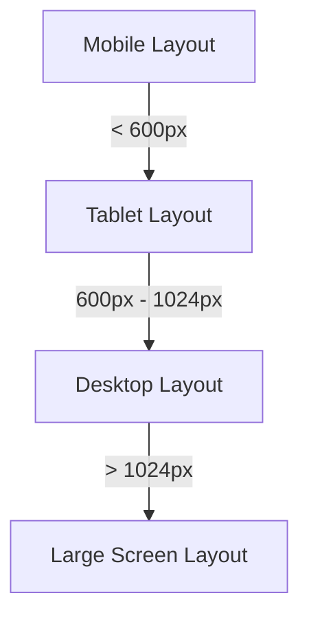

## 4.1.2 Adaptive Layouts

In the ever-evolving landscape of mobile and web applications, creating user interfaces that seamlessly adapt to a variety of devices and screen sizes is crucial. This section delves into the concept of adaptive layouts in Flutter, offering insights into how you can design applications that provide an optimal user experience across different platforms and devices.

### Definition of Adaptive Layouts

Adaptive layouts are a design approach where the user interface (UI) adjusts to fit different screen sizes, orientations, and device capabilities. Unlike a one-size-fits-all design, adaptive layouts ensure that each user, regardless of their device, enjoys a tailored experience that maximizes usability and aesthetics.

- **Key Characteristics:**
  - **Device-Specific Adjustments:** Adaptive layouts use distinct designs for different devices, ensuring that the UI is optimized for each screen size and resolution.
  - **Enhanced User Experience:** By adapting to the device's capabilities, adaptive layouts provide a more intuitive and engaging user experience.

### Responsive vs. Adaptive Design

Understanding the distinction between responsive and adaptive design is essential for creating flexible UIs.

- **Responsive Design:**
  - **Fluid Adjustments:** UI components resize and rearrange fluidly to fill the available space, often using flexible grids and percentages.
  - **Single Layout:** A single layout adapts to various screen sizes without predefined breakpoints.

- **Adaptive Design:**
  - **Distinct Layouts:** Different layouts are predefined for specific screen sizes or device types, often using breakpoints to switch between them.
  - **Tailored Experience:** Provides a more tailored experience by loading different resources or components based on the device.

Flutter supports both responsive and adaptive design, and developers often use a combination of the two to achieve the best results.

### Breakpoints

Breakpoints are specific screen widths at which the layout changes significantly. They are crucial in adaptive design for determining when to switch between different layouts.

- **Common Breakpoints:**
  - **Mobile:** < 600px
  - **Tablet:** 600px - 1024px
  - **Desktop:** > 1024px

These breakpoints help in designing layouts that are optimized for each device category.

### Implementing Adaptive Layouts in Flutter

Flutter provides several tools and techniques to implement adaptive layouts effectively.

- **Using Conditional Statements:**
  - You can use conditional logic to render different widgets based on the screen size. This approach allows you to define separate layouts for mobile, tablet, and desktop devices.

  ```dart
  Widget build(BuildContext context) {
    if (MediaQuery.of(context).size.width < 600) {
      // Mobile layout
      return MobileLayout();
    } else {
      // Tablet/Desktop layout
      return TabletDesktopLayout();
    }
  }
  ```

- **Orientation Handling:**
  - Adapting layouts based on device orientation (portrait or landscape) can enhance the user experience by utilizing the available space more effectively.

  ```dart
  Widget build(BuildContext context) {
    var orientation = MediaQuery.of(context).orientation;
    if (orientation == Orientation.portrait) {
      return PortraitLayout();
    } else {
      return LandscapeLayout();
    }
  }
  ```

### Platform-Specific Adaptation

Flutter allows you to detect the platform and adjust the UI accordingly, ensuring that your app feels native on each device.

- **Detecting Platform:**
  - Use the `Platform` class or `Theme.of(context).platform` to determine the operating system and customize the UI.

  ```dart
  if (Theme.of(context).platform == TargetPlatform.iOS) {
    // iOS-specific layout
  } else {
    // Android-specific layout
  }
  ```

### Visual Examples

Visualizing how layouts adjust across different devices can be incredibly helpful. Below are some examples and diagrams illustrating adaptive layouts.



This diagram shows how the layout transitions at various breakpoints.

### Best Practices

To ensure your adaptive layouts are effective, consider the following best practices:

- **Prioritize Essential Content:** Focus on displaying the most important content and functionality across all devices.
- **Test on Multiple Devices:** Regularly test your app on various devices to ensure a consistent and optimal user experience.
- **Use MediaQuery Extensively:** Leverage `MediaQuery` to access device dimensions and orientation, allowing for precise layout adjustments.

### Hands-On Exercise

To solidify your understanding of adaptive layouts, try the following exercise:

- **Create Two Layouts:** Design and implement two different layouts for your app—one for mobile and one for tablet.
- **Implement Switching Logic:** Use conditional statements to switch between these layouts based on the screen width.

This exercise will help you apply the concepts discussed and enhance your skills in creating adaptive layouts.

### Conclusion

Adaptive layouts are a powerful tool in Flutter for creating applications that provide a seamless user experience across a wide range of devices. By understanding the principles of adaptive design and leveraging Flutter's capabilities, you can build apps that are both functional and visually appealing, regardless of the device they are viewed on.

---

## Quiz Time!



### What is the primary goal of adaptive layouts?

- [x] To provide the best possible user experience on each device
- [ ] To ensure that all devices use the same layout
- [ ] To make the UI components resize fluidly
- [ ] To use a single layout for all screen sizes

> **Explanation:** Adaptive layouts aim to provide the best possible user experience by adjusting the UI to fit different screen sizes and device capabilities.

### How do adaptive layouts differ from responsive layouts?

- [x] Adaptive layouts use distinct layouts for different devices
- [ ] Adaptive layouts adjust fluidly to fill available space
- [ ] Responsive layouts use breakpoints to change layouts
- [ ] Responsive layouts provide a tailored experience for each device

> **Explanation:** Adaptive layouts use distinct layouts for different devices, while responsive layouts adjust fluidly to fill available space.

### What are breakpoints used for in adaptive design?

- [x] To determine when to switch between different layouts
- [ ] To make UI components resize fluidly
- [ ] To ensure a single layout fits all devices
- [ ] To adjust the UI based on user preferences

> **Explanation:** Breakpoints are specific screen widths at which the layout changes significantly, helping to switch between different layouts.

### Which Flutter class can be used to detect the platform?

- [x] Platform
- [ ] MediaQuery
- [ ] Orientation
- [ ] LayoutBuilder

> **Explanation:** The `Platform` class can be used to detect the operating system and customize the UI accordingly.

### What is the purpose of using MediaQuery in Flutter?

- [x] To access device dimensions and orientation
- [ ] To detect the platform
- [ ] To manage state across widgets
- [ ] To create animations

> **Explanation:** `MediaQuery` is used to access device dimensions and orientation, allowing for precise layout adjustments.

### Which of the following is a common breakpoint value for mobile devices?

- [x] < 600px
- [ ] 600px - 1024px
- [ ] > 1024px
- [ ] 800px - 1200px

> **Explanation:** A common breakpoint value for mobile devices is less than 600px.

### How can you adapt layouts based on device orientation in Flutter?

- [x] By using MediaQuery to check the orientation
- [ ] By using the Platform class
- [ ] By setting breakpoints
- [ ] By using LayoutBuilder

> **Explanation:** You can use `MediaQuery` to check the device orientation and adapt layouts accordingly.

### What is a best practice for designing adaptive layouts?

- [x] Prioritize essential content across all devices
- [ ] Use the same layout for all devices
- [ ] Avoid testing on multiple devices
- [ ] Focus only on desktop layouts

> **Explanation:** Prioritizing essential content across all devices ensures that the most important information is always accessible.

### Which Flutter widget can be used to render different layouts based on screen size?

- [x] MediaQuery
- [ ] Platform
- [ ] Orientation
- [ ] Theme

> **Explanation:** `MediaQuery` can be used to render different layouts based on screen size.

### True or False: Adaptive layouts in Flutter can only be implemented using the Platform class.

- [ ] True
- [x] False

> **Explanation:** Adaptive layouts can be implemented using various tools and techniques in Flutter, not just the `Platform` class.


