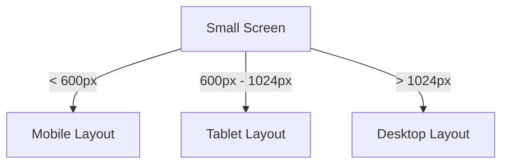

## 4.1.3 Breakpoints and Media Queries

In the ever-evolving landscape of mobile and web applications, creating a responsive user interface (UI) is paramount. Users access applications on a myriad of devices, each with its own screen size and resolution. To ensure a seamless user experience, developers must design UIs that adapt gracefully to these varying conditions. This is where breakpoints and media queries come into play.

### Understanding Breakpoints

Breakpoints are predefined screen widths where the layout of an application changes to accommodate different device sizes. They are essential in designing adaptive UIs, allowing developers to specify when and how the layout should adjust. By defining breakpoints, you can ensure that your application looks and functions well on any device, from small mobile screens to large desktop monitors.

#### Why Use Breakpoints?

- **Consistency Across Devices:** Breakpoints help maintain a consistent look and feel across different devices by adjusting the layout to fit the screen size.
- **Improved User Experience:** By optimizing the layout for each device, you enhance usability and accessibility, providing a better experience for all users.
- **Efficient Use of Screen Real Estate:** Breakpoints allow you to make the most of the available screen space, ensuring that content is displayed optimally.

### Common Breakpoint Values

In both web and app development, certain breakpoint values are commonly used to define the transition points between different layouts:

- **Small screens (mobile):** up to 600px
- **Medium screens (tablet):** 600px to 1024px
- **Large screens (desktop):** 1024px and above

These values serve as a guideline, but they can be adjusted based on the specific needs of your application.

### Using MediaQuery in Flutter

Flutter provides a powerful tool called `MediaQuery` to access information about the size and orientation of the current device. `MediaQuery` is instrumental in implementing responsive designs by allowing you to query the device's characteristics and adjust the UI accordingly.

#### Accessing MediaQueryData

To use `MediaQuery`, you first need to obtain an instance of `MediaQueryData`, which contains information about the device's screen size, orientation, and other properties.

```dart
MediaQueryData mediaQueryData = MediaQuery.of(context);
```

This line of code retrieves the `MediaQueryData` for the current context, giving you access to various properties such as screen width, height, and orientation.

### Implementing Breakpoints with MediaQuery

With `MediaQuery`, you can implement breakpoints by checking the screen width and adjusting the layout based on predefined values. Here's a simple example:

```dart
Widget build(BuildContext context) {
  double screenWidth = MediaQuery.of(context).size.width;

  if (screenWidth < 600) {
    return MobileLayout();
  } else if (screenWidth >= 600 && screenWidth < 1024) {
    return TabletLayout();
  } else {
    return DesktopLayout();
  }
}
```

In this example, the layout changes based on the screen width, switching between `MobileLayout`, `TabletLayout`, and `DesktopLayout` as the screen size crosses the defined breakpoints.

### Responsive Widgets and Packages

While `MediaQuery` is a powerful tool, Flutter also offers responsive widgets like `LayoutBuilder`, which will be covered in a later section. Additionally, several packages can help manage breakpoints and scaling:

- **responsive_builder:** A package that simplifies the process of building responsive UIs by providing utilities to handle different screen sizes.
- **flutter_screenutil:** A popular package for adapting UI to different screen sizes and resolutions, offering features like responsive font sizes and widget scaling.

### Media Queries for Orientation

In addition to screen size, orientation is another crucial factor in responsive design. `MediaQuery` can also detect changes in orientation, allowing you to adjust the layout accordingly:

```dart
Orientation orientation = MediaQuery.of(context).orientation;

if (orientation == Orientation.portrait) {
  // Portrait layout
} else {
  // Landscape layout
}
```

By checking the orientation, you can provide different layouts for portrait and landscape modes, enhancing the user experience on devices that support both orientations.

### Visual Aids

To better understand how breakpoints affect the UI, consider the following diagrams and screenshots. These visual aids illustrate how the layout changes at different screen widths, providing a clear picture of the adaptive design process.



This diagram shows the decision-making process for selecting the appropriate layout based on screen width.

### Best Practices with Breakpoints

- **Avoid Hardcoding Values:** Instead of hardcoding breakpoint values, define them as constants. This approach makes it easier to maintain and update the values as needed.
- **Ensure Accessibility:** While visual appeal is important, accessibility should be a priority. Ensure that content is accessible and usable at all screen sizes.
- **Test Across Devices:** Regularly test your application on different devices and screen sizes to ensure that the layout adapts correctly.

### Interactive Exercise

To solidify your understanding of breakpoints and media queries, try implementing them in your own Flutter app. Use the emulator or resize the browser window (for web apps) to test how the layout adjusts at different screen widths. Experiment with different breakpoint values and observe the changes in the UI.

### Conclusion

Breakpoints and media queries are essential tools in the Flutter developer's toolkit for creating responsive and adaptive UIs. By understanding and implementing these concepts, you can ensure that your application provides a seamless user experience across a wide range of devices. As you continue to explore Flutter's capabilities, remember to leverage the power of `MediaQuery` and responsive design principles to build applications that are both functional and visually appealing.

## Quiz Time!



### What are breakpoints in responsive design?

- [x] Predefined screen widths where the layout changes
- [ ] Points where the app crashes
- [ ] Specific colors used in the UI
- [ ] The time taken to load a screen

> **Explanation:** Breakpoints are predefined screen widths where the layout of the app changes to adapt to different device sizes.

### Which of the following is a common breakpoint value for small screens?

- [x] Up to 600px
- [ ] 600px to 1024px
- [ ] 1024px and above
- [ ] None of the above

> **Explanation:** Small screens, typically mobile devices, use a breakpoint value of up to 600px.

### How do you access MediaQueryData in Flutter?

- [x] `MediaQuery.of(context)`
- [ ] `MediaQueryData.get(context)`
- [ ] `context.MediaQuery()`
- [ ] `MediaQueryData(context)`

> **Explanation:** `MediaQuery.of(context)` is used to access `MediaQueryData` in Flutter.

### What does the following code snippet do?
```dart
if (screenWidth < 600) {
  return MobileLayout();
}
```

- [x] It returns a mobile layout if the screen width is less than 600px.
- [ ] It crashes the app if the screen width is less than 600px.
- [ ] It returns a desktop layout if the screen width is less than 600px.
- [ ] It does nothing.

> **Explanation:** The code checks if the screen width is less than 600px and returns a mobile layout if true.

### Which package helps manage breakpoints and scaling in Flutter?

- [x] responsive_builder
- [ ] flutter_http
- [ ] flutter_animation
- [ ] flutter_database

> **Explanation:** The `responsive_builder` package helps manage breakpoints and scaling in Flutter.

### How can you detect orientation changes in Flutter?

- [x] Using `MediaQuery.of(context).orientation`
- [ ] Using `OrientationDetector`
- [ ] Using `ScreenOrientation.of(context)`
- [ ] Using `OrientationChangeListener`

> **Explanation:** `MediaQuery.of(context).orientation` is used to detect orientation changes in Flutter.

### What is the purpose of using breakpoints in app design?

- [x] To adapt the layout for different screen sizes
- [ ] To increase the app's loading time
- [ ] To change the app's theme
- [ ] To add more animations

> **Explanation:** Breakpoints are used to adapt the layout for different screen sizes, ensuring a responsive design.

### Which of the following is a best practice when using breakpoints?

- [x] Define breakpoint values as constants
- [ ] Hardcode breakpoint values directly in the code
- [ ] Use random values for breakpoints
- [ ] Ignore breakpoints for desktop screens

> **Explanation:** Defining breakpoint values as constants is a best practice for easy maintenance and updates.

### What does the `flutter_screenutil` package provide?

- [x] Responsive font sizes and widget scaling
- [ ] Database management
- [ ] Animation utilities
- [ ] Network request handling

> **Explanation:** The `flutter_screenutil` package provides responsive font sizes and widget scaling.

### True or False: Breakpoints are only used for mobile screens.

- [ ] True
- [x] False

> **Explanation:** False. Breakpoints are used for all screen sizes, including mobile, tablet, and desktop, to ensure a responsive design.


