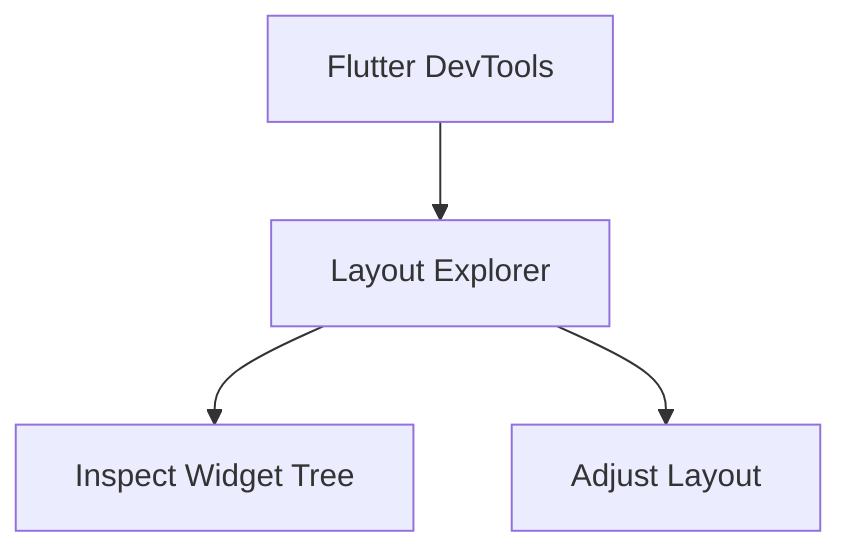
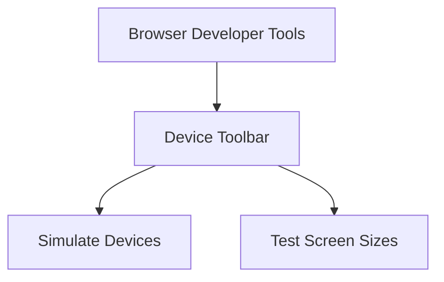

---

linkTitle: "4.1.4 Testing Responsiveness"
title: "Testing Responsiveness in Flutter: Ensuring Seamless User Experience Across Devices"
description: "Explore the importance of testing responsiveness in Flutter applications, learn about tools and techniques for effective testing, and discover best practices to ensure your app looks great on any device."
categories:
- Flutter Development
- Responsive Design
- Mobile Testing
tags:
- Flutter
- Responsive Design
- Testing
- Mobile Development
- UI/UX
date: 2024-10-25
type: docs
nav_weight: 414000
---

## 4.1.4 Testing Responsiveness

In the world of mobile and web development, ensuring that your application provides a seamless user experience across a multitude of devices and screen sizes is paramount. This section delves into the critical practice of testing responsiveness in Flutter applications, offering insights into why it's essential, how to effectively test across different environments, and best practices to adopt.

### Importance of Testing Responsiveness

Testing responsiveness is not just a best practice; it's a necessity. With the vast array of devices available today, each with its own screen size, resolution, and aspect ratio, what looks perfect on one device might appear distorted or cramped on another. Ensuring that your app's UI adapts gracefully to these variations is crucial for maintaining a positive user experience.

- **User Experience:** A responsive design ensures that users have a consistent and intuitive experience, regardless of the device they use.
- **Brand Image:** An app that looks polished and functions well across devices enhances your brand's reputation.
- **Accessibility:** Testing responsiveness also helps in making your app more accessible to users with different needs and preferences.

### Testing on Multiple Devices

While emulators and simulators are invaluable tools, nothing beats testing on actual devices. Physical devices provide the most accurate representation of how your app will perform in real-world scenarios.

- **Diverse Device Range:** Aim to test on a variety of devices, including different screen sizes, resolutions, and operating systems (iOS and Android).
- **Setting Up Emulators and Simulators:** Use Android Studio and Xcode to set up virtual devices that mimic real-world hardware. This allows you to test your app's responsiveness without needing every physical device.
  
```dart
// Example of setting up an Android emulator
flutter emulators --launch <emulator_id>
```

### Using Flutter DevTools

Flutter DevTools is a powerful suite of debugging and profiling tools that can help you inspect and optimize your app's layout.

- **Layout Explorer:** This tool allows you to visualize your widget tree and understand how widgets are laid out. You can inspect padding, alignment, and constraints, making it easier to identify and fix layout issues.



### Responsive Design Testing Tools

For web applications, browser developer tools are indispensable for testing responsiveness.

- **Device Toolbar:** Both Chrome and Firefox offer a device toolbar that lets you simulate different devices and screen sizes. This is particularly useful for web apps, allowing you to see how your app adapts to various environments.



### Debug Flags and Overlay

Flutter provides several debug flags that can help you visualize layout issues.

- **Debug Paint Size Enabled:** This flag overlays your app with visual debugging information, such as padding, baselines, and layout bounds. It's a quick way to spot layout problems.

```dart
import 'package:flutter/material.dart';

void main() {
  debugPaintSizeEnabled = true; // Enable visual debugging
  runApp(MyApp());
}
```

### Automated Testing

Automated tests can verify your UI's responsiveness across different configurations without manual intervention.

- **Integration Tests:** Use tools like `flutter_driver` or the `integration_test` package to automate UI testing. These tests can simulate user interactions and verify that your app behaves correctly on various devices.

```dart
// Example of an integration test
import 'package:flutter_test/flutter_test.dart';

void main() {
  testWidgets('Responsive layout test', (WidgetTester tester) async {
    // Build your app and trigger a frame
    await tester.pumpWidget(MyApp());

    // Verify that the layout adapts correctly
    expect(find.byType(MyResponsiveWidget), findsOneWidget);
  });
}
```

### Visual Aids

Visual aids can significantly enhance your understanding of how your app performs across different environments.

- **Screenshots:** Capture screenshots of your app running on various devices and emulators. This provides a visual record of how your app adapts to different screen sizes.
- **Debugging Tools in Action:** Include images of Flutter DevTools and browser developer tools in use, highlighting how they can help identify and resolve responsiveness issues.

### Common Issues and Solutions

Responsive design can present several challenges. Here are some common issues and how to address them:

- **Pixel Overflow:** This occurs when a widget exceeds the available space. Use `Flexible` or `Expanded` widgets to ensure content scales appropriately.
- **Widgets Not Scaling:** Ensure that your widgets use relative sizing (e.g., `MediaQuery`) rather than fixed dimensions to adapt to different screen sizes.

### Best Practices

Adopting best practices can streamline your responsiveness testing process:

- **Test Early and Often:** Regular testing throughout development helps catch issues before they become complex.
- **Device Fragmentation:** Keep the diversity of devices in mind and aim for broad compatibility.

### Interactive Exercise

To solidify your understanding, try this exercise:

- **Test Your App:** Run your app on at least two different devices or emulator configurations. Document any issues you encounter and attempt to resolve them using the tools and techniques discussed.

### Conclusion

Testing responsiveness is a crucial step in ensuring that your Flutter application provides a seamless experience across all devices. By leveraging the tools and techniques outlined in this section, you can identify and resolve potential issues early, ensuring that your app looks and functions beautifully, no matter where it's used.

## Quiz Time!



### Why is testing responsiveness important in Flutter applications?

- [x] To ensure a consistent user experience across different devices
- [ ] To increase the app's loading speed
- [ ] To reduce the app's file size
- [ ] To improve the app's security

> **Explanation:** Testing responsiveness ensures that the app provides a consistent and intuitive user experience across various devices and screen sizes.

### What is the benefit of testing on physical devices?

- [x] It provides the most accurate representation of real-world performance
- [ ] It is faster than using emulators
- [ ] It requires less setup time
- [ ] It automatically fixes layout issues

> **Explanation:** Physical devices offer the most accurate representation of how an app will perform in real-world scenarios, accounting for hardware and software variations.

### Which tool in Flutter DevTools helps inspect and adjust layouts?

- [x] Layout Explorer
- [ ] Performance Overlay
- [ ] Widget Inspector
- [ ] Memory Profiler

> **Explanation:** The Layout Explorer in Flutter DevTools allows developers to inspect and adjust widget layouts, helping to identify and fix layout issues.

### How can browser developer tools assist in testing web app responsiveness?

- [x] By simulating different devices and screen sizes
- [ ] By automatically fixing layout issues
- [ ] By increasing the app's loading speed
- [ ] By reducing the app's file size

> **Explanation:** Browser developer tools, such as the device toolbar, allow developers to simulate different devices and screen sizes, aiding in testing web app responsiveness.

### What does the `debugPaintSizeEnabled` flag do?

- [x] Displays visual debugging information like padding and layout bounds
- [ ] Increases the app's performance
- [ ] Automatically fixes layout issues
- [ ] Reduces the app's file size

> **Explanation:** The `debugPaintSizeEnabled` flag overlays the app with visual debugging information, helping developers identify layout issues.

### Which package can be used for automated UI testing in Flutter?

- [x] integration_test
- [ ] http
- [ ] provider
- [ ] path_provider

> **Explanation:** The `integration_test` package is used for automated UI testing in Flutter, allowing developers to verify the app's behavior across different configurations.

### What is a common issue in responsive design?

- [x] Pixel overflow
- [ ] Increased app size
- [ ] Reduced loading speed
- [ ] Security vulnerabilities

> **Explanation:** Pixel overflow occurs when a widget exceeds the available space, a common issue in responsive design that needs to be addressed.

### Why should you test your app on multiple devices?

- [x] To ensure broad compatibility and catch device-specific issues
- [ ] To reduce the app's file size
- [ ] To automatically fix layout issues
- [ ] To increase the app's loading speed

> **Explanation:** Testing on multiple devices ensures broad compatibility and helps catch device-specific issues that might not be apparent on emulators.

### What is the purpose of using `Flexible` or `Expanded` widgets?

- [x] To ensure content scales appropriately across different screen sizes
- [ ] To increase the app's loading speed
- [ ] To reduce the app's file size
- [ ] To improve the app's security

> **Explanation:** `Flexible` and `Expanded` widgets help ensure that content scales appropriately across different screen sizes, preventing layout issues like pixel overflow.

### True or False: Automated tests can replace the need for manual testing on physical devices.

- [ ] True
- [x] False

> **Explanation:** While automated tests are valuable, they cannot fully replace the need for manual testing on physical devices, which provide the most accurate representation of real-world performance.


