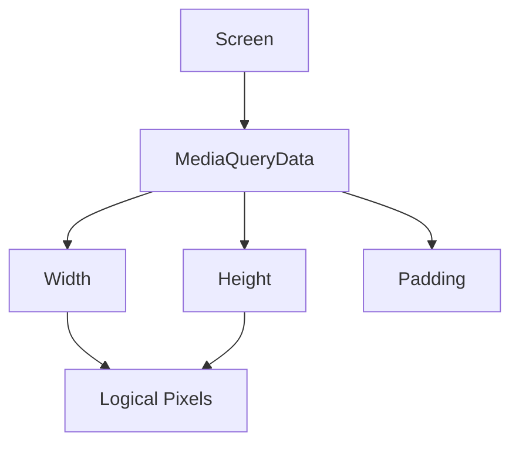

## 4.2.1 Accessing Screen Dimensions

In the world of mobile app development, creating a responsive user interface (UI) that adapts to various screen sizes and orientations is crucial. Flutter, with its rich set of tools, provides a powerful mechanism to achieve this through the `MediaQuery` class. In this section, we will explore how to access and utilize screen dimensions using `MediaQuery`, enabling you to build flexible and adaptive UIs.

### Introduction to MediaQuery

`MediaQuery` is a Flutter widget that provides information about the current state of the screen. It offers details such as the size and orientation of the screen, as well as user preferences like text scaling. This information is encapsulated in a `MediaQueryData` object, which can be accessed anywhere in the widget tree.

#### Why Use MediaQuery?

- **Responsive Design:** Adjust your UI dynamically based on screen size and orientation.
- **User Preferences:** Respect user settings such as text scaling for accessibility.
- **Device Adaptability:** Ensure your app looks great on all devices, from small phones to large tablets.

### Accessing MediaQueryData

To access `MediaQueryData`, you use the `MediaQuery.of(context)` method. This method retrieves the `MediaQueryData` for the current build context, providing you with all the necessary information about the screen.

```dart
MediaQueryData mediaQuery = MediaQuery.of(context);
```

This line of code is your gateway to understanding the screen environment in which your app is running.

### Retrieving Screen Size

Once you have the `MediaQueryData`, you can easily retrieve the screen's width and height. These dimensions are provided in logical pixels, which are device-independent units that ensure consistency across different screen densities.

```dart
double screenWidth = mediaQuery.size.width;
double screenHeight = mediaQuery.size.height;
```

#### Understanding Logical Pixels

Logical pixels are a key concept in Flutter. They allow you to design your UI without worrying about the actual pixel density of the device. This means your app will look consistent on both high-density and low-density screens.

### Using Screen Dimensions

With the screen dimensions at your disposal, you can adjust widget sizes dynamically. This is particularly useful for creating responsive layouts that adapt to different screen sizes.

```dart
Container(
  width: screenWidth * 0.8, // 80% of screen width
  height: screenHeight * 0.5, // 50% of screen height
  color: Colors.blue,
  child: Center(
    child: Text(
      'Responsive Container',
      style: TextStyle(color: Colors.white),
    ),
  ),
);
```

In this example, the `Container` widget takes up 80% of the screen's width and 50% of its height, ensuring it scales appropriately on different devices.

### Safe Areas

When designing for mobile devices, it's important to account for areas like the status bar, notch, or home indicator. These areas can obscure your content if not handled properly.

#### Using MediaQuery Padding

`MediaQuery.of(context).padding` provides the padding values for these safe areas. This allows you to adjust your layout accordingly.

```dart
EdgeInsets padding = MediaQuery.of(context).padding;
```

#### The SafeArea Widget

Flutter provides the `SafeArea` widget, which automatically adjusts its child widgets to avoid these areas. It’s a simple yet effective way to ensure your UI is not obstructed.

```dart
SafeArea(
  child: Container(
    color: Colors.green,
    child: Center(
      child: Text('Safe Area Container'),
    ),
  ),
);
```

### Visual Aids

To better understand how screen dimensions are measured and how widgets adjust, consider the following diagrams:



This diagram illustrates the relationship between the screen, `MediaQueryData`, and the dimensions you can retrieve.

### Best Practices

- **Avoid Absolute Pixels:** Always use relative sizes based on screen dimensions to ensure responsiveness.
- **Handle Edge Cases:** Be cautious of dividing by zero or null values when retrieving screen dimensions.
- **Test on Multiple Devices:** Ensure your app looks good on a variety of devices and orientations.

### Interactive Exercise

As a practical exercise, try creating a widget that always takes up 70% of the screen width and centers itself. Here’s a starting point:

```dart
class ResponsiveWidget extends StatelessWidget {
  @override
  Widget build(BuildContext context) {
    double screenWidth = MediaQuery.of(context).size.width;

    return Center(
      child: Container(
        width: screenWidth * 0.7, // 70% of screen width
        height: 100.0,
        color: Colors.orange,
        child: Center(
          child: Text(
            '70% Width Container',
            style: TextStyle(color: Colors.white),
          ),
        ),
      ),
    );
  }
}
```

### Conclusion

Accessing screen dimensions using `MediaQuery` is a fundamental skill in Flutter development. It empowers you to create responsive and adaptive UIs that provide a consistent user experience across all devices. By leveraging `MediaQuery`, you can ensure your app respects user preferences and adapts to various screen sizes and orientations.

### Further Reading and Resources

- [Flutter Documentation on MediaQuery](https://api.flutter.dev/flutter/widgets/MediaQuery-class.html)
- [Responsive Design in Flutter](https://flutter.dev/docs/development/ui/layout/responsive)
- [Building Adaptive Apps in Flutter](https://flutter.dev/docs/development/ui/layout/adaptive)

By mastering these concepts, you'll be well-equipped to tackle the challenges of responsive design in Flutter, creating apps that delight users on any device.

## Quiz Time!



### What is the primary purpose of MediaQuery in Flutter?

- [x] To provide information about the screen size, orientation, and user preferences.
- [ ] To manage state across different widgets.
- [ ] To handle network requests and responses.
- [ ] To store persistent data locally on the device.

> **Explanation:** MediaQuery is used to access information about the screen's size, orientation, and user preferences, which is essential for building responsive UIs.

### How do you access MediaQueryData in a Flutter widget?

- [x] Using `MediaQuery.of(context)`
- [ ] Using `context.mediaQuery`
- [ ] Using `MediaQueryData.of(context)`
- [ ] Using `context.getMediaQuery()`

> **Explanation:** `MediaQuery.of(context)` is the correct method to access MediaQueryData within a widget's build method.

### What unit are screen dimensions provided in when using MediaQuery?

- [x] Logical pixels
- [ ] Physical pixels
- [ ] Density-independent pixels
- [ ] Screen units

> **Explanation:** Screen dimensions are provided in logical pixels, which are device-independent and ensure consistency across different screen densities.

### Why is it important to account for safe areas in mobile app design?

- [x] To prevent content from being obscured by the status bar, notch, or home indicator.
- [ ] To ensure the app uses as much screen space as possible.
- [ ] To improve the app's performance on older devices.
- [ ] To make the app compatible with desktop platforms.

> **Explanation:** Safe areas are important to ensure that content is not obscured by device-specific elements like the status bar, notch, or home indicator.

### Which widget automatically adjusts its child widgets to avoid safe areas?

- [x] SafeArea
- [ ] Padding
- [ ] Container
- [ ] Align

> **Explanation:** The SafeArea widget is designed to automatically adjust its child widgets to avoid safe areas, ensuring that content is not obscured.

### What is a best practice when using screen dimensions in Flutter?

- [x] Use relative sizes based on screen dimensions instead of absolute pixel values.
- [ ] Always use absolute pixel values for precise control.
- [ ] Ignore user preferences for text scaling.
- [ ] Hardcode dimensions for consistency.

> **Explanation:** Using relative sizes based on screen dimensions ensures that your app is responsive and adapts to different devices and orientations.

### How can you retrieve the padding values for safe areas using MediaQuery?

- [x] Using `MediaQuery.of(context).padding`
- [ ] Using `context.padding`
- [ ] Using `MediaQueryData.padding`
- [ ] Using `context.getPadding()`

> **Explanation:** `MediaQuery.of(context).padding` provides the padding values for safe areas, allowing you to adjust your layout accordingly.

### What is the benefit of using logical pixels in Flutter?

- [x] They ensure consistency across different screen densities.
- [ ] They provide more precise control over layout.
- [ ] They are faster to render than physical pixels.
- [ ] They automatically adjust for user preferences.

> **Explanation:** Logical pixels are device-independent units that ensure consistency across different screen densities, making it easier to design responsive UIs.

### What is the recommended way to test your app's responsiveness?

- [x] Test on multiple devices and orientations.
- [ ] Test only on the latest high-end devices.
- [ ] Test using a single device with a large screen.
- [ ] Test using only emulators and simulators.

> **Explanation:** Testing on multiple devices and orientations ensures that your app is responsive and provides a consistent user experience across different platforms.

### True or False: MediaQuery can be used to access user preferences such as text scaling.

- [x] True
- [ ] False

> **Explanation:** MediaQuery provides information about user preferences, including text scaling, which is important for accessibility and responsive design.


