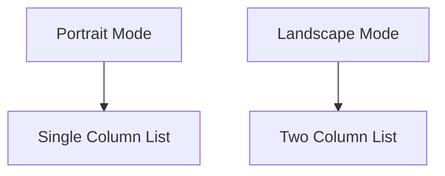

## 4.2.2 Orientation Handling

In the world of mobile app development, creating a responsive user interface that adapts to different device orientations is crucial for providing a seamless user experience. Flutter, with its powerful widget system, offers several tools to help developers handle orientation changes effectively. This section will guide you through the process of detecting device orientation, adjusting layouts accordingly, and ensuring that your app remains user-friendly in both portrait and landscape modes.

### Detecting Device Orientation

The first step in handling orientation changes is detecting the current orientation of the device. Flutter provides the `MediaQuery` class, which gives you access to various properties of the device's screen, including its orientation. Here's how you can use `MediaQuery` to check the current orientation:

```dart
import 'package:flutter/material.dart';

class OrientationExample extends StatelessWidget {
  @override
  Widget build(BuildContext context) {
    Orientation orientation = MediaQuery.of(context).orientation;
    return Scaffold(
      appBar: AppBar(
        title: Text('Orientation Example'),
      ),
      body: Center(
        child: Text(
          orientation == Orientation.portrait ? 'Portrait Mode' : 'Landscape Mode',
          style: TextStyle(fontSize: 24),
        ),
      ),
    );
  }
}
```

In this example, we use `MediaQuery.of(context).orientation` to determine whether the device is in portrait or landscape mode. Based on the orientation, we display a different message on the screen.

### Adjusting Layouts Based on Orientation

Once you've detected the device orientation, the next step is to adjust your app's layout to provide the best user experience. You can switch between different layouts using conditional logic. Here's an example of how to implement this:

```dart
import 'package:flutter/material.dart';

class ResponsiveLayout extends StatelessWidget {
  @override
  Widget build(BuildContext context) {
    Orientation orientation = MediaQuery.of(context).orientation;
    return Scaffold(
      appBar: AppBar(
        title: Text('Responsive Layout'),
      ),
      body: orientation == Orientation.portrait
          ? PortraitLayout()
          : LandscapeLayout(),
    );
  }
}

class PortraitLayout extends StatelessWidget {
  @override
  Widget build(BuildContext context) {
    return Center(
      child: Text('This is the Portrait Layout'),
    );
  }
}

class LandscapeLayout extends StatelessWidget {
  @override
  Widget build(BuildContext context) {
    return Center(
      child: Text('This is the Landscape Layout'),
    );
  }
}
```

In this code, we define two separate widgets, `PortraitLayout` and `LandscapeLayout`, and switch between them based on the current orientation. This approach allows you to tailor the user interface to the specific needs of each orientation.

### Responsive Widgets with OrientationBuilder

Flutter also provides the `OrientationBuilder` widget, which rebuilds its child whenever the orientation changes. This widget is particularly useful for creating responsive designs that adapt dynamically to orientation changes without the need for manual state management.

```dart
import 'package:flutter/material.dart';

class OrientationBuilderExample extends StatelessWidget {
  @override
  Widget build(BuildContext context) {
    return Scaffold(
      appBar: AppBar(
        title: Text('OrientationBuilder Example'),
      ),
      body: OrientationBuilder(
        builder: (context, orientation) {
          return GridView.count(
            crossAxisCount: orientation == Orientation.portrait ? 2 : 4,
            children: List.generate(20, (index) {
              return Center(
                child: Text(
                  'Item $index',
                  style: Theme.of(context).textTheme.headline5,
                ),
              );
            }),
          );
        },
      ),
    );
  }
}
```

In this example, the `OrientationBuilder` widget is used to adjust the number of columns in a `GridView` based on the device's orientation. When the device is in portrait mode, the grid displays two columns, and in landscape mode, it displays four columns.

### Considerations for Orientation Changes

Handling orientation changes involves more than just switching layouts. It's important to consider how these changes can affect the state of your app. Flutter handles orientation changes smoothly, but developers need to ensure their layouts adapt without losing important state information.

- **State Management:** Ensure that any stateful data is preserved across orientation changes. You can use Flutter's state management solutions, such as `Provider` or `Bloc`, to maintain state effectively.
- **Layout Adaptation:** Design your layouts to be flexible and adaptable. Avoid hardcoding dimensions and instead use relative sizing and positioning to ensure that your UI looks good in both orientations.

### Visual Examples

To illustrate the impact of orientation changes, let's consider a simple app that displays a list of items. In portrait mode, the items are displayed in a single column, while in landscape mode, they are displayed in two columns.



In the diagram above, you can see how the layout adapts based on the orientation. This approach ensures that the app remains user-friendly and accessible in both modes.

### Best Practices

When designing for different orientations, keep the following best practices in mind:

- **Critical Content Accessibility:** Ensure that important content is always visible and accessible, regardless of the orientation.
- **Avoid Stretching:** Avoid stretching text or images awkwardly when the orientation changes. Instead, use flexible layouts that adapt gracefully.
- **Consistent User Experience:** Maintain a consistent user experience by ensuring that navigation and interactions remain intuitive in both orientations.

### Interactive Exercise

To reinforce your understanding of orientation handling, try creating a simple app where the number of columns in a `GridView` changes based on orientation. Use the `OrientationBuilder` widget to implement this functionality.

```dart
import 'package:flutter/material.dart';

void main() => runApp(MyApp());

class MyApp extends StatelessWidget {
  @override
  Widget build(BuildContext context) {
    return MaterialApp(
      home: OrientationExercise(),
    );
  }
}

class OrientationExercise extends StatelessWidget {
  @override
  Widget build(BuildContext context) {
    return Scaffold(
      appBar: AppBar(
        title: Text('Orientation Exercise'),
      ),
      body: OrientationBuilder(
        builder: (context, orientation) {
          return GridView.builder(
            gridDelegate: SliverGridDelegateWithFixedCrossAxisCount(
              crossAxisCount: orientation == Orientation.portrait ? 2 : 4,
            ),
            itemBuilder: (context, index) {
              return Card(
                color: Colors.blueAccent,
                child: Center(
                  child: Text('Item $index'),
                ),
              );
            },
            itemCount: 20,
          );
        },
      ),
    );
  }
}
```

### Conclusion

Handling orientation changes in Flutter is a crucial aspect of building responsive and user-friendly applications. By leveraging `MediaQuery`, `OrientationBuilder`, and best practices, you can create layouts that adapt seamlessly to different orientations, providing a consistent and engaging user experience. Remember to consider state management and layout adaptation to ensure that your app remains functional and visually appealing in both portrait and landscape modes.

For further exploration, consider diving into Flutter's official documentation on [responsive design](https://flutter.dev/docs/development/ui/layout/responsive) and experimenting with more complex layouts and state management solutions.

## Quiz Time!



### What is the primary purpose of using `MediaQuery` in Flutter?

- [x] To access device-specific information such as screen size and orientation
- [ ] To manage application state across different widgets
- [ ] To handle network requests and responses
- [ ] To create animations and transitions

> **Explanation:** `MediaQuery` is used to access information about the device's screen, such as size and orientation, which is crucial for building responsive UIs.

### How does the `OrientationBuilder` widget help in handling orientation changes?

- [x] It rebuilds its child widget when the orientation changes
- [ ] It manages the state of the application during orientation changes
- [ ] It provides animations for orientation transitions
- [ ] It handles network requests during orientation changes

> **Explanation:** `OrientationBuilder` rebuilds its child widget whenever the device's orientation changes, allowing developers to adjust the layout dynamically.

### Which of the following is a best practice when handling orientation changes?

- [x] Ensure critical content is accessible in both orientations
- [ ] Hardcode dimensions for all widgets
- [ ] Ignore landscape mode as most users prefer portrait
- [ ] Use fixed layouts that do not adapt to orientation changes

> **Explanation:** Ensuring critical content is accessible in both orientations is essential for a consistent user experience.

### What is a potential issue when handling orientation changes in an app?

- [x] Loss of application state
- [ ] Increased network latency
- [ ] Reduced battery life
- [ ] Decreased app performance

> **Explanation:** Orientation changes can lead to loss of application state if not managed properly, as the UI may be rebuilt.

### In the provided code example, how many columns does the `GridView` display in landscape mode?

- [ ] 1
- [ ] 2
- [x] 4
- [ ] 6

> **Explanation:** In landscape mode, the `GridView` is configured to display 4 columns using the `OrientationBuilder` widget.

### What is the role of `SliverGridDelegateWithFixedCrossAxisCount` in a `GridView`?

- [x] It defines the number of columns in the grid
- [ ] It handles the scrolling behavior of the grid
- [ ] It manages the state of each grid item
- [ ] It provides animations for grid items

> **Explanation:** `SliverGridDelegateWithFixedCrossAxisCount` is used to define the number of columns in a `GridView`.

### Why is it important to avoid stretching text or images awkwardly during orientation changes?

- [x] To maintain a visually appealing and readable UI
- [ ] To increase the app's performance
- [ ] To reduce the app's memory usage
- [ ] To improve network connectivity

> **Explanation:** Avoiding awkward stretching ensures that the UI remains visually appealing and readable, enhancing the user experience.

### What is a common use case for the `OrientationBuilder` widget?

- [x] Adjusting the number of columns in a `GridView` based on orientation
- [ ] Managing network requests during orientation changes
- [ ] Handling user authentication
- [ ] Creating animations for screen transitions

> **Explanation:** `OrientationBuilder` is commonly used to adjust layouts, such as changing the number of columns in a `GridView`, based on orientation.

### Which widget is used to display a different layout based on the device's orientation?

- [x] `OrientationBuilder`
- [ ] `MediaQuery`
- [ ] `Scaffold`
- [ ] `AppBar`

> **Explanation:** `OrientationBuilder` is specifically designed to rebuild its child widget based on the device's orientation.

### True or False: Flutter automatically handles orientation changes without any developer intervention.

- [ ] True
- [x] False

> **Explanation:** While Flutter handles the technical aspects of orientation changes, developers must ensure their layouts adapt appropriately to maintain a good user experience.


