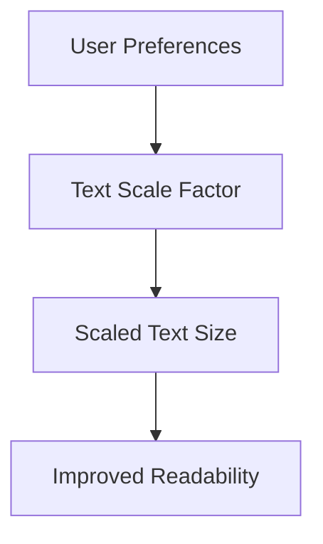

## 4.2.3 Text Scaling and Accessibility

In today's digital age, creating applications that cater to a diverse audience is not just a best practice—it's a necessity. Text scaling and accessibility are crucial components in ensuring that your Flutter applications are usable and enjoyable for everyone, including users with visual impairments or other disabilities. This section will guide you through the principles of text scaling and accessibility, providing practical examples and best practices to implement these features effectively in your Flutter apps.

### Understanding Text Scaling

Text scaling allows users to adjust the font size on their devices to improve readability. This feature is especially important for users with visual impairments or those who prefer larger text for comfort. Designing apps that respect user preferences for text size is essential for creating inclusive applications.

- **Why Text Scaling Matters:**
  - Enhances readability for users with visual impairments.
  - Improves user experience by allowing customization.
  - Ensures compliance with accessibility standards.

### Accessing Text Scale Factor

Flutter provides a straightforward way to access the user's preferred text scale factor through the `MediaQuery` class. This scale factor represents the user's chosen text size setting on their device.

```dart
double textScaleFactor = MediaQuery.of(context).textScaleFactor;
```

By retrieving the text scale factor, you can adjust your app's text sizes dynamically, ensuring that they align with user preferences.

### Adjusting Text Size

When designing your app, it's important to scale text appropriately based on the text scale factor. Flutter's `Text` widget automatically respects the user's text size preference unless explicitly overridden.

Here's an example of how to scale text using the text scale factor:

```dart
Text(
  'Sample Text',
  style: TextStyle(fontSize: 16 * textScaleFactor),
);
```

In this example, the base font size is multiplied by the text scale factor, ensuring that the text size adjusts according to the user's settings.

#### Best Practices for Text Scaling

- **Avoid Fixed Text Sizes:** Use relative sizes to adapt to user preferences.
- **Test with Maximum Scaling:** Ensure your app remains usable and visually appealing at maximum text scaling settings.

### Using `AccessibilityFeatures`

Flutter's `MediaQuery` also provides access to various accessibility features, allowing you to tailor your app's behavior to accommodate users with specific needs.

```dart
bool invertColors = MediaQuery.of(context).invertColors;
bool boldText = MediaQuery.of(context).boldText;
```

These properties help you detect if the user has enabled features like inverted colors or bold text, allowing you to adjust your app's UI accordingly.

### Supporting Users with Disabilities

Designing for accessibility involves more than just text scaling. Here are some strategies to ensure your app is accessible to users with disabilities:

- **Provide Sufficient Contrast:** Ensure text and background colors have enough contrast for readability.
- **Large Tappable Areas:** Make interactive elements large enough to be easily tapped.
- **Alternative Text for Images:** Provide descriptive text for images to assist users who rely on screen readers.

### Testing Accessibility Features

Testing your app with different accessibility settings enabled is crucial to ensure it meets the needs of all users. You can simulate text scaling and other accessibility features in the emulator or device settings.

#### Steps to Test Text Scaling:

1. **Enable Text Scaling on Device:**
   - Go to device settings and adjust the text size.
2. **Test App Responsiveness:**
   - Run your app and observe how text elements scale.
3. **Simulate Accessibility Features:**
   - Use accessibility settings in the emulator to test features like inverted colors and bold text.

### Visual Aids

Visual aids can help illustrate how text scales with different user settings. Consider using diagrams to show the impact of text scaling and accessibility features on your app's UI.



This diagram illustrates the flow from user preferences to improved readability through text scaling.

### Best Practices

- **Relative Text Sizes:** Use relative sizes instead of fixed sizes to accommodate user preferences.
- **Comprehensive Testing:** Test your app with maximum text scaling to ensure usability.
- **Accessibility Considerations:** Incorporate accessibility features like sufficient contrast and large tappable areas.

### Interactive Exercise

To reinforce your understanding, try implementing a settings page in your app that allows users to adjust text size within the app. This exercise will help you practice using the text scale factor and designing for accessibility.

#### Exercise Steps:

1. **Create a Settings Page:**
   - Add a slider to adjust text size.
2. **Apply Text Scaling:**
   - Use the slider value to adjust text sizes throughout the app.
3. **Test Accessibility:**
   - Ensure the app remains usable with different text sizes.

### Conclusion

Text scaling and accessibility are vital components of modern app design. By respecting user preferences and accommodating accessibility needs, you can create applications that are inclusive and enjoyable for all users. Remember to test your app thoroughly and consider accessibility from the outset to ensure a seamless user experience.

## Quiz Time!



### What is the purpose of text scaling in Flutter applications?

- [x] To improve readability for users with visual impairments.
- [ ] To increase the app's performance.
- [ ] To enhance the app's security.
- [ ] To reduce the app's size.

> **Explanation:** Text scaling improves readability by allowing users to adjust font sizes according to their preferences, which is especially beneficial for users with visual impairments.

### How can you access the text scale factor in a Flutter app?

- [x] Using `MediaQuery.of(context).textScaleFactor`.
- [ ] Using `TextStyle.textScaleFactor`.
- [ ] Using `ThemeData.textScaleFactor`.
- [ ] Using `Scaffold.textScaleFactor`.

> **Explanation:** The text scale factor can be accessed through `MediaQuery.of(context).textScaleFactor`, which provides the user's preferred text size setting.

### What is a best practice when designing text sizes in Flutter?

- [x] Use relative sizes instead of fixed sizes.
- [ ] Use fixed sizes for consistency.
- [ ] Use the largest possible font size.
- [ ] Use the smallest possible font size.

> **Explanation:** Using relative sizes allows text to adapt to user preferences, ensuring better accessibility and usability.

### Which of the following is an accessibility feature you can access through `MediaQuery`?

- [x] Inverted colors.
- [ ] Text alignment.
- [ ] Font style.
- [ ] Text decoration.

> **Explanation:** `MediaQuery` provides access to accessibility features like inverted colors, which can be used to adjust the app's UI for users with specific needs.

### Why is it important to test your app with maximum text scaling?

- [x] To ensure usability and visual appeal at maximum settings.
- [ ] To increase the app's loading speed.
- [ ] To reduce the app's memory usage.
- [ ] To enhance the app's security features.

> **Explanation:** Testing with maximum text scaling ensures that the app remains usable and visually appealing even when users choose the largest text size.

### What should you provide for images to assist users who rely on screen readers?

- [x] Alternative text.
- [ ] Larger images.
- [ ] Animated images.
- [ ] Colorful images.

> **Explanation:** Providing alternative text for images helps users who rely on screen readers understand the content and context of the images.

### How can you simulate text scaling in a Flutter app?

- [x] Adjust text size settings on the device or emulator.
- [ ] Change the app's theme.
- [ ] Modify the app's source code.
- [ ] Use a third-party plugin.

> **Explanation:** You can simulate text scaling by adjusting the text size settings on the device or emulator, allowing you to test how the app responds to different user preferences.

### What is the role of `AccessibilityFeatures` in Flutter?

- [x] To detect and adjust for user accessibility settings.
- [ ] To enhance the app's performance.
- [ ] To manage app permissions.
- [ ] To control app navigation.

> **Explanation:** `AccessibilityFeatures` in Flutter helps detect and adjust the app's behavior based on user accessibility settings, such as bold text or inverted colors.

### Which strategy helps ensure your app is accessible to users with disabilities?

- [x] Providing sufficient contrast between text and background.
- [ ] Using complex animations.
- [ ] Reducing the number of interactive elements.
- [ ] Limiting the app's functionality.

> **Explanation:** Providing sufficient contrast between text and background helps ensure that text is readable for users with visual impairments, enhancing accessibility.

### True or False: Fixed text sizes are recommended for accessibility in Flutter apps.

- [ ] True
- [x] False

> **Explanation:** False. Fixed text sizes are not recommended because they do not adapt to user preferences. Using relative sizes ensures better accessibility and usability.


