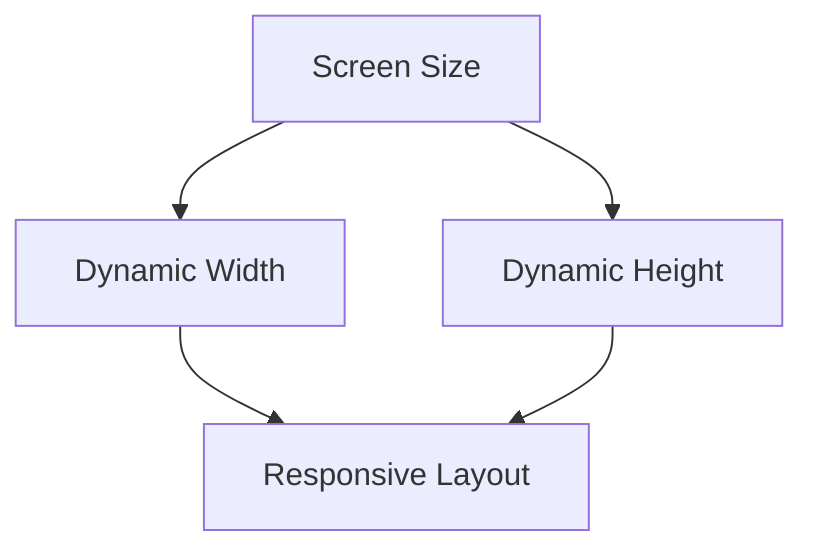

## 4.2.4 Dynamic Sizing and Spacing

In the world of mobile app development, creating a user interface that looks great on all devices is a significant challenge. With the vast array of screen sizes and resolutions available, it's crucial to design apps that are not only visually appealing but also functionally robust across different platforms. This is where dynamic sizing and spacing come into play. In this section, we'll explore how to leverage Flutter's powerful tools to create flexible and responsive layouts that adapt seamlessly to any screen size.

### Why Dynamic Sizing is Important

Fixed sizes in UI design can lead to a host of issues, especially when your app is viewed on devices with varying screen dimensions. A button that looks perfect on a smartphone might appear too small on a tablet or too large on a smartwatch. By using dynamic sizing, you ensure that your app's layout is adaptable, maintaining usability and aesthetics across all devices.

- **Flexibility:** Dynamic sizing allows your UI to adjust to different screen sizes, ensuring that elements are neither too cramped nor too sparse.
- **Consistency:** It helps maintain a consistent look and feel, providing a uniform user experience regardless of the device.
- **Accessibility:** By adjusting sizes dynamically, you can cater to users with different needs, such as those requiring larger text for readability.

### Percentage-Based Sizing

One of the simplest ways to implement dynamic sizing is by using percentages of the screen dimensions. This approach ensures that your UI elements scale proportionally with the screen size.

#### Example: Calculating Sizes Based on Screen Dimensions

Using Flutter's `MediaQuery`, you can easily access the screen's width and height to calculate dynamic sizes.

```dart
double screenWidth = MediaQuery.of(context).size.width;
double dynamicWidth = screenWidth * 0.8; // 80% of screen width
```

In this example, `dynamicWidth` will always be 80% of the screen's width, ensuring that the element scales appropriately on different devices.

### Flexible Spacing

Managing space between UI elements is crucial for creating a clean and organized layout. Flutter provides several widgets to help with this, including `SizedBox.expand`, `Spacer`, `Expanded`, and `Flexible`.

#### Using `SizedBox.expand` and `Spacer`

- **`SizedBox.expand`:** This widget expands to fill the available space, which can be useful for creating flexible layouts.
- **`Spacer`:** A flexible widget that can be used to create space between elements in a `Row` or `Column`.

#### Example: Using `Expanded` and `Flexible`

```dart
Row(
  children: <Widget>[
    Expanded(
      child: Container(
        color: Colors.blue,
      ),
    ),
    Spacer(),
    Flexible(
      flex: 2,
      child: Container(
        color: Colors.red,
      ),
    ),
  ],
)
```

In this example, the `Expanded` widget ensures that the blue container takes up the remaining space, while the `Flexible` widget allows the red container to adjust its size based on the available space, with a `flex` factor of 2.

### Adjusting Padding and Margins

Dynamic padding and margins are essential for maintaining a balanced layout. Flutter's `EdgeInsets` can be used to set these values dynamically.

#### Example: Using `EdgeInsets` Dynamically

```dart
EdgeInsets.symmetric(horizontal: screenWidth * 0.05); // 5% padding
```

This approach ensures that the padding adjusts according to the screen width, maintaining consistent spacing across different devices.

### Responsive Text Sizes

Text size is another critical aspect of responsive design. By adjusting font sizes based on screen dimensions, you can ensure readability and accessibility.

#### Example: Adjusting Font Sizes

```dart
double responsiveFontSize = screenWidth * 0.05; // Font size relative to screen width
Text(
  'Responsive Text',
  style: TextStyle(fontSize: responsiveFontSize),
)
```

This method dynamically scales the font size, ensuring that text remains legible on all devices.

### Using LayoutBuilder

While `MediaQuery` is excellent for basic dynamic sizing, `LayoutBuilder` offers more advanced capabilities by allowing you to build widgets based on the constraints of their parent.

#### Reference to Upcoming Section

We'll delve deeper into `LayoutBuilder` in the upcoming section, where you'll learn how to create even more responsive and adaptive layouts.

### Visual Examples

To illustrate the impact of dynamic sizing, let's compare layouts using fixed sizes versus dynamic sizes.

#### Before and After Images

- **Before:** A layout with fixed sizes might look cramped on smaller screens and overly spacious on larger ones.
- **After:** By implementing dynamic sizing, the layout adapts to different screen sizes, maintaining a balanced and aesthetically pleasing appearance.

#### Diagrams

Below is a diagram illustrating how spacing adjusts on different screen sizes using dynamic sizing techniques.



### Best Practices

- **Test on a Range of Screen Sizes:** Always test your app on various devices to ensure that dynamic sizing works as intended.
- **Avoid Excessively Small or Large Elements:** While dynamic sizing is powerful, be mindful of usability. Elements that are too small or too large can hinder user interaction.

### Interactive Exercise

To solidify your understanding, try refactoring a layout that uses fixed sizes to implement dynamic sizing. Consider how you can use `MediaQuery` and `Flexible` widgets to achieve a more responsive design.

### Conclusion

Dynamic sizing and spacing are crucial for creating responsive and user-friendly Flutter applications. By leveraging tools like `MediaQuery`, `Flexible`, and `EdgeInsets`, you can ensure that your app looks great and functions well on any device. As you continue to explore Flutter, keep these principles in mind to build adaptable and accessible UIs.

## Quiz Time!



### Why is dynamic sizing important in Flutter applications?

- [x] It ensures the UI adapts to different screen sizes.
- [ ] It makes the app run faster.
- [ ] It simplifies the codebase.
- [ ] It reduces the app's memory usage.

> **Explanation:** Dynamic sizing ensures that the UI elements adjust to different screen sizes, maintaining usability and aesthetics across devices.

### How can you calculate a dynamic width that is 80% of the screen width?

- [x] `double dynamicWidth = MediaQuery.of(context).size.width * 0.8;`
- [ ] `double dynamicWidth = MediaQuery.of(context).size.height * 0.8;`
- [ ] `double dynamicWidth = 0.8;`
- [ ] `double dynamicWidth = MediaQuery.of(context).size.width / 0.8;`

> **Explanation:** The correct calculation uses `MediaQuery.of(context).size.width * 0.8` to get 80% of the screen width.

### Which widget can be used to create space between elements in a `Row` or `Column`?

- [x] `Spacer`
- [ ] `Container`
- [ ] `Padding`
- [ ] `Align`

> **Explanation:** The `Spacer` widget is used to create space between elements in a `Row` or `Column`.

### What is the purpose of the `Expanded` widget in Flutter?

- [x] To make a widget take up the remaining space in a `Row` or `Column`.
- [ ] To add padding around a widget.
- [ ] To align a widget to the center.
- [ ] To change the color of a widget.

> **Explanation:** The `Expanded` widget makes a widget take up the remaining space in a `Row` or `Column`.

### How can you set dynamic padding that is 5% of the screen width?

- [x] `EdgeInsets.symmetric(horizontal: screenWidth * 0.05);`
- [ ] `EdgeInsets.all(screenWidth * 0.05);`
- [ ] `EdgeInsets.only(left: screenWidth * 0.05);`
- [ ] `EdgeInsets.zero;`

> **Explanation:** `EdgeInsets.symmetric(horizontal: screenWidth * 0.05)` sets dynamic padding that is 5% of the screen width.

### What is the benefit of adjusting font sizes based on screen width?

- [x] It ensures text remains legible on all devices.
- [ ] It makes the app load faster.
- [ ] It reduces the app's file size.
- [ ] It simplifies the code.

> **Explanation:** Adjusting font sizes based on screen width ensures that text remains legible on all devices.

### Which widget allows you to build widgets based on the constraints of their parent?

- [x] `LayoutBuilder`
- [ ] `Container`
- [ ] `Align`
- [ ] `Padding`

> **Explanation:** `LayoutBuilder` allows you to build widgets based on the constraints of their parent.

### What should you keep in mind when using dynamic sizing?

- [x] Test on a range of screen sizes to ensure it works as intended.
- [ ] Only use it for text elements.
- [ ] It should be avoided for all UI elements.
- [ ] It is only necessary for large screens.

> **Explanation:** It's important to test on a range of screen sizes to ensure dynamic sizing works as intended.

### What is the role of the `Flexible` widget in a `Row` or `Column`?

- [x] It allows a widget to adjust its size based on the available space.
- [ ] It centers a widget within its parent.
- [ ] It adds a border around a widget.
- [ ] It changes the background color of a widget.

> **Explanation:** The `Flexible` widget allows a widget to adjust its size based on the available space.

### True or False: Using fixed sizes in UI design is recommended for creating responsive layouts.

- [ ] True
- [x] False

> **Explanation:** Using fixed sizes is not recommended for responsive layouts as it can lead to UI issues on different screen sizes.


