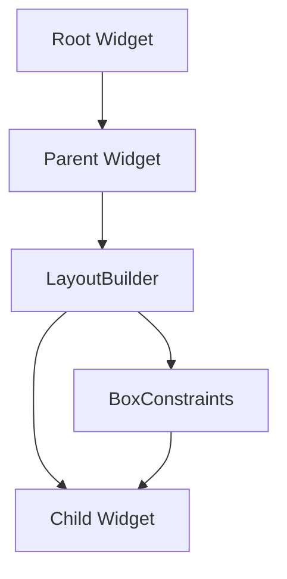
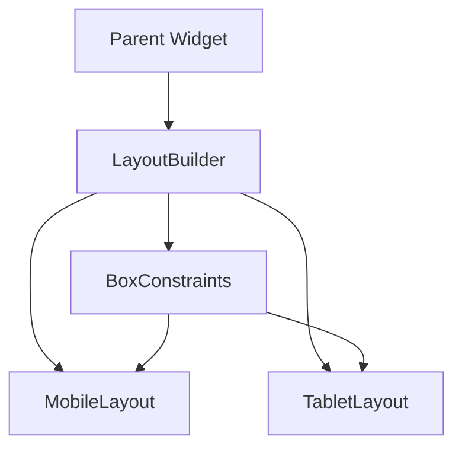

## 4.3.1 Using LayoutBuilder

In the realm of Flutter development, creating responsive user interfaces that adapt seamlessly to different screen sizes and orientations is crucial. One of the most powerful tools at your disposal for achieving this is the `LayoutBuilder` widget. This chapter delves into the intricacies of `LayoutBuilder`, providing you with the knowledge and skills to leverage it effectively in your Flutter applications.

### Introduction to LayoutBuilder

`LayoutBuilder` is a versatile widget in Flutter that builds itself based on the constraints it receives from its parent. It is particularly useful when the size of a widget is unknown ahead of time, allowing developers to make layout decisions dynamically at build time. This capability is essential for creating responsive designs that adapt to various screen sizes and orientations.

#### Key Features of LayoutBuilder

- **Dynamic Layout Decisions:** `LayoutBuilder` allows you to adjust the layout of your widgets based on the constraints provided by the parent widget.
- **Responsive Design:** It enables the creation of responsive UIs that can adapt to different screen sizes and orientations.
- **Efficient Rebuilding:** `LayoutBuilder` rebuilds its child only when the constraints change, optimizing performance.

### Understanding Constraints

To fully harness the power of `LayoutBuilder`, it's important to understand how Flutter's layout system works, particularly the concept of `BoxConstraints`.

#### BoxConstraints in Flutter

In Flutter, the layout system passes `BoxConstraints` down the widget tree. These constraints define the minimum and maximum width and height that a widget can occupy. `LayoutBuilder` provides these constraints to its builder function, allowing you to make informed layout decisions.



In the diagram above, the `BoxConstraints` flow from the parent widget to the `LayoutBuilder`, which then uses these constraints to determine how to build its child widget.

### Implementing LayoutBuilder

Let's explore how to implement `LayoutBuilder` in a Flutter application. Consider the following example, which demonstrates how to adjust the layout based on the available width:

```dart
import 'package:flutter/material.dart';

class ResponsiveLayout extends StatelessWidget {
  @override
  Widget build(BuildContext context) {
    return LayoutBuilder(
      builder: (BuildContext context, BoxConstraints constraints) {
        if (constraints.maxWidth < 600) {
          return MobileLayout();
        } else {
          return TabletLayout();
        }
      },
    );
  }
}

class MobileLayout extends StatelessWidget {
  @override
  Widget build(BuildContext context) {
    return Center(
      child: Text('Mobile Layout'),
    );
  }
}

class TabletLayout extends StatelessWidget {
  @override
  Widget build(BuildContext context) {
    return Center(
      child: Text('Tablet Layout'),
    );
  }
}
```

#### Explanation

- **LayoutBuilder Widget:** The `LayoutBuilder` widget is used to determine the layout based on the `BoxConstraints` it receives.
- **Builder Function:** The builder function takes `BuildContext` and `BoxConstraints` as parameters. It returns different widgets based on the maximum width constraint.
- **Conditional Layouts:** In this example, if the maximum width is less than 600 pixels, a `MobileLayout` is displayed; otherwise, a `TabletLayout` is shown.

### Use Cases for LayoutBuilder

`LayoutBuilder` is a powerful tool for various scenarios in responsive design. Here are some common use cases:

- **Adjusting Grid Columns:** Use `LayoutBuilder` to dynamically adjust the number of columns in a grid based on the available width.
- **Responsive Widget Appearance:** Change the appearance of a widget when it becomes too small, such as hiding certain elements or changing the layout.
- **Adaptive Navigation:** Implement different navigation layouts for mobile and tablet devices.

### Visual Aids

To better understand how `LayoutBuilder` works, let's visualize the flow of constraints and how the layout changes:



In this diagram, the `LayoutBuilder` receives constraints from the parent widget and decides whether to display the `MobileLayout` or `TabletLayout` based on these constraints.

### Best Practices for Using LayoutBuilder

To make the most of `LayoutBuilder`, consider the following best practices:

- **Use When Necessary:** Only use `LayoutBuilder` when you need to make layout decisions based on parent constraints. Avoid using it higher up in the widget tree than necessary, as it can lead to unnecessary rebuilds.
- **Optimize Performance:** Be mindful of performance implications if the layout changes frequently. Ensure that the builder function is efficient and does not perform heavy computations.
- **Test Responsiveness:** Regularly test your layouts on different devices and orientations to ensure they adapt as expected.

### Common Pitfalls

While `LayoutBuilder` is a powerful tool, there are some common pitfalls to avoid:

- **Overuse:** Avoid using `LayoutBuilder` for every layout decision. Use it judiciously where dynamic layout adjustments are necessary.
- **Complex Logic:** Keep the logic within the builder function simple to avoid performance issues.

### Interactive Exercise

Now that you have a solid understanding of `LayoutBuilder`, it's time to put your knowledge into practice. Try creating a widget that displays items differently based on the available width. For example, you could create a responsive grid that adjusts the number of columns based on the screen size.

```dart
import 'package:flutter/material.dart';

class ResponsiveGrid extends StatelessWidget {
  @override
  Widget build(BuildContext context) {
    return LayoutBuilder(
      builder: (BuildContext context, BoxConstraints constraints) {
        int columns = constraints.maxWidth < 600 ? 2 : 4;
        return GridView.builder(
          gridDelegate: SliverGridDelegateWithFixedCrossAxisCount(
            crossAxisCount: columns,
          ),
          itemBuilder: (context, index) {
            return Card(
              child: Center(child: Text('Item $index')),
            );
          },
        );
      },
    );
  }
}
```

#### Exercise Instructions

- **Modify the Grid:** Adjust the number of columns based on different width thresholds.
- **Experiment with Layouts:** Try changing the layout of the grid items based on the available width.
- **Test on Devices:** Run your application on different devices and orientations to see how the layout adapts.

### Conclusion

`LayoutBuilder` is an indispensable tool for creating responsive UIs in Flutter. By understanding how to use it effectively, you can build applications that adapt seamlessly to various screen sizes and orientations. Remember to follow best practices, avoid common pitfalls, and continuously test your layouts to ensure a smooth user experience.

### Additional Resources

- [Flutter Documentation on LayoutBuilder](https://api.flutter.dev/flutter/widgets/LayoutBuilder-class.html)
- [Responsive Design in Flutter](https://flutter.dev/docs/development/ui/layout/responsive)
- [Flutter Layout Cheat Sheet](https://medium.com/flutter-community/flutter-layout-cheat-sheet-5363348d037e)

By mastering `LayoutBuilder`, you are well on your way to creating flexible and responsive Flutter applications that provide an optimal user experience across all devices.

## Quiz Time!



### What is the primary purpose of the LayoutBuilder widget in Flutter?

- [x] To build itself based on the constraints it receives from its parent
- [ ] To manage state within a widget
- [ ] To handle user input events
- [ ] To animate transitions between screens

> **Explanation:** The primary purpose of `LayoutBuilder` is to build itself based on the constraints it receives from its parent, allowing for dynamic layout decisions.

### What does the LayoutBuilder widget use to determine how to build its child widget?

- [x] BoxConstraints
- [ ] MediaQuery
- [ ] ThemeData
- [ ] AnimationController

> **Explanation:** `LayoutBuilder` uses `BoxConstraints` to determine how to build its child widget, as these constraints define the minimum and maximum size the widget can occupy.

### In the provided example, what layout is displayed if the maximum width is less than 600 pixels?

- [x] MobileLayout
- [ ] TabletLayout
- [ ] DesktopLayout
- [ ] WebLayout

> **Explanation:** If the maximum width is less than 600 pixels, the `MobileLayout` is displayed according to the example code.

### What is a common use case for LayoutBuilder?

- [x] Adjusting the number of columns in a grid based on available width
- [ ] Managing user authentication
- [ ] Handling network requests
- [ ] Animating widget transitions

> **Explanation:** A common use case for `LayoutBuilder` is adjusting the number of columns in a grid based on the available width, making it ideal for responsive design.

### What should you be cautious of when using LayoutBuilder frequently?

- [x] Performance implications due to frequent layout changes
- [ ] Lack of support for animations
- [ ] Difficulty in handling user input
- [ ] Limited styling options

> **Explanation:** Frequent use of `LayoutBuilder` can lead to performance implications due to frequent layout changes, so it's important to use it judiciously.

### What is a potential pitfall of using LayoutBuilder higher up in the widget tree?

- [x] It can lead to unnecessary rebuilds
- [ ] It may cause memory leaks
- [ ] It can prevent state management
- [ ] It may block user interactions

> **Explanation:** Using `LayoutBuilder` higher up in the widget tree than necessary can lead to unnecessary rebuilds, impacting performance.

### What is a best practice when using LayoutBuilder?

- [x] Use it only when layout decisions depend on parent constraints
- [ ] Use it for all layout decisions
- [ ] Avoid using it with other widgets
- [ ] Use it to manage state

> **Explanation:** A best practice is to use `LayoutBuilder` only when layout decisions depend on parent constraints, ensuring efficient use.

### How does LayoutBuilder optimize performance?

- [x] By rebuilding its child only when constraints change
- [ ] By caching all widget states
- [ ] By preloading all assets
- [ ] By using a separate thread for rendering

> **Explanation:** `LayoutBuilder` optimizes performance by rebuilding its child only when constraints change, minimizing unnecessary rebuilds.

### What is the role of the builder function in LayoutBuilder?

- [x] To return a widget based on the provided constraints
- [ ] To handle user input
- [ ] To manage animations
- [ ] To apply themes

> **Explanation:** The builder function in `LayoutBuilder` returns a widget based on the provided constraints, allowing for dynamic layout adjustments.

### True or False: LayoutBuilder can be used to manage state within a widget.

- [ ] True
- [x] False

> **Explanation:** False. `LayoutBuilder` is not used for state management; it is used for making layout decisions based on constraints.


