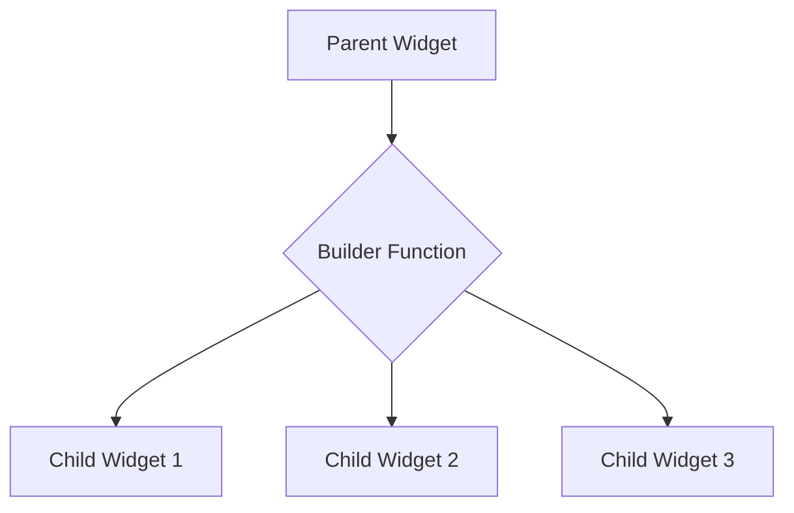

## 4.3.2 Builder Pattern in Flutter

In the world of Flutter development, creating efficient and responsive UIs is paramount. One of the key design patterns that facilitate this is the Builder Pattern. This pattern is not only a cornerstone for constructing dynamic and scalable user interfaces but also a powerful tool for optimizing performance, especially when dealing with large datasets. In this section, we will delve into the intricacies of the Builder Pattern, explore its common implementations in Flutter, and provide practical examples to illustrate its benefits.

### Understanding the Builder Pattern

The Builder Pattern is a design pattern that allows for the construction of complex objects step by step. In the context of Flutter, it is used to create widgets dynamically based on certain conditions or data. The pattern involves a parent widget providing a builder function, which is responsible for constructing child widgets. This approach is particularly useful when the number of child widgets is not known at compile time or when the widgets need to be created based on runtime data.

#### Key Concepts of the Builder Pattern

- **Dynamic Construction:** The builder function is called during the widget tree's construction, allowing for dynamic creation of widgets.
- **Efficiency:** By constructing widgets only when needed, the Builder Pattern helps in optimizing performance, especially with large or infinite lists.
- **Flexibility:** It provides a flexible way to create widgets based on dynamic data or constraints, making it ideal for responsive UI designs.

### Common Builder Widgets

Flutter provides several widgets that utilize the Builder Pattern, each serving different purposes but sharing the commonality of dynamic widget construction. Here are some of the most commonly used builder widgets:

- **`ListView.builder`:** Used for creating a scrollable list of widgets that are lazily instantiated.
- **`GridView.builder`:** Similar to `ListView.builder`, but for creating grid layouts.
- **`StreamBuilder`:** Used for building widgets based on the latest snapshot of interaction with a `Stream`.
- **`FutureBuilder`:** Constructs widgets based on the state of a `Future`.
- **`LayoutBuilder`:** Provides a way to build widgets based on the parent widget's constraints.

### Advantages of the Builder Pattern

The Builder Pattern offers several advantages, particularly in the context of Flutter:

- **Lazy Instantiation:** Widgets are created only when they are needed, which can significantly improve performance when dealing with large datasets.
- **Dynamic Data Handling:** It allows for the creation of widgets based on dynamic data, making it ideal for applications that require real-time updates or data-driven UI changes.
- **Resource Efficiency:** By constructing widgets on demand, the Builder Pattern helps in conserving memory and processing resources.

### Example with ListView.builder

To illustrate the practical application of the Builder Pattern, let's consider an example using `ListView.builder`. This widget is ideal for rendering lists where the number of items is large or infinite, as it constructs only those list items that are visible on the screen.

```dart
ListView.builder(
  itemCount: items.length,
  itemBuilder: (context, index) {
    return ListTile(
      title: Text(items[index]),
    );
  },
);
```

In this example, `ListView.builder` takes two parameters: `itemCount`, which specifies the number of items in the list, and `itemBuilder`, a function that constructs each list item. The `itemBuilder` function is called only for those items that are visible on the screen, making it highly efficient for large lists.

### Visual Diagrams

To better understand how the builder function is called during the widget tree's construction, let's visualize the process using a diagram.



In this diagram, the parent widget invokes the builder function, which in turn constructs the necessary child widgets. This process is repeated for each visible item in the list, ensuring that only the required widgets are instantiated.

### Best Practices

When using the Builder Pattern in Flutter, consider the following best practices to ensure optimal performance and maintainability:

- **Use Builder Constructors for Large Lists:** When dealing with large or infinite lists, prefer using builder constructors like `ListView.builder` or `GridView.builder` to avoid performance bottlenecks.
- **Keep Builder Functions Efficient:** Ensure that the builder functions are lightweight and efficient to prevent slowdowns during widget construction.
- **Avoid Unnecessary State Changes:** Minimize state changes within builder functions to reduce unnecessary widget rebuilds.

### Interactive Exercise

To solidify your understanding of the Builder Pattern, try refactoring a `ListView` using `children` into `ListView.builder` and observe any performance improvements. Here's a simple exercise to get you started:

1. **Original ListView:**

   ```dart
   ListView(
     children: items.map((item) => ListTile(title: Text(item))).toList(),
   );
   ```

2. **Refactored with ListView.builder:**

   ```dart
   ListView.builder(
     itemCount: items.length,
     itemBuilder: (context, index) {
       return ListTile(
         title: Text(items[index]),
       );
     },
   );
   ```

By refactoring the `ListView` to use `ListView.builder`, you can achieve more efficient rendering, especially as the number of items grows.

### Conclusion

The Builder Pattern is a powerful tool in Flutter for creating dynamic and responsive UIs. By leveraging widgets like `ListView.builder`, `GridView.builder`, `StreamBuilder`, and others, you can construct efficient and scalable applications that handle large datasets with ease. Remember to follow best practices to maximize performance and maintainability, and don't hesitate to experiment with different builder widgets to find the best fit for your application's needs.

### Further Reading and Resources

- [Flutter Documentation on ListView.builder](https://flutter.dev/docs/cookbook/lists/long-lists)
- [Effective Dart: Performance](https://dart.dev/guides/language/effective-dart/performance)
- [Design Patterns: Elements of Reusable Object-Oriented Software](https://www.amazon.com/Design-Patterns-Elements-Reusable-Object-Oriented/dp/0201633612)

## Quiz Time!



### What is the primary purpose of the Builder Pattern in Flutter?

- [x] To dynamically construct widgets based on runtime data or constraints.
- [ ] To statically define all widgets at compile time.
- [ ] To improve the aesthetic design of widgets.
- [ ] To enforce strict type checking in Dart.

> **Explanation:** The Builder Pattern is used to dynamically construct widgets based on runtime data or constraints, allowing for efficient and responsive UI design.

### Which of the following widgets does NOT utilize the Builder Pattern?

- [ ] ListView.builder
- [ ] GridView.builder
- [x] Container
- [ ] FutureBuilder

> **Explanation:** `Container` is a basic widget that does not use the Builder Pattern, unlike `ListView.builder`, `GridView.builder`, and `FutureBuilder`.

### What is a key advantage of using ListView.builder over ListView with children?

- [x] Lazy instantiation of widgets for better performance with large lists.
- [ ] Easier to write and understand code.
- [ ] Better styling options for list items.
- [ ] Automatic sorting of list items.

> **Explanation:** `ListView.builder` lazily instantiates widgets, which improves performance when dealing with large lists, as it only constructs visible items.

### How does the builder function in a builder widget improve performance?

- [x] By constructing widgets only when they are needed.
- [ ] By preloading all widgets at app startup.
- [ ] By caching all widgets in memory.
- [ ] By using a faster rendering engine.

> **Explanation:** The builder function constructs widgets only when they are needed, which conserves resources and improves performance.

### Which widget would you use to build a UI based on the latest snapshot of a Stream?

- [ ] ListView.builder
- [ ] GridView.builder
- [x] StreamBuilder
- [ ] LayoutBuilder

> **Explanation:** `StreamBuilder` is used to build a UI based on the latest snapshot of a Stream, allowing for real-time updates.

### What is the role of the itemBuilder function in ListView.builder?

- [x] To construct each list item dynamically.
- [ ] To define the overall layout of the list.
- [ ] To apply styles to the list items.
- [ ] To manage the scrolling behavior of the list.

> **Explanation:** The `itemBuilder` function is responsible for constructing each list item dynamically based on the index provided.

### When should you prefer using GridView.builder over GridView?

- [x] When dealing with a large or infinite number of grid items.
- [ ] When the grid has a fixed number of items.
- [ ] When you want to apply custom animations to grid items.
- [ ] When you need to use custom widgets for each grid item.

> **Explanation:** `GridView.builder` is preferred for large or infinite numbers of grid items because it constructs items lazily, improving performance.

### What is a common pitfall when using builder functions in Flutter?

- [ ] Using too many widgets in the builder function.
- [x] Performing expensive operations inside the builder function.
- [ ] Not using enough widgets in the builder function.
- [ ] Using the wrong data types in the builder function.

> **Explanation:** Performing expensive operations inside the builder function can lead to performance issues, as it is called frequently during widget construction.

### Which widget would you use to create a layout based on the parent widget's constraints?

- [ ] ListView.builder
- [ ] GridView.builder
- [ ] StreamBuilder
- [x] LayoutBuilder

> **Explanation:** `LayoutBuilder` is used to create a layout based on the parent widget's constraints, allowing for responsive designs.

### True or False: The Builder Pattern in Flutter is only useful for lists and grids.

- [ ] True
- [x] False

> **Explanation:** False. The Builder Pattern is versatile and can be used in various contexts, such as streams, futures, and layout constraints, not just lists and grids.


