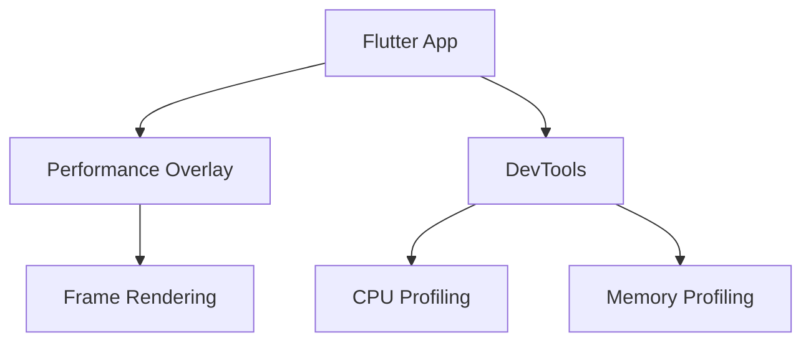

## 4.3.4 Performance Considerations

Building responsive UIs in Flutter is a powerful way to ensure your applications look great on any device. However, achieving responsiveness can sometimes introduce performance overhead if not implemented carefully. In this section, we will explore various performance considerations and best practices to ensure your Flutter applications remain smooth and efficient.

### Understanding Performance Impact

Responsive UIs are essential for modern applications, but they can come with a cost. When designing layouts that adapt to different screen sizes and orientations, it's crucial to be mindful of the performance implications. Each time a layout changes, Flutter may need to rebuild parts of the widget tree, which can lead to increased CPU and GPU usage, affecting the app's responsiveness.

#### Key Points:
- **Performance Overhead:** Building responsive UIs can introduce performance overhead if not implemented carefully.
- **Rebuild Frequency:** Frequent rebuilds can lead to jank, where the UI stutters or lags.

### Avoiding Unnecessary Rebuilds

One of the primary culprits of performance issues in Flutter is unnecessary widget rebuilds. Widgets like `LayoutBuilder` can cause child widgets to rebuild frequently, especially when constraints change. To mitigate this, it's essential to minimize the area of the widget tree that depends on changing constraints.

#### Strategies to Minimize Rebuilds:
- **Minimize Dependency:** Limit the number of widgets that depend on changing constraints.
- **Use `LayoutBuilder` Wisely:** Only use `LayoutBuilder` when necessary, and try to keep its usage localized to the smallest possible widget subtree.

```dart
class ResponsiveWidget extends StatelessWidget {
  @override
  Widget build(BuildContext context) {
    return LayoutBuilder(
      builder: (context, constraints) {
        // Only rebuild this part of the widget tree when constraints change
        return constraints.maxWidth > 600
            ? WideLayout()
            : NarrowLayout();
      },
    );
  }
}
```

### Using const Constructors

Flutter provides a powerful optimization tool in the form of `const` constructors. By marking widgets as `const`, you inform Flutter that these widgets do not change, allowing the framework to reuse them instead of rebuilding them.

#### Benefits of `const` Constructors:
- **Reduced Rebuilds:** Widgets marked as `const` are not rebuilt unless their state changes.
- **Improved Performance:** Reusing widgets reduces the workload on the CPU and GPU.

```dart
class MyWidget extends StatelessWidget {
  const MyWidget({Key? key}) : super(key: key);

  @override
  Widget build(BuildContext context) {
    return const Text('Hello, World!');
  }
}
```

### Efficient State Management

Efficient state management is crucial for maintaining performance in Flutter applications. By managing state effectively, you can prevent unnecessary widget rebuilds and ensure that only the parts of the UI that need to change are updated.

#### Tips for Efficient State Management:
- **Isolate State:** Split widgets into smaller components to isolate state changes.
- **Use State Management Libraries:** Consider using libraries like Provider, Riverpod, or Bloc to manage state efficiently.

```dart
class Counter extends StatefulWidget {
  @override
  _CounterState createState() => _CounterState();
}

class _CounterState extends State<Counter> {
  int _count = 0;

  void _increment() {
    setState(() {
      _count++;
    });
  }

  @override
  Widget build(BuildContext context) {
    return Column(
      children: [
        Text('Count: $_count'),
        ElevatedButton(
          onPressed: _increment,
          child: const Text('Increment'),
        ),
      ],
    );
  }
}
```

### Optimizing Images and Assets

Images and assets can significantly impact the performance of your Flutter application. Using appropriately sized images and constraining them to their intended size can help optimize performance.

#### Best Practices for Images:
- **Use SizedBox:** Constrain images to their intended size using `SizedBox`.
- **Optimize Image Sizes:** Use images that are appropriately sized for the target display.

```dart
class ImageWidget extends StatelessWidget {
  @override
  Widget build(BuildContext context) {
    return SizedBox(
      width: 100,
      height: 100,
      child: Image.asset('assets/image.png'),
    );
  }
}
```

### Profiling and Debugging Tools

Flutter provides a suite of performance profiling tools that can help you identify and address performance bottlenecks in your application. These tools allow you to monitor frame rendering and analyze the performance of your app.

#### Key Tools:
- **Performance Overlay:** Use the Performance Overlay to monitor frame rendering and identify jank.
- **DevTools:** Flutter DevTools provides a comprehensive suite of profiling tools for analyzing performance.



#### Using the Performance Overlay:
- **Enable Overlay:** Use `flutter run --profile` to enable the Performance Overlay.
- **Interpret Results:** Look for spikes in the overlay that indicate performance issues.

### Best Practices

To ensure optimal performance in your Flutter applications, consider the following best practices:

- **Keep Layouts Simple:** Avoid overly complex layouts that can lead to performance issues.
- **Test on Real Devices:** Always test your application on real devices, especially lower-end ones, to gauge performance accurately.
- **Profile Regularly:** Regularly profile your application to identify and address performance bottlenecks.

### Interactive Exercise

To put these concepts into practice, we encourage you to profile your own Flutter application using the tools discussed. Identify any performance bottlenecks and consider how you might address them using the strategies outlined in this section.

### Conclusion

By understanding and applying these performance considerations, you can build responsive UIs in Flutter that are both beautiful and efficient. Remember to keep layouts simple, manage state effectively, and use profiling tools to ensure your application performs well across all devices.

## Quiz Time!



### What is a common performance issue when building responsive UIs in Flutter?

- [x] Unnecessary widget rebuilds
- [ ] Excessive use of const constructors
- [ ] Overuse of state management libraries
- [ ] Lack of images and assets

> **Explanation:** Unnecessary widget rebuilds can lead to performance issues, causing the UI to stutter or lag.

### How can you minimize unnecessary rebuilds in a Flutter application?

- [x] Use const constructors for widgets that do not change
- [ ] Avoid using LayoutBuilder
- [ ] Use large images without constraints
- [ ] Avoid state management libraries

> **Explanation:** Using const constructors helps reduce rebuilds by allowing Flutter to reuse widgets that do not change.

### What is the benefit of using const constructors in Flutter?

- [x] Reduced rebuilds and improved performance
- [ ] Increased rebuilds and decreased performance
- [ ] More complex widget trees
- [ ] Larger application size

> **Explanation:** Const constructors reduce rebuilds, leading to improved performance by reusing widgets that do not change.

### Which tool can be used to monitor frame rendering in Flutter?

- [x] Performance Overlay
- [ ] SizedBox
- [ ] LayoutBuilder
- [ ] State Management Library

> **Explanation:** The Performance Overlay is used to monitor frame rendering and identify performance issues in Flutter applications.

### What is a recommended practice for optimizing images in Flutter?

- [x] Use SizedBox to constrain images to their intended size
- [ ] Use images without constraints
- [ ] Avoid using images altogether
- [ ] Use the largest possible image size

> **Explanation:** Using SizedBox to constrain images helps ensure they are displayed at their intended size, optimizing performance.

### Why is it important to test Flutter applications on real devices?

- [x] To accurately gauge performance, especially on lower-end devices
- [ ] To avoid using profiling tools
- [ ] To increase application size
- [ ] To ensure the app does not run on emulators

> **Explanation:** Testing on real devices provides an accurate measure of performance, particularly on lower-end devices where performance issues are more likely to occur.

### What is a benefit of using state management libraries in Flutter?

- [x] Efficient state management and reduced unnecessary widget rebuilds
- [ ] Increased complexity and more rebuilds
- [ ] Larger application size
- [ ] Avoiding the use of const constructors

> **Explanation:** State management libraries help manage state efficiently, reducing unnecessary widget rebuilds and improving performance.

### How can you enable the Performance Overlay in Flutter?

- [x] Use `flutter run --profile`
- [ ] Use `flutter run --debug`
- [ ] Use `flutter run --release`
- [ ] Use `flutter run --test`

> **Explanation:** The Performance Overlay can be enabled using `flutter run --profile`, allowing you to monitor frame rendering.

### What is a key consideration when using LayoutBuilder in Flutter?

- [x] Minimize the area of the widget tree that depends on changing constraints
- [ ] Use LayoutBuilder for all widgets
- [ ] Avoid using LayoutBuilder altogether
- [ ] Use LayoutBuilder to increase rebuilds

> **Explanation:** Minimizing the area of the widget tree that depends on changing constraints helps reduce unnecessary rebuilds when using LayoutBuilder.

### True or False: Using const constructors can help improve performance in Flutter applications.

- [x] True
- [ ] False

> **Explanation:** True. Const constructors help improve performance by reducing unnecessary widget rebuilds, allowing Flutter to reuse widgets that do not change.


