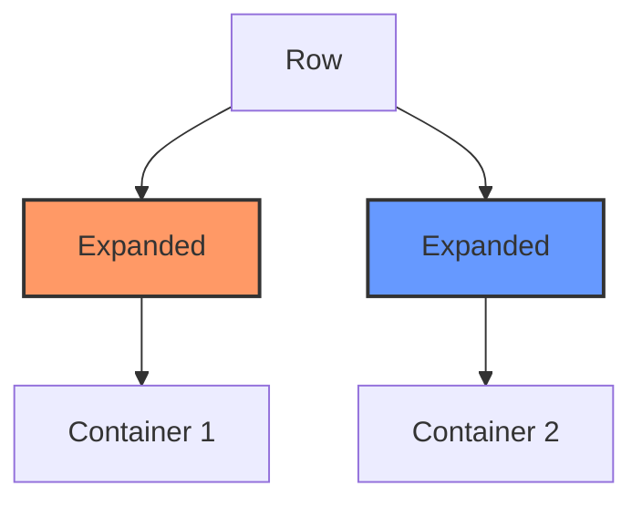
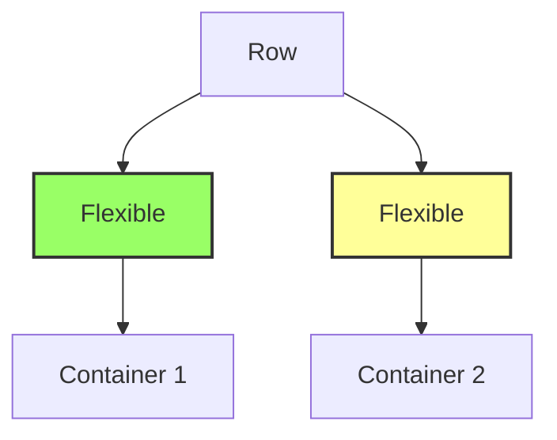

## 4.4.1 Using Flexible and Expanded

In the world of mobile app development, creating responsive user interfaces that adapt seamlessly to different screen sizes is crucial. Flutter, with its rich set of widgets, provides powerful tools to achieve this. Among these tools, the `Flexible` and `Expanded` widgets play a pivotal role in building adaptable layouts. This section delves into the intricacies of these widgets, offering insights, practical examples, and best practices to harness their full potential.

### Understanding Flexible and Expanded Widgets

Before diving into the specifics, let's revisit the `Flexible` and `Expanded` widgets introduced in Chapter 3. These widgets are essential for creating responsive designs by controlling how much space a widget occupies within a `Row`, `Column`, or `Flex` widget.

- **Flexible Widget:** Allows a child widget to occupy available space while respecting its intrinsic size. It provides flexibility in how space is distributed among children.
- **Expanded Widget:** Forces a child widget to expand and fill the available space. It is a specialized version of `Flexible` with `FlexFit.tight` as its default fit.

Both widgets are used to manage the distribution of space within a parent widget, ensuring that the layout adapts to different screen sizes and orientations.

### Using Expanded

The `Expanded` widget is a powerful tool for creating layouts where child widgets need to fill the available space. It is particularly useful in `Row`, `Column`, or `Flex` widgets, where you want to distribute space evenly or according to specific proportions.

#### Example: Using Expanded in a Row

Consider the following example, where two containers are placed inside a `Row` widget. Each container is wrapped with an `Expanded` widget, ensuring they occupy equal space.

```dart
Row(
  children: [
    Expanded(
      child: Container(color: Colors.red),
    ),
    Expanded(
      child: Container(color: Colors.blue),
    ),
  ],
);
```

In this example, the two containers will expand to fill the entire width of the `Row`, each taking up 50% of the available space.

#### The Role of the `flex` Parameter

The `flex` parameter in the `Expanded` widget allows you to specify the proportion of space each child should occupy. By default, the `flex` value is 1, meaning each child takes an equal share of the available space. However, you can adjust this value to change the distribution.

```dart
Row(
  children: [
    Expanded(
      flex: 2,
      child: Container(color: Colors.red),
    ),
    Expanded(
      flex: 1,
      child: Container(color: Colors.blue),
    ),
  ],
);
```

In this modified example, the red container takes up twice the space of the blue container, thanks to the `flex` parameter.

### Using Flexible

The `Flexible` widget provides more nuanced control over space distribution. Unlike `Expanded`, which forces a child to fill the available space, `Flexible` allows a child to occupy space while respecting its intrinsic size.

#### FlexFit.tight vs. FlexFit.loose

The `Flexible` widget can be configured with two different fit types: `FlexFit.tight` and `FlexFit.loose`.

- **FlexFit.tight:** Similar to `Expanded`, it forces the child to fill the available space.
- **FlexFit.loose:** Allows the child to take up as much space as it needs, but no more.

#### Example: Flexible with FlexFit.tight

```dart
Row(
  children: [
    Flexible(
      fit: FlexFit.tight,
      child: Container(color: Colors.green),
    ),
    Flexible(
      fit: FlexFit.tight,
      child: Container(color: Colors.yellow),
    ),
  ],
);
```

In this example, both containers will fill the available space equally, similar to using `Expanded`.

#### Example: Flexible with FlexFit.loose

```dart
Row(
  children: [
    Flexible(
      fit: FlexFit.loose,
      child: Container(width: 100, color: Colors.green),
    ),
    Flexible(
      fit: FlexFit.loose,
      child: Container(width: 100, color: Colors.yellow),
    ),
  ],
);
```

Here, each container will only take up 100 pixels of width, regardless of the available space, because of the `FlexFit.loose` configuration.

### Adjusting Layouts Dynamically

One of the key benefits of using `Flexible` and `Expanded` is their ability to create layouts that adjust dynamically to different screen sizes. This adaptability is crucial for building responsive UIs that provide a consistent user experience across devices.

#### Example: Responsive Layout with Flexible and Expanded

Consider a scenario where you want to create a layout with three sections: a header, a content area, and a footer. The content area should expand to fill the remaining space, while the header and footer maintain their intrinsic sizes.

```dart
Column(
  children: [
    Container(
      height: 100,
      color: Colors.orange,
    ),
    Expanded(
      child: Container(color: Colors.white),
    ),
    Container(
      height: 50,
      color: Colors.grey,
    ),
  ],
);
```

In this example, the header and footer have fixed heights, while the content area expands to fill the remaining space.

### Visual Aids

To better understand the differences between `Flexible` and `Expanded`, let's visualize their behavior using diagrams.



In this diagram, `Container 1` and `Container 2` are both wrapped in `Expanded`, filling the available space equally.



Here, `Container 1` and `Container 2` are wrapped in `Flexible` with `FlexFit.loose`, allowing them to maintain their intrinsic sizes.

### Best Practices

When using `Flexible` and `Expanded`, consider the following best practices:

- Use `Expanded` when you want a widget to fill the remaining space in a `Row`, `Column`, or `Flex`.
- Use `Flexible` when you want a widget to adjust its size but not necessarily fill all available space.
- Leverage the `flex` parameter to control the distribution of space among children.
- Test your layouts on different screen sizes to ensure responsiveness.

### Interactive Exercise

To solidify your understanding, try creating a layout where widgets adjust their size relative to each other as the screen size changes. Use both `Flexible` and `Expanded` to achieve the desired responsiveness.

**Exercise:** Create a layout with three containers in a `Column`. The first container should have a fixed height, the second should expand to fill the remaining space, and the third should adjust its size based on the available space.

```dart
Column(
  children: [
    Container(
      height: 100,
      color: Colors.purple,
    ),
    Expanded(
      child: Container(color: Colors.teal),
    ),
    Flexible(
      fit: FlexFit.loose,
      child: Container(height: 50, color: Colors.pink),
    ),
  ],
);
```

### Conclusion

The `Flexible` and `Expanded` widgets are indispensable tools for building responsive UIs in Flutter. By understanding their differences and how to use them effectively, you can create layouts that adapt seamlessly to various screen sizes and orientations. Experiment with these widgets in your projects to enhance the user experience and ensure your apps look great on any device.

For further exploration, consider diving into Flutter's official documentation on [Flexible](https://api.flutter.dev/flutter/widgets/Flexible-class.html) and [Expanded](https://api.flutter.dev/flutter/widgets/Expanded-class.html) widgets. Additionally, explore open-source projects on GitHub that demonstrate advanced usage of these widgets in real-world applications.

## Quiz Time!



### What is the primary purpose of the `Expanded` widget in Flutter?

- [x] To force a child widget to fill the available space in a `Row`, `Column`, or `Flex`.
- [ ] To allow a child widget to maintain its intrinsic size.
- [ ] To provide padding around a widget.
- [ ] To align widgets within a container.

> **Explanation:** The `Expanded` widget is used to make a child widget fill the available space within a `Row`, `Column`, or `Flex`.

### How does the `flex` parameter affect the behavior of `Expanded` widgets?

- [x] It determines the proportion of space each child occupies.
- [ ] It sets the padding around the widget.
- [ ] It controls the alignment of the widget.
- [ ] It specifies the color of the widget.

> **Explanation:** The `flex` parameter in `Expanded` widgets is used to specify the proportion of space that each child should occupy relative to others.

### What is the default fit type for the `Flexible` widget?

- [x] FlexFit.loose
- [ ] FlexFit.tight
- [ ] FlexFit.fill
- [ ] FlexFit.none

> **Explanation:** The default fit type for the `Flexible` widget is `FlexFit.loose`, which allows the child to take up as much space as it needs.

### Which widget would you use to ensure a child widget maintains its intrinsic size while occupying available space?

- [x] Flexible with FlexFit.loose
- [ ] Expanded
- [ ] Container
- [ ] SizedBox

> **Explanation:** `Flexible` with `FlexFit.loose` allows a child widget to maintain its intrinsic size while occupying available space.

### In a `Row` with two `Expanded` children, what happens if both have a `flex` value of 1?

- [x] Both children will occupy equal space.
- [ ] The first child will occupy more space.
- [ ] The second child will occupy more space.
- [ ] Neither child will expand.

> **Explanation:** When both `Expanded` children have a `flex` value of 1, they will occupy equal space within the `Row`.

### What is the difference between `FlexFit.tight` and `FlexFit.loose`?

- [x] `FlexFit.tight` forces the child to fill available space, while `FlexFit.loose` allows the child to maintain its intrinsic size.
- [ ] `FlexFit.tight` adds padding, while `FlexFit.loose` removes padding.
- [ ] `FlexFit.tight` aligns widgets, while `FlexFit.loose` centers them.
- [ ] `FlexFit.tight` changes the color, while `FlexFit.loose` changes the size.

> **Explanation:** `FlexFit.tight` forces the child to fill available space, whereas `FlexFit.loose` allows the child to maintain its intrinsic size.

### Which widget is best for creating a layout where a widget should fill the remaining space?

- [x] Expanded
- [ ] Flexible
- [ ] Container
- [ ] Padding

> **Explanation:** The `Expanded` widget is best for creating layouts where a widget should fill the remaining space.

### How can you make a widget take up twice as much space as another in a `Row`?

- [x] Set the `flex` parameter of the `Expanded` widget to 2 for the desired widget.
- [ ] Use a `Container` with double the width.
- [ ] Wrap the widget in a `Padding` widget.
- [ ] Use a `SizedBox` with double the height.

> **Explanation:** By setting the `flex` parameter of the `Expanded` widget to 2, you can make the widget take up twice as much space as another.

### What is the effect of using `Expanded` in a `Column`?

- [x] It makes the child widget fill the available vertical space.
- [ ] It centers the child widget horizontally.
- [ ] It adds padding around the child widget.
- [ ] It changes the background color of the child widget.

> **Explanation:** Using `Expanded` in a `Column` makes the child widget fill the available vertical space.

### True or False: The `Flexible` widget can only be used in `Row` and `Column` widgets.

- [ ] True
- [x] False

> **Explanation:** The `Flexible` widget can be used in any widget that supports flexible space allocation, not just `Row` and `Column`.


