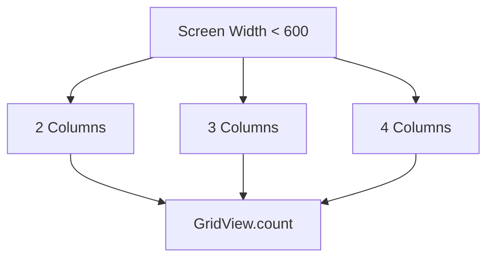

## 4.4.2 GridView and SliverGrid

In the realm of mobile application development, creating responsive and visually appealing user interfaces is paramount. Flutter, with its rich set of widgets, provides powerful tools to achieve this. Among these, `GridView` and `SliverGrid` stand out as essential components for displaying content in a grid format. This section delves into the capabilities of these widgets, offering insights into their usage, customization, and best practices for building responsive UIs.

### GridView Overview

`GridView` is a versatile widget that allows developers to display items in a grid layout. It is particularly useful for creating galleries, product listings, and any other interface where items are organized in a grid. Flutter offers several constructors for `GridView`, each catering to different use cases:

- **`GridView.count`:** This constructor is ideal when you know the exact number of columns you want in your grid. It allows you to specify the number of columns directly, making it straightforward to use for fixed grid layouts.

- **`GridView.extent`:** This constructor is useful when you want to specify the maximum extent (width) of each item in the grid. It automatically calculates the number of columns based on the available width and the specified extent.

- **`GridView.builder`:** This constructor is designed for more dynamic scenarios where the number of items is not known beforehand. It uses a builder function to create items on demand, making it efficient for large datasets.

#### Example: Using GridView.count

```dart
GridView.count(
  crossAxisCount: 3,
  children: List.generate(20, (index) {
    return Container(
      margin: EdgeInsets.all(4.0),
      color: Colors.blueAccent,
      child: Center(
        child: Text('Item $index'),
      ),
    );
  }),
);
```

In this example, `GridView.count` creates a grid with three columns, displaying 20 items.

### Responsive Grids with GridView

Creating responsive grids that adapt to different screen sizes is crucial for a seamless user experience. Flutter's `GridView` can be customized to adjust the number of columns based on the screen width, ensuring that your layout remains consistent across devices.

#### Implementing a Responsive Grid

To create a responsive grid, you can use the `GridView.count` constructor in combination with a function that determines the number of columns based on the screen width.

```dart
int getCrossAxisCount(double screenWidth) {
  if (screenWidth < 600) {
    return 2;
  } else if (screenWidth < 900) {
    return 3;
  } else {
    return 4;
  }
}

Widget build(BuildContext context) {
  double screenWidth = MediaQuery.of(context).size.width;
  return GridView.count(
    crossAxisCount: getCrossAxisCount(screenWidth),
    children: List.generate(20, (index) {
      return Container(
        margin: EdgeInsets.all(4.0),
        color: Colors.blueAccent,
        child: Center(
          child: Text('Item $index'),
        ),
      );
    }),
  );
}
```

In this example, the `getCrossAxisCount` function returns a different number of columns based on the screen width, allowing the grid to adapt dynamically.

### Using SliverGrid

For more advanced scrolling effects and custom layouts, Flutter provides `SliverGrid`, which can be used within a `CustomScrollView`. This approach offers greater flexibility and control over how items are displayed and scrolled.

#### Example: SliverGrid with CustomScrollView

```dart
CustomScrollView(
  slivers: <Widget>[
    SliverGrid(
      gridDelegate: SliverGridDelegateWithFixedCrossAxisCount(
        crossAxisCount: 3,
      ),
      delegate: SliverChildBuilderDelegate(
        (BuildContext context, int index) {
          return Container(
            margin: EdgeInsets.all(4.0),
            color: Colors.greenAccent,
            child: Center(
              child: Text('Item $index'),
            ),
          );
        },
        childCount: 20,
      ),
    ),
  ],
);
```

In this example, `SliverGrid` is used within a `CustomScrollView`, allowing for custom scrolling behavior and layout adjustments.

### Dynamic Grids

Dynamic grids can adjust item size or spacing based on various factors, such as screen size or user preferences. This flexibility is essential for creating responsive and user-friendly interfaces.

#### Adjusting Item Size Dynamically

```dart
GridView.builder(
  gridDelegate: SliverGridDelegateWithMaxCrossAxisExtent(
    maxCrossAxisExtent: 200,
    childAspectRatio: 3 / 2,
    crossAxisSpacing: 10,
    mainAxisSpacing: 10,
  ),
  itemBuilder: (BuildContext context, int index) {
    return Container(
      color: Colors.orangeAccent,
      child: Center(
        child: Text('Item $index'),
      ),
    );
  },
  itemCount: 20,
);
```

In this example, the grid adjusts the item size based on the maximum cross-axis extent, ensuring that items are proportionally sized.

### Visual Aids

To better understand how grids adjust to different screen sizes, consider the following diagrams and screenshots:



This diagram illustrates how the number of columns in a grid can change based on the screen width.

### Best Practices

- **Proportional Sizing:** Ensure that items in the grid are proportionally sized to maintain a consistent look and feel across different devices.
- **Optimize Content:** Optimize images and other content for performance to ensure smooth scrolling and interaction.
- **Use Caching:** Implement caching strategies for images and data to improve load times and reduce network usage.

### Interactive Exercise

To reinforce your understanding of `GridView` and `SliverGrid`, try building a photo gallery app where the grid adjusts based on screen size. Use the concepts discussed in this section to create a responsive and visually appealing layout.

### Conclusion

`GridView` and `SliverGrid` are powerful tools in Flutter's arsenal for creating responsive and dynamic grid layouts. By understanding their capabilities and best practices, you can build applications that provide a seamless user experience across a wide range of devices.

## Quiz Time!



### What is the primary use of `GridView` in Flutter?

- [x] To display items in a grid layout
- [ ] To create a list of items
- [ ] To manage state in a Flutter app
- [ ] To handle user input

> **Explanation:** `GridView` is used to display items in a grid layout, making it ideal for galleries and product listings.

### Which `GridView` constructor is best for creating a grid with a fixed number of columns?

- [x] `GridView.count`
- [ ] `GridView.extent`
- [ ] `GridView.builder`
- [ ] `GridView.custom`

> **Explanation:** `GridView.count` allows you to specify the number of columns directly, making it suitable for fixed grid layouts.

### How does `GridView.extent` determine the number of columns?

- [x] Based on the maximum extent of each item
- [ ] Based on the total number of items
- [ ] Based on the height of the grid
- [ ] Based on the aspect ratio of the items

> **Explanation:** `GridView.extent` calculates the number of columns based on the maximum extent (width) specified for each item.

### What is the purpose of `SliverGrid` in Flutter?

- [x] To provide advanced scrolling effects and custom layouts
- [ ] To manage state in a Flutter app
- [ ] To handle user input
- [ ] To create a list of items

> **Explanation:** `SliverGrid` is used within a `CustomScrollView` for advanced scrolling effects and custom layouts.

### Which function can be used to dynamically adjust the number of columns in a `GridView`?

- [x] `getCrossAxisCount`
- [ ] `setColumnCount`
- [ ] `adjustGridColumns`
- [ ] `calculateColumns`

> **Explanation:** `getCrossAxisCount` is a function that can be implemented to return different column counts based on screen width.

### What is a key benefit of using `GridView.builder`?

- [x] It efficiently creates items on demand
- [ ] It allows for fixed grid layouts
- [ ] It automatically optimizes images
- [ ] It provides built-in animations

> **Explanation:** `GridView.builder` uses a builder function to create items on demand, making it efficient for large datasets.

### How can you optimize images in a grid for better performance?

- [x] By using caching strategies
- [ ] By increasing image resolution
- [ ] By loading all images at once
- [ ] By using larger image files

> **Explanation:** Implementing caching strategies helps improve load times and reduce network usage, optimizing images for better performance.

### What is the role of `SliverChildBuilderDelegate` in a `SliverGrid`?

- [x] To build grid items on demand
- [ ] To manage state in a Flutter app
- [ ] To handle user input
- [ ] To create a list of items

> **Explanation:** `SliverChildBuilderDelegate` is used to build grid items on demand within a `SliverGrid`.

### Which of the following is a best practice for creating responsive grids?

- [x] Ensure items are proportionally sized
- [ ] Use fixed item sizes
- [ ] Load all data at once
- [ ] Avoid using caching

> **Explanation:** Ensuring items are proportionally sized helps maintain a consistent look and feel across different devices.

### True or False: `GridView` can only be used for displaying images.

- [ ] True
- [x] False

> **Explanation:** `GridView` can be used to display any type of widget, not just images, making it versatile for various use cases.


