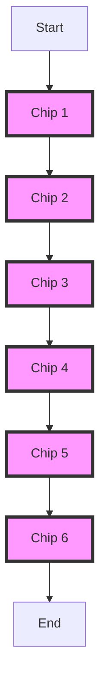
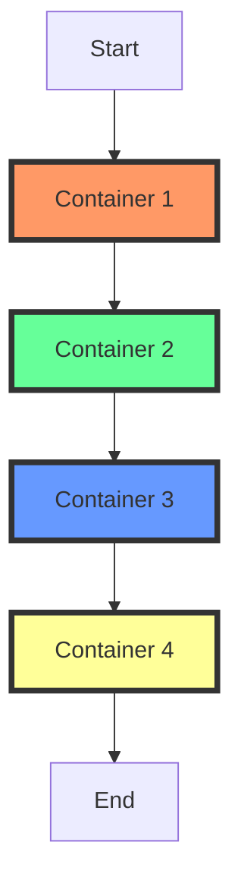

## 4.4.3 Wrap and Flow Widgets

In the world of mobile app development, creating responsive and adaptive user interfaces is crucial. Flutter, with its rich set of widgets, provides powerful tools to help developers achieve this goal. Among these tools are the `Wrap` and `Flow` widgets, which offer flexible ways to arrange child widgets dynamically. In this section, we'll delve into these widgets, exploring their functionalities, use cases, and best practices.

### Understanding the Wrap Widget

The `Wrap` widget in Flutter is designed to lay out its children in multiple horizontal or vertical runs. This means that when the available space is insufficient to accommodate all children in a single line, the `Wrap` widget automatically moves the overflow items to the next line. This behavior makes it particularly useful for creating layouts where the number of items is dynamic or when items need to adjust to varying screen sizes.

#### Key Features of Wrap

- **Dynamic Layouts:** Automatically adjusts the layout based on the available space.
- **Horizontal and Vertical Runs:** Supports both horizontal and vertical orientations.
- **Spacing Control:** Allows customization of spacing between items and between lines.

#### Using Wrap: A Practical Example

Let's consider a simple example where we use the `Wrap` widget to display a series of `Chip` widgets. This example demonstrates how the `Wrap` widget dynamically adjusts the layout when the screen size changes.

```dart
import 'package:flutter/material.dart';

void main() => runApp(MyApp());

class MyApp extends StatelessWidget {
  @override
  Widget build(BuildContext context) {
    return MaterialApp(
      home: Scaffold(
        appBar: AppBar(title: Text('Wrap Widget Example')),
        body: Center(
          child: Wrap(
            spacing: 8.0, // Horizontal spacing between children
            runSpacing: 4.0, // Vertical spacing between lines
            children: [
              Chip(label: Text('Item 1')),
              Chip(label: Text('Item 2')),
              Chip(label: Text('Item 3')),
              Chip(label: Text('Item 4')),
              Chip(label: Text('Item 5')),
              Chip(label: Text('Item 6')),
            ],
          ),
        ),
      ),
    );
  }
}
```

In this example, the `Wrap` widget arranges the `Chip` widgets horizontally. When the screen width is insufficient to display all chips in a single line, it wraps the remaining chips to the next line. The `spacing` and `runSpacing` properties allow you to control the space between the chips and between the lines, respectively.

#### Visualizing the Wrap Widget

To better understand how the `Wrap` widget functions, consider the following diagram:



This diagram illustrates how the `Wrap` widget arranges its children. When the width is insufficient, it wraps the items to the next line, maintaining the specified spacing.

### Introducing the Flow Widget

While the `Wrap` widget is excellent for simple wrapping layouts, the `Flow` widget offers a more customizable, low-level approach to arranging children. The `Flow` widget requires a `FlowDelegate` to control the layout of its children, providing fine-grained control over their positioning and sizing.

#### Key Features of Flow

- **Custom Layout Logic:** Allows developers to define custom layout logic through a `FlowDelegate`.
- **Efficient Rendering:** Optimizes rendering by only laying out visible children.
- **Complex Layouts:** Suitable for scenarios where complex layout behavior is required.

#### Using Flow: A Practical Example

To use the `Flow` widget, you need to implement a `FlowDelegate` that defines the layout logic. Here's a basic example:

```dart
import 'package:flutter/material.dart';

void main() => runApp(MyApp());

class MyApp extends StatelessWidget {
  @override
  Widget build(BuildContext context) {
    return MaterialApp(
      home: Scaffold(
        appBar: AppBar(title: Text('Flow Widget Example')),
        body: Center(
          child: Flow(
            delegate: SimpleFlowDelegate(),
            children: [
              Container(width: 50, height: 50, color: Colors.red),
              Container(width: 50, height: 50, color: Colors.green),
              Container(width: 50, height: 50, color: Colors.blue),
              Container(width: 50, height: 50, color: Colors.yellow),
            ],
          ),
        ),
      ),
    );
  }
}

class SimpleFlowDelegate extends FlowDelegate {
  @override
  void paintChildren(FlowPaintingContext context) {
    double x = 0.0;
    double y = 0.0;
    for (int i = 0; i < context.childCount; i++) {
      final childSize = context.getChildSize(i) ?? Size.zero;
      if (x + childSize.width > context.size.width) {
        x = 0;
        y += childSize.height;
      }
      context.paintChild(i, transform: Matrix4.translationValues(x, y, 0));
      x += childSize.width;
    }
  }

  @override
  bool shouldRepaint(covariant FlowDelegate oldDelegate) => false;
}
```

In this example, the `SimpleFlowDelegate` positions each child widget in a row. When the row is full, it moves to the next line. The `Flow` widget provides flexibility to implement custom layout logic, making it suitable for complex scenarios.

#### Visualizing the Flow Widget

The following diagram illustrates how the `Flow` widget, with a custom `FlowDelegate`, positions its children:



This diagram shows how the `FlowDelegate` controls the positioning of each container, allowing for custom layout behavior.

### Use Cases for Wrap and Flow

Both `Wrap` and `Flow` widgets are invaluable for creating responsive and dynamic layouts. Here are some common use cases:

- **Tag Clouds:** Displaying a collection of tags that adjust based on screen size.
- **Responsive Menus:** Creating menus that adapt to different screen widths.
- **Dynamic Content:** Arranging content that changes in size or number dynamically.

### Best Practices

- **Use Wrap for Simplicity:** The `Wrap` widget is ideal for straightforward wrapping layouts where items need to adjust to available space.
- **Reserve Flow for Complexity:** The `Flow` widget is more complex and should be used when custom layout behavior is required. It offers greater control but at the cost of increased complexity.

### Interactive Exercise

To solidify your understanding of the `Wrap` and `Flow` widgets, try this exercise:

**Exercise:** Create a list of buttons that wrap when they reach the edge of the screen. Use the `Wrap` widget to achieve this. Experiment with different spacing and alignment options to see how they affect the layout.

```dart
import 'package:flutter/material.dart';

void main() => runApp(MyApp());

class MyApp extends StatelessWidget {
  @override
  Widget build(BuildContext context) {
    return MaterialApp(
      home: Scaffold(
        appBar: AppBar(title: Text('Interactive Wrap Exercise')),
        body: Center(
          child: Wrap(
            spacing: 10.0,
            runSpacing: 5.0,
            alignment: WrapAlignment.center,
            children: List.generate(10, (index) {
              return ElevatedButton(
                onPressed: () {},
                child: Text('Button $index'),
              );
            }),
          ),
        ),
      ),
    );
  }
}
```

### Conclusion

The `Wrap` and `Flow` widgets are powerful tools in Flutter's arsenal for creating responsive and adaptive user interfaces. By understanding their functionalities and use cases, you can design layouts that dynamically adjust to different screen sizes and content variations. Remember to choose the right widget based on your layout complexity and requirements.

### Additional Resources

- [Flutter Documentation: Wrap Widget](https://api.flutter.dev/flutter/widgets/Wrap-class.html)
- [Flutter Documentation: Flow Widget](https://api.flutter.dev/flutter/widgets/Flow-class.html)
- [Flutter Layouts: Building Responsive UIs](https://flutter.dev/docs/development/ui/layout)

By exploring these resources, you can deepen your understanding of responsive design in Flutter and apply these concepts to your projects.

## Quiz Time!



### What is the primary purpose of the Wrap widget in Flutter?

- [x] To lay out children in multiple horizontal or vertical runs
- [ ] To provide a fixed grid layout
- [ ] To manage animations between widgets
- [ ] To handle user input events

> **Explanation:** The Wrap widget is designed to lay out its children in multiple horizontal or vertical runs, making it useful for dynamic layouts where items need to wrap to the next line.

### Which property of the Wrap widget controls the space between items?

- [ ] runAlignment
- [x] spacing
- [ ] alignment
- [ ] direction

> **Explanation:** The `spacing` property of the Wrap widget controls the horizontal space between items.

### What is required to use the Flow widget effectively?

- [ ] A ListView
- [x] A FlowDelegate
- [ ] A Column
- [ ] A GridView

> **Explanation:** The Flow widget requires a FlowDelegate to define the custom layout logic for its children.

### When should you prefer using the Wrap widget over the Flow widget?

- [x] For simple wrapping layouts
- [ ] For complex custom layouts
- [ ] For fixed grid layouts
- [ ] For animations

> **Explanation:** The Wrap widget is preferred for simple wrapping layouts due to its ease of use and automatic handling of overflow.

### What is a common use case for the Flow widget?

- [ ] Static menus
- [ ] Fixed headers
- [x] Complex custom layouts
- [ ] Simple lists

> **Explanation:** The Flow widget is suitable for complex custom layouts where specific positioning and sizing logic is required.

### Which property of the Wrap widget controls the vertical space between lines?

- [ ] spacing
- [ ] alignment
- [x] runSpacing
- [ ] direction

> **Explanation:** The `runSpacing` property controls the vertical space between lines in the Wrap widget.

### How does the Flow widget optimize rendering?

- [ ] By caching all children
- [ ] By using a fixed layout
- [x] By only laying out visible children
- [ ] By preloading all assets

> **Explanation:** The Flow widget optimizes rendering by only laying out the children that are visible, which improves performance.

### What is a key advantage of using the Wrap widget?

- [x] It automatically adjusts layout based on available space
- [ ] It provides fixed positioning for children
- [ ] It supports animations
- [ ] It handles user input

> **Explanation:** The Wrap widget automatically adjusts the layout of its children based on the available space, making it ideal for responsive designs.

### Which widget is more suitable for creating tag clouds?

- [x] Wrap
- [ ] Flow
- [ ] ListView
- [ ] GridView

> **Explanation:** The Wrap widget is more suitable for creating tag clouds due to its ability to handle dynamic content that wraps based on available space.

### True or False: The Flow widget is simpler to use than the Wrap widget.

- [ ] True
- [x] False

> **Explanation:** False. The Flow widget is more complex than the Wrap widget because it requires a FlowDelegate to define custom layout logic.


