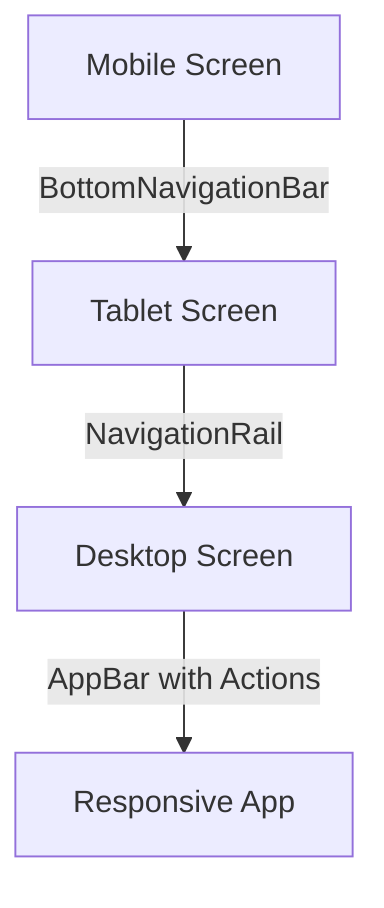

## 4.4.4 Responsive Navigation Bars

In the world of mobile and web applications, navigation is a cornerstone of user experience (UX). A well-designed navigation system not only guides users through your app but also enhances usability and accessibility. As devices come in various shapes and sizes, from small smartphones to large desktop monitors, creating responsive navigation bars becomes essential. This section will guide you through the process of building adaptive navigation bars in Flutter, ensuring your app provides a seamless experience across all devices.

### Importance of Responsive Navigation

Responsive navigation is crucial for several reasons:

- **User Experience:** A consistent and intuitive navigation system helps users find what they need quickly and efficiently, reducing frustration and improving satisfaction.
- **Accessibility:** Responsive navigation ensures that users with different devices and screen sizes can access all parts of your app without difficulty.
- **Aesthetic Appeal:** A navigation bar that adapts to the screen size maintains the visual integrity of your app, providing a polished and professional look.

### Implementing Responsive AppBar

The `AppBar` widget in Flutter is a versatile tool for creating top navigation bars. However, its content needs to adapt based on the screen size to maintain usability and aesthetics.

#### Example: Responsive AppBar

Here's a basic example of how to implement a responsive `AppBar` that adjusts its actions based on the screen width:

```dart
AppBar(
  title: Text('Responsive App'),
  actions: MediaQuery.of(context).size.width > 600
      ? [
          IconButton(icon: Icon(Icons.search), onPressed: () {}),
          IconButton(icon: Icon(Icons.more_vert), onPressed: () {}),
        ]
      : null,
);
```

- **Explanation:** In this example, the `AppBar` displays additional action buttons only when the screen width exceeds 600 pixels. For smaller screens, these actions can be moved to a `Drawer` or a `BottomNavigationBar`.

#### Moving Actions to a Drawer or Bottom Navigation

For smaller screens, it's often beneficial to move less critical actions to a `Drawer` or `BottomNavigationBar` to save space and maintain a clean interface.

```dart
Scaffold(
  appBar: AppBar(
    title: Text('Responsive App'),
  ),
  drawer: Drawer(
    child: ListView(
      children: <Widget>[
        DrawerHeader(
          child: Text('Menu'),
          decoration: BoxDecoration(
            color: Colors.blue,
          ),
        ),
        ListTile(
          title: Text('Item 1'),
          onTap: () {},
        ),
        ListTile(
          title: Text('Item 2'),
          onTap: () {},
        ),
      ],
    ),
  ),
  body: Center(child: Text('Content')),
);
```

- **Explanation:** The `Drawer` widget provides a side navigation menu that can be accessed by swiping from the left edge of the screen or tapping the menu icon in the `AppBar`.

### Using BottomNavigationBar

The `BottomNavigationBar` is a common pattern for mobile navigation, especially on smaller screens. It provides quick access to the main sections of your app.

#### Example: Responsive BottomNavigationBar

```dart
BottomNavigationBar(
  items: const <BottomNavigationBarItem>[
    BottomNavigationBarItem(
      icon: Icon(Icons.home),
      label: 'Home',
    ),
    BottomNavigationBarItem(
      icon: Icon(Icons.business),
      label: 'Business',
    ),
    BottomNavigationBarItem(
      icon: Icon(Icons.school),
      label: 'School',
    ),
  ],
  currentIndex: _selectedIndex,
  selectedItemColor: Colors.amber[800],
  onTap: _onItemTapped,
);
```

- **Explanation:** The `BottomNavigationBar` provides a straightforward way to navigate between different sections of your app. You can adjust the number of items or their style based on the screen size.

### Drawer Navigation

The `Drawer` widget is particularly useful for smaller screens where space is limited. It allows you to hide less frequently used navigation options off-screen, accessible via a swipe or a menu button.

#### Example: Implementing a Drawer

```dart
Drawer(
  child: ListView(
    padding: EdgeInsets.zero,
    children: <Widget>[
      DrawerHeader(
        decoration: BoxDecoration(
          color: Colors.blue,
        ),
        child: Text(
          'Drawer Header',
          style: TextStyle(
            color: Colors.white,
            fontSize: 24,
          ),
        ),
      ),
      ListTile(
        leading: Icon(Icons.message),
        title: Text('Messages'),
        onTap: () {
          // Update the state of the app
          // ...
          // Then close the drawer
          Navigator.pop(context);
        },
      ),
      ListTile(
        leading: Icon(Icons.account_circle),
        title: Text('Profile'),
        onTap: () {
          Navigator.pop(context);
        },
      ),
      ListTile(
        leading: Icon(Icons.settings),
        title: Text('Settings'),
        onTap: () {
          Navigator.pop(context);
        },
      ),
    ],
  ),
);
```

- **Explanation:** The `Drawer` widget can be customized with any content you need, such as navigation links, user profiles, or settings.

### Responsive Navigation Patterns

As your app scales to larger screens, such as tablets and desktops, you might want to consider more advanced navigation patterns like the **Responsive Navigation Rail**.

#### Example: Using NavigationRail

The `NavigationRail` widget is ideal for larger screens, providing a vertical navigation bar that can be placed on the side of the screen.

```dart
NavigationRail(
  selectedIndex: _selectedIndex,
  onDestinationSelected: (int index) {
    setState(() {
      _selectedIndex = index;
    });
  },
  labelType: NavigationRailLabelType.selected,
  destinations: [
    NavigationRailDestination(
      icon: Icon(Icons.favorite_border),
      selectedIcon: Icon(Icons.favorite),
      label: Text('First'),
    ),
    NavigationRailDestination(
      icon: Icon(Icons.bookmark_border),
      selectedIcon: Icon(Icons.book),
      label: Text('Second'),
    ),
    NavigationRailDestination(
      icon: Icon(Icons.star_border),
      selectedIcon: Icon(Icons.star),
      label: Text('Third'),
    ),
  ],
);
```

- **Explanation:** The `NavigationRail` provides a compact and efficient way to navigate on larger screens, offering more space for content.

### Visual Aids

To better understand how these navigation components adapt to different screen sizes, let's visualize them:



- **Explanation:** This diagram illustrates how navigation components can transition from a `BottomNavigationBar` on mobile screens to a `NavigationRail` on tablets and an `AppBar` with additional actions on desktops.

### Best Practices

- **Keep Navigation Simple:** Avoid cluttering the navigation bar with too many options. Prioritize the most important actions and group secondary ones in a `Drawer`.
- **Ensure Accessibility:** Use clear labels and icons, and ensure that navigation elements are reachable and usable for all users, including those with disabilities.
- **Consistent Design:** Maintain a consistent look and feel across different devices to provide a seamless user experience.

### Interactive Exercise

To solidify your understanding, try implementing a responsive navigation system that switches between a `BottomNavigationBar` and a `NavigationRail` based on the screen width. Consider the following steps:

1. **Set Up a New Flutter Project:** Start by creating a new Flutter project and setting up the basic structure.
2. **Implement a Responsive Layout:** Use `MediaQuery` to detect the screen width and switch between navigation components.
3. **Test on Different Devices:** Run your app on various devices and emulators to ensure the navigation adapts correctly.
4. **Experiment with Styles:** Customize the appearance of your navigation components to match your app's theme.

### Conclusion

Responsive navigation bars are a vital component of modern app design, ensuring that users can navigate your app effortlessly, regardless of the device they are using. By leveraging Flutter's powerful widgets like `AppBar`, `BottomNavigationBar`, `Drawer`, and `NavigationRail`, you can create adaptive navigation systems that enhance user experience and accessibility.

## Quiz Time!



### Why is responsive navigation important in app design?

- [x] It enhances user experience by adapting to different screen sizes.
- [ ] It only affects the aesthetic appeal of the app.
- [ ] It is only necessary for mobile applications.
- [ ] It is not important for accessibility.

> **Explanation:** Responsive navigation is crucial because it enhances user experience by adapting to different screen sizes, ensuring accessibility and usability across all devices.

### What widget is commonly used for top navigation bars in Flutter?

- [x] AppBar
- [ ] BottomNavigationBar
- [ ] Drawer
- [ ] NavigationRail

> **Explanation:** The `AppBar` widget is commonly used for top navigation bars in Flutter applications.

### How can you make an AppBar responsive to screen size?

- [x] Use MediaQuery to adjust its content based on screen width.
- [ ] Use a fixed size for all devices.
- [ ] Only use it on large screens.
- [ ] Avoid using actions in the AppBar.

> **Explanation:** You can make an `AppBar` responsive by using `MediaQuery` to adjust its content based on the screen width.

### Which widget is ideal for navigation on smaller screens?

- [ ] NavigationRail
- [x] BottomNavigationBar
- [ ] AppBar
- [ ] FloatingActionButton

> **Explanation:** The `BottomNavigationBar` is ideal for navigation on smaller screens, providing quick access to the main sections of the app.

### What is a common use case for the Drawer widget?

- [x] To hide less frequently used navigation options on smaller screens.
- [ ] To replace the AppBar on large screens.
- [ ] To display advertisements.
- [ ] To serve as the main navigation on all devices.

> **Explanation:** The `Drawer` widget is commonly used to hide less frequently used navigation options on smaller screens.

### Which widget is recommended for navigation on larger screens like tablets and desktops?

- [ ] BottomNavigationBar
- [ ] AppBar
- [x] NavigationRail
- [ ] FloatingActionButton

> **Explanation:** The `NavigationRail` widget is recommended for navigation on larger screens like tablets and desktops.

### What is a best practice for designing navigation systems?

- [x] Keep navigation simple and accessible.
- [ ] Include as many options as possible.
- [ ] Use different styles for each device.
- [ ] Avoid using icons and labels.

> **Explanation:** A best practice for designing navigation systems is to keep them simple and accessible, ensuring ease of use for all users.

### How can you test the responsiveness of your navigation system?

- [x] Run the app on various devices and emulators.
- [ ] Only test on a single device.
- [ ] Use fixed dimensions for all components.
- [ ] Ignore testing and rely on user feedback.

> **Explanation:** To test the responsiveness of your navigation system, run the app on various devices and emulators to ensure it adapts correctly.

### What is the purpose of using MediaQuery in Flutter?

- [x] To obtain information about the screen size and orientation.
- [ ] To style widgets.
- [ ] To manage state.
- [ ] To handle user input.

> **Explanation:** `MediaQuery` is used in Flutter to obtain information about the screen size and orientation, helping to create responsive layouts.

### True or False: The NavigationRail widget is suitable for mobile screens.

- [ ] True
- [x] False

> **Explanation:** The `NavigationRail` widget is not suitable for mobile screens; it is designed for larger screens like tablets and desktops.


