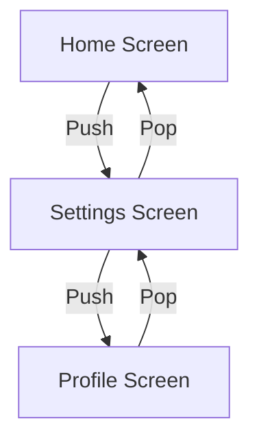

## 5.1.1 Introduction to Navigation in Flutter

In the world of mobile applications, navigation is a cornerstone of user experience. It allows users to move seamlessly between different screens or pages, accessing various functionalities and content. In this section, we will delve into the concept of navigation, particularly focusing on how it is implemented in Flutter using the Navigator widget and the stack data structure.

### Understanding Navigation

**Navigation** in mobile applications refers to the process of moving between different screens or pages. It is a fundamental aspect of app design, as it dictates how users interact with the app and access its features. A well-designed navigation system enhances user experience by making it intuitive and efficient to find and use the app's functionalities.

#### Importance of Navigation

- **User Experience:** Smooth navigation is crucial for creating an intuitive user experience. Users should be able to move between screens effortlessly, without confusion or frustration.
- **Functionality Access:** Navigation allows users to access different parts of the app, such as settings, profiles, or content sections, thereby enhancing the app's usability.
- **Flow Control:** It helps in controlling the flow of the application, guiding users through a logical sequence of screens.

### Navigation in Flutter

Flutter, Google's UI toolkit for building natively compiled applications, handles navigation using a stack-based approach. The **Navigator widget** is central to this process, acting like a stack data structure where screens are pushed onto or popped off the stack.

#### The Navigator Widget

The Navigator widget in Flutter manages a stack of routes, where each route represents a screen or page in the app. This widget allows you to push new routes onto the stack or pop existing ones off, thereby controlling the navigation flow.

- **Routes:** In Flutter, each screen or page is considered a route. A route can be a simple screen or a more complex widget hierarchy.
- **Stack Management:** The Navigator widget manages these routes using a stack, a data structure that follows the Last In, First Out (LIFO) principle.

### The Stack Concept

To understand how navigation works in Flutter, it's essential to grasp the concept of a stack. A stack is a collection of elements with two primary operations: push and pop.

- **Push:** Adds an element to the top of the stack.
- **Pop:** Removes the element from the top of the stack.

Think of a stack as a stack of books. You can only add or remove the top book, just as you can only push or pop the top route in a navigation stack.

#### Visualizing the Stack

To better understand this concept, let's visualize it using a Mermaid.js diagram:



In this diagram:
- The Home Screen is the initial route.
- Pushing the Settings Screen adds it to the top of the stack.
- Pushing the Profile Screen adds it above the Settings Screen.
- Popping the Profile Screen reveals the Settings Screen.
- Popping the Settings Screen returns to the Home Screen.

### Basic Navigation Operations

Flutter's Navigator widget provides straightforward methods for managing navigation:

#### Pushing a Route

To navigate to a new screen, you push a route onto the stack. This operation adds the new screen to the top of the stack, making it the current view.

```dart
// Pushing a new route
Navigator.push(
  context,
  MaterialPageRoute(builder: (context) => SecondScreen()),
);
```

In this example, `SecondScreen` is the new route being pushed onto the stack.

#### Popping a Route

To return to the previous screen, you pop the current route off the stack. This operation removes the top screen, revealing the one beneath it.

```dart
// Popping the current route
Navigator.pop(context);
```

### Real-World Examples

Consider a typical mobile app scenario where you navigate from a home screen to a settings screen. This transition involves pushing the settings screen onto the stack. When you're done adjusting settings, you pop the settings screen to return to the home screen.

### Setting the Stage

This chapter will guide you through both basic and advanced navigation techniques in Flutter. By the end, you'll be equipped to manage navigation in your Flutter apps effectively, ensuring a smooth and intuitive user experience.

### Engagement

As you explore this section, think about how you navigate through the apps you use daily. Consider how important smooth navigation is to your experience and how it influences your perception of the app's quality.

### Conclusion

Navigation is a vital component of mobile app development, and mastering it in Flutter opens up a world of possibilities for creating seamless user experiences. By understanding the stack-based navigation model and utilizing the Navigator widget, you can build apps that are both functional and user-friendly.

---

## Quiz Time!



### What is navigation in mobile applications?

- [x] The process of moving between different screens or pages within an app.
- [ ] The process of designing the user interface.
- [ ] The process of optimizing app performance.
- [ ] The process of managing app data.

> **Explanation:** Navigation refers to the process of moving between different screens or pages within an app, allowing users to access various functionalities and content.

### How does Flutter handle navigation?

- [x] Using a stack and the Navigator widget.
- [ ] Using a queue and the Navigator widget.
- [ ] Using a list and the Navigator widget.
- [ ] Using a tree and the Navigator widget.

> **Explanation:** Flutter handles navigation using a stack and the Navigator widget, where screens are pushed onto or popped off the stack.

### What is a route in Flutter?

- [x] A screen or page in a Flutter app.
- [ ] A function in a Flutter app.
- [ ] A widget in a Flutter app.
- [ ] A data model in a Flutter app.

> **Explanation:** In Flutter, each screen or page is considered a route, which can be a simple screen or a more complex widget hierarchy.

### What does the push operation do in a navigation stack?

- [x] Adds a new screen to the top of the stack.
- [ ] Removes the current screen from the top of the stack.
- [ ] Replaces the current screen with a new one.
- [ ] Clears all screens from the stack.

> **Explanation:** The push operation adds a new screen to the top of the stack, making it the current view.

### What does the pop operation do in a navigation stack?

- [x] Removes the current screen from the top of the stack.
- [ ] Adds a new screen to the top of the stack.
- [ ] Replaces the current screen with a new one.
- [ ] Clears all screens from the stack.

> **Explanation:** The pop operation removes the current screen from the top of the stack, revealing the one beneath it.

### Which of the following is a real-world example of navigation?

- [x] Navigating from a home screen to a settings screen.
- [ ] Designing a new user interface.
- [ ] Optimizing app performance.
- [ ] Managing app data.

> **Explanation:** Navigating from a home screen to a settings screen is a real-world example of navigation, involving pushing and popping routes.

### What is the role of the Navigator widget in Flutter?

- [x] Manages a stack of routes for navigation.
- [ ] Manages app data and state.
- [ ] Manages user interface design.
- [ ] Manages app performance optimization.

> **Explanation:** The Navigator widget in Flutter manages a stack of routes, allowing for navigation between different screens.

### What data structure does the Navigator widget use?

- [x] Stack
- [ ] Queue
- [ ] List
- [ ] Tree

> **Explanation:** The Navigator widget uses a stack data structure, which follows the Last In, First Out (LIFO) principle.

### How does the stack data structure work?

- [x] Last In, First Out (LIFO) principle.
- [ ] First In, First Out (FIFO) principle.
- [ ] Random Access principle.
- [ ] Hierarchical Access principle.

> **Explanation:** The stack data structure works on the Last In, First Out (LIFO) principle, where the last element added is the first to be removed.

### True or False: Each screen in a Flutter app is considered a route.

- [x] True
- [ ] False

> **Explanation:** True. In Flutter, each screen or page is considered a route, which can be managed using the Navigator widget.


