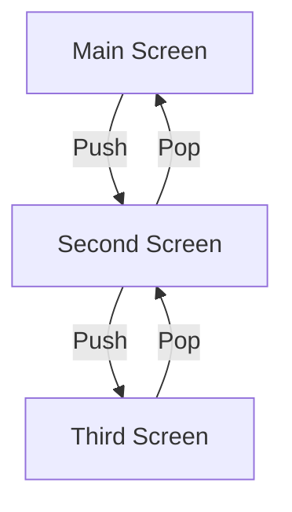

## 5.1.3 Route Management

In the world of mobile app development, navigation is a critical component that determines how users interact with your application. Flutter, with its robust navigation system, provides developers with the flexibility to manage routes efficiently. This section delves into the concept of route management in Flutter, exploring different types of routes, customizing transitions, and best practices to ensure a seamless user experience.

### What is a Route?

In Flutter, a **Route** is an abstraction that represents a screen or page in your application. When you navigate from one screen to another, you are essentially pushing a new route onto the navigation stack. This stack-based approach allows for intuitive navigation, where you can easily move forward to new screens or back to previous ones.

### Types of Routes

Flutter offers several types of routes to cater to different design paradigms and transition needs. Understanding these routes is crucial for implementing effective navigation in your app.

#### MaterialPageRoute

The `MaterialPageRoute` is designed for applications that follow Material Design guidelines. It provides default transition animations that are consistent with Android's native behavior.

- **Usage Example:**

  ```dart
  Navigator.push(
    context,
    MaterialPageRoute(builder: (context) => SecondScreen()),
  );
  ```

- **Characteristics:**
  - Default transition animations include a slide from the right on Android.
  - Ideal for apps targeting Android users or those following Material Design principles.

#### CupertinoPageRoute

The `CupertinoPageRoute` is tailored for iOS-styled applications, offering transition animations that mimic iOS's native behavior.

- **Usage Example:**

  ```dart
  Navigator.push(
    context,
    CupertinoPageRoute(builder: (context) => SecondScreen()),
  );
  ```

- **Characteristics:**
  - Default transition animations include a slide from the right with a parallax effect, typical of iOS.
  - Suitable for apps targeting iOS users or those adopting Cupertino design elements.

#### PageRouteBuilder

For developers seeking more control over transition animations, `PageRouteBuilder` offers the flexibility to define custom transitions.

- **Usage Example:**

  ```dart
  Navigator.push(
    context,
    PageRouteBuilder(
      pageBuilder: (context, animation, secondaryAnimation) => SecondScreen(),
      transitionsBuilder: (context, animation, secondaryAnimation, child) {
        return FadeTransition(opacity: animation, child: child);
      },
    ),
  );
  ```

- **Characteristics:**
  - Allows for custom animations, such as fades, slides, or rotations.
  - Provides a `transitionsBuilder` function to define how the transition should occur.

### Customizing Routes

Customizing routes in Flutter involves using `PageRouteBuilder` to create unique transition animations that enhance the user experience. This flexibility allows developers to implement creative and engaging transitions that align with the app's theme and branding.

- **Creating a Custom Route:**

  To create a custom route, define a `PageRouteBuilder` with a `pageBuilder` and a `transitionsBuilder`. The `pageBuilder` specifies the target screen, while the `transitionsBuilder` defines the animation.

  ```dart
  Navigator.push(
    context,
    PageRouteBuilder(
      pageBuilder: (context, animation, secondaryAnimation) => SecondScreen(),
      transitionsBuilder: (context, animation, secondaryAnimation, child) {
        var begin = Offset(0.0, 1.0);
        var end = Offset.zero;
        var curve = Curves.ease;

        var tween = Tween(begin: begin, end: end).chain(CurveTween(curve: curve));

        var offsetAnimation = animation.drive(tween);

        return SlideTransition(position: offsetAnimation, child: child);
      },
    ),
  );
  ```

- **Explanation:**
  - **Offset:** Defines the starting and ending points of the transition.
  - **Curve:** Determines the animation's pacing, providing a smooth transition.
  - **SlideTransition:** Animates the position of the child widget.

### Handling Route Lifecycle

Understanding the route lifecycle is essential for managing resources efficiently. Routes in Flutter go through a lifecycle that includes creation, building, and disposal.

- **Lifecycle Stages:**
  - **Creation:** When a route is pushed onto the stack, it is created and initialized.
  - **Building:** The route is built and displayed on the screen.
  - **Disposal:** When a route is popped from the stack, it is disposed of, freeing up resources.

- **Best Practices:**
  - Keep routes lightweight by minimizing resource-intensive operations.
  - Dispose of resources, such as controllers or streams, in the `dispose` method to prevent memory leaks.

### Visual Aids

To better understand how routes are managed within the Navigator stack, consider the following diagram:



- **Explanation:**
  - The diagram illustrates a simple navigation flow where the user navigates from the Main Screen to the Second Screen, then to the Third Screen, and back.

### Best Practices

Implementing best practices in route management ensures efficient navigation and a smooth user experience.

- **Keep Routes Lightweight:**
  - Avoid heavy computations or resource loading during route transitions.
  - Use asynchronous operations to load data in the background.

- **Dispose of Resources Properly:**
  - Implement the `dispose` method in stateful widgets to clean up resources.
  - Ensure that any listeners, controllers, or streams are closed to prevent memory leaks.

### Exercise

To solidify your understanding of route management, try implementing a custom route with a unique transition animation. Use `PageRouteBuilder` to create a transition that slides in from the bottom and fades in simultaneously.

- **Challenge:**
  - Create a new screen called `CustomTransitionScreen`.
  - Implement a route that combines a slide and fade transition.
  - Test the transition by navigating to `CustomTransitionScreen` from your main screen.

### Conclusion

Route management in Flutter is a powerful tool that allows developers to create intuitive and engaging navigation experiences. By understanding the different types of routes and how to customize them, you can enhance your app's user interface and ensure a seamless flow between screens. Remember to follow best practices to maintain performance and resource efficiency.

## Quiz Time!



### What is a Route in Flutter?

- [x] An abstraction that represents a screen or page.
- [ ] A function that handles user input.
- [ ] A widget that displays text.
- [ ] A library for managing state.

> **Explanation:** A Route in Flutter is an abstraction that represents a screen or page, allowing for navigation between different parts of an app.

### Which route type is designed for Material Design applications?

- [x] MaterialPageRoute
- [ ] CupertinoPageRoute
- [ ] PageRouteBuilder
- [ ] CustomRoute

> **Explanation:** MaterialPageRoute is designed for Material Design applications, providing default transition animations consistent with Android's native behavior.

### What is the primary use of PageRouteBuilder?

- [x] To allow custom transition animations.
- [ ] To manage state across screens.
- [ ] To handle user input.
- [ ] To display images.

> **Explanation:** PageRouteBuilder is used to allow custom transition animations, offering flexibility in defining how screens transition.

### How can you dispose of resources properly in Flutter?

- [x] Implement the dispose method in stateful widgets.
- [ ] Use the initState method.
- [ ] Call setState frequently.
- [ ] Avoid using controllers.

> **Explanation:** Implementing the dispose method in stateful widgets is crucial for cleaning up resources like controllers and listeners to prevent memory leaks.

### What does the transitionsBuilder function in PageRouteBuilder do?

- [x] Defines how the transition should occur.
- [ ] Initializes the route.
- [ ] Manages state changes.
- [ ] Handles user input.

> **Explanation:** The transitionsBuilder function in PageRouteBuilder defines how the transition should occur, allowing for custom animations.

### Which route type provides default transition animations for iOS?

- [x] CupertinoPageRoute
- [ ] MaterialPageRoute
- [ ] PageRouteBuilder
- [ ] CustomRoute

> **Explanation:** CupertinoPageRoute provides default transition animations for iOS, mimicking iOS's native behavior.

### What is the purpose of the Navigator stack?

- [x] To manage the order of routes and facilitate navigation.
- [ ] To store user data.
- [ ] To render widgets.
- [ ] To handle network requests.

> **Explanation:** The Navigator stack manages the order of routes and facilitates navigation, allowing users to move forward and backward through screens.

### What is a common best practice for route management?

- [x] Keep routes lightweight and dispose of resources properly.
- [ ] Load all data synchronously.
- [ ] Avoid using asynchronous operations.
- [ ] Use only one type of route.

> **Explanation:** Keeping routes lightweight and disposing of resources properly are common best practices to ensure efficient navigation and prevent memory leaks.

### What is the role of the pageBuilder function in PageRouteBuilder?

- [x] Specifies the target screen for the route.
- [ ] Handles user input.
- [ ] Manages state changes.
- [ ] Renders animations.

> **Explanation:** The pageBuilder function in PageRouteBuilder specifies the target screen for the route, determining which screen to display.

### True or False: Customizing routes in Flutter is only possible with PageRouteBuilder.

- [x] False
- [ ] True

> **Explanation:** While PageRouteBuilder offers extensive customization options, other route types like MaterialPageRoute and CupertinoPageRoute can also be customized to some extent.


