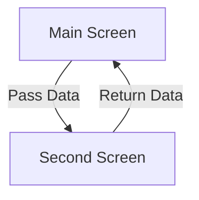

## 5.1.4 Passing Data Between Screens

In Flutter, navigation between screens is a fundamental aspect of app development. As you build more complex applications, the need to pass data between these screens becomes crucial. This section will guide you through various methods of passing data between screens in Flutter, ensuring you can handle both simple and complex data transfers efficiently.

### Passing Data to New Screens

When navigating to a new screen, you often need to pass data to that screen. This can be achieved using several methods, each suitable for different scenarios.

#### Using Constructor Parameters

The most straightforward way to pass data to a new screen is by using constructor parameters. This method involves passing data directly to the new screen's constructor when you navigate to it.

**Example:**

```dart
Navigator.push(
  context,
  MaterialPageRoute(builder: (context) => SecondScreen(data: 'Hello')),
);

// SecondScreen implementation
class SecondScreen extends StatelessWidget {
  final String data;
  SecondScreen({required this.data});

  @override
  Widget build(BuildContext context) {
    return Scaffold(
      appBar: AppBar(title: Text('Second Screen')),
      body: Center(child: Text(data)),
    );
  }
}
```

In this example, the `SecondScreen` receives a string `data` through its constructor. This method is simple and effective for passing small amounts of data.

### Receiving Data from Popped Screens

Sometimes, you need to retrieve data from a screen when it is popped off the navigation stack. This is common in scenarios where a user performs an action on a secondary screen, and the result needs to be communicated back to the primary screen.

**Example:**

```dart
// On the pushed screen
Navigator.pop(context, 'Data to return');

// On the previous screen
final result = await Navigator.push(
  context,
  MaterialPageRoute(builder: (context) => SecondScreen()),
);
print('Received data: $result');
```

Here, the `Navigator.pop` method is used to send data back to the previous screen. The `await` keyword ensures that the primary screen waits for the result before proceeding.

### Using Route Arguments

For more complex data passing, especially when using named routes, `RouteSettings` and `ModalRoute` can be utilized to pass and retrieve arguments.

**Example:**

```dart
// Passing arguments
Navigator.pushNamed(
  context,
  '/second',
  arguments: ScreenArguments('Title', 'Message'),
);

// Retrieving arguments
class SecondScreen extends StatelessWidget {
  @override
  Widget build(BuildContext context) {
    final args = ModalRoute.of(context)!.settings.arguments as ScreenArguments;
    return Scaffold(
      appBar: AppBar(title: Text(args.title)),
      body: Center(child: Text(args.message)),
    );
  }
}

// Define a class to hold the arguments
class ScreenArguments {
  final String title;
  final String message;

  ScreenArguments(this.title, this.message);
}
```

In this approach, a custom class `ScreenArguments` is used to encapsulate the data being passed. This method is particularly useful when dealing with multiple pieces of data or complex data structures.

### Best Practices

- **Use Clearly Defined Models:** When passing complex data, define models or classes to encapsulate the data. This improves code readability and maintainability.
- **Ensure Data Security:** Be mindful of sensitive data being passed between screens. Use secure methods to handle such data.
- **Optimize for Performance:** Avoid passing large amounts of data unnecessarily. Instead, consider fetching data on the destination screen if possible.

### Visual Aid

To better understand the data flow between screens, consider the following diagram:



This diagram illustrates the bidirectional data flow between two screens, highlighting the process of passing and receiving data.

### Exercise

**Create a Simple Data Passing App:**

1. **Objective:** Build an app where a user inputs data on one screen, and it is displayed on another.
2. **Steps:**
   - Create a form on the first screen to collect user input.
   - Pass the input data to a second screen using constructor parameters or route arguments.
   - Display the data on the second screen.
   - Optionally, allow the user to modify the data and return the updated data to the first screen.

**Code Implementation:**

```dart
// FirstScreen with a form
class FirstScreen extends StatelessWidget {
  @override
  Widget build(BuildContext context) {
    final TextEditingController controller = TextEditingController();

    return Scaffold(
      appBar: AppBar(title: Text('First Screen')),
      body: Center(
        child: Column(
          children: [
            TextField(
              controller: controller,
              decoration: InputDecoration(labelText: 'Enter some text'),
            ),
            ElevatedButton(
              onPressed: () {
                Navigator.push(
                  context,
                  MaterialPageRoute(
                    builder: (context) => SecondScreen(data: controller.text),
                  ),
                );
              },
              child: Text('Submit'),
            ),
          ],
        ),
      ),
    );
  }
}

// SecondScreen to display data
class SecondScreen extends StatelessWidget {
  final String data;
  SecondScreen({required this.data});

  @override
  Widget build(BuildContext context) {
    return Scaffold(
      appBar: AppBar(title: Text('Second Screen')),
      body: Center(child: Text('Received: $data')),
    );
  }
}
```

### Conclusion

Passing data between screens in Flutter is a versatile and essential skill for any developer. By understanding and utilizing the various methods available, you can create seamless and efficient navigation experiences in your applications. Remember to follow best practices and consider the security and performance implications of your data passing strategies.

## Quiz Time!



### What is the simplest way to pass data to a new screen in Flutter?

- [x] Using constructor parameters
- [ ] Using a global variable
- [ ] Using a database
- [ ] Using a file

> **Explanation:** Using constructor parameters is the simplest and most direct way to pass data to a new screen in Flutter.

### How can you retrieve data from a screen when it is popped?

- [x] Using `Navigator.pop` with a return value
- [ ] Using a global variable
- [ ] Using a shared preference
- [ ] Using a file

> **Explanation:** `Navigator.pop` can return data to the previous screen, allowing you to retrieve data when a screen is popped.

### Which class is used to encapsulate data when passing arguments using named routes?

- [x] A custom class like `ScreenArguments`
- [ ] `String`
- [ ] `int`
- [ ] `double`

> **Explanation:** A custom class like `ScreenArguments` is used to encapsulate data when passing arguments using named routes.

### What method is used to pass data back to a previous screen?

- [x] `Navigator.pop`
- [ ] `Navigator.push`
- [ ] `Navigator.replace`
- [ ] `Navigator.remove`

> **Explanation:** `Navigator.pop` is used to pass data back to a previous screen.

### What should you consider when passing large amounts of data between screens?

- [x] Performance and security
- [ ] Only performance
- [ ] Only security
- [ ] Neither performance nor security

> **Explanation:** Both performance and security should be considered when passing large amounts of data between screens.

### Which widget is commonly used to navigate to a new screen?

- [x] `Navigator`
- [ ] `Scaffold`
- [ ] `Container`
- [ ] `Text`

> **Explanation:** `Navigator` is the widget used to manage navigation and routing in Flutter.

### What is a benefit of using named routes?

- [x] Easier management of complex navigation
- [ ] Faster performance
- [ ] Less memory usage
- [ ] Simpler code

> **Explanation:** Named routes make it easier to manage complex navigation paths within an application.

### How can you ensure data security when passing data between screens?

- [x] Use secure methods and avoid passing sensitive data unnecessarily
- [ ] Use global variables
- [ ] Use local storage
- [ ] Use print statements

> **Explanation:** Ensuring data security involves using secure methods and avoiding unnecessary passing of sensitive data.

### What is a common pitfall when passing data between screens?

- [x] Passing too much data, leading to performance issues
- [ ] Passing too little data
- [ ] Using too many screens
- [ ] Using too few screens

> **Explanation:** Passing too much data can lead to performance issues, which is a common pitfall.

### True or False: You can only pass data between screens using constructor parameters.

- [ ] True
- [x] False

> **Explanation:** False. You can pass data using constructor parameters, route arguments, and other methods.


