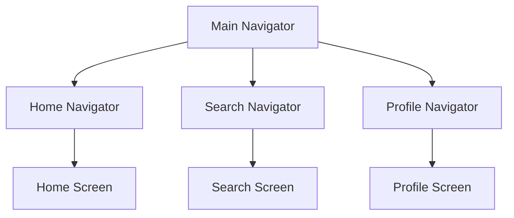

## 5.3.1 Nested Navigation

Navigating through a mobile application is a fundamental aspect of user experience design. As applications grow in complexity, so does the need for sophisticated navigation structures. Nested navigation is a powerful technique in Flutter that allows developers to manage multiple navigation stacks within a single application, providing a seamless and intuitive user experience. This section will delve into the concept of nested navigation, its implementation, and best practices to ensure a smooth user journey.

### Understanding the Need for Nested Navigation

Nested navigation becomes essential in applications where multiple independent navigation flows are required. Common scenarios include:

- **Tab Bars:** Each tab in a tab bar might represent a different section of the app, each with its own navigation stack. For example, a social media app might have tabs for Home, Search, Notifications, and Profile, each with its own set of screens.
- **Side Menus:** Similar to tab bars, side menus can lead to different sections of an app, each requiring its own navigation history.
- **Complex Workflows:** Applications with complex workflows, such as e-commerce apps with separate flows for browsing, cart management, and user profiles, benefit from nested navigation to keep these flows distinct and manageable.

By using nested navigation, developers can ensure that each section of the app maintains its own navigation history, allowing users to navigate back and forth within a section without affecting the navigation state of other sections.

### Implementing Nested Navigators

To implement nested navigation in Flutter, you can use multiple `Navigator` widgets, each managing its own stack of routes. This approach is particularly useful in applications with tabbed interfaces, where each tab needs its own navigation stack.

#### Example Implementation

Consider an app with a bottom navigation bar, where each tab has its own navigation stack. Here's how you can set up nested navigators:

```dart
import 'package:flutter/material.dart';

void main() => runApp(MyApp());

class MyApp extends StatelessWidget {
  @override
  Widget build(BuildContext context) {
    return MaterialApp(
      home: MainScreen(),
    );
  }
}

class MainScreen extends StatefulWidget {
  @override
  _MainScreenState createState() => _MainScreenState();
}

class _MainScreenState extends State<MainScreen> {
  int _currentIndex = 0;
  final List<GlobalKey<NavigatorState>> _navigatorKeys = [
    GlobalKey<NavigatorState>(),
    GlobalKey<NavigatorState>(),
    GlobalKey<NavigatorState>(),
  ];

  void _onTap(int index) {
    setState(() {
      _currentIndex = index;
    });
  }

  @override
  Widget build(BuildContext context) {
    return Scaffold(
      body: IndexedStack(
        index: _currentIndex,
        children: [
          Navigator(
            key: _navigatorKeys[0],
            onGenerateRoute: (routeSettings) {
              return MaterialPageRoute(builder: (context) => HomeScreen());
            },
          ),
          Navigator(
            key: _navigatorKeys[1],
            onGenerateRoute: (routeSettings) {
              return MaterialPageRoute(builder: (context) => SearchScreen());
            },
          ),
          Navigator(
            key: _navigatorKeys[2],
            onGenerateRoute: (routeSettings) {
              return MaterialPageRoute(builder: (context) => ProfileScreen());
            },
          ),
        ],
      ),
      bottomNavigationBar: BottomNavigationBar(
        currentIndex: _currentIndex,
        onTap: _onTap,
        items: [
          BottomNavigationBarItem(icon: Icon(Icons.home), label: 'Home'),
          BottomNavigationBarItem(icon: Icon(Icons.search), label: 'Search'),
          BottomNavigationBarItem(icon: Icon(Icons.person), label: 'Profile'),
        ],
      ),
    );
  }
}

class HomeScreen extends StatelessWidget {
  @override
  Widget build(BuildContext context) {
    return Scaffold(
      appBar: AppBar(title: Text('Home')),
      body: Center(child: Text('Home Screen')),
    );
  }
}

class SearchScreen extends StatelessWidget {
  @override
  Widget build(BuildContext context) {
    return Scaffold(
      appBar: AppBar(title: Text('Search')),
      body: Center(child: Text('Search Screen')),
    );
  }
}

class ProfileScreen extends StatelessWidget {
  @override
  Widget build(BuildContext context) {
    return Scaffold(
      appBar: AppBar(title: Text('Profile')),
      body: Center(child: Text('Profile Screen')),
    );
  }
}
```

In this example, each tab in the bottom navigation bar has its own `Navigator` widget, allowing for independent navigation stacks. The `IndexedStack` widget is used to maintain the state of each tab's navigation stack, ensuring that switching between tabs does not reset their navigation history.

### Managing State and Back Navigation

Handling back navigation in nested navigators can be challenging, especially when dealing with the Android back button. To manage this, you can use the `WillPopScope` widget to intercept back button presses and determine the appropriate action.

#### Example: Handling Back Navigation

```dart
@override
Widget build(BuildContext context) {
  return WillPopScope(
    onWillPop: () async {
      final isFirstRouteInCurrentTab =
          !await _navigatorKeys[_currentIndex].currentState.maybePop();
      if (isFirstRouteInCurrentTab) {
        if (_currentIndex != 0) {
          _onTap(0); // Switch to first tab if not already there
          return false;
        }
      }
      return isFirstRouteInCurrentTab;
    },
    child: Scaffold(
      // ... rest of the scaffold
    ),
  );
}
```

In this setup, the `WillPopScope` widget checks if the current tab's navigator can pop a route. If it can't, and the current tab is not the first one, it switches to the first tab instead of exiting the app.

### Visual Aid

To better understand how nested navigators work, consider the following diagram:



This diagram illustrates the structure of the nested navigators, where the main navigator manages the overall navigation, and each tab has its own navigator managing its respective screens.

### Best Practices

- **Intuitive Navigation:** Ensure that the navigation flow is intuitive for users. Avoid deep nesting of navigators unless necessary, as it can complicate the user experience.
- **State Management:** Each nested navigator should maintain its own state. Use `IndexedStack` to preserve the state of each tab's navigation stack.
- **Consistent Back Navigation:** Implement consistent back navigation behavior using `WillPopScope` to handle back button presses appropriately.

### Exercise

To solidify your understanding of nested navigation, try creating a tabbed app where each tab has its own navigation stack. Implement back navigation handling using `WillPopScope` and ensure that each tab maintains its state independently.

### Conclusion

Nested navigation is a powerful tool in Flutter that allows developers to create complex, multi-layered navigation flows. By understanding and implementing nested navigators, you can enhance the user experience in your applications, making navigation intuitive and seamless. Remember to follow best practices to maintain a clean and manageable navigation structure.

### Additional Resources

- [Flutter Documentation on Navigation](https://flutter.dev/docs/development/ui/navigation)
- [Flutter Cookbook: Managing State](https://flutter.dev/docs/cookbook/state)
- [Dart & Flutter: The Complete Developer's Guide](https://www.udemy.com/course/dart-and-flutter-the-complete-developers-guide/)

## Quiz Time!



### What is a common use case for nested navigation in Flutter?

- [x] Applications with tab bars
- [ ] Single-page applications
- [ ] Applications with only one screen
- [ ] Command-line applications

> **Explanation:** Nested navigation is commonly used in applications with tab bars, where each tab requires its own navigation stack.

### Which widget is used to maintain the state of each tab's navigation stack?

- [x] IndexedStack
- [ ] Column
- [ ] Row
- [ ] ListView

> **Explanation:** The `IndexedStack` widget is used to maintain the state of each tab's navigation stack, ensuring that switching between tabs does not reset their navigation history.

### How can you handle back navigation in nested navigators?

- [x] Using WillPopScope
- [ ] Using a simple Navigator.pop()
- [ ] Using a ListView
- [ ] Using a Column

> **Explanation:** The `WillPopScope` widget is used to intercept back button presses and manage back navigation in nested navigators.

### What is the purpose of using multiple Navigator widgets in a Flutter app?

- [x] To manage multiple independent navigation stacks
- [ ] To create a single-page application
- [ ] To reduce app size
- [ ] To improve network performance

> **Explanation:** Multiple `Navigator` widgets are used to manage multiple independent navigation stacks, allowing for complex navigation flows within an app.

### Which of the following is NOT a benefit of nested navigation?

- [ ] Independent navigation stacks
- [ ] Intuitive user experience
- [x] Reduced code complexity
- [ ] Better state management

> **Explanation:** While nested navigation provides independent navigation stacks and an intuitive user experience, it can increase code complexity rather than reduce it.

### What should you use to ensure consistent back navigation behavior?

- [x] WillPopScope
- [ ] IndexedStack
- [ ] ListView
- [ ] Column

> **Explanation:** `WillPopScope` is used to ensure consistent back navigation behavior by intercepting back button presses.

### What is a potential challenge when implementing nested navigation?

- [x] Managing state across multiple navigators
- [ ] Creating a single-page application
- [ ] Reducing app size
- [ ] Improving network performance

> **Explanation:** Managing state across multiple navigators can be challenging when implementing nested navigation.

### How can you switch tabs in a tabbed app with nested navigation?

- [x] By updating the current index in the BottomNavigationBar
- [ ] By using a ListView
- [ ] By using a Column
- [ ] By using a Row

> **Explanation:** You can switch tabs in a tabbed app with nested navigation by updating the current index in the `BottomNavigationBar`.

### Which widget is used to intercept back button presses in Flutter?

- [x] WillPopScope
- [ ] IndexedStack
- [ ] ListView
- [ ] Column

> **Explanation:** The `WillPopScope` widget is used to intercept back button presses in Flutter.

### True or False: Nested navigation can be used to manage a single navigation stack in an app.

- [ ] True
- [x] False

> **Explanation:** False. Nested navigation is used to manage multiple independent navigation stacks, not a single navigation stack.


