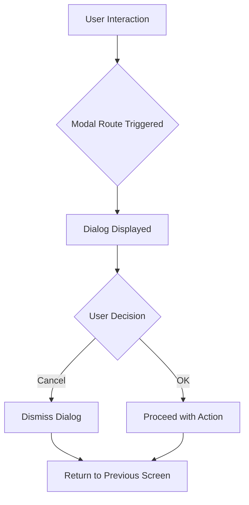

## 5.3.2 Modal Routes and Dialogs

In the world of mobile app development, user interaction is paramount. Modal routes and dialogs are essential tools in Flutter that allow developers to create interactive and engaging user experiences. This section delves into the concept of modal routes, how to implement dialogs and bottom sheets, and best practices for their use.

### Understanding Modal Routes

Modal routes are a type of route in Flutter that temporarily block interaction with the previous routes until they are dismissed. They are often used for tasks that require user attention, such as confirmations, alerts, or input forms. Modal routes can be visualized as layers that overlay the current screen, demanding user interaction before proceeding.

#### Key Characteristics of Modal Routes

- **Blocking Nature:** Modal routes prevent interaction with the underlying content, ensuring that the user addresses the modal before returning to the previous screen.
- **Focus on User Action:** They are ideal for scenarios where user input or acknowledgment is necessary.
- **Versatility:** Modal routes can be used for various purposes, including dialogs, bottom sheets, and custom overlays.

### Displaying Dialogs

Dialogs are a common use case for modal routes. They are small windows that prompt the user to make a decision or enter additional information. In Flutter, dialogs are typically displayed using the `showDialog` function.

#### Example: Alert Dialog

The following example demonstrates how to display a simple alert dialog using `showDialog`:

```dart
showDialog(
  context: context,
  builder: (BuildContext context) {
    return AlertDialog(
      title: Text('Alert'),
      content: Text('Do you want to proceed?'),
      actions: [
        TextButton(
          onPressed: () => Navigator.of(context).pop(false),
          child: Text('Cancel'),
        ),
        TextButton(
          onPressed: () => Navigator.of(context).pop(true),
          child: Text('OK'),
        ),
      ],
    );
  },
);
```

**Explanation:**

- **Context:** The `context` parameter is crucial as it provides the location in the widget tree where the dialog should be displayed.
- **Builder:** The `builder` function returns the dialog widget, allowing for customization of the dialog's appearance and behavior.
- **Actions:** Dialogs often include actions such as buttons that allow the user to respond. In this example, the dialog has "Cancel" and "OK" buttons, each of which pops the dialog off the stack with a return value.

### Implementing Bottom Sheets

Bottom sheets are another form of modal interaction, typically used to present additional options or information without navigating away from the current screen. Flutter provides the `showModalBottomSheet` function to display modal bottom sheets.

#### Example: Modal Bottom Sheet

```dart
showModalBottomSheet(
  context: context,
  builder: (context) {
    return Container(
      height: 200,
      child: Center(child: Text('Modal Bottom Sheet')),
    );
  },
);
```

**Explanation:**

- **Height:** The height of the bottom sheet can be adjusted to fit the content. In this example, it is set to 200 pixels.
- **Content:** The `builder` function returns a widget that represents the content of the bottom sheet. Here, it simply displays a centered text.

### Custom Modal Routes

While Flutter provides built-in support for dialogs and bottom sheets, there are times when you may need to create custom modal routes for unique behaviors or animations. Custom modal routes allow for greater flexibility and control over the presentation and dismissal of modal content.

#### Creating a Custom Modal Route

To create a custom modal route, you can extend the `ModalRoute` class and override its methods to define the desired behavior.

```dart
class CustomModalRoute extends ModalRoute<void> {
  @override
  Duration get transitionDuration => Duration(milliseconds: 300);

  @override
  bool get opaque => false;

  @override
  bool get barrierDismissible => true;

  @override
  Color get barrierColor => Colors.black.withOpacity(0.5);

  @override
  Widget buildPage(
      BuildContext context,
      Animation<double> animation,
      Animation<double> secondaryAnimation,
      ) {
    return Center(
      child: Material(
        type: MaterialType.transparency,
        child: Container(
          padding: EdgeInsets.all(20),
          color: Colors.white,
          child: Text('Custom Modal Route'),
        ),
      ),
    );
  }
}
```

**Explanation:**

- **Transition Duration:** Specifies how long the transition animation should last.
- **Opaque:** Determines whether the modal route should block interaction with the underlying content.
- **Barrier Dismissible:** Indicates whether tapping outside the modal should dismiss it.
- **Barrier Color:** Sets the color of the overlay that appears behind the modal.
- **Build Page:** Defines the content of the modal route.

### Visual Aid

To better understand modal routes and dialogs, consider the following diagram illustrating the interaction flow:



### Best Practices

- **Clarity:** Ensure that modal interactions are clear and provide a straightforward path for the user to follow.
- **Avoid Overuse:** Overusing modal routes can disrupt the user experience. Use them sparingly and only when necessary.
- **Accessibility:** Ensure that modal content is accessible to all users, including those using assistive technologies.
- **Responsive Design:** Design modal content to be responsive and adaptable to different screen sizes and orientations.

### Exercise

As a practical exercise, try creating a confirmation dialog that returns a value based on user input. This will help reinforce your understanding of modal routes and dialogs.

**Exercise Instructions:**

1. Create a new Flutter project.
2. Implement a button that, when pressed, displays a confirmation dialog.
3. The dialog should ask the user to confirm or cancel an action.
4. Based on the user's choice, display a message indicating the result.

### Conclusion

Modal routes and dialogs are powerful tools in Flutter that enhance user interaction by providing focused and interactive experiences. By understanding how to implement and customize these elements, you can create more engaging and user-friendly applications. Remember to follow best practices and consider the user experience when incorporating modal routes into your projects.

For further exploration, consider reviewing the official Flutter documentation on [dialogs](https://flutter.dev/docs/cookbook/design/dialogs) and [bottom sheets](https://flutter.dev/docs/cookbook/design/snackbars). Additionally, explore open-source projects on GitHub to see how other developers implement modal routes in their applications.

## Quiz Time!



### What is a modal route in Flutter?

- [x] A route that blocks interaction with previous routes until dismissed.
- [ ] A route that allows interaction with previous routes.
- [ ] A route that automatically saves user data.
- [ ] A route that is used only for navigation.

> **Explanation:** Modal routes are designed to block interaction with previous routes until they are dismissed, ensuring user focus on the modal content.

### Which function is used to display an alert dialog in Flutter?

- [x] showDialog
- [ ] showAlert
- [ ] displayDialog
- [ ] alertDialog

> **Explanation:** The `showDialog` function is used to display alert dialogs in Flutter.

### What is the purpose of the `builder` parameter in `showDialog`?

- [x] To define the dialog's appearance and behavior.
- [ ] To set the dialog's transition duration.
- [ ] To specify the dialog's position on the screen.
- [ ] To determine if the dialog is dismissible.

> **Explanation:** The `builder` parameter is used to define the appearance and behavior of the dialog by returning a widget.

### How can you make a bottom sheet modal in Flutter?

- [x] Use the `showModalBottomSheet` function.
- [ ] Use the `showBottomSheet` function.
- [ ] Use the `displayBottomSheet` function.
- [ ] Use the `modalBottomSheet` function.

> **Explanation:** The `showModalBottomSheet` function is used to display modal bottom sheets in Flutter.

### What does the `barrierDismissible` property do in a custom modal route?

- [x] Determines if tapping outside the modal dismisses it.
- [ ] Sets the modal's transition duration.
- [ ] Defines the modal's background color.
- [ ] Specifies the modal's animation type.

> **Explanation:** The `barrierDismissible` property determines if the modal can be dismissed by tapping outside of it.

### Which widget is typically used to create the content of a dialog?

- [x] AlertDialog
- [ ] DialogContent
- [ ] DialogBox
- [ ] ContentDialog

> **Explanation:** The `AlertDialog` widget is commonly used to create the content of a dialog in Flutter.

### What is a key consideration when using modal routes?

- [x] Avoid overuse to prevent disrupting user flow.
- [ ] Always use them for navigation.
- [ ] Ensure they cover the entire screen.
- [ ] Use them only for error messages.

> **Explanation:** Modal routes should be used sparingly to avoid disrupting the user flow and should be reserved for important interactions.

### How can you customize the transition of a custom modal route?

- [x] Override the `buildPage` method in a custom `ModalRoute`.
- [ ] Use the `transitionBuilder` parameter in `showDialog`.
- [ ] Set the `transitionType` property in `showModalBottomSheet`.
- [ ] Modify the `transitionDuration` in `showDialog`.

> **Explanation:** To customize the transition of a custom modal route, you can override the `buildPage` method in a custom `ModalRoute`.

### What should you consider for accessibility when using modal dialogs?

- [x] Ensure modal content is accessible to all users.
- [ ] Use only text content in modals.
- [ ] Avoid using buttons in modals.
- [ ] Ensure modals are always full-screen.

> **Explanation:** It's important to ensure that modal content is accessible to all users, including those using assistive technologies.

### True or False: Modal routes can be used to create both dialogs and bottom sheets.

- [x] True
- [ ] False

> **Explanation:** Modal routes can indeed be used to create both dialogs and bottom sheets, as they both involve overlaying content that requires user interaction.


