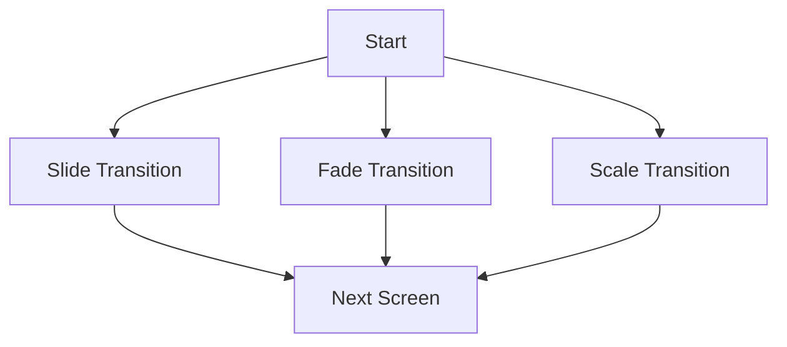

## 5.3.3 Custom Transitions

In the world of mobile app development, user experience is paramount. One of the subtle yet powerful ways to enhance this experience is through the use of custom transitions. These transitions can make your app feel more fluid and responsive, providing a polished look that can set it apart from others. In this section, we'll delve into the art of creating custom transitions in Flutter using the `PageRouteBuilder`.

### Enhancing User Experience with Custom Transitions

Smooth transitions between screens can significantly enhance the user experience by providing visual continuity and feedback. They help users understand the flow of the application and make interactions feel more natural. Custom transitions can be used to:

- **Guide User Attention:** Direct focus to important elements as they appear or disappear.
- **Provide Feedback:** Indicate the result of user actions, such as navigating to a new screen.
- **Enhance Aesthetics:** Add a layer of polish and professionalism to your app.

### Using PageRouteBuilder

Flutter provides a flexible way to define custom transitions through the `PageRouteBuilder`. This class allows you to specify the transition animation between two screens. Let's explore how to implement a custom slide transition using `PageRouteBuilder`.

#### Example: Implementing a Slide Transition

Here's a simple example of how to create a slide transition when navigating to a new screen:

```dart
Navigator.push(
  context,
  PageRouteBuilder(
    pageBuilder: (context, animation, secondaryAnimation) => NextScreen(),
    transitionsBuilder: (context, animation, secondaryAnimation, child) {
      var curve = Curves.easeInOut;
      var tween = Tween(begin: Offset(0.0, 1.0), end: Offset.zero).chain(CurveTween(curve: curve));
      return SlideTransition(
        position: animation.drive(tween),
        child: child,
      );
    },
  ),
);
```

In this example:

- **`pageBuilder`:** Defines the widget to display as the new screen.
- **`transitionsBuilder`:** Defines the animation to apply during the transition.

### Understanding Animation Components

To create effective custom transitions, it's essential to understand the components involved:

- **Animation Object:** Represents the animation's state, providing values over time.
- **Tween:** Defines the start and end points of the animation. It interpolates between these values as the animation progresses.
- **Curves:** Modify the progression of the animation, allowing for effects like easing in and out. Curves can make animations feel more natural and less linear.

#### Animation Object

The `Animation` object is central to Flutter's animation framework. It provides a value that changes over time, which can be used to animate properties of widgets.

#### Tween

A `Tween` is used to define the range of values for an animation. For example, a `Tween<Offset>` can be used to animate the position of a widget from one point to another.

#### Curves

Curves are used to adjust the rate of change of an animation. They can make animations start slowly and accelerate, or start quickly and decelerate. Flutter provides a variety of built-in curves, such as `Curves.easeInOut`, `Curves.bounceIn`, and `Curves.elasticOut`.

### Practicing with Different Transitions

Experimenting with different types of transitions can help you find the right effect for your app. Here are a few common transition types you can try:

- **Fade Transition:** Gradually changes the opacity of the screen.
- **Scale Transition:** Changes the size of the screen, creating a zoom effect.
- **Rotate Transition:** Rotates the screen during the transition.

#### Example: Fade Transition

```dart
Navigator.push(
  context,
  PageRouteBuilder(
    pageBuilder: (context, animation, secondaryAnimation) => NextScreen(),
    transitionsBuilder: (context, animation, secondaryAnimation, child) {
      return FadeTransition(
        opacity: animation,
        child: child,
      );
    },
  ),
);
```

#### Example: Scale Transition

```dart
Navigator.push(
  context,
  PageRouteBuilder(
    pageBuilder: (context, animation, secondaryAnimation) => NextScreen(),
    transitionsBuilder: (context, animation, secondaryAnimation, child) {
      var curve = Curves.easeInOut;
      var tween = Tween(begin: 0.0, end: 1.0).chain(CurveTween(curve: curve));
      return ScaleTransition(
        scale: animation.drive(tween),
        child: child,
      );
    },
  ),
);
```

### Visual Aid

To better understand how these transitions work, consider visual aids such as animated examples or GIFs. These can illustrate how different transitions affect the user experience and provide inspiration for your own implementations.



### Best Practices

When implementing custom transitions, keep the following best practices in mind:

- **Consistency:** Use consistent transition styles throughout your app to maintain a cohesive user experience.
- **Simplicity:** Avoid using too many different types of transitions, which can confuse users.
- **Performance:** Ensure that transitions are smooth and do not cause performance issues, especially on lower-end devices.

### Exercise: Implement a Scale Transition

As an exercise, try implementing a scale transition for navigating between screens. Use the `PageRouteBuilder` to create a transition that scales the new screen from a smaller size to its full size.

### Conclusion

Custom transitions are a powerful tool for enhancing the user experience in your Flutter applications. By understanding the components involved and experimenting with different types of transitions, you can create a polished and engaging app. Remember to keep transitions consistent and simple, and always consider the performance implications.

### Additional Resources

- [Flutter Documentation on Animations](https://flutter.dev/docs/development/ui/animations)
- [Flutter Cookbook: Animate a page route transition](https://flutter.dev/docs/cookbook/animation/page-route-animation)
- [Understanding Flutter's Animation System](https://medium.com/flutter/understanding-flutters-animation-system-5e0e7e2b1f4f)

## Quiz Time!



### What is the primary purpose of using custom transitions in a Flutter app?

- [x] To enhance user experience by providing visual continuity and feedback.
- [ ] To increase the app's loading speed.
- [ ] To reduce the app's memory usage.
- [ ] To simplify the app's codebase.

> **Explanation:** Custom transitions enhance user experience by providing visual continuity and feedback, making interactions feel more natural.

### Which class in Flutter is used to define custom transitions between screens?

- [ ] Navigator
- [x] PageRouteBuilder
- [ ] TransitionBuilder
- [ ] AnimationController

> **Explanation:** `PageRouteBuilder` is used to define custom transitions between screens in Flutter.

### What does the Tween class in Flutter do?

- [x] It defines the start and end points of an animation.
- [ ] It controls the duration of an animation.
- [ ] It manages the state of a widget.
- [ ] It handles user input events.

> **Explanation:** The `Tween` class defines the start and end points of an animation, interpolating between these values.

### Which of the following is NOT a built-in curve provided by Flutter?

- [ ] Curves.easeInOut
- [ ] Curves.bounceIn
- [ ] Curves.elasticOut
- [x] Curves.linearBounce

> **Explanation:** `Curves.linearBounce` is not a built-in curve provided by Flutter.

### What is the role of the Animation object in Flutter?

- [x] It represents the animation's state and provides values over time.
- [ ] It defines the start and end points of an animation.
- [ ] It modifies the progression of an animation.
- [ ] It manages the lifecycle of a widget.

> **Explanation:** The `Animation` object represents the animation's state and provides values over time.

### Which transition type would you use to create a zoom effect?

- [ ] FadeTransition
- [x] ScaleTransition
- [ ] SlideTransition
- [ ] RotateTransition

> **Explanation:** `ScaleTransition` is used to create a zoom effect by changing the size of the screen.

### What is a best practice when implementing custom transitions in Flutter?

- [x] Use consistent transition styles throughout the app.
- [ ] Use as many different transition types as possible.
- [ ] Avoid using curves in animations.
- [ ] Implement transitions only for the main screen.

> **Explanation:** Using consistent transition styles throughout the app helps maintain a cohesive user experience.

### How can you modify the rate of change of an animation in Flutter?

- [ ] By using the Animation object
- [x] By using curves
- [ ] By using the Tween class
- [ ] By using the Navigator class

> **Explanation:** Curves are used to modify the rate of change of an animation, making it feel more natural.

### What is the purpose of the transitionsBuilder parameter in PageRouteBuilder?

- [x] To define the animation to apply during the transition.
- [ ] To specify the widget to display as the new screen.
- [ ] To manage the state of the animation.
- [ ] To handle user input during the transition.

> **Explanation:** The `transitionsBuilder` parameter defines the animation to apply during the transition.

### True or False: Custom transitions can help guide user attention and provide feedback.

- [x] True
- [ ] False

> **Explanation:** True. Custom transitions can help guide user attention and provide feedback, enhancing the overall user experience.


