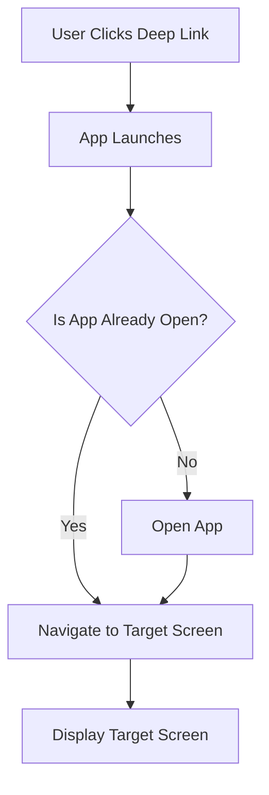

## 5.3.4 Deep Linking

In the world of mobile applications, providing a seamless user experience is paramount. One powerful tool in achieving this is deep linking. Deep linking allows users to navigate directly to a specific screen within your app using a URL, enhancing user engagement and facilitating a smoother navigation experience. This section will guide you through understanding, implementing, and testing deep links in Flutter applications, using practical examples and best practices.

### Understanding Deep Linking

Deep linking is a mechanism that allows users to open a specific page or screen within a mobile application directly from a URL. This is particularly useful for marketing campaigns, notifications, or any scenario where you want to direct users to a particular part of your app without requiring them to navigate through the app manually.

#### Key Benefits of Deep Linking:
- **Enhanced User Experience:** Users can access specific content directly, reducing the number of steps needed to reach their desired destination.
- **Improved Engagement:** By directing users to relevant content, deep linking can increase user engagement and retention.
- **Seamless Integration:** Deep links can be integrated with marketing campaigns, social media, and other platforms to drive traffic to your app.

### Implementing Deep Links

To implement deep linking in a Flutter application, we will use the `uni_links` package. This package provides a unified API for handling deep links on both Android and iOS platforms.

#### Step-by-Step Implementation:

1. **Add Dependency:**
   Add the `uni_links` package to your `pubspec.yaml` file:
   ```yaml
   dependencies:
     flutter:
       sdk: flutter
     uni_links: ^0.5.1
   ```

2. **Platform-Specific Setup:**
   - **Android:**
     Modify the `AndroidManifest.xml` file to handle incoming links. Add an `<intent-filter>` to specify the URL scheme your app will respond to:
     ```xml
     <activity
         android:name=".MainActivity"
         android:launchMode="singleTask">
         <intent-filter>
             <action android:name="android.intent.action.VIEW"/>
             <category android:name="android.intent.category.DEFAULT"/>
             <category android:name="android.intent.category.BROWSABLE"/>
             <data android:scheme="yourapp" android:host="example.com"/>
         </intent-filter>
     </activity>
     ```

   - **iOS:**
     Update the `Info.plist` file to define the URL scheme:
     ```xml
     <key>CFBundleURLTypes</key>
     <array>
       <dict>
         <key>CFBundleURLSchemes</key>
         <array>
           <string>yourapp</string>
         </array>
       </dict>
     </array>
     ```

3. **Handling Incoming Links:**
   Implement logic in your Flutter app to handle incoming links. This involves setting up listeners to detect when the app is opened via a link and navigating to the appropriate screen.

   **Example Code:**
   ```dart
   import 'package:flutter/material.dart';
   import 'package:uni_links/uni_links.dart';
   import 'dart:async';

   class MyApp extends StatefulWidget {
     @override
     _MyAppState createState() => _MyAppState();
   }

   class _MyAppState extends State<MyApp> {
     StreamSubscription<String?>? _linkSubscription;

     @override
     void initState() {
       super.initState();
       _initUniLinks();
     }

     Future<void> _initUniLinks() async {
       try {
         final initialLink = await getInitialLink();
         if (initialLink != null) {
           _navigateToScreen(initialLink);
         }
       } catch (e) {
         print('Failed to get initial link: $e');
       }

       _linkSubscription = linkStream.listen((String? link) {
         if (link != null) {
           _navigateToScreen(link);
         }
       }, onError: (err) {
         print('Failed to listen to link stream: $err');
       });
     }

     void _navigateToScreen(String link) {
       // Parse the link and navigate to the appropriate screen
       if (link.contains('example.com/screen1')) {
         Navigator.pushNamed(context, '/screen1');
       } else if (link.contains('example.com/screen2')) {
         Navigator.pushNamed(context, '/screen2');
       }
     }

     @override
     void dispose() {
       _linkSubscription?.cancel();
       super.dispose();
     }

     @override
     Widget build(BuildContext context) {
       return MaterialApp(
         initialRoute: '/',
         routes: {
           '/': (context) => HomeScreen(),
           '/screen1': (context) => Screen1(),
           '/screen2': (context) => Screen2(),
         },
       );
     }
   }
   ```

### Testing Deep Links

Testing deep links is crucial to ensure they work as expected across different platforms. Here are some methods to test deep links:

- **Android:**
  Use the Android Debug Bridge (adb) to simulate opening a deep link:
  ```bash
  adb shell am start -W -a android.intent.action.VIEW -d "yourapp://example.com/screen1" com.yourcompany.yourapp
  ```

- **iOS:**
  Use Xcode to test deep links by simulating a URL scheme in the simulator or on a physical device.

### Visual Aid

Below is a diagram illustrating how a deep link navigates through the app to the target screen:



### Best Practices

- **Security:** Ensure that deep links are handled securely to prevent unauthorized access or data leaks. Validate and sanitize all incoming URLs.
- **User Feedback:** Provide meaningful feedback to users if the content they are trying to access is not available. This could be a custom error page or a fallback screen.
- **Testing:** Regularly test deep links across different devices and scenarios to ensure reliability.

### Exercise

To solidify your understanding of deep linking, try setting up a basic deep link in your Flutter app that navigates to a specific screen. Use the `uni_links` package and follow the steps outlined above. Experiment with different URL schemes and test the links on both Android and iOS platforms.

### Conclusion

Deep linking is a powerful feature that enhances user experience by allowing direct navigation to specific content within your app. By implementing deep links using the `uni_links` package, you can create a more engaging and seamless experience for your users. Remember to follow best practices for security and user feedback, and test your deep links thoroughly.

## Quiz Time!



### What is the primary purpose of deep linking in mobile applications?

- [x] To navigate users directly to a specific screen within the app using a URL
- [ ] To improve app performance
- [ ] To enhance app security
- [ ] To increase app download speed

> **Explanation:** Deep linking allows users to navigate directly to a specific screen within the app using a URL, enhancing user experience and engagement.

### Which package is commonly used in Flutter for handling deep links?

- [x] uni_links
- [ ] url_launcher
- [ ] path_provider
- [ ] shared_preferences

> **Explanation:** The `uni_links` package is commonly used in Flutter for handling deep links, providing a unified API for both Android and iOS.

### What file needs to be modified on Android to handle deep links?

- [x] AndroidManifest.xml
- [ ] build.gradle
- [ ] settings.gradle
- [ ] MainActivity.kt

> **Explanation:** The `AndroidManifest.xml` file needs to be modified to handle deep links by adding an `<intent-filter>`.

### In iOS, which file is updated to define the URL scheme for deep linking?

- [x] Info.plist
- [ ] AppDelegate.swift
- [ ] Main.storyboard
- [ ] ViewController.swift

> **Explanation:** The `Info.plist` file is updated to define the URL scheme for deep linking in iOS applications.

### What method is used to get the initial link when the app is opened via a deep link?

- [x] getInitialLink()
- [ ] getLink()
- [ ] fetchInitialLink()
- [ ] retrieveLink()

> **Explanation:** The `getInitialLink()` method is used to get the initial link when the app is opened via a deep link.

### How can you test deep links on an Android device?

- [x] Using adb commands
- [ ] Using the Android Emulator only
- [ ] By restarting the app
- [ ] By uninstalling and reinstalling the app

> **Explanation:** You can test deep links on an Android device using adb commands to simulate opening a deep link.

### What should you do if the content linked by a deep link is not available?

- [x] Provide meaningful feedback to the user
- [ ] Ignore the request
- [ ] Redirect to the home screen
- [ ] Close the app

> **Explanation:** If the content linked by a deep link is not available, provide meaningful feedback to the user, such as a custom error page or a fallback screen.

### What is a key security consideration when implementing deep links?

- [x] Validate and sanitize all incoming URLs
- [ ] Use only HTTPS URLs
- [ ] Encrypt all URLs
- [ ] Limit the number of deep links

> **Explanation:** A key security consideration when implementing deep links is to validate and sanitize all incoming URLs to prevent unauthorized access or data leaks.

### Can deep links be used to enhance marketing campaigns?

- [x] True
- [ ] False

> **Explanation:** True. Deep links can be used to enhance marketing campaigns by directing users to specific content within the app, increasing engagement and conversion rates.

### What is the role of the `linkStream` in handling deep links?

- [x] To listen for link changes while the app is in memory
- [ ] To fetch initial links
- [ ] To store deep link URLs
- [ ] To manage app navigation history

> **Explanation:** The `linkStream` is used to listen for link changes while the app is in memory, allowing the app to handle deep links dynamically.


