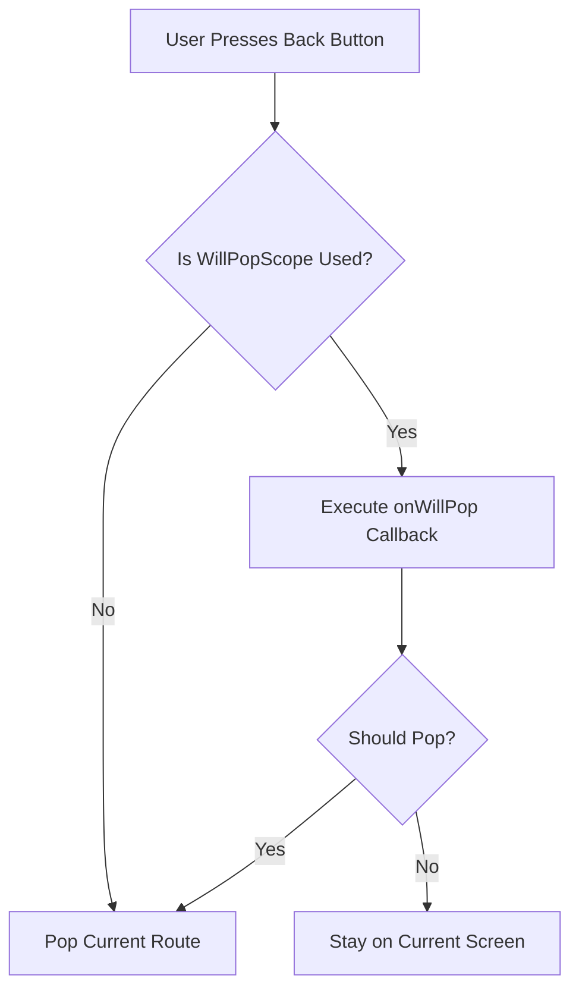

## 5.4.3 Handling Back Navigation

Navigating back in a mobile application is a fundamental aspect of user experience, allowing users to return to previous screens or exit the app. In Flutter, handling back navigation effectively involves understanding the default behavior and customizing it when necessary to enhance user interaction. This section delves into the intricacies of back navigation in Flutter, focusing on intercepting and customizing back button behavior using the `WillPopScope` widget, best practices, and practical exercises to solidify your understanding.

### Customizing Back Button Behavior

The back button, whether physical or virtual, is a crucial part of mobile app navigation. By default, Flutter handles back navigation automatically, popping the current route off the navigation stack. However, there are scenarios where you might want to customize this behavior, such as confirming unsaved changes or preventing accidental exits. The `WillPopScope` widget in Flutter provides a mechanism to intercept back button presses and execute custom logic.

#### Intercepting Back Button Presses with `WillPopScope`

The `WillPopScope` widget allows you to define a callback function that determines whether the current route should be popped. This is particularly useful for displaying confirmation dialogs or saving data before exiting a screen.

**Example: Intercepting Back Navigation**

Consider a scenario where you have a form screen, and you want to warn the user if they attempt to navigate back without saving changes. Here's how you can implement this using `WillPopScope`:

```dart
import 'package:flutter/material.dart';

class FormScreen extends StatelessWidget {
  @override
  Widget build(BuildContext context) {
    return WillPopScope(
      onWillPop: () async {
        // Show a confirmation dialog
        final shouldPop = await showDialog<bool>(
          context: context,
          builder: (context) => AlertDialog(
            title: Text('Are you sure?'),
            content: Text('Do you want to exit without saving?'),
            actions: [
              TextButton(
                onPressed: () => Navigator.of(context).pop(false),
                child: Text('Cancel'),
              ),
              TextButton(
                onPressed: () => Navigator.of(context).pop(true),
                child: Text('Exit'),
              ),
            ],
          ),
        );
        return shouldPop ?? false;
      },
      child: Scaffold(
        appBar: AppBar(
          title: Text('Form Screen'),
        ),
        body: Center(
          child: Text('Your form goes here'),
        ),
      ),
    );
  }
}
```

In this example, the `onWillPop` callback is used to display an `AlertDialog` when the back button is pressed. The dialog asks the user if they want to exit without saving. Depending on the user's choice, the function returns `true` or `false`, determining whether the screen should be popped from the navigation stack.

#### Understanding the `WillPopScope` Widget

The `WillPopScope` widget is a powerful tool for managing back navigation. It wraps a subtree and provides an `onWillPop` callback that returns a `Future<bool>`. This callback is triggered when the user attempts to navigate back, allowing you to execute asynchronous operations, such as showing a dialog or performing a network request.

**Key Points:**

- **Return Value:** The `onWillPop` callback must return a `Future<bool>`. Returning `true` allows the pop operation, while `false` prevents it.
- **Asynchronous Operations:** You can perform asynchronous operations within the callback, such as displaying dialogs or saving data.
- **Default Behavior:** If `onWillPop` is not provided, the default behavior is to pop the current route.

### Best Practices for Handling Back Navigation

While customizing back navigation can enhance user experience, it's essential to follow best practices to ensure a seamless and intuitive interaction.

#### Use `onWillPop` Judiciously

- **Avoid Overuse:** Overusing `onWillPop` can lead to a frustrating user experience. Reserve its use for scenarios where confirmation is genuinely necessary, such as unsaved changes or critical actions.
- **Consistency:** Ensure consistent behavior across your app. If you intercept back navigation on one screen, consider whether similar screens should have the same behavior.

#### Provide Clear and Concise Dialogs

- **User Clarity:** When intercepting back navigation, provide clear and concise dialogs that explain the consequences of the action. Use straightforward language and avoid technical jargon.
- **Actionable Options:** Offer actionable options in dialogs, such as "Save and Exit" or "Cancel," to guide users in making informed decisions.

### Exercise: Creating a Form Screen with Back Navigation Warning

To reinforce your understanding of handling back navigation, try creating a form screen that warns users if they attempt to navigate back without saving changes.

**Exercise Steps:**

1. **Create a New Flutter Project:** Start by creating a new Flutter project using your preferred IDE.

2. **Design the Form Screen:** Implement a simple form with a few input fields, such as a `TextField` for entering a name and an `ElevatedButton` for saving changes.

3. **Implement `WillPopScope`:** Wrap your form screen with a `WillPopScope` widget and implement the `onWillPop` callback to display a confirmation dialog when the back button is pressed.

4. **Test the Behavior:** Run the app on an emulator or device and test the back navigation behavior. Ensure that the dialog appears as expected and that the screen only pops when the user confirms.

5. **Enhance the Dialog:** Customize the dialog to include additional options, such as "Save and Exit," and implement the corresponding logic.

By completing this exercise, you'll gain hands-on experience in customizing back navigation and enhancing user experience in your Flutter applications.

### Practical Code Example: Form Screen with Back Navigation Warning

Here's a complete implementation of a form screen with a back navigation warning:

```dart
import 'package:flutter/material.dart';

class FormScreen extends StatefulWidget {
  @override
  _FormScreenState createState() => _FormScreenState();
}

class _FormScreenState extends State<FormScreen> {
  final _formKey = GlobalKey<FormState>();
  bool _isDirty = false; // Track if the form has unsaved changes

  @override
  Widget build(BuildContext context) {
    return WillPopScope(
      onWillPop: () async {
        if (_isDirty) {
          final shouldPop = await showDialog<bool>(
            context: context,
            builder: (context) => AlertDialog(
              title: Text('Unsaved Changes'),
              content: Text('You have unsaved changes. Do you want to exit?'),
              actions: [
                TextButton(
                  onPressed: () => Navigator.of(context).pop(false),
                  child: Text('Cancel'),
                ),
                TextButton(
                  onPressed: () => Navigator.of(context).pop(true),
                  child: Text('Exit'),
                ),
              ],
            ),
          );
          return shouldPop ?? false;
        }
        return true; // Allow pop if there are no unsaved changes
      },
      child: Scaffold(
        appBar: AppBar(
          title: Text('Form Screen'),
        ),
        body: Form(
          key: _formKey,
          onChanged: () {
            setState(() {
              _isDirty = true; // Mark form as dirty on change
            });
          },
          child: Padding(
            padding: const EdgeInsets.all(16.0),
            child: Column(
              children: [
                TextFormField(
                  decoration: InputDecoration(labelText: 'Name'),
                ),
                SizedBox(height: 20),
                ElevatedButton(
                  onPressed: () {
                    if (_formKey.currentState!.validate()) {
                      // Save form data
                      setState(() {
                        _isDirty = false; // Reset dirty flag on save
                      });
                      ScaffoldMessenger.of(context).showSnackBar(
                        SnackBar(content: Text('Changes saved')),
                      );
                    }
                  },
                  child: Text('Save'),
                ),
              ],
            ),
          ),
        ),
      ),
    );
  }
}
```

### Diagram: Back Navigation Flow

To better understand the flow of back navigation handling, consider the following diagram illustrating the process:



### Conclusion

Handling back navigation in Flutter is a critical aspect of creating intuitive and user-friendly applications. By leveraging the `WillPopScope` widget, you can intercept back button presses and implement custom logic to enhance user experience. Remember to use this feature judiciously, providing clear dialogs and consistent behavior across your app. Through practical exercises and code examples, you can master back navigation handling and apply these techniques to your own projects.

### Additional Resources

- [Flutter Documentation: WillPopScope](https://api.flutter.dev/flutter/widgets/WillPopScope-class.html)
- [Flutter Cookbook: Navigation](https://flutter.dev/docs/cookbook/navigation)
- [Dart Language Tour](https://dart.dev/guides/language/language-tour)

## Quiz Time!



### What widget is used to intercept back button presses in Flutter?

- [x] WillPopScope
- [ ] GestureDetector
- [ ] Navigator
- [ ] BackButton

> **Explanation:** The `WillPopScope` widget is specifically designed to intercept back button presses and allow custom logic to be executed before the route is popped.

### What does the `onWillPop` callback return?

- [x] Future<bool>
- [ ] bool
- [ ] void
- [ ] Future<void>

> **Explanation:** The `onWillPop` callback returns a `Future<bool>`, which determines whether the current route should be popped based on the returned value.

### In the provided example, what happens if the user selects "Cancel" in the dialog?

- [x] The current screen remains open.
- [ ] The current screen is popped.
- [ ] The app exits.
- [ ] The form is automatically saved.

> **Explanation:** Selecting "Cancel" returns `false` from the dialog, preventing the current route from being popped and keeping the screen open.

### What is a best practice when using `onWillPop`?

- [x] Use it judiciously to avoid hindering standard navigation.
- [ ] Use it on every screen for consistency.
- [ ] Always prevent back navigation.
- [ ] Use it only for form screens.

> **Explanation:** It is best to use `onWillPop` judiciously to avoid hindering standard navigation and only when necessary, such as for unsaved changes.

### What should you provide when intercepting back navigation?

- [x] Clear and concise dialogs
- [ ] Complex animations
- [ ] Automatic form submission
- [ ] Silent background tasks

> **Explanation:** When intercepting back navigation, it's important to provide clear and concise dialogs to inform the user of the consequences of their action.

### What is the purpose of the `_isDirty` flag in the example?

- [x] To track if the form has unsaved changes
- [ ] To indicate network connectivity
- [ ] To manage user authentication
- [ ] To control app theme

> **Explanation:** The `_isDirty` flag is used to track whether the form has unsaved changes, which determines whether the back navigation should be intercepted.

### How can you enhance the dialog in the exercise?

- [x] Add additional options like "Save and Exit"
- [ ] Remove all options
- [ ] Use a different color scheme
- [ ] Add sound effects

> **Explanation:** Enhancing the dialog with additional options like "Save and Exit" provides users with more choices and improves the user experience.

### What happens if `onWillPop` is not provided?

- [x] The default behavior is to pop the current route.
- [ ] The app crashes.
- [ ] The back button is disabled.
- [ ] A default dialog is shown.

> **Explanation:** If `onWillPop` is not provided, the default behavior is to pop the current route when the back button is pressed.

### What is the role of `showDialog` in the example?

- [x] To display a confirmation dialog to the user
- [ ] To log user actions
- [ ] To save form data
- [ ] To change the app theme

> **Explanation:** The `showDialog` function is used to display a confirmation dialog to the user, allowing them to decide whether to proceed with back navigation.

### True or False: The `WillPopScope` widget can perform asynchronous operations.

- [x] True
- [ ] False

> **Explanation:** True. The `WillPopScope` widget's `onWillPop` callback can perform asynchronous operations, such as displaying dialogs or making network requests.


