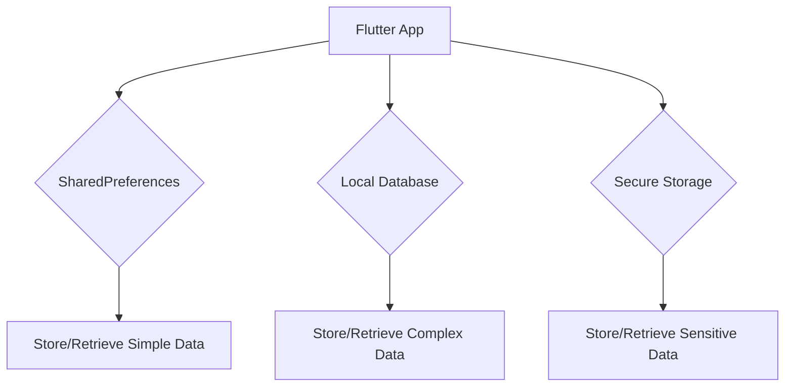

## 5.4.4 Persisting Data Across Sessions

In mobile app development, persisting data across sessions is crucial for providing a seamless user experience. Whether it's saving user preferences, caching data for offline access, or storing sensitive information securely, Flutter offers several tools and techniques to manage data persistence effectively. This section will explore various methods for persisting data in Flutter applications, including using SharedPreferences for simple data, local databases for complex data, and secure storage for sensitive information. We'll also discuss best practices and provide practical examples to help you implement these techniques in your projects.

### Using SharedPreferences for Simple Data

SharedPreferences is a simple key-value storage solution that allows you to store small amounts of data persistently. It's ideal for saving user preferences, settings, or any other lightweight data that needs to be retained across app sessions.

#### Storing and Retrieving Data with SharedPreferences

SharedPreferences stores data in a persistent key-value store, making it easy to save and retrieve simple data types such as integers, strings, and booleans. Here's a basic example of how to use SharedPreferences in a Flutter application:

```dart
import 'package:flutter/material.dart';
import 'package:shared_preferences/shared_preferences.dart';

class CounterApp extends StatefulWidget {
  @override
  _CounterAppState createState() => _CounterAppState();
}

class _CounterAppState extends State<CounterApp> {
  int _counter = 0;

  @override
  void initState() {
    super.initState();
    _loadCounter();
  }

  // Load counter value from SharedPreferences
  _loadCounter() async {
    SharedPreferences prefs = await SharedPreferences.getInstance();
    setState(() {
      _counter = prefs.getInt('counter') ?? 0;
    });
  }

  // Increment counter and save to SharedPreferences
  _incrementCounter() async {
    SharedPreferences prefs = await SharedPreferences.getInstance();
    setState(() {
      _counter++;
      prefs.setInt('counter', _counter);
    });
  }

  @override
  Widget build(BuildContext context) {
    return Scaffold(
      appBar: AppBar(
        title: Text('Counter App'),
      ),
      body: Center(
        child: Column(
          mainAxisAlignment: MainAxisAlignment.center,
          children: <Widget>[
            Text(
              'You have pushed the button this many times:',
            ),
            Text(
              '$_counter',
              style: Theme.of(context).textTheme.headline4,
            ),
          ],
        ),
      ),
      floatingActionButton: FloatingActionButton(
        onPressed: _incrementCounter,
        tooltip: 'Increment',
        child: Icon(Icons.add),
      ),
    );
  }
}
```

In this example, the counter value is stored in SharedPreferences each time the user increments it. When the app is restarted, the counter value is loaded from SharedPreferences, ensuring that the user's progress is not lost.

### Using Local Databases for Complex Data

For more complex data storage needs, such as storing large datasets or structured data, local databases are a better choice. Flutter provides several packages for local database management, including `sqflite` and `hive`.

#### Using `sqflite` for SQL-Based Storage

`sqflite` is a popular package for SQLite database management in Flutter. It allows you to perform SQL operations to manage complex data structures efficiently.

```dart
import 'package:sqflite/sqflite.dart';
import 'package:path/path.dart';

class DatabaseHelper {
  static final _databaseName = "MyDatabase.db";
  static final _databaseVersion = 1;

  static final table = 'my_table';

  static final columnId = '_id';
  static final columnName = 'name';

  // Singleton instance
  DatabaseHelper._privateConstructor();
  static final DatabaseHelper instance = DatabaseHelper._privateConstructor();

  // Database reference
  static Database? _database;

  Future<Database> get database async {
    if (_database != null) return _database!;
    _database = await _initDatabase();
    return _database!;
  }

  _initDatabase() async {
    String path = join(await getDatabasesPath(), _databaseName);
    return await openDatabase(path,
        version: _databaseVersion,
        onCreate: _onCreate);
  }

  Future _onCreate(Database db, int version) async {
    await db.execute('''
          CREATE TABLE $table (
            $columnId INTEGER PRIMARY KEY,
            $columnName TEXT NOT NULL
          )
          ''');
  }

  Future<int> insert(Map<String, dynamic> row) async {
    Database db = await instance.database;
    return await db.insert(table, row);
  }

  Future<List<Map<String, dynamic>>> queryAllRows() async {
    Database db = await instance.database;
    return await db.query(table);
  }
}
```

In this example, a simple SQLite database is set up with a single table. You can extend this to include more tables and complex queries as needed.

#### Using `hive` for NoSQL-Based Storage

`hive` is a lightweight and fast NoSQL database solution for Flutter. It's particularly well-suited for storing structured data without the overhead of SQL.

```dart
import 'package:hive/hive.dart';

void main() async {
  await Hive.initFlutter();

  var box = await Hive.openBox('myBox');

  // Store data
  box.put('name', 'John Doe');

  // Retrieve data
  var name = box.get('name');
  print('Name: $name');
}
```

`hive` is easy to set up and use, making it a great choice for applications that require fast and efficient data storage.

### Secure Storage

When dealing with sensitive information, such as user credentials or tokens, it's important to use secure storage solutions. `flutter_secure_storage` provides a secure way to store sensitive data by encrypting it.

```dart
import 'package:flutter_secure_storage/flutter_secure_storage.dart';

final storage = FlutterSecureStorage();

// Write value
await storage.write(key: 'username', value: 'john_doe');

// Read value
String? username = await storage.read(key: 'username');
```

This package ensures that sensitive data is stored securely, protecting it from unauthorized access.

### Visual Aid: Data Flow Diagram

To better understand how data flows from the app to persistent storage and back, consider the following diagram:



This diagram illustrates the different pathways data can take depending on the storage solution used.

### Best Practices

- **Avoid Blocking the UI Thread:** Always perform storage operations asynchronously to prevent blocking the UI thread. This ensures a smooth user experience.
- **Handle Exceptions Gracefully:** Implement error handling to manage exceptions that may occur during storage operations. This prevents crashes and provides a better user experience.
- **Use Appropriate Storage Solutions:** Choose the right storage solution based on the complexity and sensitivity of the data. Use SharedPreferences for simple data, local databases for complex data, and secure storage for sensitive information.

### Exercise: Implementing User Preferences

As an exercise, try implementing a feature that saves user preferences between sessions. For example, you could create a settings page where users can toggle dark mode, and save this preference using SharedPreferences. When the app is restarted, the user's preference should be loaded and applied automatically.

### Conclusion

Persisting data across sessions is a fundamental aspect of mobile app development. By using the right tools and techniques, you can ensure that your app provides a seamless and consistent user experience. Whether you're storing simple preferences or complex datasets, Flutter offers a variety of solutions to meet your needs. Remember to follow best practices to optimize performance and security, and encourage hands-on experimentation to deepen your understanding.

## Quiz Time!



### What is SharedPreferences best suited for in Flutter?

- [x] Storing small amounts of data persistently
- [ ] Storing large datasets
- [ ] Storing sensitive information securely
- [ ] Performing complex queries

> **Explanation:** SharedPreferences is ideal for storing small amounts of data, such as user preferences or settings, persistently across app sessions.

### Which package is recommended for SQL-based local database management in Flutter?

- [x] sqflite
- [ ] hive
- [ ] flutter_secure_storage
- [ ] shared_preferences

> **Explanation:** The `sqflite` package is commonly used for managing SQLite databases in Flutter, allowing for SQL-based data storage and retrieval.

### What is the primary advantage of using `hive` for data storage in Flutter?

- [x] It's a lightweight and fast NoSQL database solution
- [ ] It provides SQL-based storage
- [ ] It's specifically for storing sensitive data
- [ ] It requires complex setup

> **Explanation:** `hive` is a lightweight and fast NoSQL database solution, making it suitable for applications that need efficient data storage without the complexity of SQL.

### How does `flutter_secure_storage` protect sensitive data?

- [x] By encrypting the data
- [ ] By storing it in a local database
- [ ] By using SharedPreferences
- [ ] By storing it in plain text

> **Explanation:** `flutter_secure_storage` encrypts sensitive data, ensuring that it is stored securely and protected from unauthorized access.

### What should you avoid when performing storage operations in Flutter?

- [x] Blocking the UI thread
- [ ] Using async functions
- [ ] Handling exceptions
- [ ] Using secure storage for sensitive data

> **Explanation:** Blocking the UI thread during storage operations can lead to a poor user experience, so it's important to perform these operations asynchronously.

### Which storage solution is best for storing user credentials securely?

- [x] flutter_secure_storage
- [ ] sqflite
- [ ] hive
- [ ] shared_preferences

> **Explanation:** `flutter_secure_storage` is designed to securely store sensitive information, such as user credentials, by encrypting the data.

### What is a common use case for using local databases in Flutter?

- [x] Storing large datasets or structured data
- [ ] Storing small amounts of data
- [ ] Storing sensitive information securely
- [ ] Performing simple key-value storage

> **Explanation:** Local databases are ideal for storing large datasets or structured data that require complex queries and efficient management.

### What is the purpose of the `getInstance` method in SharedPreferences?

- [x] To obtain an instance of SharedPreferences
- [ ] To save data to SharedPreferences
- [ ] To delete data from SharedPreferences
- [ ] To encrypt data in SharedPreferences

> **Explanation:** The `getInstance` method is used to obtain an instance of SharedPreferences, allowing you to perform read and write operations.

### Which of the following is a best practice when handling storage operations?

- [x] Use async functions to avoid blocking the UI thread
- [ ] Perform operations synchronously
- [ ] Ignore exceptions
- [ ] Store all data in plain text

> **Explanation:** Using async functions for storage operations ensures that the UI thread is not blocked, providing a smooth user experience.

### True or False: `hive` requires SQL queries to manage data.

- [ ] True
- [x] False

> **Explanation:** `hive` is a NoSQL database solution, meaning it does not require SQL queries to manage data. It uses a simpler key-value approach.


