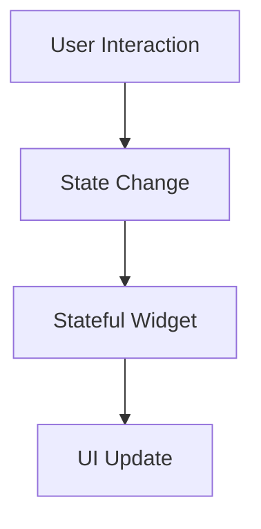

## 6.1.1 What is State Management

In the realm of Flutter development, understanding and effectively managing state is pivotal to creating dynamic, interactive, and responsive applications. This section delves into the concept of state management, its significance, and how it is implemented within Flutter applications.

### Definition of State

In the context of Flutter applications, **state** refers to any data that can change over time. This change can be triggered by user interactions, network responses, or other events within the application. State is the dynamic aspect of your app that dictates how the UI should look and behave at any given moment.

#### Real-World Examples of State

To better understand state, consider these real-world examples:

- **Text Input Field**: The current value entered by a user in a text input field represents a state. As the user types, the state changes, and the UI updates to reflect the new input.
- **Checkbox**: Whether a checkbox is checked or unchecked is a state. The UI must update to show the current state of the checkbox.
- **Shopping Cart**: The items in a shopping cart, including their quantities and total price, represent a state that changes as users add or remove items.

### Importance of State Management

Effective state management is crucial for creating interactive and dynamic apps. In Flutter, the reactive framework rebuilds widgets when their state changes, ensuring that the UI always reflects the current state of the application. This approach leads to:

- **Maintainable Code**: By clearly defining how state changes affect the UI, developers can write more maintainable and understandable code.
- **Scalable Applications**: Proper state management allows applications to scale efficiently, handling more complex interactions and data flows.
- **Bug-Free Experiences**: By managing state effectively, developers can minimize bugs related to inconsistent UI states or unexpected behavior.

### State in Flutter

Flutter manages state using widgets, which are the building blocks of any Flutter application. There are two primary types of widgets in Flutter:

#### Stateless Widgets

**Stateless Widgets** are immutable. Once created, they do not hold any state that can change over time. They are ideal for static content that does not require updates after the initial build. For example, a static image or a text label that does not change can be implemented using a stateless widget.

#### Stateful Widgets

**Stateful Widgets**, on the other hand, can hold mutable state. They are designed to change over time in response to user interactions or other events. A stateful widget maintains a state object that can be updated, triggering a rebuild of the widget to reflect the new state.

### Visual Aids

To illustrate the relationship between state, the widget tree, and how changes in state trigger UI updates, consider the following Mermaid.js diagram:



This flowchart demonstrates how a user's interaction leads to a state change, which updates the stateful widget, resulting in a UI update.

### Analogy: The Thermometer

Consider the analogy of a **thermometer**:

- **Temperature**: Represents the state. It changes over time based on environmental conditions.
- **Thermometer Display**: Represents the UI. It shows the current temperature.
- **State Change**: When the temperature changes, the thermometer updates to display the new temperature, similar to how a Flutter app updates its UI when the state changes.

### Interactive Example

Let's explore a practical example with a simple counter app. This app demonstrates how state changes in response to user interactions:

```dart
class CounterApp extends StatefulWidget {
  @override
  _CounterAppState createState() => _CounterAppState();
}

class _CounterAppState extends State<CounterApp> {
  int _counter = 0;

  void _incrementCounter() {
    setState(() {
      _counter++;
    });
  }

  @override
  Widget build(BuildContext context) {
    return Scaffold(
      appBar: AppBar(title: Text('Counter Example')),
      body: Center(
        child: Text(
          'Counter: $_counter',
          style: TextStyle(fontSize: 24),
        ),
      ),
      floatingActionButton: FloatingActionButton(
        onPressed: _incrementCounter,
        child: Icon(Icons.add),
      ),
    );
  }
}
```

In this example, the `_counter` variable represents the state. The `setState` method is used to update the state, which triggers a rebuild of the widget tree, updating the displayed counter value.

#### Encouragement for Hands-On Practice

Readers are encouraged to run this code in their Flutter environment. Observe how pressing the button increments the counter, demonstrating the dynamic nature of state management in Flutter.

### Key Takeaways

- **State** represents dynamic data in an app that can change over time.
- Proper state management ensures a responsive and consistent user interface.
- Flutter uses stateless and stateful widgets to manage state, with stateful widgets holding mutable state.
- Understanding and implementing effective state management is crucial for building maintainable, scalable, and bug-free applications.

By mastering state management, developers can create Flutter applications that are not only visually appealing but also robust and responsive to user interactions.

## Quiz Time!



### What is state in the context of Flutter applications?

- [x] Data that can change over time due to user interactions or other events.
- [ ] Static data that never changes.
- [ ] The layout of the application.
- [ ] The color scheme of the application.

> **Explanation:** State refers to dynamic data that can change over time, affecting the UI of the application.

### Why is state management important in Flutter?

- [x] It ensures a responsive and consistent user interface.
- [ ] It only affects the performance of the app.
- [ ] It is not important for small applications.
- [ ] It is only necessary for web applications.

> **Explanation:** State management is crucial for maintaining a responsive and consistent UI, regardless of the app's size or platform.

### What type of widget is immutable and does not hold any state?

- [x] Stateless Widget
- [ ] Stateful Widget
- [ ] Container Widget
- [ ] ListView Widget

> **Explanation:** Stateless widgets are immutable and do not hold any state that can change over time.

### Which method is used to update the state in a stateful widget?

- [x] setState
- [ ] initState
- [ ] build
- [ ] dispose

> **Explanation:** The `setState` method is used to update the state in a stateful widget, triggering a rebuild of the widget tree.

### In the counter app example, what does the `_counter` variable represent?

- [x] The state of the application
- [ ] The layout of the application
- [ ] The style of the text
- [ ] The color of the button

> **Explanation:** The `_counter` variable represents the state of the application, which changes when the button is pressed.

### What happens when the `setState` method is called in a stateful widget?

- [x] The widget tree is rebuilt to reflect the new state.
- [ ] The application crashes.
- [ ] The UI remains unchanged.
- [ ] The app restarts.

> **Explanation:** Calling `setState` triggers a rebuild of the widget tree, updating the UI to reflect the new state.

### Which of the following is a real-world example of state?

- [x] The items in a shopping cart
- [ ] The background color of the app
- [ ] The font size of the text
- [ ] The app icon

> **Explanation:** The items in a shopping cart represent a state that can change over time as users add or remove items.

### What is the role of the `build` method in a stateful widget?

- [x] It defines the UI based on the current state.
- [ ] It initializes the state.
- [ ] It disposes of resources.
- [ ] It updates the state.

> **Explanation:** The `build` method defines the UI based on the current state of the widget.

### True or False: Stateless widgets can hold mutable state.

- [ ] True
- [x] False

> **Explanation:** Stateless widgets are immutable and cannot hold mutable state.

### What analogy is used in the article to explain state management?

- [x] A thermometer
- [ ] A clock
- [ ] A car
- [ ] A computer

> **Explanation:** The article uses the analogy of a thermometer to explain state management, where the temperature represents the state.


