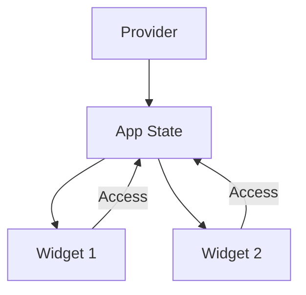

## 6.1.2 Types of State

State management is a crucial aspect of building dynamic and interactive applications in Flutter. Understanding the different types of state and how to manage them effectively can significantly enhance the performance and maintainability of your app. In this section, we will delve into the two primary types of state in Flutter: ephemeral state (local state) and app state (shared state). We will explore their characteristics, use cases, and best practices for managing them.

### Ephemeral State (Local State)

**Ephemeral state**, also known as local state, refers to the state that is only relevant to a single widget. This type of state is short-lived and does not need to be accessed or modified by other parts of the application. It is typically used for transient data that is only needed during the lifecycle of a widget.

#### Characteristics of Ephemeral State

- **Scope**: Limited to a single widget.
- **Duration**: Short-lived, existing only while the widget is in use.
- **Management**: Handled using `StatefulWidget` and `setState()`.

#### Examples of Ephemeral State

- **Animation Values**: The current value of an animation that is only relevant to the widget displaying it.
- **Tab Selection**: The selected tab in a `TabBar` widget, which is only needed while the user interacts with the tab bar.

#### Managing Ephemeral State

Ephemeral state is typically managed using a `StatefulWidget` in Flutter. The `StatefulWidget` class allows you to create a widget that can maintain state over time. The `setState()` method is used to update the state and trigger a rebuild of the widget.

```dart
class CounterWidget extends StatefulWidget {
  @override
  _CounterWidgetState createState() => _CounterWidgetState();
}

class _CounterWidgetState extends State<CounterWidget> {
  int _counter = 0;

  void _incrementCounter() {
    setState(() {
      _counter++;
    });
  }

  @override
  Widget build(BuildContext context) {
    return Column(
      children: [
        Text('Counter: $_counter'),
        ElevatedButton(
          onPressed: _incrementCounter,
          child: Text('Increment'),
        ),
      ],
    );
  }
}
```

In this example, the `_counter` variable is an ephemeral state managed by the `CounterWidget`. It is updated using the `setState()` method, which triggers a rebuild of the widget to reflect the new state.

### App State (Shared State)

**App state**, also known as shared state, refers to the state that needs to be shared across multiple widgets or pages in an application. This type of state is typically more complex and requires advanced state management techniques to handle effectively.

#### Characteristics of App State

- **Scope**: Shared across multiple widgets or the entire application.
- **Duration**: Can be long-lived, persisting across sessions.
- **Management**: Requires state management solutions like Provider, Bloc, or Redux.

#### Examples of App State

- **User Authentication Status**: Whether a user is logged in or not, which affects multiple parts of the app.
- **Theme Settings**: The current theme (light or dark mode) that applies to the entire application.
- **Data from APIs**: Data retrieved from a database or API that is used across different screens.

#### Managing App State

Managing app state requires more sophisticated solutions than ephemeral state. Flutter provides several state management libraries and patterns to handle app state effectively. Some popular solutions include Provider, Bloc, and Redux.

```dart
import 'package:flutter/material.dart';
import 'package:provider/provider.dart';

void main() {
  runApp(
    ChangeNotifierProvider(
      create: (context) => CounterModel(),
      child: MyApp(),
    ),
  );
}

class CounterModel extends ChangeNotifier {
  int _counter = 0;

  int get counter => _counter;

  void increment() {
    _counter++;
    notifyListeners();
  }
}

class MyApp extends StatelessWidget {
  @override
  Widget build(BuildContext context) {
    return MaterialApp(
      home: Scaffold(
        appBar: AppBar(title: Text('Provider Example')),
        body: Center(
          child: Consumer<CounterModel>(
            builder: (context, counterModel, child) {
              return Text('Counter: ${counterModel.counter}');
            },
          ),
        ),
        floatingActionButton: FloatingActionButton(
          onPressed: () => context.read<CounterModel>().increment(),
          child: Icon(Icons.add),
        ),
      ),
    );
  }
}
```

In this example, the `CounterModel` class is used to manage the app state. It extends `ChangeNotifier`, allowing it to notify listeners when the state changes. The `Provider` package is used to make the `CounterModel` available to the widget tree, enabling widgets to access and modify the shared state.

### Visual Representations

To better understand the flow of state in a Flutter application, let's look at some visual representations.

#### Local State Diagram

```mermaid
graph TD;
    A[StatefulWidget] --> B[Ephemeral State]
    B --> C[setState()]
    C --> A
```

In this diagram, the `StatefulWidget` manages its own ephemeral state. The state is updated using the `setState()` method, which triggers a rebuild of the widget.

#### Shared State Diagram



In this diagram, the `Provider` makes the app state available to multiple widgets. Widgets can access and modify the shared state, allowing for consistent data across the application.

### State Duration

State can vary in duration, from transient states that only exist during a session to persistent states that need to be saved between sessions. Understanding the duration of state is crucial for determining how to manage it effectively.

- **Transient State**: Exists only while the app is running. Examples include ephemeral state and temporary user inputs.
- **Persistent State**: Needs to be saved and restored between app launches. Examples include user preferences and saved data.

### Interactive Exercise

Think about different UI elements in an app you are familiar with. Try to categorize them as ephemeral or app state. Consider how each type of state is managed and how it affects the overall application.

### Best Practices

- Use `StatefulWidget` for managing local state that does not affect other parts of the app.
- For shared state, consider using state management solutions like Provider, Bloc, or Redux.
- Keep state management simple and avoid over-engineering. Choose the right tool for the job based on the complexity and requirements of your app.
- Ensure that state updates are efficient and do not cause unnecessary rebuilds or performance issues.

### Conclusion

Understanding the types of state in Flutter and how to manage them effectively is essential for building robust and scalable applications. By distinguishing between ephemeral and app state, you can choose the appropriate state management techniques and tools for your app's needs. As you continue to develop your Flutter skills, consider exploring advanced state management solutions and patterns to enhance your application's performance and maintainability.

## Quiz Time!



### What is ephemeral state in Flutter?

- [x] State that is only relevant to a single widget.
- [ ] State that is shared across multiple widgets.
- [ ] State that persists between app sessions.
- [ ] State that is managed using external libraries.

> **Explanation:** Ephemeral state is local to a single widget and does not need to be accessed by other parts of the app.

### Which of the following is an example of ephemeral state?

- [ ] User authentication status.
- [x] The selected tab in a TabBar.
- [ ] Theme settings.
- [ ] Data retrieved from an API.

> **Explanation:** The selected tab in a `TabBar` is an example of ephemeral state, as it is only relevant to the widget displaying the tab bar.

### How is ephemeral state typically managed in Flutter?

- [ ] Using Provider.
- [x] Using StatefulWidget and setState().
- [ ] Using Redux.
- [ ] Using Bloc.

> **Explanation:** Ephemeral state is managed using `StatefulWidget` and the `setState()` method to update the state and trigger a widget rebuild.

### What is app state in Flutter?

- [ ] State that is only relevant to a single widget.
- [x] State that needs to be shared across multiple widgets or pages.
- [ ] State that is short-lived and transient.
- [ ] State that is managed using setState().

> **Explanation:** App state is shared across multiple widgets or pages and requires more advanced state management techniques.

### Which of the following is an example of app state?

- [x] User authentication status.
- [ ] The current value of an animation.
- [ ] The selected tab in a TabBar.
- [ ] Temporary user inputs.

> **Explanation:** User authentication status is an example of app state, as it affects multiple parts of the application.

### How is app state typically managed in Flutter?

- [ ] Using StatefulWidget and setState().
- [x] Using state management solutions like Provider, Bloc, or Redux.
- [ ] Using temporary variables.
- [ ] Using local storage.

> **Explanation:** App state is managed using state management solutions like Provider, Bloc, or Redux to handle shared state across the application.

### What is the role of the Provider package in managing app state?

- [x] It makes the app state available to the widget tree.
- [ ] It manages local state within a single widget.
- [ ] It provides animations for widgets.
- [ ] It handles network requests.

> **Explanation:** The Provider package makes the app state available to the widget tree, allowing multiple widgets to access and modify the shared state.

### What is the purpose of the setState() method in Flutter?

- [x] To update the state and trigger a widget rebuild.
- [ ] To manage shared state across the application.
- [ ] To handle network requests.
- [ ] To provide animations for widgets.

> **Explanation:** The `setState()` method is used to update the state and trigger a rebuild of the widget to reflect the new state.

### Which type of state is typically short-lived and only needed during a session?

- [x] Transient state.
- [ ] Persistent state.
- [ ] Shared state.
- [ ] Global state.

> **Explanation:** Transient state is short-lived and only needed during a session, such as ephemeral state and temporary user inputs.

### True or False: App state can persist between app sessions.

- [x] True
- [ ] False

> **Explanation:** App state can persist between app sessions, especially when it involves user preferences or saved data that needs to be restored.


