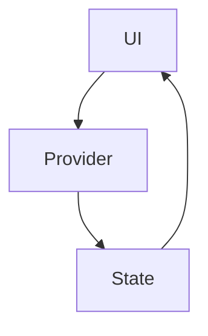
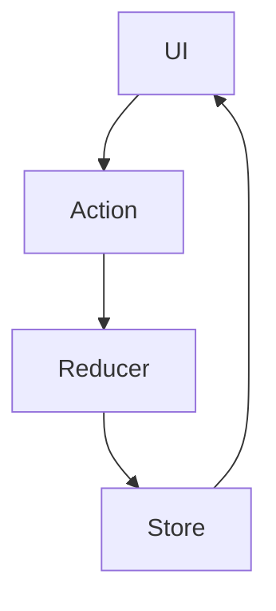

---

linkTitle: "6.1.3 Common State Management Solutions"
title: "Common State Management Solutions in Flutter: Exploring State Management Techniques"
description: "Explore various state management solutions in Flutter, including built-in options like setState and InheritedWidget, and popular third-party packages such as Provider, Bloc, Redux, and Riverpod. Learn how to choose the right solution for your app's needs."
categories:
- Flutter Development
- State Management
- Mobile App Development
tags:
- Flutter
- State Management
- Provider
- Bloc
- Redux
- Riverpod
date: 2024-10-25
type: docs
nav_weight: 613000
canonical: "https://fluttermasterylibrary.com/3/6/1/3"
license: "© 2023 Tokenizer Inc. CC BY-NC-SA 4.0"
---

## 6.1.3 Common State Management Solutions

State management is a crucial aspect of building robust and responsive applications in Flutter. With a plethora of options available, choosing the right state management solution can be daunting. This section provides an in-depth exploration of various state management techniques, both built-in and third-party, to help you make informed decisions for your Flutter projects.

### Overview

In Flutter, state management refers to the practice of handling the state of an application—how data is stored, accessed, and updated. There is no one-size-fits-all approach to state management in Flutter. The choice of solution often depends on the complexity of the application, the size of the development team, and personal or team preferences. Let's delve into the most common state management solutions available in Flutter.

### Built-in Solutions

#### setState()

The `setState()` method is the simplest and most straightforward way to manage state in Flutter. It is built into the framework and is used within `StatefulWidget` to update the UI in response to state changes.

- **Usage:** `setState()` is ideal for managing local, ephemeral state that is confined to a single widget. It is best suited for simple applications or components where the state does not need to be shared across multiple widgets.

- **Example:**

```dart
class CounterWidget extends StatefulWidget {
  @override
  _CounterWidgetState createState() => _CounterWidgetState();
}

class _CounterWidgetState extends State<CounterWidget> {
  int _counter = 0;

  void _incrementCounter() {
    setState(() {
      _counter++;
    });
  }

  @override
  Widget build(BuildContext context) {
    return Column(
      children: [
        Text('Counter: $_counter'),
        ElevatedButton(
          onPressed: _incrementCounter,
          child: Text('Increment'),
        ),
      ],
    );
  }
}
```

- **Pros:** Simple to use and understand, no additional dependencies required.
- **Cons:** Not suitable for managing complex or shared state across multiple widgets.

#### InheritedWidget and InheritedModel

`InheritedWidget` is a powerful mechanism in Flutter for propagating information down the widget tree efficiently. It allows widgets to access shared data without needing to pass it through constructors.

- **Usage:** `InheritedWidget` is suitable for scenarios where you need to share data across multiple widgets in the widget tree. It is often used as a base for other state management solutions.

- **Example:**

```dart
class MyInheritedWidget extends InheritedWidget {
  final int data;

  MyInheritedWidget({Key? key, required this.data, required Widget child})
      : super(key: key, child: child);

  @override
  bool updateShouldNotify(MyInheritedWidget oldWidget) {
    return oldWidget.data != data;
  }

  static MyInheritedWidget? of(BuildContext context) {
    return context.dependOnInheritedWidgetOfExactType<MyInheritedWidget>();
  }
}
```

- **Pros:** Efficient for propagating data down the widget tree.
- **Cons:** Can become complex to manage as the application grows, often abstracted by other solutions.

### Third-Party Packages

#### Provider

Provider is a popular state management solution built on top of `InheritedWidget`. It offers a simpler and more scalable way to manage app state, making it easier to share data across the widget tree.

- **Usage:** Provider is suitable for applications of varying sizes, offering a balance between simplicity and scalability. It is widely used due to its ease of use and integration with other packages.

- **Example:**

```dart
class Counter with ChangeNotifier {
  int _count = 0;

  int get count => _count;

  void increment() {
    _count++;
    notifyListeners();
  }
}

void main() {
  runApp(
    ChangeNotifierProvider(
      create: (context) => Counter(),
      child: MyApp(),
    ),
  );
}
```

- **Pros:** Easy to use, good community support, integrates well with other packages.
- **Cons:** Can become complex for very large applications.

#### Bloc (Business Logic Component)

Bloc is a state management solution that promotes the separation of business logic from UI components. It uses streams to handle state, making it suitable for larger applications with complex state management needs.

- **Usage:** Bloc is ideal for applications that require a clear separation between UI and business logic, ensuring that the UI remains reactive to state changes.

- **Example:**

```dart
class CounterBloc extends Bloc<CounterEvent, int> {
  CounterBloc() : super(0);

  @override
  Stream<int> mapEventToState(CounterEvent event) async* {
    if (event is IncrementEvent) {
      yield state + 1;
    }
  }
}
```

- **Pros:** Promotes clean architecture, suitable for complex applications.
- **Cons:** Steeper learning curve, requires understanding of streams and reactive programming.

#### Redux

Redux is a predictable state container that centralizes state management in a single store. It follows a unidirectional data flow, making it suitable for very large applications.

- **Usage:** Redux is ideal for applications that require a single source of truth for state management, ensuring consistency and predictability.

- **Example:**

```dart
final store = Store<int>(counterReducer, initialState: 0);

int counterReducer(int state, dynamic action) {
  if (action == Actions.Increment) {
    return state + 1;
  }
  return state;
}
```

- **Pros:** Predictable state management, suitable for large applications.
- **Cons:** Can be overkill for smaller applications, requires boilerplate code.

#### Riverpod

Riverpod is an improvement over Provider, offering increased safety and flexibility. It does not rely on `BuildContext`, eliminating some common problems associated with Provider.

- **Usage:** Riverpod is suitable for applications that require a more robust and flexible state management solution, offering better compile-time safety.

- **Example:**

```dart
final counterProvider = StateProvider<int>((ref) => 0);

void incrementCounter(WidgetRef ref) {
  ref.read(counterProvider.state).state++;
}
```

- **Pros:** Increased safety, no dependency on `BuildContext`, flexible.
- **Cons:** Newer library, may have a smaller community compared to Provider.

#### GetX, MobX, and Others

There are several other state management solutions available, such as GetX and MobX, each offering unique features and benefits. Developers are encouraged to explore these options to find the best fit for their specific needs.

### Comparison Table

Below is a comparison table of the different state management solutions based on various criteria:

| Solution      | Ease of Use | Community Support | Learning Curve | Suitable for App Size |
|---------------|-------------|-------------------|----------------|-----------------------|
| setState()    | High        | Built-in          | Low            | Small                 |
| InheritedWidget | Medium    | Built-in          | Medium         | Medium                |
| Provider      | High        | Strong            | Low            | Small to Medium       |
| Bloc          | Medium      | Strong            | High           | Medium to Large       |
| Redux         | Medium      | Strong            | High           | Large                 |
| Riverpod      | High        | Growing           | Medium         | Small to Large        |
| GetX          | High        | Growing           | Medium         | Small to Large        |
| MobX          | Medium      | Moderate          | Medium         | Medium to Large       |

### Visual Aids

To better understand how data flows in each solution, let's look at some diagrams:

#### Provider Data Flow



#### Redux Data Flow



### Key Takeaways

- There are multiple state management options in Flutter, each with its own strengths and suitable use cases.
- The choice of state management solution depends on the specific needs of the app, the complexity of the state, and the preferences of the development team.
- Understanding the pros and cons of each solution can help you make informed decisions and build more efficient and maintainable applications.

By exploring these state management solutions, you can choose the one that best fits your project's requirements and leverage the power of Flutter to build responsive and scalable applications.

## Quiz Time!



### Which built-in Flutter method is used for managing local state within a StatefulWidget?

- [x] setState()
- [ ] InheritedWidget
- [ ] Provider
- [ ] Bloc

> **Explanation:** `setState()` is a built-in method in Flutter used to manage local state within a `StatefulWidget`.

### What is the primary advantage of using Provider over InheritedWidget?

- [x] Simplicity and scalability
- [ ] Requires less boilerplate code
- [ ] Better performance
- [ ] Built-in to Flutter

> **Explanation:** Provider is built on top of `InheritedWidget` and offers a simpler and more scalable way to manage app state.

### Which state management solution uses streams to handle state?

- [ ] Provider
- [x] Bloc
- [ ] Redux
- [ ] Riverpod

> **Explanation:** Bloc uses streams to handle state, promoting a separation of business logic from UI components.

### What is a key feature of Redux in state management?

- [ ] Uses streams for state handling
- [ ] Centralizes state management in a single store
- [ ] Built on top of InheritedWidget
- [ ] Eliminates the need for BuildContext

> **Explanation:** Redux centralizes state management in a single store, following a unidirectional data flow.

### Which state management solution is known for not relying on BuildContext?

- [ ] Provider
- [ ] Bloc
- [ ] Redux
- [x] Riverpod

> **Explanation:** Riverpod does not rely on `BuildContext`, offering increased safety and flexibility.

### What is the main benefit of using setState() in Flutter?

- [x] Simplicity for managing local state
- [ ] Suitable for large applications
- [ ] Eliminates boilerplate code
- [ ] Offers unidirectional data flow

> **Explanation:** `setState()` is simple and ideal for managing local, ephemeral state within a `StatefulWidget`.

### Which state management solution is recommended for very large applications?

- [ ] setState()
- [ ] Provider
- [x] Redux
- [ ] Riverpod

> **Explanation:** Redux is suitable for very large applications due to its predictable state management and unidirectional data flow.

### What does Bloc promote in application architecture?

- [ ] Centralized state management
- [x] Separation of business logic from UI
- [ ] Elimination of BuildContext
- [ ] Simplicity and ease of use

> **Explanation:** Bloc promotes the separation of business logic from UI components, ensuring a clean architecture.

### Which state management solution is considered an improvement over Provider?

- [ ] Bloc
- [ ] Redux
- [x] Riverpod
- [ ] GetX

> **Explanation:** Riverpod is considered an improvement over Provider, offering increased safety and flexibility.

### True or False: InheritedWidget is often abstracted by other state management solutions.

- [x] True
- [ ] False

> **Explanation:** True. `InheritedWidget` is often abstracted by other solutions like Provider to simplify state management.


