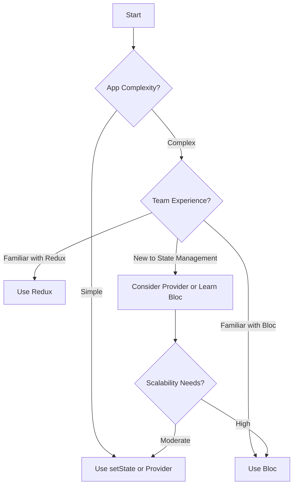

## 6.1.4 Choosing the Right State Management Approach in Flutter

State management is a crucial aspect of building robust and scalable Flutter applications. Choosing the right approach can significantly impact the maintainability, performance, and scalability of your app. In this section, we'll explore various factors to consider when selecting a state management solution, provide guidelines for making an informed decision, and offer real-world scenarios to illustrate different approaches.

### Factors to Consider

#### Complexity of the App

The complexity of your app is a primary factor in determining the appropriate state management solution. Here's how different levels of complexity might influence your choice:

- **Small Apps:**
  - For simple applications with limited state management needs, using Flutter's built-in `setState()` method or the Provider package is often sufficient. These solutions are easy to implement and understand, making them ideal for beginners or small projects.
  - **Example:** A simple to-do app where tasks are added, removed, or marked as complete can efficiently use `setState()` to manage state changes.

- **Larger Apps:**
  - As your app grows in complexity, with multiple screens and intricate state interactions, more sophisticated solutions like Bloc or Redux become beneficial. These patterns provide a structured approach to managing state, making it easier to scale and maintain the app.
  - **Example:** An e-commerce app with global user data, product listings, and a shopping cart might benefit from using Bloc to handle state across various components.

#### Team Familiarity and Preferences

The experience and preferences of your development team can also influence the choice of state management solution:

- **Experience with Patterns:**
  - If your team is already familiar with a particular pattern or library, it might be advantageous to leverage that expertise. For instance, a team experienced with Redux from web development might find it easier to implement Redux in Flutter.
  
- **Learning Curve:**
  - Consider the learning curve associated with each solution. While `setState()` and Provider are relatively straightforward, Bloc and Redux require a deeper understanding of reactive programming and state management principles.

#### Scalability

Scalability is another critical factor to consider:

- **Handling Growth:**
  - Evaluate how well the state management solution can handle the growth of your app. As the app evolves, the chosen solution should support new features and increased complexity without becoming cumbersome.
  
- **Maintainability:**
  - A scalable solution should also be maintainable, allowing for easy updates and modifications. Bloc, for example, promotes a clear separation of concerns, making it easier to manage complex state interactions.

#### Performance

Performance considerations are essential when choosing a state management approach:

- **Efficiency:**
  - Some solutions, like overusing `setState()`, can lead to unnecessary widget rebuilds, impacting performance. More advanced solutions like Bloc or Redux can help optimize performance by minimizing rebuilds and efficiently managing state changes.
  
- **Resource Usage:**
  - Consider the resource usage of each solution, particularly in terms of memory and CPU consumption. Efficient state management can lead to smoother user experiences and longer battery life on mobile devices.

#### Community and Support

The community and support available for a state management solution can influence its long-term viability:

- **Active Community:**
  - Solutions with active communities offer better support, resources, and documentation. This can be invaluable when troubleshooting issues or seeking guidance on best practices.
  
- **Library Maintenance:**
  - Consider the maintenance and update frequency of the library. An actively maintained library is more likely to stay up-to-date with the latest Flutter releases and best practices.

### Guidelines for Choosing a State Management Solution

- **Start Simple:**
  - Begin with the simplest solution that meets your app's requirements. Avoid over-engineering by introducing complex state management patterns prematurely.
  
- **Iterate as Needed:**
  - As your app grows, be prepared to iterate and adopt more sophisticated solutions if necessary. It's easier to refactor and introduce a new pattern than to start with an overly complex solution.

- **Evaluate Regularly:**
  - Regularly evaluate your state management approach to ensure it continues to meet your app's needs. Be open to change if a different solution offers better scalability or performance.

### Decision Matrix

To assist in selecting the right state management approach, consider the following decision tree:

### Real-World Scenarios

Let's explore some hypothetical app scenarios and discuss which state management solution might be appropriate:

- **Simple To-Do App:**
  - **Solution:** `setState()` or Provider
  - **Rationale:** The app's state management needs are minimal, with straightforward interactions. `setState()` provides a quick and easy way to update the UI in response to user actions.

- **E-Commerce App with Global User Data:**
  - **Solution:** Provider or Bloc
  - **Rationale:** The app requires managing global state, such as user authentication and shopping cart data. Provider offers a simple way to share state across widgets, while Bloc provides a more structured approach for complex interactions.

- **Social Media App with Complex Data Flows:**
  - **Solution:** Bloc or Redux
  - **Rationale:** The app involves intricate data flows, such as real-time updates, notifications, and user interactions. Bloc or Redux can efficiently manage these complexities, ensuring a responsive and scalable app.

### Exercises

To reinforce your understanding, consider evaluating your own apps or project ideas and deciding on a suitable state management approach. Reflect on the factors discussed and use the decision matrix to guide your choice.

### Key Takeaways

- **No Universal Best Choice:**
  - There is no one-size-fits-all solution for state management. The right approach depends on your app's specific use cases and requirements.
  
- **Weigh Pros and Cons:**
  - Carefully weigh the pros and cons of each solution before committing. Consider factors like complexity, team familiarity, scalability, performance, and community support.

- **Be Open to Change:**
  - Be willing to adapt and change your state management approach as your app evolves. Flexibility is key to maintaining a robust and scalable application.

### Additional Resources

For further exploration of state management in Flutter, consider the following resources:

- [Flutter Documentation on State Management](https://flutter.dev/docs/development/data-and-backend/state-mgmt)
- [Provider Package Documentation](https://pub.dev/packages/provider)
- [Bloc Package Documentation](https://bloclibrary.dev/)
- [Redux Package Documentation](https://pub.dev/packages/redux)
- Books and online courses on Flutter development and state management patterns.

## Quiz Time!



### Which factor is NOT typically considered when choosing a state management approach?

- [ ] Complexity of the app
- [ ] Team familiarity and preferences
- [ ] Scalability
- [x] Color scheme of the app

> **Explanation:** The color scheme of the app is unrelated to state management decisions, which focus on complexity, team familiarity, scalability, performance, and community support.

### What is a primary advantage of using `setState()` for small apps?

- [x] Simplicity and ease of use
- [ ] High scalability
- [ ] Complex data flow management
- [ ] Built-in authentication

> **Explanation:** `setState()` is simple and easy to use, making it ideal for small apps with straightforward state management needs.

### Which state management solution is recommended for a social media app with complex data flows?

- [ ] setState()
- [ ] Provider
- [x] Bloc or Redux
- [ ] InheritedWidget

> **Explanation:** Bloc or Redux are suitable for managing complex data flows and interactions in a social media app.

### What should you consider regarding team familiarity when choosing a state management solution?

- [x] The team's experience with certain patterns or libraries
- [ ] The team's favorite color
- [ ] The team's office location
- [ ] The team's lunch preferences

> **Explanation:** Team familiarity with certain patterns or libraries can influence the choice of state management solution, as it affects the learning curve and implementation efficiency.

### Which solution is often sufficient for a simple to-do app?

- [x] setState()
- [ ] Bloc
- [ ] Redux
- [ ] Riverpod

> **Explanation:** For a simple to-do app, `setState()` is often sufficient due to its simplicity and ease of use.

### What is a potential downside of overusing `setState()`?

- [ ] Improved performance
- [x] Unnecessary widget rebuilds
- [ ] Increased scalability
- [ ] Enhanced security

> **Explanation:** Overusing `setState()` can lead to unnecessary widget rebuilds, impacting performance negatively.

### Why is community support important when choosing a state management solution?

- [x] It provides better long-term support and resources
- [ ] It determines the app's color scheme
- [ ] It affects the app's scalability
- [ ] It influences the app's logo design

> **Explanation:** Community support is important because it offers better long-term support, resources, and documentation for troubleshooting and best practices.

### What is a key takeaway when choosing a state management approach?

- [x] There's no universal best choice; it depends on specific use cases
- [ ] Always choose the most complex solution available
- [ ] Ignore team preferences and experience
- [ ] Focus solely on the app's color scheme

> **Explanation:** The key takeaway is that there's no universal best choice; the right approach depends on specific use cases and requirements.

### Which state management solution is known for promoting a clear separation of concerns?

- [ ] setState()
- [ ] Provider
- [x] Bloc
- [ ] InheritedWidget

> **Explanation:** Bloc is known for promoting a clear separation of concerns, making it easier to manage complex state interactions.

### True or False: The right state management approach should be chosen based solely on the app's initial requirements.

- [ ] True
- [x] False

> **Explanation:** False. The right state management approach should be flexible and adaptable to the app's evolving requirements, not just its initial needs.


