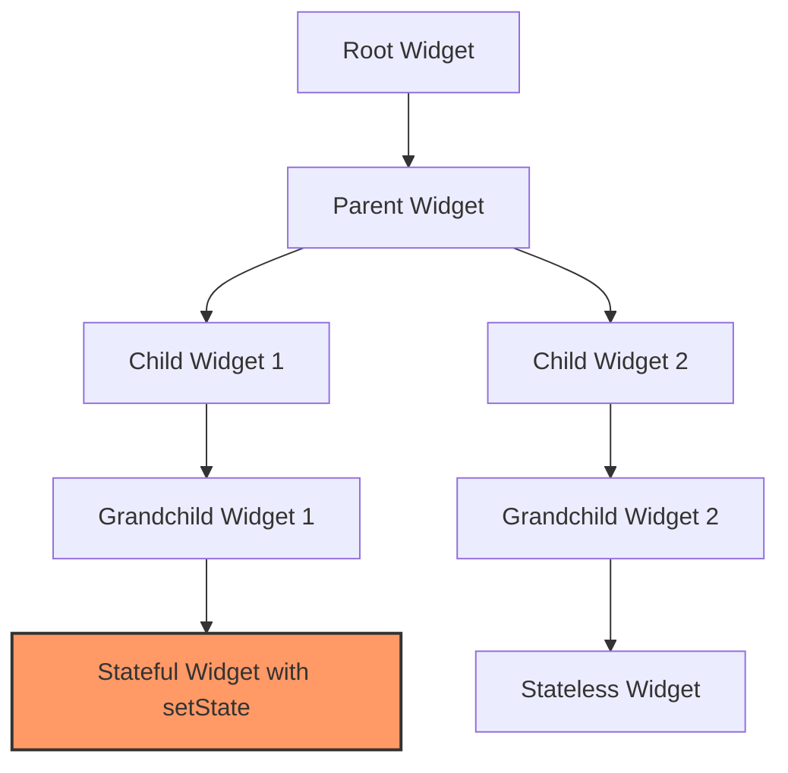
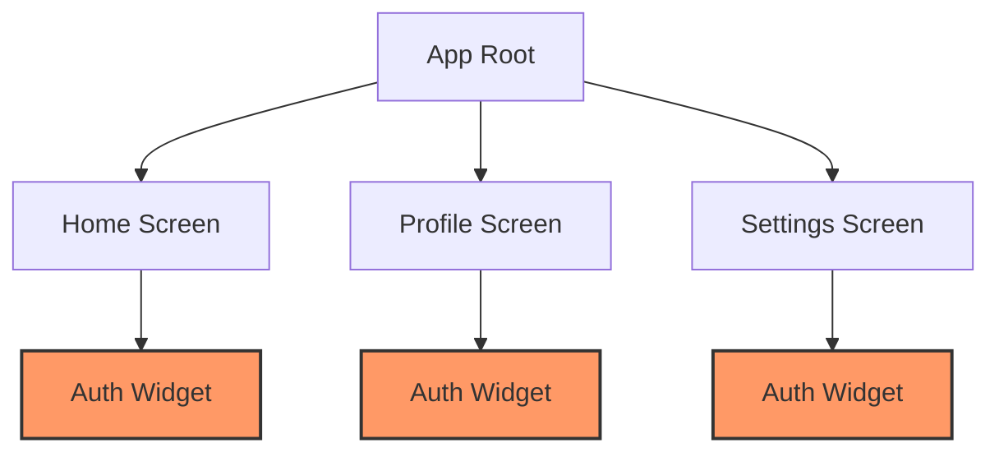

## 6.2.3 Limitations of setState

In Flutter, `setState()` is a fundamental method used to manage state within a `StatefulWidget`. While it is a powerful tool for managing local state, it has several limitations that can make it less suitable for larger, more complex applications. In this section, we will explore these limitations in detail, providing insights into why `setState()` may not always be the best choice for state management in Flutter.

### Local Scope

One of the primary limitations of `setState()` is its local scope. When you call `setState()`, it only affects the widget in which it is called. This means that if you have state that needs to be shared across multiple widgets, `setState()` becomes cumbersome and inefficient.

#### Example of Local Scope Limitation

Consider a simple application where you have a counter that needs to be displayed and updated in multiple widgets. Using `setState()` in this scenario would require you to pass the state down through widget constructors, leading to a practice known as **prop drilling**.

```dart
class CounterApp extends StatefulWidget {
  @override
  _CounterAppState createState() => _CounterAppState();
}

class _CounterAppState extends State<CounterApp> {
  int _counter = 0;

  void _incrementCounter() {
    setState(() {
      _counter++;
    });
  }

  @override
  Widget build(BuildContext context) {
    return Column(
      children: [
        CounterDisplay(counter: _counter),
        CounterButton(onPressed: _incrementCounter),
      ],
    );
  }
}

class CounterDisplay extends StatelessWidget {
  final int counter;

  CounterDisplay({required this.counter});

  @override
  Widget build(BuildContext context) {
    return Text('Counter: $counter');
  }
}

class CounterButton extends StatelessWidget {
  final VoidCallback onPressed;

  CounterButton({required this.onPressed});

  @override
  Widget build(BuildContext context) {
    return ElevatedButton(
      onPressed: onPressed,
      child: Text('Increment'),
    );
  }
}
```

In this example, the counter state is passed down from the `_CounterAppState` to the `CounterDisplay` and `CounterButton` widgets. As the app grows, this approach becomes increasingly difficult to manage.

### Complexity in Larger Apps

In larger applications with deep widget trees, passing state down through constructors can lead to **prop drilling**, where state is passed through many layers of widgets. This not only makes the app harder to maintain and refactor but also increases the complexity of the codebase.

#### Visual Aid: Widget Tree Complexity



In the diagram above, the `Stateful Widget with setState` (G) needs to share state with other widgets in the tree. Using `setState()` would require passing the state through multiple layers, complicating the architecture.

### Tightly Coupled UI and Logic

Another significant limitation of `setState()` is that it often leads to tightly coupled UI and business logic. This violates the principle of separation of concerns, making the code harder to test and maintain.

#### Example of Tightly Coupled Code

```dart
class LoginPage extends StatefulWidget {
  @override
  _LoginPageState createState() => _LoginPageState();
}

class _LoginPageState extends State<LoginPage> {
  bool _isLoading = false;

  void _login() {
    setState(() {
      _isLoading = true;
    });

    // Simulate a network call
    Future.delayed(Duration(seconds: 2), () {
      setState(() {
        _isLoading = false;
      });
    });
  }

  @override
  Widget build(BuildContext context) {
    return Column(
      children: [
        _isLoading ? CircularProgressIndicator() : Text('Login'),
        ElevatedButton(
          onPressed: _login,
          child: Text('Login'),
        ),
      ],
    );
  }
}
```

In this example, the UI logic (showing a loading indicator) is tightly coupled with the business logic (simulating a login process). This makes it difficult to test the business logic independently of the UI.

### Performance Issues

Overusing `setState()` can lead to performance degradation due to excessive rebuilding of widgets. Each time `setState()` is called, the entire widget subtree is rebuilt, which can be costly in terms of performance, especially if the widget tree is large or complex.

#### Example of Performance Issue

```dart
class PerformanceApp extends StatefulWidget {
  @override
  _PerformanceAppState createState() => _PerformanceAppState();
}

class _PerformanceAppState extends State<PerformanceApp> {
  int _counter = 0;

  void _incrementCounter() {
    setState(() {
      _counter++;
    });
  }

  @override
  Widget build(BuildContext context) {
    return ListView.builder(
      itemCount: 1000,
      itemBuilder: (context, index) {
        return ListTile(
          title: Text('Item $index'),
          trailing: index == 0 ? Text('Counter: $_counter') : null,
        );
      },
    );
  }
}
```

In this example, calling `setState()` to update the counter results in the entire list being rebuilt, which is inefficient and can lead to performance issues.

### Example Scenario: User Authentication

Consider an application where the user's authentication status needs to be accessed by multiple widgets in different parts of the app. Using `setState()` to manage this state would require passing the authentication status through various widget constructors, leading to a complex and hard-to-maintain codebase.

#### Visual Aid: Authentication State Propagation



In this diagram, the authentication state needs to be accessed by multiple widgets (`Auth Widget`) across different screens. Using `setState()` would require passing the state through each screen, complicating the architecture.

### Conclusion

While `setState()` is a powerful tool for managing local state within a `StatefulWidget`, it is not scalable for managing global or complex state across an application. Its limitations in terms of local scope, complexity in larger apps, tightly coupled UI and logic, and performance issues make it less suitable for larger, more complex applications.

### Exercises

To solidify your understanding of the limitations of `setState()`, consider the following exercise:

- Examine the following code snippet and identify the limitations of using `setState()` for managing global state:

```dart
class GlobalStateApp extends StatefulWidget {
  @override
  _GlobalStateAppState createState() => _GlobalStateAppState();
}

class _GlobalStateAppState extends State<GlobalStateApp> {
  bool _isAuthenticated = false;

  void _toggleAuthentication() {
    setState(() {
      _isAuthenticated = !_isAuthenticated;
    });
  }

  @override
  Widget build(BuildContext context) {
    return Column(
      children: [
        AuthStatus(isAuthenticated: _isAuthenticated),
        AuthButton(onPressed: _toggleAuthentication),
      ],
    );
  }
}

class AuthStatus extends StatelessWidget {
  final bool isAuthenticated;

  AuthStatus({required this.isAuthenticated});

  @override
  Widget build(BuildContext context) {
    return Text(isAuthenticated ? 'Logged In' : 'Logged Out');
  }
}

class AuthButton extends StatelessWidget {
  final VoidCallback onPressed;

  AuthButton({required this.onPressed});

  @override
  Widget build(BuildContext context) {
    return ElevatedButton(
      onPressed: onPressed,
      child: Text('Toggle Auth'),
    );
  }
}
```

- Consider how you might refactor this code to use a more scalable state management solution, such as Provider or Bloc, to manage the authentication state globally.

By understanding the limitations of `setState()`, you can make informed decisions about when to use it and when to consider alternative state management solutions for your Flutter applications.

## Quiz Time!



### What is a primary limitation of `setState()` in Flutter?

- [x] It only affects the widget it's called in.
- [ ] It automatically updates all widgets in the app.
- [ ] It can manage global state efficiently.
- [ ] It is the best solution for all state management needs.

> **Explanation:** `setState()` only affects the widget it's called in, making it unsuitable for managing state that needs to be shared across multiple widgets.

### What is "prop drilling" in the context of Flutter?

- [x] Passing state down through multiple widget constructors.
- [ ] Using `setState()` to manage global state.
- [ ] Creating complex animations with multiple widgets.
- [ ] Building responsive layouts with media queries.

> **Explanation:** Prop drilling refers to the practice of passing state down through multiple widget constructors, which can make the app harder to maintain.

### How does `setState()` affect performance in Flutter?

- [x] It can lead to performance degradation due to excessive rebuilding of widgets.
- [ ] It optimizes widget rebuilds automatically.
- [ ] It prevents any widget from being rebuilt.
- [ ] It improves the app's overall speed.

> **Explanation:** Overusing `setState()` can lead to performance degradation because it causes the entire widget subtree to be rebuilt.

### Why is tightly coupled UI and logic a limitation of `setState()`?

- [x] It makes testing and maintaining code more difficult.
- [ ] It simplifies the separation of concerns.
- [ ] It enhances the modularity of the code.
- [ ] It allows for easy refactoring.

> **Explanation:** Tightly coupled UI and logic violate the separation of concerns, making the code harder to test and maintain.

### In a large app, what issue arises from using `setState()` to manage state?

- [x] Complexity due to prop drilling.
- [ ] Automatic state synchronization.
- [ ] Simplified global state management.
- [ ] Enhanced performance.

> **Explanation:** In large apps, using `setState()` can lead to complexity due to prop drilling, where state is passed through many layers of widgets.

### What is a common alternative to `setState()` for managing global state?

- [x] Provider
- [ ] StatelessWidget
- [ ] setState()
- [ ] MediaQuery

> **Explanation:** Provider is a common alternative to `setState()` for managing global state in Flutter applications.

### How can `setState()` lead to tightly coupled UI and logic?

- [x] By intertwining business logic with UI code.
- [ ] By separating concerns effectively.
- [ ] By isolating business logic from UI code.
- [ ] By using external state management libraries.

> **Explanation:** `setState()` can lead to tightly coupled UI and logic by intertwining business logic with UI code, making it difficult to test and maintain.

### What is a visual aid used to illustrate the limitations of `setState()`?

- [x] Widget tree diagram
- [ ] Animation sequence
- [ ] Color palette
- [ ] Typography chart

> **Explanation:** A widget tree diagram is used to illustrate how `setState()` becomes impractical when state needs to be accessed by distant widgets.

### What is the effect of calling `setState()` in a widget?

- [x] It rebuilds the widget subtree.
- [ ] It updates only the parent widget.
- [ ] It prevents any widget from being rebuilt.
- [ ] It optimizes the entire app's performance.

> **Explanation:** Calling `setState()` in a widget rebuilds the widget subtree, which can lead to performance issues if overused.

### True or False: `setState()` is the best solution for managing state in all Flutter applications.

- [ ] True
- [x] False

> **Explanation:** False. While `setState()` is useful for managing local state, it is not the best solution for managing global or complex state in all Flutter applications.


