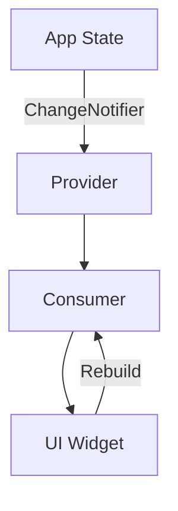

## 6.3.1 Introduction to Provider

State management is a crucial aspect of building robust and scalable Flutter applications. Among the various state management solutions available, the Provider package stands out due to its simplicity and efficiency. In this section, we will delve into the Provider package, exploring its core concepts, benefits, and practical applications.

### What is Provider?

The Provider package is a wrapper around Flutter's `InheritedWidget`, designed to make state management more accessible and reusable. It is recommended by the Flutter team and has become a widely adopted solution for managing state in Flutter applications. Provider simplifies the process of accessing and updating state across the widget tree, enhancing both code readability and maintainability.

#### Key Characteristics of Provider:

- **Ease of Use:** Provider abstracts the complexity of `InheritedWidget`, making it easier to implement state management in your Flutter apps.
- **Reusability:** It allows for the creation of reusable state management logic that can be shared across different parts of the application.
- **Integration:** Provider integrates seamlessly with Flutter's widget tree, allowing for efficient state updates and UI rebuilds.

### Benefits of Using Provider

Provider offers several advantages that make it a preferred choice for state management in Flutter:

- **Simplifies State Management:** By abstracting the complexities of `InheritedWidget`, Provider makes it easier to manage state in Flutter applications.
- **Access and Update State Anywhere:** Provider allows you to access and update state from anywhere in the widget tree, eliminating the need for complex state management architectures.
- **Enhances Code Readability and Maintainability:** With Provider, your code becomes more organized and easier to maintain, as state management logic is separated from UI code.

### Core Concepts

To effectively use Provider, it's essential to understand its core components: `ChangeNotifier` and `Consumer`.

#### ChangeNotifier

`ChangeNotifier` is a class that provides change notifications to its listeners. It is the backbone of the Provider package, enabling widgets to listen for changes and rebuild when necessary.

- **How it Works:** When a `ChangeNotifier` object changes, it notifies all its listeners, prompting them to rebuild.
- **Use Case:** Ideal for managing simple state changes, such as updating a counter or toggling a boolean value.

#### Consumer

`Consumer` is a widget that listens to changes in a provided model and rebuilds when notified. It is used to access the state managed by a `ChangeNotifier`.

- **How it Works:** `Consumer` listens to a `ChangeNotifier` and rebuilds its child widget whenever the notifier changes.
- **Use Case:** Use `Consumer` to rebuild specific parts of the UI that depend on the state managed by a `ChangeNotifier`.

### When to Use Provider

Provider is suitable for small to medium-sized applications where you need to share state across multiple widgets without implementing a complex architecture. It is particularly useful when:

- You want to manage simple state changes without introducing additional complexity.
- You need to share state across different parts of the widget tree.
- You are building applications that require a straightforward and efficient state management solution.

### Visual Aid

To better understand how Provider works, let's visualize the flow of data from the model to the UI using a diagram:



In this diagram, the `App State` is managed by a `ChangeNotifier`, which is wrapped by a `Provider`. The `Consumer` listens for changes in the `Provider` and rebuilds the `UI Widget` when notified.

### Example: Counter App with Provider

Let's refactor a simple counter app to use Provider for state management.

#### Step 1: Add Provider Dependency

First, add the Provider package to your `pubspec.yaml` file:

```yaml
dependencies:
  flutter:
    sdk: flutter
  provider: ^6.0.0
```

Run `flutter pub get` to install the package.

#### Step 2: Create a ChangeNotifier

Create a `Counter` class that extends `ChangeNotifier`:

```dart
import 'package:flutter/foundation.dart';

class Counter with ChangeNotifier {
  int _count = 0;

  int get count => _count;

  void increment() {
    _count++;
    notifyListeners();
  }
}
```

#### Step 3: Provide the Counter

Wrap your app with a `ChangeNotifierProvider` to provide the `Counter` instance:

```dart
import 'package:flutter/material.dart';
import 'package:provider/provider.dart';
import 'counter.dart'; // Import the Counter class

void main() {
  runApp(
    ChangeNotifierProvider(
      create: (context) => Counter(),
      child: MyApp(),
    ),
  );
}

class MyApp extends StatelessWidget {
  @override
  Widget build(BuildContext context) {
    return MaterialApp(
      home: CounterScreen(),
    );
  }
}
```

#### Step 4: Consume the Counter

Use a `Consumer` widget to access and display the counter value:

```dart
import 'package:flutter/material.dart';
import 'package:provider/provider.dart';
import 'counter.dart'; // Import the Counter class

class CounterScreen extends StatelessWidget {
  @override
  Widget build(BuildContext context) {
    return Scaffold(
      appBar: AppBar(
        title: Text('Counter App with Provider'),
      ),
      body: Center(
        child: Consumer<Counter>(
          builder: (context, counter, child) {
            return Text(
              '${counter.count}',
              style: TextStyle(fontSize: 48),
            );
          },
        ),
      ),
      floatingActionButton: FloatingActionButton(
        onPressed: () {
          Provider.of<Counter>(context, listen: false).increment();
        },
        child: Icon(Icons.add),
      ),
    );
  }
}
```

### Exercises

To deepen your understanding of Provider, consider the following exercises:

- **Exercise 1:** Refactor an existing app to use Provider for state management. Identify parts of the app that could benefit from using Provider and implement the necessary changes.
- **Exercise 2:** Create a new Flutter app that uses Provider to manage a list of items. Implement functionality to add, remove, and update items in the list.
- **Exercise 3:** Experiment with different types of Providers, such as `FutureProvider` and `StreamProvider`, to handle asynchronous data.

### Conclusion

Provider is a powerful and flexible state management solution for Flutter applications. By simplifying the process of accessing and updating state, Provider enhances code readability and maintainability, making it an excellent choice for small to medium-sized apps. With the knowledge gained in this section, you are now equipped to implement Provider in your Flutter projects, improving the overall structure and efficiency of your code.

### Additional Resources

- [Official Provider Documentation](https://pub.dev/packages/provider)
- [Flutter State Management Guide](https://flutter.dev/docs/development/data-and-backend/state-mgmt)
- [Provider Package on GitHub](https://github.com/rrousselGit/provider)

## Quiz Time!



### What is Provider in Flutter?

- [x] A wrapper around InheritedWidgets to simplify state management.
- [ ] A package for creating animations in Flutter.
- [ ] A tool for building custom widgets.
- [ ] A library for managing network requests.

> **Explanation:** Provider is a wrapper around InheritedWidgets that simplifies state management in Flutter applications.

### What is the primary benefit of using Provider?

- [x] Simplifies state management and enhances code readability.
- [ ] Provides advanced animation capabilities.
- [ ] Offers built-in network request handling.
- [ ] Enables direct database access.

> **Explanation:** Provider simplifies state management by making it easier to access and update state across the widget tree, enhancing code readability and maintainability.

### Which class in Provider provides change notifications to its listeners?

- [x] ChangeNotifier
- [ ] Consumer
- [ ] Provider
- [ ] StatefulWidget

> **Explanation:** ChangeNotifier is a class that provides change notifications to its listeners, allowing widgets to rebuild when the state changes.

### What is the role of the Consumer widget in Provider?

- [x] It listens to changes in a provided model and rebuilds when notified.
- [ ] It provides network request capabilities.
- [ ] It manages animations in the app.
- [ ] It handles database operations.

> **Explanation:** The Consumer widget listens to changes in a provided model and rebuilds its child widget when notified of state changes.

### When is Provider most suitable for use?

- [x] In small to medium applications where state needs to be shared across multiple widgets.
- [ ] In large applications with complex state management needs.
- [ ] In applications that require direct database access.
- [ ] In applications focused on advanced animations.

> **Explanation:** Provider is most suitable for small to medium applications where state needs to be shared across multiple widgets without complex architecture.

### What does the ChangeNotifierProvider do?

- [x] It provides an instance of ChangeNotifier to the widget tree.
- [ ] It manages network requests.
- [ ] It handles animations.
- [ ] It provides database access.

> **Explanation:** ChangeNotifierProvider provides an instance of ChangeNotifier to the widget tree, allowing widgets to listen for changes.

### How does the Consumer widget access the state managed by a ChangeNotifier?

- [x] By listening to the ChangeNotifier and rebuilding when notified.
- [ ] By directly modifying the ChangeNotifier.
- [ ] By creating a new instance of ChangeNotifier.
- [ ] By accessing a global variable.

> **Explanation:** The Consumer widget listens to the ChangeNotifier and rebuilds its child widget when notified of state changes.

### What is the purpose of the notifyListeners() method in ChangeNotifier?

- [x] To notify all listeners of a change in state.
- [ ] To reset the state to its initial value.
- [ ] To remove all listeners from the ChangeNotifier.
- [ ] To create a new instance of the ChangeNotifier.

> **Explanation:** The notifyListeners() method is used to notify all listeners of a change in state, prompting them to rebuild.

### Which of the following is a key characteristic of Provider?

- [x] It abstracts the complexity of InheritedWidget.
- [ ] It provides built-in database management.
- [ ] It offers advanced animation capabilities.
- [ ] It handles network requests automatically.

> **Explanation:** Provider abstracts the complexity of InheritedWidget, making state management more accessible and reusable.

### True or False: Provider is recommended by the Flutter team for state management.

- [x] True
- [ ] False

> **Explanation:** True. Provider is recommended by the Flutter team as a simple and efficient state management solution for Flutter applications.


