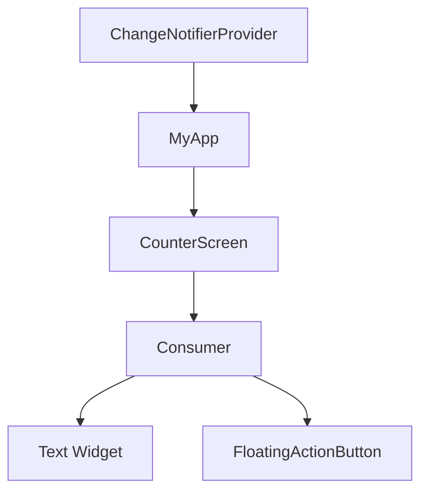

## 6.3.2 Setting Up Provider

State management is a crucial aspect of building dynamic and responsive applications in Flutter. The Provider package is one of the most popular solutions for managing state in Flutter applications due to its simplicity and efficiency. In this section, we will explore how to set up and use Provider in your Flutter projects. We will cover everything from adding the Provider dependency to creating and consuming models, with practical examples and visual aids to guide you through the process.

### Adding Provider Dependency

To begin using Provider in your Flutter application, you need to add it as a dependency in your `pubspec.yaml` file. This file is where you manage all the dependencies for your Flutter project.

```yaml
dependencies:
  flutter:
    sdk: flutter
  provider: ^6.0.0
```

After adding the dependency, run the following command in your terminal to fetch the package:

```bash
flutter pub get
```

This command ensures that all the necessary files are downloaded and integrated into your project, allowing you to use the Provider package.

### Creating a ChangeNotifier Model

The core of using Provider is creating models that extend `ChangeNotifier`. This allows you to manage state changes and notify listeners when the state updates. Let's create a simple `CounterModel` to demonstrate this concept:

```dart
import 'package:flutter/foundation.dart';

class CounterModel extends ChangeNotifier {
  int _counter = 0;

  int get counter => _counter;

  void increment() {
    _counter++;
    notifyListeners();
  }
}
```

#### Explanation:

- **`ChangeNotifier`:** This is a class provided by Flutter that allows you to notify listeners about changes. It is the backbone of the Provider pattern.
- **`_counter`:** A private variable to hold the state of the counter.
- **`counter`:** A getter to expose the counter value.
- **`increment()`:** A method to increase the counter value and call `notifyListeners()`.

The `notifyListeners()` method is crucial as it informs all the widgets listening to this model that they need to rebuild because the state has changed.

### Providing the Model

Once you have your model, you need to provide it to the widget tree. This is done using the `ChangeNotifierProvider` widget. It makes the model available to any descendant widgets in the tree.

```dart
import 'package:flutter/material.dart';
import 'package:provider/provider.dart';
import 'counter_model.dart'; // Import your model

void main() {
  runApp(
    ChangeNotifierProvider(
      create: (context) => CounterModel(),
      child: MyApp(),
    ),
  );
}

class MyApp extends StatelessWidget {
  @override
  Widget build(BuildContext context) {
    return MaterialApp(
      home: CounterScreen(),
    );
  }
}
```

#### Explanation:

- **`ChangeNotifierProvider`:** This widget is used to provide an instance of `CounterModel` to the widget tree.
- **`create`:** A function that returns a new instance of `CounterModel`.
- **`child`:** The root widget of your application, which in this case is `MyApp`.

### Consuming the Model

To use the provided model in your UI, you can use the `Consumer` widget. This widget rebuilds whenever the model notifies listeners of a change.

```dart
import 'package:flutter/material.dart';
import 'package:provider/provider.dart';
import 'counter_model.dart'; // Import your model

class CounterScreen extends StatelessWidget {
  @override
  Widget build(BuildContext context) {
    return Scaffold(
      appBar: AppBar(
        title: Text('Counter App'),
      ),
      body: Center(
        child: Consumer<CounterModel>(
          builder: (context, model, child) {
            return Text(
              'Counter: ${model.counter}',
              style: TextStyle(fontSize: 24),
            );
          },
        ),
      ),
      floatingActionButton: FloatingActionButton(
        onPressed: () {
          Provider.of<CounterModel>(context, listen: false).increment();
        },
        child: Icon(Icons.add),
      ),
    );
  }
}
```

#### Explanation:

- **`Consumer<CounterModel>`:** This widget listens to changes in `CounterModel` and rebuilds its child whenever the model updates.
- **`builder`:** A function that provides the current `context`, the `model` (instance of `CounterModel`), and an optional `child` widget. You use `model` to access the state and methods of `CounterModel`.
- **`Provider.of<CounterModel>(context, listen: false)`:** This is an alternative way to access the model. Setting `listen: false` means this particular call will not rebuild the widget when the model changes.

### Alternative Access Methods

While `Consumer` is the most common way to access the model, you can also use `Provider.of<CounterModel>(context)` directly. This method is useful when you need to access the model without rebuilding the widget.

```dart
void incrementCounter(BuildContext context) {
  final model = Provider.of<CounterModel>(context, listen: false);
  model.increment();
}
```

#### When to Use Each Method:

- **`Consumer`:** Use when you need the widget to rebuild in response to model changes.
- **`Provider.of`:** Use when you only need to perform an action on the model without rebuilding the widget.

### Visual Aid

To better understand how Provider works, let's visualize the hierarchy from `ChangeNotifierProvider` to `Consumer`.



In this diagram:

- **`ChangeNotifierProvider`** provides the `CounterModel` to the entire widget tree.
- **`Consumer<CounterModel>`** listens to changes in `CounterModel` and rebuilds its children (`Text Widget` and `FloatingActionButton`) accordingly.

### Exercises

To solidify your understanding of Provider, try setting up a basic app that manages state using Provider. Here are some exercises to get you started:

- **Exercise 1:** Modify the `CounterModel` to include a decrement method and update the UI to include a button for decrementing the counter.
- **Exercise 2:** Create a new model for managing a list of items. Implement add and remove functionality, and display the list in the UI.
- **Exercise 3:** Experiment with nesting `ChangeNotifierProvider` to manage multiple models in a single app.

### Best Practices

- **Keep Models Simple:** Ensure that your models only contain logic related to state management. Avoid including UI logic in your models.
- **Minimize Rebuilds:** Use `Provider.of` with `listen: false` when you don't need to rebuild the widget to improve performance.
- **Test Your Models:** Write unit tests for your models to ensure that state changes behave as expected.

### Common Pitfalls

- **Forgetting `notifyListeners()`:** Always call `notifyListeners()` after updating the state in your model to ensure the UI reflects the changes.
- **Overusing `Consumer`:** Avoid wrapping large parts of your UI in `Consumer`. Instead, use it only where necessary to minimize rebuilds.
- **Ignoring Performance:** Be mindful of performance implications when using Provider, especially in large applications.

### Additional Resources

- [Flutter Provider Documentation](https://pub.dev/packages/provider)
- [State Management in Flutter](https://flutter.dev/docs/development/data-and-backend/state-mgmt/intro)
- [Flutter Community Articles on Provider](https://medium.com/flutter-community)

By following this guide, you should now have a solid understanding of how to set up and use Provider for state management in your Flutter applications. Remember to experiment with different models and configurations to find what works best for your specific use case.

## Quiz Time!



### What is the primary purpose of the `notifyListeners()` method in a `ChangeNotifier` model?

- [x] To notify all listeners that the state has changed and they should rebuild.
- [ ] To reset the state of the model.
- [ ] To log changes in the console.
- [ ] To initialize the model with default values.

> **Explanation:** The `notifyListeners()` method is used to inform all widgets listening to the model that they need to rebuild because the state has changed.

### Which widget is used to provide a `ChangeNotifier` model to the widget tree?

- [x] ChangeNotifierProvider
- [ ] Consumer
- [ ] Provider.of
- [ ] InheritedWidget

> **Explanation:** `ChangeNotifierProvider` is the widget used to provide a `ChangeNotifier` model to the widget tree, making it available to descendant widgets.

### How can you access a provided model without rebuilding the widget?

- [x] Provider.of<CounterModel>(context, listen: false)
- [ ] Consumer<CounterModel>
- [ ] ChangeNotifierProvider
- [ ] StatefulWidget

> **Explanation:** `Provider.of<CounterModel>(context, listen: false)` allows you to access the model without rebuilding the widget, as it does not listen for changes.

### What is the role of the `builder` parameter in the `Consumer` widget?

- [x] It provides the current context, model, and an optional child widget for building the UI.
- [ ] It initializes the model with default values.
- [ ] It logs changes in the console.
- [ ] It resets the state of the model.

> **Explanation:** The `builder` parameter in the `Consumer` widget provides the current context, model, and an optional child widget, allowing you to build the UI based on the model's state.

### Which method is recommended for accessing the model when you need the widget to rebuild on state changes?

- [x] Consumer<CounterModel>
- [ ] Provider.of<CounterModel>(context, listen: false)
- [ ] ChangeNotifierProvider
- [ ] StatefulWidget

> **Explanation:** `Consumer<CounterModel>` is recommended when you need the widget to rebuild on state changes, as it listens for changes in the model.

### What should you do after adding a new dependency to the `pubspec.yaml` file?

- [x] Run `flutter pub get` to fetch the package.
- [ ] Restart the Flutter app.
- [ ] Rebuild the widget tree.
- [ ] Clear the cache.

> **Explanation:** After adding a new dependency to the `pubspec.yaml` file, you should run `flutter pub get` to fetch the package and integrate it into your project.

### Which of the following is a common pitfall when using Provider?

- [x] Forgetting to call `notifyListeners()` after updating the state.
- [ ] Using `ChangeNotifierProvider` to provide the model.
- [ ] Accessing the model with `Provider.of`.
- [ ] Using `Consumer` to listen for changes.

> **Explanation:** A common pitfall when using Provider is forgetting to call `notifyListeners()` after updating the state, which prevents the UI from reflecting changes.

### What is the purpose of the `ChangeNotifier` class in Flutter?

- [x] To allow models to notify listeners about state changes.
- [ ] To provide default values to models.
- [ ] To log changes in the console.
- [ ] To initialize the widget tree.

> **Explanation:** The `ChangeNotifier` class in Flutter allows models to notify listeners about state changes, enabling dynamic UI updates.

### Which of the following is a best practice when using Provider?

- [x] Keep models simple and focused on state management.
- [ ] Include UI logic in models.
- [ ] Wrap large parts of the UI in `Consumer`.
- [ ] Avoid testing models.

> **Explanation:** A best practice when using Provider is to keep models simple and focused on state management, avoiding the inclusion of UI logic.

### True or False: The `Consumer` widget rebuilds its child whenever the model notifies listeners of a change.

- [x] True
- [ ] False

> **Explanation:** True. The `Consumer` widget rebuilds its child whenever the model notifies listeners of a change, allowing the UI to update dynamically.


