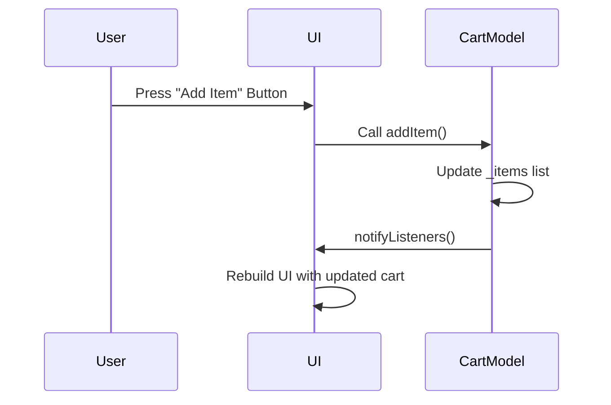

## 6.3.3 Managing State with Provider

State management is a crucial aspect of building robust and scalable Flutter applications. The Provider package is a popular choice among Flutter developers for managing state efficiently. In this section, we will delve into the intricacies of managing state with Provider, focusing on updating state in the model, notifying listeners, using Selector for performance optimization, and building a practical example application—a simple shopping cart app. We will also discuss best practices and provide visual aids to enhance understanding.

### Updating State in the Model

In Flutter, the model class is where the state of your application resides. It is essential to ensure that all state changes occur within this class. This approach encapsulates the state logic and keeps it separate from the UI, promoting a clean architecture.

Consider a simple counter model:

```dart
import 'package:flutter/material.dart';

class CounterModel extends ChangeNotifier {
  int _counter = 0;

  int get counter => _counter;

  void increment() {
    _counter++;
    notifyListeners();
  }

  void decrement() {
    _counter--;
    notifyListeners();
  }
}
```

In this example, the `CounterModel` class extends `ChangeNotifier`, which provides the `notifyListeners()` method. This method is crucial for informing the UI about state changes.

### Notifying Listeners

The `notifyListeners()` method plays a pivotal role in the Provider architecture. After updating any state variable, you must call `notifyListeners()` to trigger UI updates. This mechanism ensures that any widget listening to the model will rebuild with the latest state.

For instance, in the `CounterModel` class, both the `increment()` and `decrement()` methods call `notifyListeners()` after modifying the `_counter` variable. This pattern is fundamental to keeping the UI in sync with the underlying state.

### Using Selector for Performance Optimization

While `notifyListeners()` is effective, it can lead to unnecessary widget rebuilds if not used judiciously. The `Selector` widget addresses this by allowing you to rebuild only those parts of the UI that depend on specific pieces of data.

Here's how you can use `Selector`:

```dart
Selector<CounterModel, int>(
  selector: (context, model) => model.counter,
  builder: (context, counter, child) {
    return Text('Counter: $counter');
  },
);
```

In this example, the `Selector` widget listens to changes in the `counter` property of `CounterModel`. The `builder` function is only called when the `counter` value changes, optimizing performance by avoiding unnecessary rebuilds.

### Example Application: Building a Shopping Cart App

Let's apply these concepts by building a simple shopping cart app. This app will allow users to add and remove items from a cart, with the cart total updating in real-time.

#### Step 1: Define the Cart Model

First, create a `CartModel` class to manage the cart's state:

```dart
import 'package:flutter/material.dart';

class CartModel extends ChangeNotifier {
  final List<String> _items = [];

  List<String> get items => List.unmodifiable(_items);

  void addItem(String item) {
    _items.add(item);
    notifyListeners();
  }

  void removeItem(String item) {
    _items.remove(item);
    notifyListeners();
  }

  int get totalItems => _items.length;
}
```

The `CartModel` class maintains a list of items and provides methods to add and remove items. It also exposes a `totalItems` getter to retrieve the number of items in the cart.

#### Step 2: Provide the Cart Model

Next, use the `Provider` to supply the `CartModel` to the widget tree:

```dart
import 'package:flutter/material.dart';
import 'package:provider/provider.dart';

void main() {
  runApp(
    ChangeNotifierProvider(
      create: (context) => CartModel(),
      child: MyApp(),
    ),
  );
}

class MyApp extends StatelessWidget {
  @override
  Widget build(BuildContext context) {
    return MaterialApp(
      home: ShoppingCart(),
    );
  }
}
```

The `ChangeNotifierProvider` widget wraps the `MyApp` widget, making the `CartModel` available to all descendant widgets.

#### Step 3: Build the Shopping Cart UI

Create a `ShoppingCart` widget to display the cart's contents and allow item manipulation:

```dart
class ShoppingCart extends StatelessWidget {
  @override
  Widget build(BuildContext context) {
    return Scaffold(
      appBar: AppBar(title: Text('Shopping Cart')),
      body: Column(
        children: [
          Expanded(
            child: Consumer<CartModel>(
              builder: (context, cart, child) {
                return ListView.builder(
                  itemCount: cart.items.length,
                  itemBuilder: (context, index) {
                    return ListTile(
                      title: Text(cart.items[index]),
                      trailing: IconButton(
                        icon: Icon(Icons.remove),
                        onPressed: () {
                          cart.removeItem(cart.items[index]);
                        },
                      ),
                    );
                  },
                );
              },
            ),
          ),
          Padding(
            padding: const EdgeInsets.all(16.0),
            child: Text(
              'Total Items: ${context.watch<CartModel>().totalItems}',
              style: TextStyle(fontSize: 20),
            ),
          ),
        ],
      ),
      floatingActionButton: FloatingActionButton(
        onPressed: () {
          context.read<CartModel>().addItem('Item ${context.read<CartModel>().totalItems + 1}');
        },
        child: Icon(Icons.add),
      ),
    );
  }
}
```

- **Consumer Widget:** The `Consumer<CartModel>` widget listens to changes in the `CartModel` and rebuilds the list of items whenever the cart's state changes.
- **FloatingActionButton:** Adds a new item to the cart when pressed.
- **Text Widget:** Displays the total number of items in the cart, updating in real-time.

### Best Practices

- **Single Responsibility:** Ensure that each model class has a single responsibility. This makes your code easier to maintain and test.
- **Separation of Concerns:** Avoid placing UI code in your models. Keep the UI and business logic separate.
- **Resource Management:** If your model holds resources (e.g., streams, controllers), override the `dispose()` method to release them when the model is no longer needed.

### Visual Aid: Sequence Diagram

Below is a sequence diagram illustrating how a user action leads to a state change in the model and updates the UI through Provider:



### Exercises

To reinforce your understanding, try extending the shopping cart app with the following features:

- **Item Quantities:** Allow users to specify quantities for each item in the cart.
- **Total Price Calculation:** Implement a feature to calculate and display the total price of items in the cart.
- **Persistent Storage:** Save the cart's state to persistent storage so that it persists across app restarts.

### Conclusion

Managing state with Provider in Flutter is a powerful technique that promotes clean architecture and efficient UI updates. By encapsulating state logic within model classes and using `notifyListeners()` judiciously, you can build responsive and maintainable applications. The `Selector` widget further enhances performance by minimizing unnecessary rebuilds. By following best practices and experimenting with the provided exercises, you can deepen your understanding and apply these concepts to your own projects.

## Quiz Time!



### What is the primary purpose of the `notifyListeners()` method in a ChangeNotifier model?

- [x] To inform the UI about state changes so it can rebuild.
- [ ] To update the state variables in the model.
- [ ] To initialize the model with default values.
- [ ] To dispose of resources when the model is no longer needed.

> **Explanation:** The `notifyListeners()` method is used to inform any listeners that the state has changed, prompting the UI to rebuild with the new state.

### How does the `Selector` widget optimize performance in a Flutter app?

- [x] By only rebuilding widgets when specific data changes.
- [ ] By caching widget states for faster access.
- [ ] By reducing the number of widgets in the widget tree.
- [ ] By preloading data before the app starts.

> **Explanation:** The `Selector` widget optimizes performance by only rebuilding the parts of the UI that depend on specific pieces of data, thus avoiding unnecessary rebuilds.

### In the provided shopping cart example, what role does the `Consumer` widget play?

- [x] It listens to changes in the `CartModel` and rebuilds the UI accordingly.
- [ ] It provides the `CartModel` to the widget tree.
- [ ] It initializes the cart with default items.
- [ ] It handles user input for adding and removing items.

> **Explanation:** The `Consumer` widget listens to changes in the `CartModel` and rebuilds the UI when the model's state changes.

### What is a best practice when designing model classes in Flutter?

- [x] Ensure each model class has a single responsibility.
- [ ] Include all UI code within the model class.
- [ ] Avoid using the `notifyListeners()` method.
- [ ] Use global variables for state management.

> **Explanation:** A best practice is to ensure that each model class has a single responsibility, which makes the code easier to maintain and test.

### Which method should be overridden to release resources in a model class?

- [x] dispose()
- [ ] initState()
- [ ] build()
- [ ] notifyListeners()

> **Explanation:** The `dispose()` method should be overridden to release resources when the model is no longer needed.

### What is the benefit of using `context.watch<CartModel>()` in the shopping cart example?

- [x] It allows the widget to rebuild when the `CartModel` changes.
- [ ] It initializes the cart with default items.
- [ ] It provides a static reference to the `CartModel`.
- [ ] It prevents the widget from rebuilding unnecessarily.

> **Explanation:** Using `context.watch<CartModel>()` allows the widget to rebuild whenever the `CartModel` changes, ensuring the UI stays in sync with the state.

### How can you extend the shopping cart app to handle item quantities?

- [x] Add a quantity field to each item and update the model to manage quantities.
- [ ] Use a global variable to track item quantities.
- [ ] Store quantities in a separate database.
- [ ] Implement a new widget to handle quantities outside the model.

> **Explanation:** To handle item quantities, you can add a quantity field to each item and update the model to manage these quantities.

### What is the purpose of the `ChangeNotifierProvider` in the Flutter app?

- [x] To provide the `CartModel` to the widget tree.
- [ ] To listen for changes in the `CartModel`.
- [ ] To initialize the app with default settings.
- [ ] To handle user input for adding items.

> **Explanation:** The `ChangeNotifierProvider` is used to provide the `CartModel` to the widget tree, making it accessible to descendant widgets.

### Why is it important to avoid placing UI code in model classes?

- [x] To maintain separation of concerns and keep the architecture clean.
- [ ] To reduce the number of lines of code in the model class.
- [ ] To improve the performance of the app.
- [ ] To ensure the model class can be reused across different projects.

> **Explanation:** Avoiding UI code in model classes maintains separation of concerns, keeping the architecture clean and maintainable.

### True or False: The `Selector` widget can be used to optimize performance by rebuilding only when specific data changes.

- [x] True
- [ ] False

> **Explanation:** True. The `Selector` widget optimizes performance by rebuilding only when specific data changes, reducing unnecessary widget rebuilds.


