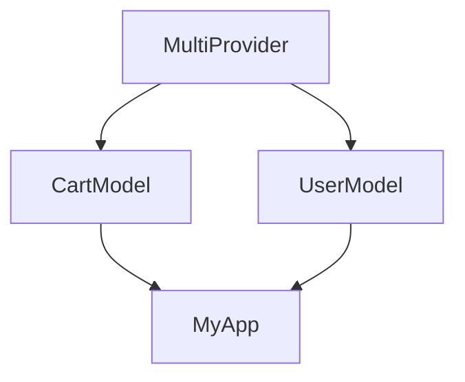
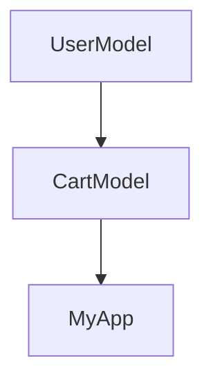
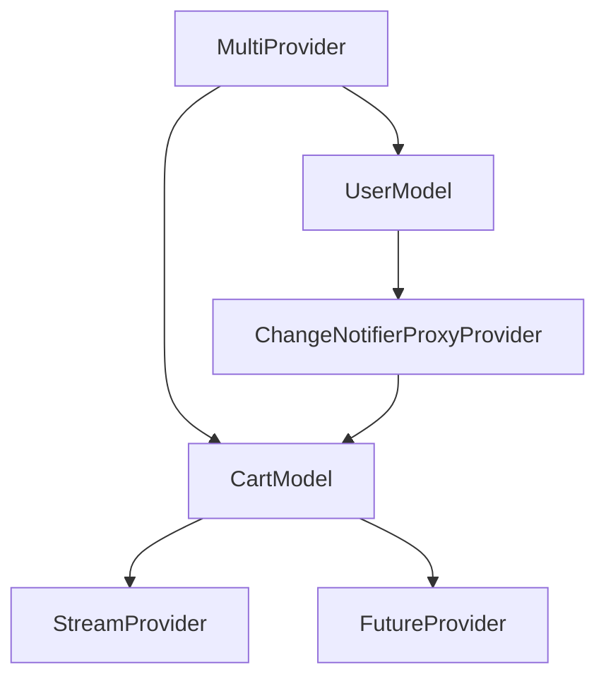

## 6.3.4 Advanced Provider Techniques

In the realm of Flutter development, managing state efficiently is crucial for building responsive and maintainable applications. The Provider package offers a robust solution for state management, and in this section, we delve into advanced techniques that leverage Provider's full potential. We'll explore `MultiProvider`, `ProxyProvider`, handling asynchronous data with `StreamProvider` and `FutureProvider`, error handling, testing, and performance optimization.

### MultiProvider: Managing Multiple Models

When building complex applications, you often need to manage multiple state models. `MultiProvider` allows you to provide multiple models efficiently, ensuring that your app's architecture remains clean and scalable.

```dart
MultiProvider(
  providers: [
    ChangeNotifierProvider(create: (_) => CartModel()),
    ChangeNotifierProvider(create: (_) => UserModel()),
  ],
  child: MyApp(),
);
```

#### Explanation

- **`MultiProvider`**: This widget takes a list of providers and a child widget. It simplifies the process of providing multiple models to the widget tree.
- **`ChangeNotifierProvider`**: This is used to provide instances of `ChangeNotifier` subclasses, such as `CartModel` and `UserModel`.

#### Practical Example

Imagine an e-commerce app where you need to manage both user information and shopping cart data. By using `MultiProvider`, you can easily inject both `UserModel` and `CartModel` into your widget tree, allowing any widget to access and react to changes in these models.

#### Diagram



### ProxyProvider: Creating Dependent Providers

`ProxyProvider` is a powerful tool for creating providers that depend on other providers. This is particularly useful when you need to update one provider based on changes in another.

```dart
ChangeNotifierProxyProvider<UserModel, CartModel>(
  create: (_) => CartModel(),
  update: (_, userModel, cartModel) => cartModel..updateUser(userModel),
);
```

#### Explanation

- **`ChangeNotifierProxyProvider`**: This variant of `ProxyProvider` is used when the dependent provider is a `ChangeNotifier`.
- **`update` method**: This method is called whenever the `UserModel` changes, allowing `CartModel` to update its state accordingly.

#### Practical Example

In our e-commerce app, the `CartModel` might need to update its state based on changes in the `UserModel`, such as applying user-specific discounts or shipping options.

#### Diagram



### Using Provider with Streams and Futures

Managing asynchronous data is a common requirement in modern applications. `StreamProvider` and `FutureProvider` are designed to handle data streams and future results, respectively.

#### StreamProvider

```dart
StreamProvider<int>(
  create: (_) => Stream.periodic(Duration(seconds: 1), (count) => count),
  initialData: 0,
);
```

#### FutureProvider

```dart
FutureProvider<String>(
  create: (_) async => await fetchData(),
  initialData: "Loading...",
);
```

#### Explanation

- **`StreamProvider`**: Provides a stream of data to the widget tree. The `initialData` parameter is used to provide an initial value until the stream emits its first value.
- **`FutureProvider`**: Similar to `StreamProvider`, but for futures. It provides a value once the future completes.

#### Practical Example

In a news app, you might use `StreamProvider` to listen for live updates, while `FutureProvider` can be used to fetch initial data from an API.

### Handling Errors

Error handling is crucial for building robust applications. With Provider, you can handle errors within your models and notify the UI accordingly.

#### Example

```dart
class CartModel extends ChangeNotifier {
  String _errorMessage;

  void addItem(Item item) {
    try {
      // Add item logic
    } catch (error) {
      _errorMessage = error.toString();
      notifyListeners();
    }
  }

  String get errorMessage => _errorMessage;
}
```

#### Explanation

- **Error Handling**: By catching exceptions within your model methods, you can update the UI to reflect errors, such as displaying an error message.

### Testing with Provider

Testing is an integral part of the development process. Provider makes it easy to test models by injecting mock dependencies.

#### Example

```dart
void main() {
  testWidgets('CartModel test', (WidgetTester tester) async {
    final cartModel = MockCartModel();

    await tester.pumpWidget(
      ChangeNotifierProvider<CartModel>.value(
        value: cartModel,
        child: MyApp(),
      ),
    );

    // Test logic
  });
}
```

#### Explanation

- **Mocking**: Use mock models to isolate the unit under test, ensuring that tests are reliable and independent of external dependencies.

### Optimizing Performance

Performance optimization is key to delivering a smooth user experience. Provider offers tools like `Consumer` and `context.select()` for fine-grained control over widget rebuilds.

#### Using Consumer

```dart
Consumer<CartModel>(
  builder: (context, cart, child) {
    return Text('Total items: ${cart.totalItems}');
  },
);
```

#### Using context.select()

```dart
final totalItems = context.select<CartModel, int>((cart) => cart.totalItems);
```

#### Explanation

- **`Consumer`**: Use this widget to rebuild only the parts of the UI that depend on the provider.
- **`context.select()`**: Allows you to listen to specific properties of a provider, reducing unnecessary rebuilds.

### Visual Aid: Provider Relationships

Understanding the relationships between providers is crucial for effective state management.



### Exercises

1. **MultiProvider Setup**: Create a Flutter app that uses `MultiProvider` to manage both a `ThemeModel` and a `LocaleModel`. Ensure that changes in these models update the UI accordingly.

2. **ProxyProvider Implementation**: Extend the e-commerce app example by using `ProxyProvider` to update a `ShippingModel` based on changes in the `UserModel`.

### Conclusion

Advanced Provider techniques empower you to build scalable, efficient, and maintainable Flutter applications. By mastering `MultiProvider`, `ProxyProvider`, and optimizing performance with `Consumer` and `context.select()`, you can create responsive apps that handle complex state management scenarios with ease.

## Quiz Time!



### What is the primary purpose of `MultiProvider` in Flutter?

- [x] To provide multiple models to the widget tree efficiently.
- [ ] To manage asynchronous data streams.
- [ ] To handle errors within models.
- [ ] To optimize performance by reducing rebuilds.

> **Explanation:** `MultiProvider` is used to provide multiple models to the widget tree, simplifying the process of managing multiple state objects.

### How does `ProxyProvider` differ from `MultiProvider`?

- [x] `ProxyProvider` creates providers that depend on other providers.
- [ ] `ProxyProvider` is used for asynchronous data streams.
- [ ] `ProxyProvider` handles error notifications.
- [ ] `ProxyProvider` optimizes performance by reducing rebuilds.

> **Explanation:** `ProxyProvider` is used to create providers that rely on other providers, allowing for dependent state management.

### Which widget is used to selectively rebuild parts of the UI that depend on a provider?

- [x] Consumer
- [ ] StreamProvider
- [ ] FutureProvider
- [ ] MultiProvider

> **Explanation:** `Consumer` is used to rebuild only the parts of the UI that depend on a provider, optimizing performance.

### What is the role of `context.select()` in Flutter?

- [x] To listen to specific properties of a provider and reduce unnecessary rebuilds.
- [ ] To manage asynchronous data streams.
- [ ] To handle error notifications.
- [ ] To provide multiple models to the widget tree.

> **Explanation:** `context.select()` allows you to listen to specific properties of a provider, reducing unnecessary widget rebuilds.

### How can you handle errors within a model using Provider?

- [x] By catching exceptions and using `notifyListeners()` to update the UI.
- [ ] By using `StreamProvider` to manage error streams.
- [ ] By using `FutureProvider` to handle error futures.
- [ ] By using `MultiProvider` to provide error models.

> **Explanation:** Errors can be handled within a model by catching exceptions and using `notifyListeners()` to update the UI with error messages.

### What is the advantage of using `StreamProvider`?

- [x] It manages asynchronous data streams and provides initial data.
- [ ] It handles error notifications within models.
- [ ] It optimizes performance by reducing rebuilds.
- [ ] It provides multiple models to the widget tree.

> **Explanation:** `StreamProvider` is used to manage asynchronous data streams, providing initial data until the stream emits its first value.

### In what scenario would you use `FutureProvider`?

- [x] When you need to provide a value once a future completes.
- [ ] When you need to manage multiple models.
- [ ] When you need to handle error notifications.
- [ ] When you need to optimize performance by reducing rebuilds.

> **Explanation:** `FutureProvider` is used to provide a value once a future completes, making it ideal for handling asynchronous operations.

### How can you test models using Provider?

- [x] By injecting mock dependencies and using `ChangeNotifierProvider`.
- [ ] By using `StreamProvider` to manage test streams.
- [ ] By using `FutureProvider` to handle test futures.
- [ ] By using `MultiProvider` to provide test models.

> **Explanation:** Models can be tested by injecting mock dependencies and using `ChangeNotifierProvider` to isolate the unit under test.

### What is the benefit of using `Consumer` in Flutter?

- [x] It allows selective rebuilding of UI parts that depend on a provider.
- [ ] It manages asynchronous data streams.
- [ ] It handles error notifications within models.
- [ ] It provides multiple models to the widget tree.

> **Explanation:** `Consumer` allows for selective rebuilding of UI parts that depend on a provider, optimizing performance.

### True or False: `ProxyProvider` can be used to update a provider based on changes in another provider.

- [x] True
- [ ] False

> **Explanation:** `ProxyProvider` is specifically designed to update a provider based on changes in another provider, facilitating dependent state management.


