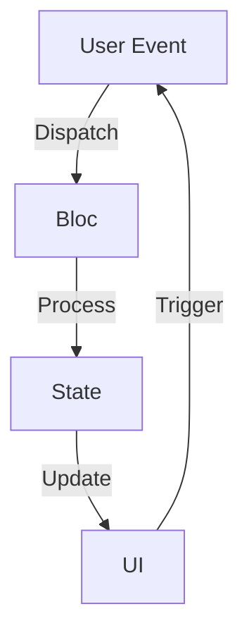

## 6.4.1 Bloc Pattern

In the realm of Flutter development, managing state efficiently is crucial for building responsive and maintainable applications. One of the most robust solutions for state management is the Bloc pattern, which stands for **Business Logic Component**. This pattern emphasizes the separation of business logic from the presentation layer, enabling developers to create scalable and testable applications.

### Overview of Bloc

The Bloc pattern is designed to facilitate a clear separation between the business logic and the user interface (UI). By isolating the business logic, developers can focus on writing clean and reusable code that is independent of the UI framework. This separation not only enhances code maintainability but also simplifies testing and debugging.

- **Business Logic Component (Bloc):** The core idea behind Bloc is to encapsulate the business logic in a separate component, allowing the UI to react to changes in the state without directly handling the logic.
- **Separation of Concerns:** Bloc promotes a clear distinction between the UI and the business logic, making it easier to manage complex applications.

### Core Concepts

Understanding the core concepts of Bloc is essential for implementing it effectively in your Flutter applications. The Bloc pattern revolves around two primary concepts: **Events** and **States**.

#### Events

Events are the inputs to the Bloc. They represent user interactions or other triggers that require the Bloc to perform some business logic. Events are dispatched to the Bloc, which then processes them to produce new states.

- **User Interactions:** Events often originate from user actions, such as button clicks or form submissions.
- **Event Classes:** Define events as classes that extend a common abstract class. This approach allows for easy expansion and management of different event types.

#### States

States are the outputs of the Bloc. They represent the current condition of the UI, reflecting the result of processing events. The UI listens to state changes and updates accordingly.

- **UI Representation:** States dictate how the UI should appear at any given moment.
- **State Classes:** Similar to events, states are defined as classes, allowing for a structured approach to managing different UI conditions.

### Implementing Bloc

To implement the Bloc pattern in Flutter, we utilize the `flutter_bloc` package, which provides a set of tools and utilities to simplify the integration of Bloc into your applications.

#### Introducing the `flutter_bloc` Package

The `flutter_bloc` package is a powerful library that facilitates the implementation of the Bloc pattern in Flutter. It provides essential components such as `BlocProvider`, `BlocBuilder`, and `BlocListener`, which help manage the lifecycle and interaction of Blocs within the widget tree.

To get started, add the `flutter_bloc` package to your `pubspec.yaml` file:

```yaml
dependencies:
  flutter_bloc: ^8.0.0
```

#### Defining Events and States

Let's explore how to define events and states in a simple counter application:

```dart
// Events
abstract class CounterEvent {}

class IncrementEvent extends CounterEvent {}

// Bloc
class CounterBloc extends Bloc<CounterEvent, int> {
  CounterBloc() : super(0);

  @override
  Stream<int> mapEventToState(CounterEvent event) async* {
    if (event is IncrementEvent) {
      yield state + 1;
    }
  }
}
```

- **CounterEvent:** An abstract class representing the base event type.
- **IncrementEvent:** A specific event that triggers the increment of the counter.
- **CounterBloc:** A Bloc that manages the state of an integer counter. It starts with an initial state of `0` and increments the state in response to `IncrementEvent`.

### Integrating Bloc into the UI

Integrating Bloc into the UI involves providing the Bloc to the widget tree and using widgets to rebuild the UI in response to state changes.

#### Using `BlocProvider`

`BlocProvider` is a widget that provides a Bloc to its descendants. It ensures that the Bloc is properly disposed of when no longer needed.

```dart
BlocProvider(
  create: (context) => CounterBloc(),
  child: MyCounterApp(),
);
```

- **BlocProvider:** Wraps the widget tree and provides the `CounterBloc` to its descendants.
- **MyCounterApp:** The root widget of your application that can access the `CounterBloc`.

#### Using `BlocBuilder`

`BlocBuilder` is a widget that listens to state changes in the Bloc and rebuilds the UI accordingly.

```dart
BlocBuilder<CounterBloc, int>(
  builder: (context, count) {
    return Text('Counter: $count');
  },
);
```

- **BlocBuilder:** Listens to the `CounterBloc` and rebuilds the `Text` widget whenever the state changes.
- **Text Widget:** Displays the current count, reflecting the state of the `CounterBloc`.

### Visual Aid

To better understand the flow of data in the Bloc pattern, consider the following diagram:



- **User Event:** Represents an action initiated by the user.
- **Bloc:** Processes the event and produces a new state.
- **State:** Represents the current condition of the UI.
- **UI:** Updates in response to state changes and can trigger new events.

### When to Use Bloc

The Bloc pattern is particularly suitable for complex applications where a clear separation between UI and logic is beneficial. It excels in scenarios where:

- **Complex Business Logic:** Applications with intricate business rules that require structured management.
- **Scalability:** Projects that anticipate growth and require a scalable architecture.
- **Testability:** Applications that benefit from isolated and testable business logic.

### Exercises

To solidify your understanding of the Bloc pattern, try creating a simple app using Bloc to manage state. Consider building a login form where:

- **Events:** Represent user actions such as entering credentials and submitting the form.
- **States:** Reflect the form's current status, such as loading, success, or error.

### Conclusion

The Bloc pattern is a powerful tool in the Flutter developer's arsenal, offering a structured approach to state management that enhances code maintainability and testability. By separating business logic from presentation, developers can build scalable and robust applications that are easier to manage and extend.

### Additional Resources

To further explore the Bloc pattern and its applications in Flutter, consider the following resources:

- [Bloc Library Documentation](https://bloclibrary.dev/#/)
- [Flutter Bloc Package on Pub.dev](https://pub.dev/packages/flutter_bloc)
- [Bloc Pattern in Flutter: A Comprehensive Guide](https://medium.com/flutter-community/flutter-bloc-pattern-a-comprehensive-guide-8f3e1e2a5a5e)

## Quiz Time!



### What does Bloc stand for in the context of Flutter?

- [x] Business Logic Component
- [ ] Basic Logic Controller
- [ ] Binary Logic Circuit
- [ ] Block Logic Compiler

> **Explanation:** Bloc stands for Business Logic Component, emphasizing the separation of business logic from the UI.

### What are the primary components of the Bloc pattern?

- [x] Events and States
- [ ] Controllers and Views
- [ ] Models and Services
- [ ] Actions and Reducers

> **Explanation:** The primary components of the Bloc pattern are Events and States, which represent inputs and outputs of the Bloc.

### Which package is commonly used to implement the Bloc pattern in Flutter?

- [x] flutter_bloc
- [ ] provider
- [ ] redux
- [ ] riverpod

> **Explanation:** The `flutter_bloc` package is commonly used to implement the Bloc pattern in Flutter applications.

### How does BlocBuilder help in integrating Bloc into the UI?

- [x] It rebuilds the UI in response to state changes.
- [ ] It provides the Bloc to the widget tree.
- [ ] It manages the lifecycle of the Bloc.
- [ ] It handles user input events.

> **Explanation:** BlocBuilder listens to state changes in the Bloc and rebuilds the UI accordingly.

### What is the role of BlocProvider in a Flutter application?

- [x] It provides the Bloc to its descendants.
- [ ] It handles network requests.
- [ ] It manages database connections.
- [ ] It styles the application.

> **Explanation:** BlocProvider is a widget that provides a Bloc to its descendants, ensuring proper lifecycle management.

### When is the Bloc pattern particularly beneficial?

- [x] In complex applications with intricate business logic.
- [ ] In simple applications with minimal logic.
- [ ] When using only stateless widgets.
- [ ] For styling and theming purposes.

> **Explanation:** The Bloc pattern is beneficial in complex applications where a clear separation between UI and logic is needed.

### What is the initial state of the CounterBloc in the provided example?

- [x] 0
- [ ] 1
- [ ] null
- [ ] -1

> **Explanation:** The CounterBloc starts with an initial state of 0, as defined in the constructor.

### Which widget is used to listen to state changes and rebuild the UI?

- [x] BlocBuilder
- [ ] BlocListener
- [ ] BlocConsumer
- [ ] BlocProvider

> **Explanation:** BlocBuilder is used to listen to state changes and rebuild the UI in response.

### What is the purpose of defining events as classes in Bloc?

- [x] To allow easy expansion and management of different event types.
- [ ] To handle network requests.
- [ ] To manage database connections.
- [ ] To style the application.

> **Explanation:** Defining events as classes allows for easy expansion and management of different event types.

### True or False: Bloc pattern is only suitable for small applications.

- [ ] True
- [x] False

> **Explanation:** False. The Bloc pattern is suitable for complex applications where a clear separation between UI and logic is beneficial.


