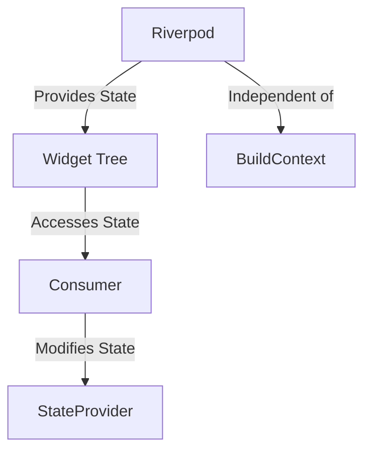

## 6.4.2 Riverpod

State management is a crucial aspect of Flutter development, and choosing the right solution can significantly impact your application's architecture and maintainability. In this section, we delve into Riverpod, a modern, type-safe, and testable state management solution for Flutter. Riverpod is a rewrite of the popular Provider package, designed to address its limitations and offer enhanced performance and testing capabilities.

### Introduction to Riverpod

Riverpod is a state management library for Flutter that provides a robust and flexible way to manage state across your application. It is built with the goal of overcoming some of the challenges and limitations associated with the Provider package. Riverpod offers several key advantages:

- **Type Safety:** Riverpod is designed to be type-safe, reducing runtime errors and improving code reliability.
- **Testability:** It simplifies testing by decoupling state management from the widget tree, making it easier to write unit tests.
- **No `BuildContext` Dependency:** Unlike Provider, Riverpod does not rely on `BuildContext` to access providers, which reduces errors and makes it easier to manage state outside the widget tree.
- **Provider Scoping:** Riverpod supports provider scoping, allowing you to define providers that are only available within a specific part of your application.

### Advantages of Riverpod

Riverpod offers several advantages over traditional state management solutions like Provider:

- **Improved Performance:** By eliminating the dependency on `BuildContext`, Riverpod reduces the overhead associated with widget rebuilding, leading to better performance.
- **Enhanced Testing Capabilities:** Riverpod's architecture makes it easier to test state management logic in isolation, without the need for a widget tree.
- **Provider Scoping:** Riverpod allows you to scope providers to specific parts of your application, reducing the risk of unintended state sharing and improving modularity.

### Implementing Riverpod

Let's explore how to implement Riverpod in a Flutter application. We'll start by defining a simple counter provider and then demonstrate how to access and modify its state in the UI.

#### Defining a Provider

To define a provider in Riverpod, you use the `StateProvider` class. Here's an example of a simple counter provider:

```dart
final counterProvider = StateProvider((ref) => 0);
```

In this example, `counterProvider` is a `StateProvider` that holds an integer value, initialized to 0.

#### Accessing the Provider in the UI

To access the provider's state in the UI, you use the `Consumer` widget. Here's how you can display the counter value:

```dart
Consumer(
  builder: (context, watch, _) {
    final count = watch(counterProvider).state;
    return Text('Counter: $count');
  },
);
```

In this code snippet, the `Consumer` widget listens to changes in the `counterProvider` and rebuilds the `Text` widget whenever the counter value changes.

#### Modifying the State

To modify the state of a provider, you use the `read` method to access the provider and update its state:

```dart
context.read(counterProvider).state++;
```

This line increments the counter value by 1.

### Types of Providers

Riverpod offers several types of providers to handle different state management scenarios:

- **Provider:** Used for immutable data that doesn't change over time. It's ideal for providing configuration or constant values.
- **StateProvider:** Used for managing mutable state. It allows you to read and write state values.
- **FutureProvider:** Used for asynchronous operations. It handles loading, success, and error states automatically.
- **ChangeNotifierProvider:** Used for classes that extend `ChangeNotifier`, providing a way to manage complex state logic.

### Visual Aid

To better understand how Riverpod eliminates the dependency on `BuildContext`, consider the following diagram:



In this diagram, Riverpod provides state independently of the widget tree, allowing widgets to access and modify state without relying on `BuildContext`.

### Exercises

To solidify your understanding of Riverpod, try the following exercise:

- **Refactor an Existing App:** Take an existing Flutter app that uses Provider for state management and refactor it to use Riverpod. Observe the differences in code structure, performance, and testability.

### Conclusion

Riverpod is a powerful and flexible state management solution for Flutter that addresses many of the limitations of Provider. By eliminating the dependency on `BuildContext`, improving performance, and enhancing testability, Riverpod provides a modern approach to managing state in Flutter applications. As you explore Riverpod, consider how its features can benefit your projects and improve your development workflow.

For further exploration, refer to the official [Riverpod documentation](https://riverpod.dev) and consider experimenting with different types of providers to see how they can be applied to various state management scenarios.

## Quiz Time!



### What is one of the main advantages of Riverpod over Provider?

- [x] It does not rely on `BuildContext`.
- [ ] It is only for immutable data.
- [ ] It requires less code.
- [ ] It is a built-in Flutter package.

> **Explanation:** Riverpod eliminates the dependency on `BuildContext`, reducing errors when accessing providers.

### How do you define a simple counter provider using Riverpod?

- [x] `final counterProvider = StateProvider((ref) => 0);`
- [ ] `final counterProvider = Provider((ref) => 0);`
- [ ] `final counterProvider = FutureProvider((ref) => 0);`
- [ ] `final counterProvider = ChangeNotifierProvider((ref) => 0);`

> **Explanation:** A `StateProvider` is used for mutable state, initialized with a value of 0.

### Which widget is used to access a provider's state in the UI?

- [x] `Consumer`
- [ ] `Provider`
- [ ] `StateProvider`
- [ ] `FutureProvider`

> **Explanation:** The `Consumer` widget listens to changes in the provider and rebuilds the UI accordingly.

### How do you modify the state of a provider in Riverpod?

- [x] `context.read(counterProvider).state++;`
- [ ] `context.watch(counterProvider).state++;`
- [ ] `context.listen(counterProvider).state++;`
- [ ] `context.observe(counterProvider).state++;`

> **Explanation:** The `read` method is used to access and modify the provider's state.

### What type of provider is used for asynchronous operations in Riverpod?

- [x] `FutureProvider`
- [ ] `StateProvider`
- [ ] `Provider`
- [ ] `ChangeNotifierProvider`

> **Explanation:** `FutureProvider` is used for handling asynchronous operations.

### Which of the following is NOT a type of provider in Riverpod?

- [x] `StreamProvider`
- [ ] `Provider`
- [ ] `StateProvider`
- [ ] `FutureProvider`

> **Explanation:** `StreamProvider` is not mentioned as a type of provider in the context of this section.

### What is a key feature of Riverpod that enhances testability?

- [x] It decouples state management from the widget tree.
- [ ] It uses `BuildContext` for accessing providers.
- [ ] It requires fewer lines of code.
- [ ] It is integrated with Flutter's widget tree.

> **Explanation:** Riverpod's architecture allows for easier testing by decoupling state management from the widget tree.

### What is the purpose of provider scoping in Riverpod?

- [x] To define providers that are only available within a specific part of the application.
- [ ] To reduce the number of providers in the application.
- [ ] To increase the performance of the application.
- [ ] To simplify the syntax of providers.

> **Explanation:** Provider scoping allows for defining providers that are only available within a specific part of the application, improving modularity.

### How does Riverpod improve performance compared to Provider?

- [x] By reducing the overhead associated with widget rebuilding.
- [ ] By using fewer resources.
- [ ] By simplifying the codebase.
- [ ] By integrating with Flutter's widget tree.

> **Explanation:** Riverpod improves performance by eliminating the dependency on `BuildContext`, reducing the overhead associated with widget rebuilding.

### True or False: Riverpod is a built-in Flutter package.

- [ ] True
- [x] False

> **Explanation:** Riverpod is not a built-in Flutter package; it is a third-party state management solution.


