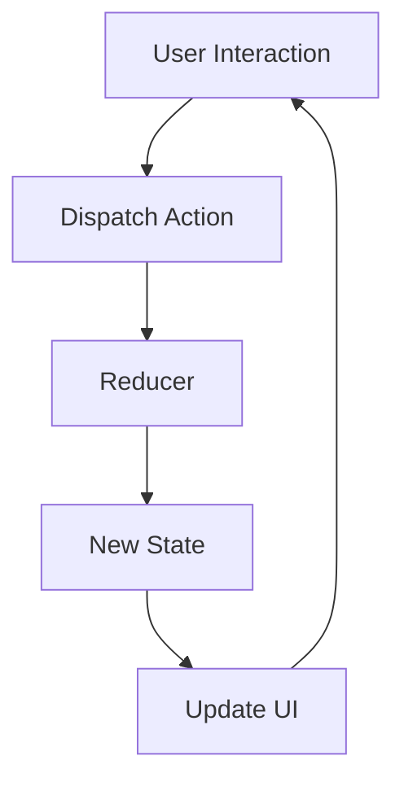
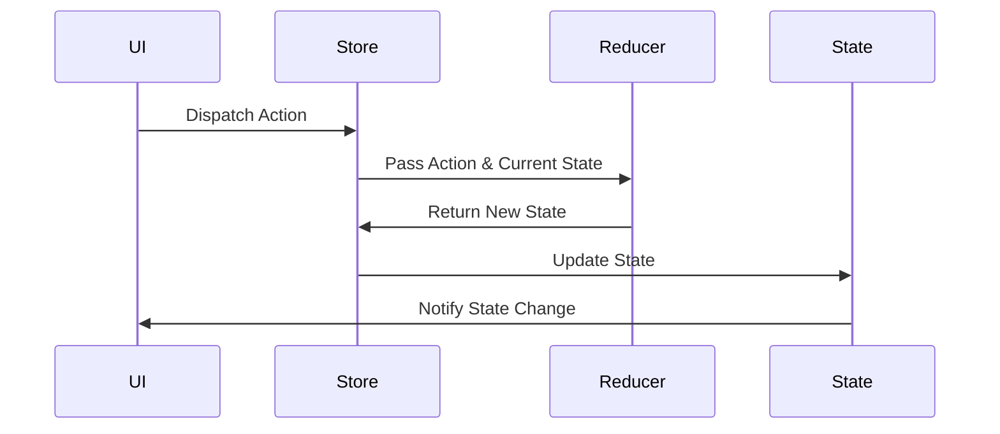

## 6.4.3 Redux in Flutter

State management is a crucial aspect of building robust and scalable applications. In this section, we delve into Redux, a popular state management library that provides a predictable state container for JavaScript apps and has been adapted for Flutter. We'll explore its principles, implementation, and practical applications in Flutter development.

### Understanding Redux

Redux is built on three core principles that ensure a predictable and maintainable state management system:

- **Single Source of Truth:** The entire state of your application is stored in a single object tree within a single store. This centralization simplifies debugging and testing by providing a single point of reference for the app's state.

- **State is Read-Only:** The only way to change the state is to emit an action, an object describing what happened. This ensures that views or network callbacks never write directly to the state, maintaining consistency and predictability.

- **Changes are Made with Pure Functions:** To specify how the state tree is transformed by actions, you write pure reducers. Reducers are pure functions that take the previous state and an action, and return the next state. This immutability and predictability make the system easier to understand and debug.

#### Redux Architecture

To better understand how Redux operates, let's visualize its architecture:



- **User Interaction:** The user interacts with the UI, triggering an action.
- **Dispatch Action:** An action is dispatched to the store.
- **Reducer:** The reducer processes the action and returns a new state.
- **New State:** The store updates the state with the new state.
- **Update UI:** The UI is re-rendered to reflect the new state.

### Implementing Redux in Flutter

To implement Redux in a Flutter application, you need to set up the store, actions, reducers, and state. Let's walk through these steps using a simple counter app as an example.

#### Step 1: Add Dependencies

First, add the `redux` and `flutter_redux` packages to your `pubspec.yaml` file:

```yaml
dependencies:
  flutter:
    sdk: flutter
  redux: ^5.0.0
  flutter_redux: ^0.8.2
```

Run `flutter pub get` to install the packages.

#### Step 2: Define the State

Create a class to represent the state of your application. In this example, the state consists of a single integer representing a counter.

```dart
// State
class AppState {
  final int counter;
  AppState(this.counter);
}
```

#### Step 3: Define Actions

Actions are simple classes that represent events in your application. For our counter app, we'll define an `IncrementAction`.

```dart
// Actions
class IncrementAction {}
```

#### Step 4: Create the Reducer

The reducer is a pure function that takes the current state and an action, and returns a new state. It determines how the state should change in response to an action.

```dart
// Reducer
AppState reducer(AppState state, dynamic action) {
  if (action is IncrementAction) {
    return AppState(state.counter + 1);
  }
  return state;
}
```

#### Step 5: Set Up the Store

The store holds the application state and provides methods to dispatch actions and subscribe to changes.

```dart
import 'package:redux/redux.dart';

void main() {
  final store = Store<AppState>(
    reducer,
    initialState: AppState(0),
  );

  runApp(MyApp(store: store));
}
```

#### Step 6: Connect the UI

Use the `StoreProvider` and `StoreConnector` widgets from `flutter_redux` to connect your UI to the Redux store.

```dart
import 'package:flutter/material.dart';
import 'package:flutter_redux/flutter_redux.dart';

class MyApp extends StatelessWidget {
  final Store<AppState> store;

  MyApp({required this.store});

  @override
  Widget build(BuildContext context) {
    return StoreProvider<AppState>(
      store: store,
      child: MaterialApp(
        home: CounterPage(),
      ),
    );
  }
}

class CounterPage extends StatelessWidget {
  @override
  Widget build(BuildContext context) {
    return Scaffold(
      appBar: AppBar(title: Text('Redux Counter')),
      body: Center(
        child: StoreConnector<AppState, int>(
          converter: (store) => store.state.counter,
          builder: (context, counter) {
            return Text(
              '$counter',
              style: TextStyle(fontSize: 48.0),
            );
          },
        ),
      ),
      floatingActionButton: StoreConnector<AppState, VoidCallback>(
        converter: (store) {
          return () => store.dispatch(IncrementAction());
        },
        builder: (context, callback) {
          return FloatingActionButton(
            onPressed: callback,
            child: Icon(Icons.add),
          );
        },
      ),
    );
  }
}
```

### When to Use Redux

Redux is particularly beneficial for large applications where a predictable state container is needed. It shines in scenarios where:

- The application has a complex state that needs to be shared across many components.
- You need a clear and consistent way to manage state changes.
- Debugging and testing are priorities, as Redux's architecture makes it easier to track state changes.

### Visual Aid: Redux Flow

To further illustrate the flow of data in a Redux application, consider the following diagram:



### Exercises

To solidify your understanding of Redux in Flutter, try implementing a more complex application, such as a task manager. Consider the following features:

- **Task Creation:** Allow users to add new tasks.
- **Task Completion:** Enable users to mark tasks as completed.
- **Task Filtering:** Provide options to filter tasks by status (e.g., all, completed, pending).

### Conclusion

Redux offers a powerful and predictable way to manage state in Flutter applications, especially as they grow in complexity. By adhering to its principles of a single source of truth, read-only state, and pure functions, developers can create maintainable and scalable applications.

### Additional Resources

- [Redux Official Documentation](https://redux.js.org/)
- [Flutter Redux Package](https://pub.dev/packages/flutter_redux)
- [Redux in Flutter: A Practical Guide](https://medium.com/flutter-community/redux-in-flutter-a-practical-guide-2c1e2b8f7e0b)

## Quiz Time!



### What is the primary principle of Redux regarding state storage?

- [x] Single Source of Truth
- [ ] Multiple Sources of Truth
- [ ] Distributed State Management
- [ ] No State Management

> **Explanation:** Redux maintains a single source of truth, meaning the entire state of the application is stored in a single object tree within a single store.

### How are changes made to the state in Redux?

- [x] Through pure functions called reducers
- [ ] By directly modifying the state
- [ ] Using asynchronous callbacks
- [ ] Through UI interactions

> **Explanation:** Changes to the state in Redux are made using pure functions called reducers, which take the previous state and an action to produce a new state.

### What is the role of actions in Redux?

- [x] To describe what happened
- [ ] To directly modify the state
- [ ] To render UI components
- [ ] To manage network requests

> **Explanation:** Actions in Redux are objects that describe what happened, serving as the only way to convey information to the store.

### Which package is used to integrate Redux with Flutter?

- [x] flutter_redux
- [ ] redux_flutter
- [ ] redux_in_flutter
- [ ] flutter_state

> **Explanation:** The `flutter_redux` package is used to integrate Redux with Flutter, providing widgets like `StoreProvider` and `StoreConnector`.

### What is a reducer in Redux?

- [x] A pure function that returns a new state
- [ ] A component that renders UI
- [ ] A middleware for handling actions
- [ ] A service for network requests

> **Explanation:** A reducer is a pure function that takes the current state and an action, and returns a new state.

### When is Redux most beneficial?

- [x] In large applications with complex state
- [ ] In small applications with simple state
- [ ] When no state management is needed
- [ ] When using only local state

> **Explanation:** Redux is most beneficial in large applications with complex state that needs to be shared across many components.

### What is the purpose of the `StoreProvider` widget in Flutter Redux?

- [x] To provide the Redux store to the widget tree
- [ ] To dispatch actions to the store
- [ ] To render UI components
- [ ] To manage network requests

> **Explanation:** The `StoreProvider` widget provides the Redux store to the widget tree, making it accessible to all descendant widgets.

### How does the `StoreConnector` widget function in a Flutter Redux app?

- [x] It connects the UI to the Redux store
- [ ] It dispatches actions to the store
- [ ] It manages network requests
- [ ] It renders static content

> **Explanation:** The `StoreConnector` widget connects the UI to the Redux store, allowing the UI to react to state changes.

### What is the main advantage of using Redux in Flutter?

- [x] Predictable state management
- [ ] Faster UI rendering
- [ ] Simplified network requests
- [ ] Reduced code complexity

> **Explanation:** The main advantage of using Redux in Flutter is predictable state management, which simplifies debugging and testing.

### True or False: In Redux, the state can be modified directly by components.

- [ ] True
- [x] False

> **Explanation:** False. In Redux, the state is read-only and cannot be modified directly by components. Changes are made through actions and reducers.


