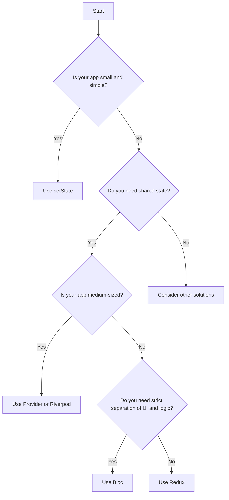

## 6.4.4 Comparison of State Management Libraries

State management is a critical aspect of Flutter development, influencing how data flows through your application and how UI components react to changes. Choosing the right state management solution can significantly impact your app's performance, scalability, and maintainability. This section provides a detailed comparison of popular state management libraries in Flutter, helping you make informed decisions for your projects.

### Comparison Criteria

To effectively compare state management libraries, we will evaluate them based on the following criteria:

- **Complexity:** The difficulty level of implementing and maintaining the library.
- **Scalability:** The library's ability to handle increasing app size and complexity.
- **Boilerplate Code:** The amount of code required to set up and maintain the library.
- **Community Support:** The availability of resources, documentation, and community assistance.

### Comparative Table

Below is a comparative table summarizing the key attributes of each state management library:

| Library       | Complexity | Scalability | Boilerplate | Community Support |
|---------------|------------|-------------|-------------|-------------------|
| setState      | Low        | Low         | Low         | High              |
| Provider      | Low        | Medium      | Low         | High              |
| Bloc          | Medium     | High        | Medium      | High              |
| Riverpod      | Medium     | High        | Low         | Growing           |
| Redux         | High       | High        | High        | Medium            |

### Use Case Recommendations

- **setState():** Ideal for simple, local state management in small applications where the state is confined to a single widget or a small widget tree.
- **Provider/Riverpod:** Suitable for small to medium-sized applications that require shared state across multiple widgets. Riverpod offers a more modern approach with less boilerplate compared to Provider.
- **Bloc:** Best for medium to large applications that benefit from a clear separation between UI and business logic, promoting a reactive programming model.
- **Redux:** Recommended for large applications that demand strict state management and predictability, often at the cost of increased complexity and boilerplate.

### Pros and Cons Discussion

#### setState

**Pros:**
- **Simplicity:** Easy to understand and implement, making it ideal for beginners.
- **Low Overhead:** Minimal setup and boilerplate code.
- **Direct Control:** Provides direct control over widget state updates.

**Cons:**
- **Scalability Issues:** Becomes difficult to manage as the app grows.
- **Limited to Local State:** Not suitable for managing global or shared state.

#### Provider

**Pros:**
- **Ease of Use:** Simple API with minimal boilerplate.
- **Good for Shared State:** Efficient for managing shared state across widgets.
- **Community Support:** Strong community backing and extensive documentation.

**Cons:**
- **Medium Scalability:** May require additional patterns (like ChangeNotifier) for complex state management.
- **Verbose for Complex Logic:** Can become verbose when dealing with complex business logic.

#### Bloc

**Pros:**
- **Separation of Concerns:** Clearly separates UI from business logic.
- **Reactive Programming Model:** Encourages a reactive approach, making it easier to manage asynchronous data streams.
- **High Scalability:** Suitable for large applications with complex state management needs.

**Cons:**
- **Complexity:** Steeper learning curve compared to simpler solutions.
- **Boilerplate:** Requires more boilerplate code, especially for event and state classes.

#### Riverpod

**Pros:**
- **Modern Approach:** Offers a more modern and flexible API compared to Provider.
- **Less Boilerplate:** Reduces boilerplate code with a more declarative approach.
- **High Scalability:** Scales well with application complexity.

**Cons:**
- **Growing Community:** While growing, the community and resources are not as extensive as Provider or Bloc.
- **Learning Curve:** Requires understanding of its unique concepts and patterns.

#### Redux

**Pros:**
- **Predictability:** Ensures predictable state changes through a single source of truth.
- **Time Travel Debugging:** Allows for powerful debugging capabilities.
- **High Scalability:** Handles complex state management in large applications.

**Cons:**
- **High Complexity:** Complex setup and steep learning curve.
- **Boilerplate Heavy:** Requires significant boilerplate code for actions, reducers, and middleware.

### Visual Aid: Decision Tree

To assist in choosing the right state management solution, consider the following decision tree:

### Final Advice

When selecting a state management solution, it's crucial to choose the simplest option that effectively meets your app's needs. Remember that it's possible to mix and match different strategies or transition between them as your app evolves. For instance, you might start with setState for local state and gradually incorporate Provider or Bloc as your app grows.

### Exercises

To apply what you've learned, consider the following exercises:

- **Exercise 1:** Evaluate a current or planned project. Identify the state management needs and decide which solution would be most appropriate based on the comparison criteria.
- **Exercise 2:** Implement a small feature using setState, then refactor it to use Provider or Riverpod. Observe the differences in complexity and scalability.
- **Exercise 3:** Create a simple app using Bloc for state management. Focus on separating UI and business logic, and reflect on the benefits and challenges encountered.

### Conclusion

State management is a foundational aspect of Flutter development, and choosing the right solution can greatly influence your app's success. By understanding the strengths and weaknesses of each library, you can make informed decisions that align with your project's requirements and goals. As you gain experience, you'll develop a deeper intuition for selecting and combining state management strategies to build robust and scalable applications.

## Quiz Time!



### Which state management solution is best suited for small, simple apps with local state?

- [x] setState
- [ ] Provider
- [ ] Bloc
- [ ] Redux

> **Explanation:** setState is ideal for managing local state in small, simple applications due to its simplicity and low overhead.

### Which library is recommended for medium to large apps needing separation of UI and business logic?

- [ ] setState
- [ ] Provider
- [x] Bloc
- [ ] Redux

> **Explanation:** Bloc is recommended for medium to large applications that benefit from a clear separation between UI and business logic.

### What is a key advantage of using Redux for state management?

- [ ] Low complexity
- [x] Predictability
- [ ] Minimal boilerplate
- [ ] Small community

> **Explanation:** Redux ensures predictable state changes through a single source of truth, which is a key advantage for complex applications.

### Which state management solution is known for having a growing community but less boilerplate compared to others?

- [ ] setState
- [ ] Provider
- [x] Riverpod
- [ ] Redux

> **Explanation:** Riverpod is known for having a growing community and offers a modern approach with less boilerplate compared to other solutions.

### What is a common disadvantage of using Bloc for state management?

- [ ] Low scalability
- [x] Complexity
- [ ] Lack of community support
- [ ] Minimal boilerplate

> **Explanation:** Bloc has a steeper learning curve and requires more boilerplate code, making it more complex to implement.

### Which solution is best for large applications needing strict state management and predictability?

- [ ] setState
- [ ] Provider
- [ ] Bloc
- [x] Redux

> **Explanation:** Redux is best suited for large applications that require strict state management and predictability.

### What is a benefit of using Provider for state management?

- [x] Ease of use
- [ ] High complexity
- [ ] High boilerplate
- [ ] Small community

> **Explanation:** Provider is easy to use with a simple API and minimal boilerplate, making it a popular choice for shared state management.

### Which library offers time travel debugging as a feature?

- [ ] setState
- [ ] Provider
- [ ] Bloc
- [x] Redux

> **Explanation:** Redux offers time travel debugging, allowing developers to navigate through state changes for powerful debugging capabilities.

### What is a key consideration when choosing a state management solution?

- [x] Simplicity and effectiveness for the app's needs
- [ ] Popularity of the library
- [ ] Amount of boilerplate code
- [ ] Complexity of the solution

> **Explanation:** It's important to choose the simplest solution that effectively meets the app's needs, balancing complexity and functionality.

### True or False: It's possible to mix and match state management strategies as an app evolves.

- [x] True
- [ ] False

> **Explanation:** Developers can mix and match different state management strategies or transition between them as the app's requirements change.


