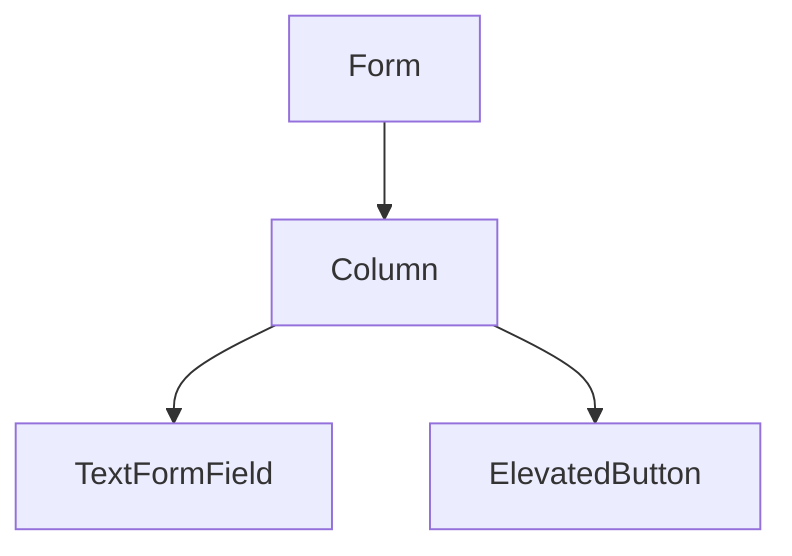

## 7.1.1 Creating Forms in Flutter

Forms are integral components of many applications, serving as the primary means for collecting user input. Whether you're developing a simple contact form or a complex multi-step registration process, understanding how to effectively create and manage forms in Flutter is crucial. Flutter provides a robust set of tools and widgets, such as `Form` and `TextFormField`, to facilitate form creation and validation. This section will guide you through the process of building forms in Flutter, from basic setup to best practices.

### Introduction to Forms

Forms are ubiquitous in applications, enabling users to input data that can be processed and stored. In Flutter, forms are built using a combination of widgets that work together to collect and validate user input. The `Form` widget acts as a container for form fields, while widgets like `TextFormField` provide the interface for user input. Flutter's form handling capabilities allow for efficient data collection and validation, ensuring that user input is both accurate and secure.

### Understanding the Form Widget

The `Form` widget in Flutter serves as a container for grouping and validating multiple form fields. It maintains the state of its child widgets and provides methods for validation and submission. By encapsulating form fields within a `Form` widget, you can easily manage the state and validation of the entire form.

#### Key Features of the Form Widget

- **State Management:** The `Form` widget maintains the state of its child widgets, allowing for consistent validation and data handling.
- **Validation:** Provides methods to validate form fields, ensuring that user input meets specified criteria.
- **Submission:** Offers a straightforward way to handle form submission, processing data only when all fields are valid.

### Creating a Basic Form

Let's start by creating a basic form in Flutter. This example demonstrates how to use the `Form` widget along with `TextFormField` and `ElevatedButton` to collect and validate user input.

```dart
class SimpleForm extends StatelessWidget {
  final _formKey = GlobalKey<FormState>();

  @override
  Widget build(BuildContext context) {
    return Form(
      key: _formKey,
      child: Column(
        children: <Widget>[
          TextFormField(
            decoration: InputDecoration(labelText: 'Enter your name'),
          ),
          ElevatedButton(
            onPressed: () {
              if (_formKey.currentState!.validate()) {
                // Process data
              }
            },
            child: Text('Submit'),
          ),
        ],
      ),
    );
  }
}
```

#### Explanation of the Code

- **GlobalKey<FormState>:** A unique key that identifies the form and allows access to its state. This key is essential for validating and saving form data.
- **Form Widget:** Acts as the root of the form, containing all form fields and managing their state.
- **TextFormField:** A widget that provides a text input field with built-in validation capabilities.
- **ElevatedButton:** A button that triggers form validation and submission when pressed.

### Explaining the Form Key

The form key is a critical component in Flutter forms, enabling interaction with the form's state. It allows you to:

- **Validate Form Fields:** Check if all fields meet the specified validation criteria.
- **Save Form Data:** Persist user input for processing or storage.
- **Reset Form State:** Clear all fields and reset the form to its initial state.

### Form Structure

Understanding the structure of a Flutter form is essential for effective form design. A typical form consists of the following components:

- **Form Widget:** The root container that manages the state and validation of its child widgets.
- **Children Widgets:** A combination of input fields (`TextFormField`) and action buttons (`ElevatedButton`), arranged in a layout widget like `Column` or `ListView`.

#### Visual Aids

To better understand the hierarchy and relationship between the widgets in a form, consider the following diagram:



This diagram illustrates the widget tree for a simple form, highlighting the `Form` as the root, with a `Column` containing a `TextFormField` and an `ElevatedButton`.

### Best Practices for Creating Forms

Creating effective forms involves more than just assembling widgets. Consider the following best practices to enhance user experience and data integrity:

- **Keep Forms Simple:** Avoid overwhelming users with too many fields. Focus on collecting only essential information.
- **Use Appropriate Input Types:** Match input fields to the type of data being collected (e.g., email, password, number).
- **Provide Clear Labels and Hints:** Ensure that users understand what information is required by using descriptive labels and hints.
- **Validate Input:** Implement validation logic to check for errors and guide users in correcting them.

### Interactive Exercise

To reinforce your understanding of form creation in Flutter, try building a simple login form with email and password fields. Use the `Form` widget to manage the state and validation of the input fields.

#### Exercise Instructions

1. **Create a New Flutter Project:** Start by setting up a new Flutter project in your preferred IDE.
2. **Design the Form Layout:** Use a `Form` widget to contain `TextFormField` widgets for email and password input.
3. **Implement Validation:** Add validation logic to ensure that the email is in a valid format and the password meets security criteria.
4. **Add a Submit Button:** Use an `ElevatedButton` to trigger form validation and submission.

Here's a basic example to get you started:

```dart
class LoginForm extends StatelessWidget {
  final _formKey = GlobalKey<FormState>();

  @override
  Widget build(BuildContext context) {
    return Form(
      key: _formKey,
      child: Column(
        children: <Widget>[
          TextFormField(
            decoration: InputDecoration(labelText: 'Email'),
            validator: (value) {
              if (value == null || value.isEmpty) {
                return 'Please enter your email';
              }
              return null;
            },
          ),
          TextFormField(
            decoration: InputDecoration(labelText: 'Password'),
            obscureText: true,
            validator: (value) {
              if (value == null || value.isEmpty) {
                return 'Please enter your password';
              }
              return null;
            },
          ),
          ElevatedButton(
            onPressed: () {
              if (_formKey.currentState!.validate()) {
                // Process login
              }
            },
            child: Text('Login'),
          ),
        ],
      ),
    );
  }
}
```

### Conclusion

Creating forms in Flutter is a straightforward process that involves using the `Form` widget to manage state and validation. By following best practices and leveraging Flutter's robust form handling capabilities, you can build user-friendly forms that enhance the overall user experience. Experiment with different input types and validation logic to create forms that meet your application's needs.

### Additional Resources

For further exploration of form creation and validation in Flutter, consider the following resources:

- [Flutter Documentation on Forms](https://flutter.dev/docs/cookbook/forms)
- [Dart Language Tour](https://dart.dev/guides/language/language-tour)
- [Flutter Widgets Catalog](https://flutter.dev/docs/development/ui/widgets)

These resources provide in-depth information and examples to help you master form creation and validation in Flutter.

## Quiz Time!



### What is the primary purpose of the `Form` widget in Flutter?

- [x] To group and validate multiple form fields
- [ ] To display a list of items
- [ ] To handle animations
- [ ] To manage navigation between screens

> **Explanation:** The `Form` widget is used to group and validate multiple form fields, maintaining their state and providing methods for validation and submission.

### Which widget is commonly used for text input in Flutter forms?

- [x] TextFormField
- [ ] TextField
- [ ] Text
- [ ] InputField

> **Explanation:** `TextFormField` is commonly used for text input in Flutter forms as it provides built-in validation capabilities.

### What is the role of the `GlobalKey<FormState>` in a Flutter form?

- [x] To uniquely identify the form and access its state
- [ ] To store user input data
- [ ] To manage animations
- [ ] To handle network requests

> **Explanation:** `GlobalKey<FormState>` uniquely identifies the form and allows access to its state for validation and data handling.

### How can you validate a form in Flutter?

- [x] By using the `validate` method on the form's state
- [ ] By checking each field manually
- [ ] By using a separate validation library
- [ ] By writing custom validation logic in the main function

> **Explanation:** You can validate a form in Flutter by using the `validate` method on the form's state, which checks all fields against their validation logic.

### What is a best practice when designing forms in Flutter?

- [x] Keep forms simple and user-friendly
- [ ] Use complex layouts for better aesthetics
- [ ] Avoid using labels to save space
- [ ] Include as many fields as possible

> **Explanation:** Keeping forms simple and user-friendly is a best practice, ensuring that users are not overwhelmed and can easily provide the necessary information.

### Which widget is used to trigger form validation and submission?

- [x] ElevatedButton
- [ ] FlatButton
- [ ] IconButton
- [ ] FloatingActionButton

> **Explanation:** `ElevatedButton` is commonly used to trigger form validation and submission when pressed.

### What is the purpose of the `validator` property in `TextFormField`?

- [x] To define validation logic for the input field
- [ ] To set the initial value of the field
- [ ] To change the field's appearance
- [ ] To handle user interactions

> **Explanation:** The `validator` property in `TextFormField` is used to define validation logic for the input field, ensuring that user input meets specified criteria.

### How can you reset a form in Flutter?

- [x] By calling the `reset` method on the form's state
- [ ] By reloading the app
- [ ] By manually clearing each field
- [ ] By using a separate reset widget

> **Explanation:** You can reset a form in Flutter by calling the `reset` method on the form's state, which clears all fields and resets the form to its initial state.

### What is the advantage of using `TextFormField` over `TextField` in forms?

- [x] Built-in validation capabilities
- [ ] Better performance
- [ ] More customization options
- [ ] Easier to style

> **Explanation:** `TextFormField` offers built-in validation capabilities, making it more suitable for use in forms compared to `TextField`.

### True or False: The `Form` widget can contain any type of widget as its children.

- [x] True
- [ ] False

> **Explanation:** True. The `Form` widget can contain any type of widget as its children, although it is typically used with input fields and buttons.


